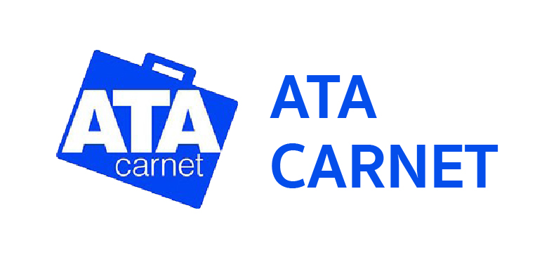

---
# Course title, summary, and position.
linktitle: การปฏิบัติพิธีการ A.T.A. CARNET
summary: การนำเข้าส่งออกชั่วคราว A.T.A Carnet

# Page metadata.
title: การปฏิบัติพิธีการ A.T.A. CARNET
date: "2020-08-03"
lastmod: "2020-08-03"
draft: false  # Is this a draft? true/false
toc: true # Show table of contents? true/false
type: page  # Do not modify.
# Optional header image (relative to `static/img/` folder).

---

## การปฏิบัติพิธีการ A.T.A. CARNET กรณีนำเข้าทางคลังสินค้า

เอกสารค้ำประกันเอ.ที.เอ คาร์เนท์ (A.T.A. CARNET) หมายถึงเอกสารศุลกากรระหว่างประเทศ ที่ใช้ใน การผ่านพิธีการศุลกากรแทนใบขนสินค้าขาเข้า ใบขนสินค้าขาออก ใบสุทธิสำหรับนำกลับเข้ามา เอกสารผ่านแดนควบคุมการส่งของจากด่านศุลกากรแห่งหนึ่งไปยังด่านศุลกากรอีกแห่งหนึ่งภายในประเทศ และเป็นเอกสารค้ำประกันค่าภาษีอากรสำหรับของที่นำเข้ามาชั่วคราวโดยได้รับการยกเว้นอากรภายใต้อนุสัญญาเอ.ที.เอ คาร์เนท์ 

เอกสารค้ำประกัน (A.T.A. CARNET) 1 ชุด ประกอบด้วย 4 ส่วน คือ.  

- ปกหน้าและปกหลัง (สีเขียว) และใบต่อ (สีขาว)
- แบบส่งออกและแบบนำกลับเข้ามาในราชอาณาจักร (สีเหลือง)
- แบบนำเข้าและแบบส่งกลับออกไปนอกราชอาณาจักร (สีขาว) และ
- แบบผ่านแดนขาเข้าและแบบผ่านแดนขาออก (สีฟ้า)

## สินค้าที่อยู่ในข่ายใช้ระบบเอ.ที.เอ คาร์เนท์

1. เครื่องมือสำหรับใช้ในวิชาชีพหนังสือพิมพ์ สำหรับการแพร่เสียงหรือการแพร่ภาพทางโทรทัศน์
2. เครื่องมือสำหรับใช้ในวิชาชีพการสร้างภาพยนตร์
3. เครื่องมือสำหรับใช้ในวิชาชีพอื่น ๆ เช่น.  

	- เครื่องมือใช้ในการสร้าง การทดสอบ การใช้งาน การตรวจสอบ การควบคุมการบำรุงรักษาหรือ ซ่อมแซม เครื่องจักรโรงงาน พาหนะที่ใช้ในการขนส่ง
	- เครื่องมือที่จำเป็นสำหรับนักธุรกิจ ที่ปรึกษาเกี่ยวกับประสิทธิภาพของธุรกิจผู้เชี่ยวชาญด้านประสิทธิภาพการผลิต นักบัญชีและสมาชิกของวิชาชีพที่คล้ายคลึงกัน
	- เครื่องมือที่จำเป็นสำหรับผู้เชี่ยวชาญที่ทำการสำรวจภูมิประเทศหรืองานสำรวจทางภูมิศาสตร์
	- เครื่องมือและเครื่องใช้ที่จำเป็นสำหรับแพทย์ ศัลยแพทย์ สัตวแพทย์ การผดุงครรภ์
	- เครื่องมือที่จำเป็นสำหรับผู้มีอาชีพให้ความบันเทิง คณะละคร และวงดนตรีออเคสตร้า รวมทั้งสิ่งของต่าง ๆ ทั้งหมดที่ใช้ ในการแสดงสำหรับสาธารณชนและที่ไม่ใช่สาธารณชน

4. ของที่นำเข้ามาเพื่อนำออกแสดงหรือสาธิตในงานนิทรรศการ งานแสดงสินค้า หรืองานประชุม
5. ของที่นำเข้ามาเพื่อใช้เกี่ยวข้องกับการนำสินค้าต่างประเทศออกแสดงในงานนิทรรศการ งานแสดงสินค้า หรืองานประชุม
6. เครื่องมือเครื่องใช้ต่าง ๆ รวมถึงอุปกรณ์การแปล เครื่องมือสำหรับการบันทึกเสียงและภาพยนตร์เกี่ยวกับการศึกษา วิทยาศาสตร์ หรือวัฒนธรรม สำหรับใช้ในการประชุมระหว่างประเทศ
7. สินค้าตัวอย่างเล็ก ๆ น้อย ๆ สำหรับแจกจ่ายฟรีให้ผู้เข้าชมนิทรรศการ
8. สินค้าที่นำเข้ามาสาธิตและถูกบริโภคหรือทำลายไปในกระบวนการของการสาธิต
9. สินค้าที่มีมูลค่าต่ำที่ใช้ในการก่อสร้าง การตกแต่ง และการประดับประดาร้านชั่วคราว
10. สิ่งพิมพ์ แคตตาล็อก หนังสือแจ้งทางการค้า บัญชีราคาสินค้า แผนภาพโฆษณา ปฏิทิน 
11. แฟ้มเอกสาร บันทึก แบบฟอร์ม และเอกสารอื่น ๆ ที่นำเข้ามาใช้ในการประชุมระหว่างประเทศ
12. ตัวอย่างสินค้าที่นำเข้ามาแสดงหรือสาธิตเพื่อชักชวนให้สั่งซื้อสินค้านั้น
13. ฟิล์มภาพยนตร์โฆษณาโพสิทีฟขนาดไม่เกิน 16 มม. ที่มีภาพแสดงให้เห็นถึงลักษณะหรือการทำงาน ของผลิตภัณฑ์หรือเครื่องมือ อุปกรณ์ที่ไม่สามารถสาธิตได้โดยเพียงการ ดูจากตัวอย่างสินค้าหรือแคตตาล็อก
14. เครื่องมือวิทยาศาสตร์ที่ใช้ในการวิจัยหรือการศึกษาทางวิทยาศาสตร์ และเครื่องอะไหล่ของเครื่องมือดังกล่าว
15. เครื่องมือทางช่างที่ใช้บำรุงรักษา ทดสอบ วัด หรือซ่อมแซมเครื่องมือวิทยาศาสตร์ที่ใช้ในการวิจัย หรือการศึกษาทางวิทยาศาสตร์ 

อนึ่ง สินค้าที่กล่าวข้างต้นนั้น ในบางรายการมีข้อจำกัดหรือมีข้อกำหนดคุณสมบัติและหลักเกณฑ์เงื่อนไขกำกับไว้ด้วย ซึ่งจะดูรายละเอียดได้จากอนุสัญญาฯ ที่เกี่ยวข้อง

## พิธีการส่งออกภายใต้ระบบระบบ เอ.ที.เอ. คาร์เนท์

1. ขั้นตอนการปฏิบัติพิธีการการส่งออกภายใต้ระบบระบบ เอ.ที.เอ. คาร์เนท์
	* ผู้ส่งออกยื่นเอกสารแบบส่งออกและแบบนำกลับเข้ามาในราชอาณาจักร (สีเหลือง) ทั้งต้นขั้ว (EXPORTATION COUNTERFOIL) และใบสำคัญคู่ต้นขั้ว (EXPORTATION VOUCHER) ที่กรอกข้อความครบถ้วนสมบูรณ์แล้วพร้อมเอกสารประกอบ แต่ไม่ต้องยื่นบัญชีราคาสินค้า (Invoice) หรือบัญชีรายละเอียดสินค้า (Packing List) โดยผู้ส่งของออกจะต้องสำแดงรายละเอียดไว้ในแบบส่งออก และให้เจ้าหน้าที่ตรวจสอบรับรอง ณ สำนักงานหรือด่านศุลกากรที่ส่งออก
	- กรมศุลกากรตรวจสอบเอกสารและออกเลขที่ยกเว้นอากรหรือเลขที่ชำระอากร (ถ้ามี) แล้วมอบเอกสารทั้งหมดให้ผู้ส่งออกไปทำการตรวจปล่อยสินค้า หรือชำระอากรแล้วแต่กรณี

	- ข้อควรทราบในการส่งออกภายใต้ระบบ เอ.ที.เอ. คาร์เนท์
          1. แบบส่งออก (สีเหลือง) ส่วนของใบสำคัญคู่ต้นขั้ว (EXPORTATION VOUCHER) สามารถใช้เป็นเอกสารที่ใช้แทนใบขนสินค้าขาออก และส่วนของต้นขั้ว (EXPORTATION COUNTERFOIL) ใช้เป็นใบสุทธิสำหรับนำกลับเข้ามา
          1. การนำเข้า-ส่งออกโดยใช้เอกสารค้ำประกัน (เอ.ที.เอ. คาร์เนท์) ผู้นำเข้า-ส่งออกสามารถใช้เอกสารดังกล่าวเป็นเอกสารค้ำประกันค่าภาษีอากรและค่าภาระติดพันสำหรับสินค้าที่นำเข้ามาชั่วคราว ทั้งนี้ ตามขอบเขตของแต่ละอนุสัญญาที่เกี่ยวข้อง 
          1. การยกเว้นใบอนุญาต จะได้รับยกเว้นเฉพาะของนำเข้าและเป็นไปตามเงื่อนไขในอนุสัญญาการนำเข้าทั้ง 4 ฉบับ ส่วนสินค้าส่งออก เป็นไปตามหลักเกณฑ์ดังนี้
                - การส่งของออกโดยใช้แบบส่งออก (สีเหลือง) แล้วจะนำกลับเข้ามาในภายหลัง ในขณะส่งออก ถ้ามีกฎหมายหรือระเบียบใดกำหนดให้ต้องขออนุญาต ก็ต้องมีใบอนุญาตตามปกติ 
                - ของนำเข้าชั่วคราวแล้วส่งกลับออกไปโดยใช้แบบส่งกลับออกไป (สีขาว) (RE-EXPORTATION) ตามปกติของนำเข้าชั่วคราวที่มีใบอนุญาตนำเข้า ในใบอนุญาตจะกำหนดวันส่งออกไว้ด้วย จึงถือเป็นใบอนุญาตนำเข้า-ส่งออก ในฉบับเดียวกัน
          1. โดยที่เอกสารค้ำประกัน (เอ.ที.เอ. คาร์เนท์) ไม่มีสำเนา กรณีเอกสารถูกทำลาย สูญหายหรือถูกขโมย ผู้นำเข้าสามารถขอให้สภาหอการค้าผู้ออกเอกสารดังกล่าว ออกเอกสารให้ใหม่เพื่อทดแทนฉบับที่สูญหายได้

1. พิธีการนำของกลับเข้ามาภายใต้ระบบ เอ.ที.เอ. คาร์เนท์

    **ขั้นตอนการปฎิบัติพิธีการนำกลับเข้ามา** 
    - ผู้นำเข้ายื่นเอกสารแบบนำกลับเข้ามา (สีเหลือง) ทั้งต้นขั้ว (RE-IMPORTATION COUNTERFOIL) และใบสำคัญคู่ต้นขั้ว (RE-IMPORTATION VOUCHER) ใบสั่งปล่อย และเอกสารประกอบต่อสำนักงานหรือด่านศุลกากรที่นำเข้า 
    - กรมศุลกากรตรวจสอบเอกสาร หากถูกต้องตรงกับการส่งออกจะพิจารณาอนุมัติการยกเว้นอากร แล้วมอบเอกสารทั้งหมดให้ผู้นำเข้าไปทำการตรวจปล่อยสินค้า ติดต่อกับส่วนตรวจสินค้าเพื่อรับสินค้าออกจากอารักขาศุลกากร

## พิธีการนำเข้าภายใต้ระบบ เอ.ที.เอ. คาร์เนท์

1. ขั้นตอนปฏิบัติพิธีการการนำเข้าภายใต้ระบบ เอ.ที.เอ. คาร์เนท์
	- ผู้นำเข้ายื่นเอกสารแบบนำเข้าและแบบส่งกลับออกไปนอกราชอาณาจักร (สีขาว) ทั้งต้นขั้ว (IMPORTATION COUNTERFOIL) และใบสำคัญคู่ต้นขั้ว (IMPORTATION VOUCHER) ที่กรอกข้อความครบถ้วนสมบูรณ์แล้วพร้อมเอกสารประกอบ ณ สำนักงานหรือด่านศุลกากรที่นำเข้า
	- กรมศุลกากรตรวจสอบเอกสารและออกเลขที่ยกเว้นอากรหรือเลขที่ชำระอากร (ถ้ามี) แล้วมอบเอกสารทั้งหมดให้ผู้ส่งออกไปชำระอากร (ถ้ามี) หรือ ติดต่อกับส่วนตรวจสินค้าเพื่อรับสินค้าออกจากอารักขาศุลกากร
1. ข้อควรทราบเบื้องต้นเกี่ยวกับพิธีการนำเข้าภายใต้ระบบ เอ.ที.เอ. คาร์เนท์
	- ของที่นำเข้ามาในราชอาณาจักรโดยใชัเอกสารค้ำประกัน (เอ.ที.เอ. คาร์เนท์) จะต้องเป็นสินค้าที่อยู่ในข่ายใช้ระบบเอ.ที.เอ คาร์เนท์ ส่วนของที่นำเข้ามาเพื่อวัตถุประสงค์อื่น เช่น นำเข้ามาเพื่อใช้ในกระบวนการผลิตหรือนำเข้ามาเพื่อซ่อมแซมจะใช้เอกสารค้ำประกัน (เอ.ที.เอ. คาร์เนท์) ไม่ได้ และผู้นำของเข้าจะเพิ่มเติมรายการสินค้าใด ๆ ลงในแบบนำเข้า (สีขาว) อีกไม่ได้
	- เอกสารค้ำประกัน (เอ.ที.เอ. คาร์เนท์) มีอายุ 1 ปี นับแต่วันออกเอกสาร การนำของเข้าตาม เอกสารค้ำประกัน (เอ.ที.เอ. คาร์เนท์) จะต้องส่งกลับออกไปภายใน 6 เดือนนับแต่วันนำเข้า แต่ทั้งนี้จะต้องไม่เกินอายุของเอกสารค้ำประกันดังกล่าว
	- ปกหน้า(สีเขียว) ของเอกสารค้ำประกัน (เอ.ที.เอ. คาร์เนท์) จะระบุชื่อประเทศภาคีสมาชิกและชื่อของสมาคมผู้ค้ำประกัน
	- ในกรณีที่ผู้นำของเข้าตามเอกสารค้ำประกัน(เอ.ที.เอ.คาร์เนท์) ไม่ส่งของกลับออกไปภายใน ระยะเวลาที่กำหนด หรือไม่ปฏิบัติตามเงื่อนไขของการนำเข้าชั่วคราว ไม่ว่ากรณีใดๆ สภาหอการค้าแห่งประเทศไทยในฐานะผู้ค้ำประกันจะต้องรับผิดชอบในการจ่ายค่าภาษีอากรและค่าภาระติดพันให้แก่กรมศุลกากรเป็นจำนวนเงินไม่เกินอากรขาเข้ากับอีกร้อยละ 10 ของอากรขาเข้า ส่วนที่เกินจากนี้กรมศุลกากรจะเรียกเก็บจากผู้นำของเข้า
	- แบบฟอร์มเอกสารค้ำประกัน (เอ.ที.เอ. คาร์เนท์) หรือส่วนหนึ่งของแบบฟอร์มดังกล่าวที่นำเข้า-ส่งออกเพื่อใช้เป็นเอกสารค้ำประกัน (เอ.ที.เอ.คาร์เนท์) ให้ได้รับยกเว้นอากร
 

1. พิธีการส่งของกลับออกไปภายใต้ระบบ เอ.ที.เอ. คาร์เนท์

    **ขั้นตอนปฏิบัติพิธีการการส่งของกลับออกไปภายใต้ระบบระบบ เอ.ที.เอ. คาร์เนท์**
    
	- ผู้ส่งออกยื่นเอกสารแบบส่งกลับออกไป (สีขาว) ทั้งต้นขั้ว (RE-EXPORTATION COUNTERFOIL) และใบสำคัญคู่ต้นขั้ว (RE-EXPORTATION VOUCHER) ที่กรอกข้อความครบถ้วนสมบูรณ์แล้วพร้อมเอกสารประกอบ ณ สำนักงานหรือด่านศุลกากรที่ส่งออก
	- กรมศุลกากรตรวจสอบเอกสารและออกเลขที่ยกเว้นอากรหรือเลขที่ชำระอากร (ถ้ามี) แล้วมอบเอกสารทั้งหมดให้ผู้ส่งออกไปทำการชำระอากร (ถ้ามี) หรือ ติดต่อกับส่วนตรวจสินค้าเพื่อรับสินค้าออกจากอารักขาศุลกากร


**สอบถามข้อมูลเพิ่มเติมได้ที่** : สำนักงานศุลกากรตรวจสินค้าท่าอากาศยานสุวรรณภูมิ (สสภ.).  
อ.บางพลี จ.สมุทรปราการ 10540.  
หมายเลขโทรศัพท์ : 02-134-1246.  
อีเมล์ : 68000100@customs.go.th.  

ที่มา : [กรมศุลกากร](http://www.customs.go.th/cont_strc_simple.php?ini_content=business_160426_03_160909_02&lang=th&left_menu=menu_business_160421_03_160725_04)  
วันที่ปรับปรุงล่าสุด : 21 พฤษภาคม 2562


