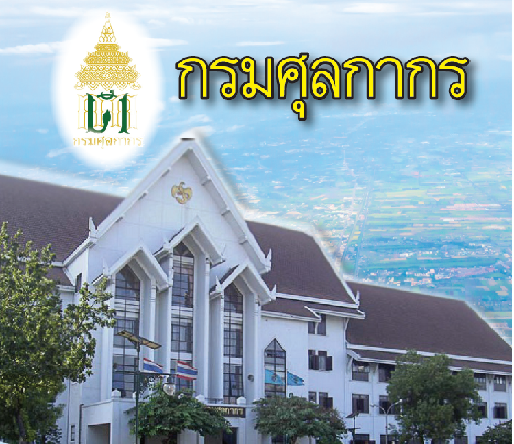

กิจการภาษี หรือการศุลกากร มีมาตั้งแต่ก่อนสมัยสุโขทัยจากหลักฐาน ศิลาจารึกของพ่อขุนรามคำแหง เรียกว่า "จกอบ" ในสมัยสุโขทัยมีการ ค้าขายเป็นปัจจัย ในการสร้างความมั่งคั่งของรัฐ การเก็บภาษีนี้ในช่วง ระยะเวลาหนึ่งกรุงสุโขทัย ได้มี ประกาศยกเว้นแก่ผู้มาค้าขายดัง หลักฐาน ที่ปรากฏในศิลาจารึกว่า **เมืองสุโขทัยนี้ดีในน้ำมีปลาในนามีข้าวพ่อเมือง บ่เอาจกอบในไพร่ลู่ทางเพื่อนจูงวัวไปค้าขี่ม้าไปขาย ใครจักใคร่ค้าช้างค้าใครจักใคร่ค้าม้าค้า** ต่อมาในสมัยกรุงศรีอยุธยา หน่วยงานที่ทำหน้าที่ด้านตรวจเก็บภาษีขาเข้าขาออกเฉพาะเรียกว่า พระคลังสินค้า มีสถานที่สำหรับการภาษี เรียกว่า ขนอน เก็บภาษีจากระวางบรรทุกสินค้าและจาก สินค้าในสมัยกรุงธนบุรีบ้านเมืองอยู่ในยุคสงครามการค้าขายระหว่าง ประเทศไม่ปรากฏหลักฐาน ในทางประวัติศาสตร์

เมื่อเข้าสู่ยุครัตนโกสินทร์ ในรัชสมัยสมเด็จพระนั่งเกล้าเจ้าอยู่หัวมีการประมูลผูกขาดการเรียกเก็บภาษีอากร เรียกว่า "ระบบเจ้าภาษีนายอากร" ส่วนสถานที่เก็บภาษีเรียกว่า "โรงภาษี" ต่อมาในสมัยรัชกาลที่ 4 การติดต่อ ค้าขายกับต่างประเทศมากขึ้น มีการทำสนธิสัญญาเบาริ่งที่เกี่ยวกับ ศุลกากร คือ ยกเลิกการเก็บค่าธรรมเนียมปากเรือเปลี่ยนมาเป็นเก็บ ภาษี สินค้าขาเข้า ที่เรียกว่า "ภาษีร้อยชักสาม" ส่วนสินค้าขาออกให้เก็บตามที่ระบุในท้ายสัญญา เป็นชนิดไป มีการตั้งโรงภาษี เรียกว่า ศุลกสถาน (Customs House) ขึ้นเป็นที่ทำการศุลกากร

ยุคใหม่ของศุลกากรไทยเริ่มในปี พ.ศ. 2417 เมื่อรัชกาลที่ 5 ทรง จัดตั้ง หอรัษฎากรพิพัฒน์ เป็นสำนักงานกลางใน การรวบรวมรายได้ของแผ่นดิน งานศุลกากร ซึ่งทำหน้าที่จัดเก็บภาษีขาเข้าขาออกเป็นรายได้ของรัฐ อยู่ในความควบคุมดูแลของหอรัษฎากรพิพัฒน์ คือการก่อตั้งกรมศุลกากร งานศุลกากรได้เจริญเติบโตขึ้นอย่างรวดเร็วความเปลี่ยน แปลงของบ้านเมืองและสถานการณ์ของโลก ได้มีการ สร้างอาคารที่ทำการใหม่ให้เหมาะสม ขึ้นแทนที่ทำการศุลกากร ที่เรียกว่าศุลกสถาน เดิมในปี 2497 นั่นคือ สถานที่ตั้งกรมศุลกากร คลองเตย ในปัจจุบันในช่วงเวลาที่ผ่านมาอัตราการขยายตัวทางเศรษฐกิจของไทยมีการเจริญเติบโตอย่างรวดเร็วโดยเฉพาะด้านการค้าระหว่างประเทศซึ่งเดิม กรมศุลกากรมีภารกิจหลักคือจัดเก็บภาษีอากรจากของที่นำเข้ามาในและส่งออกไปนอกราชอาณาจักรเพื่อนำไปพัฒนาเศรษฐกิจ ของประเทศและดูแลป้องกัน ปราบปรามการลักลอบหนีศุลกากรเพื่อให้การจัดเก็บภาษีอากรเป็นไปตามเป้าหมายและเกิดความ เป็นธรรมแก่ผู้ประกอบการที่สุจริต

ในปัจจุบันกรมศุลกากร ได้รับบทบาทและหน้าที่จากเดิมที่เน้นการจัดเก็บภาษีอากรจากของที่นำเข้ามาในและส่งออกไป นอกราชอาณาจักรมาเป็นการมุ่งเน้นที่จะพัฒนาส่งเสริมด้านการค้าระหว่างประเทศและการส่งออกของไทยที่มีศักยภาพ ในการแข่งขันกับตลาดการค้าของโลกได้ ควบคู่กันนั้นกรมศุลกากร ได้พัฒนาระบบงานการจัดองค์กรการ นำระบบคอมพิวเตอร์ มาใช้ในการบริหารงาน ตลอดจนพัฒนา ประสิทธิภาพของข้าราชการให้มีความสอดคล้องกับความเจริญ ก้าวหน้าทางเศรษฐกิจของประเทศ นอกจากการพัฒนาระบบงานต่างๆแล้ว กรมศุลกากรได้ปรับปรุงขยายหน่วยงานต่างๆ รองรับกับ ปริมาณงานที่เพิ่มขึ้น กรมศุลกากรได้จัดสร้างอาคารที่ทำการอีกหนึ่งหลัง เป็นอาคารสำนักงานสูง 16 ชั้น เรียกว่า อาคาร 120 ปี กรมศุลกากร ทำพิธีเปิดอาคารเมื่อวันที่ 29 เมษายน 2539



* วันที่ปรับปรุงล่าสุด : 7 พฤศจิกายน 2561.  
 
* **สอบถามข้อมูลเพิ่มเติมได้ที่ :** [ส่วนสื่อสารองค์กร สำนักงานเลขานุการกรม (สลข.)](http://www.customs.go.th/cont_strc_simple.php?top_menu=menu_about&left_menu=menu_about_160421_01_160421_04&ini_menu=menu_about_160421_01&ini_content=about_160426_01&lang=th&root_left_menu=menu_about_160421_01&left_menu=menu_about_160421_01_160421_04)
* หมายเลขโทรศัพท์ : 0-2667-7600
* อีเมล์ : 64070000@customs.go.th
