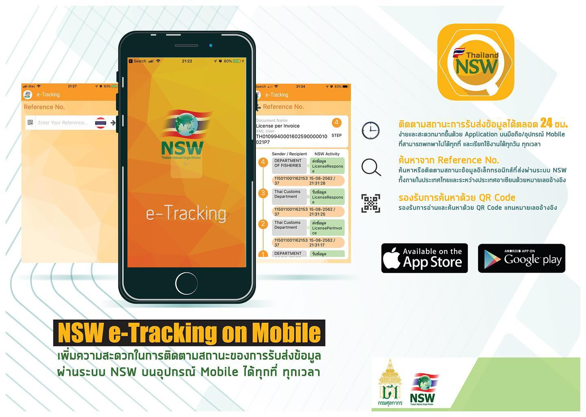
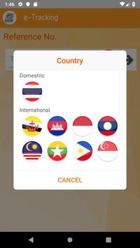
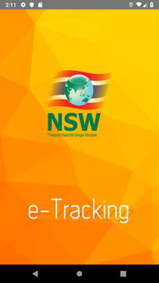
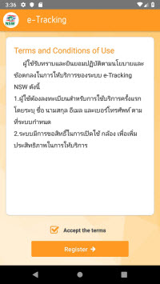
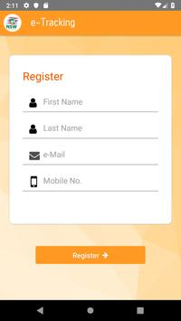
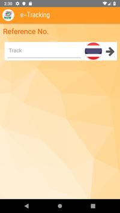
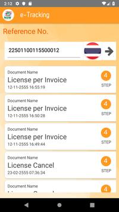
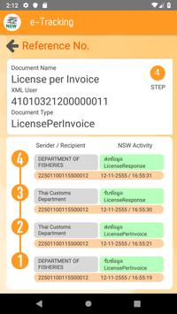
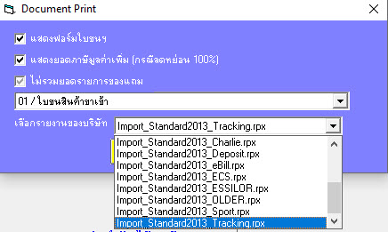

ระบบติดตามสถานะการรับส่งข้อมูล ผู้นำเข้า ส่งออก โลจิสติกส์ เป็นบริการเพื่อให้ผู้นำเข้า/ส่งออกสินค้า สามารถตรวจสอบและติดตามสถานะของข้อมูล ที่รับส่งผ่านทางระบบ Thailand NSW ได้ด้วยตัวเอง เพื่ออำนวยความสะดวกแก่ผู้ใช้บริการ รองรับการอ่าน QR Code เพื่อสะดวกในการค้นหาข้อมูลด้วยเลขอ้างอิงที่ขนาดข้อมูลมีความยาว สำหรับการจัดเก็บข้อมูลส่วนบุคคลนั้น เพื่อใช้ในการแจ้งเตือนข่าวสาร และสนับสนุนการใช้งานแอปพลิเคชั่น ประกอบไปด้วย

- บริการการติดตามสถานะข้อมูลอิเล็กทรอนิกส์ที่ส่งผ่านระบบ Thailand NSW ด้วยเลขอ้างอิง
- ผู้ใช้งานสามารถค้นหาข้อมูลด้วยกาอ่าน QR Code แทนการกรอกเลขที่อ้างอิง
- ผู้ใช้งานสามารถค้นหาข้อมูลที่รับและส่งกันระหว่างประเทศในอาเซี่ยน โดยสามารถเลือกประเทศจากสัญลักษณ์ธงชาติของประเทศนั้น ๆ
- มีบริการแจ้งข่าวสารและการแจ้งเตือนในแอปพลิเคชั่น

ระบบดังกล่าวได้ปรับปรุงจากเวอร์ชันบน website โดยให้บริการเฉพาะในส่วนของการติดตามสถานะของข้อมูล ทำให้การลงทะเบียน ทำได้โดยง่าย ใช้ข้อมุล เพียงชื่อ-สกุล, e-mail, หมายเลขโทรศัพท์ และหลังจาก submit ข้อมูลเข้าในระบบ สามารถใช้งานได้ในทันที ทำให้ผู้ใช้สามารถติดตามสถานะเอกสารประเภทต่าง ๆ ของงานศุลกากรได้อย่างครบถ้วน เช่น ระบบใบขนสินค้า , ระบบการชำระเงิน e-Payment , ระบบใบอนุญาต/ใบรับรอง ของหน่วยงานต่าง ๆ ฯลฯ ทำให้เราสามารถตรวจสอบได้ว่า ขณะนี้ข้อมูลค้างอยู่ที่หน่วยงานใด ธนาคารตอบกลับระบบ e-Payment แล้วหริอยัง ,ใบอนุญาตเลขที่นี้ มีอยู่ในระบบหรือไม่ หรือได้ยื่นใบอนุญาตในวันไหน หน่วยงานผุ้ออกใบอนุญาตส่งข้อมูลให้กรมศุลกากร แล้วหรือยัง ฯลฯ

ในส่วนของ ECS ได้เพิ่มแบบฟอร์มใบขนสินค้าให้สามารถเลือกแสดงข้อมูล หมายเลขอ้างอิง (Reference No.) ในรูปแบบ Barcode ทั้งในส่วนของใบขนสินค้าขาเข้า-ขาออก โดยได้กำหนดชื่อแบบฟอร์มเป็น ขาเข้า - Import_Standard2013_Tracking.rpx , ขาออก - Export_Standard2013_Tracking.rpx เพื่อเพิ่มความสะดวกในการใช้งานระบบดังกล่าว และลดข้อผิดพลาดในการต้องบันทึกข้อมูล Reference No. ด้วยตัวเอง และสามารถส่งใบขนสินค้าดังกล่าวให้กับทางผู้นำเข้า-ส่งออก เพื่อให้ผู้ที่เกี่ยวข้องสามารถตรวจสอบ status ใบขนสินค้าได้แบบ real time ได้ทุกที่ ทุกเวลาตลอด 24 ชั่วโมง

{}
แบบฟอร์มนี้เป็นทางเลือกเพื่ออำนวยความสะดวกในการใช้งานระบบดังกล่าว สำหรับผุ้ที่ไม่ได้ใช้งานระบบดังกล่าว ท่านไม่ต้องดำเนินการใด ๆ ยังสามารถใช้งานโปรแกรมได้ตามปกติ เหมือนเดิมทุกประการ
{}

แอปพลิเคชั่นนี้เป็นส่วนหนึ่งของระบบกลางการเชื่อมโยงข้อมูลระหว่างประเทศของไทย ผู้ใช้งานสามารถดูข้อมูลเพิ่มเติมได้ที่

- www.thainsw.net

ศูนย์บริการ

- Email : callcenter@thainsw.net