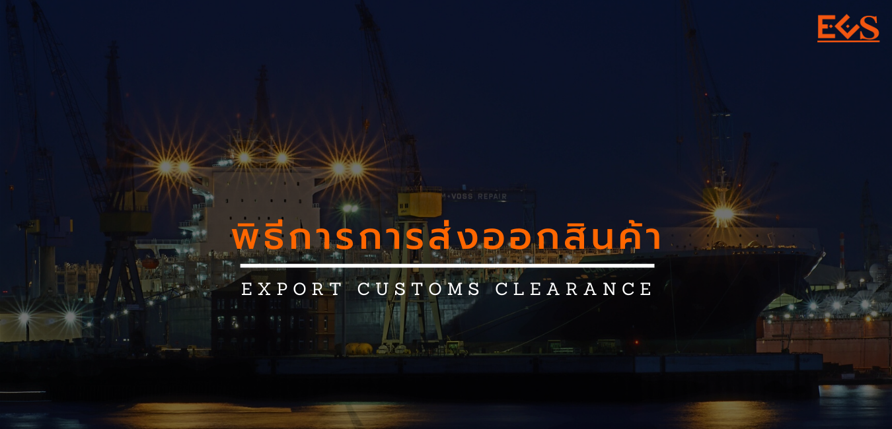

การส่งออกสินค้า (Export) คือ การจัดส่งสินค้าและบริการจากต้นทางสู่ปลายทางในทางบก ทางน้ำหรือทางอากาศ โดยผู้ส่งสินค้าหรือบริการออกเรียกว่า **ผู้ส่งออก** ส่วนในทางการค้าระหว่างประเทศ การส่งออกหมายถึง การขายสินค้าและบริการในประเทศไปสู่ตลาดอื่น (ตลาดสากล) ในการส่งออกและนำเข้าซึ่งสินค้าจะต้องมีหน่วยงานที่ต้องเกี่ยวข้องด้วยคือ กรมศุลกากร แม้ว่าจะเป็นการนำเข้า หรือส่งออกผ่านทางระบบอินเทอร์เน็ตเองก็จำเป็นต้องเกี่ยวข้องกับกรมศุลการกรด้วย และที่สำคัญต้องอยู่ภายใต้กฎหมายการนำเข้าและส่งออกของประเทศนั้น ๆ

> **Content**

.

