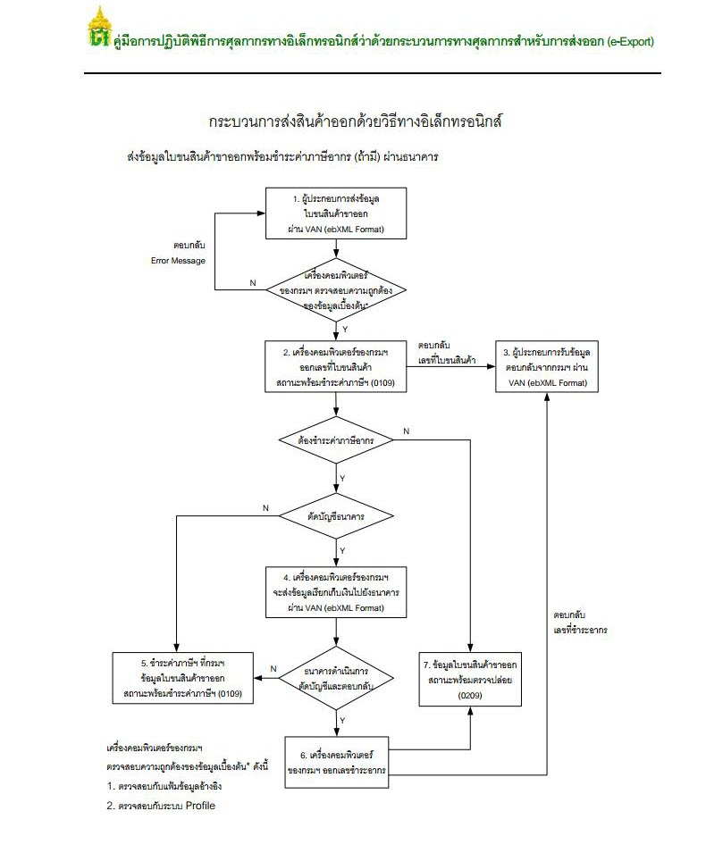

## ภาพรวมระบบ

คู่มือการปฏิบัติพิธีการศุลกากรส่งออกทางอิเล็กทรอนิกส์ว่าด้วยกระบวนการทางศุลกากรสําหรับการส่งออก (e-Export) กําหนดขึ้นเพื่อประโยชน์ในการส่งของออก ให้การปฏิบัติพิธีการศุลกากรสามารถกระทําโดยวิธีการทางอิเล็กทรอนิกส์ได้ โดยให้ใช้บังคับเป็นการทั่วไปสําหรับการส่งของออกไปนอกราชอาณาจักรทางเรือ
ทางรถไฟ ทางรถยนต์ คนเดินออกไปทางเครื่องบิน ทางไปรษณีย์ ทางท่อขนส่งทางบก ทางสายส่งไฟฟ้า ทางเรือที่เข้าออกด่านศุลกากรทางบก เรือเล็กทางทะเลที่เข้าออกด่านศุลกากรทางทะเล ทางผู้โดยสารนําพาขึ้นอากาศยาน

การส่งของออกไปนอกราชอาณาจักร หมายถึง การนําของใด ๆ จากภายในราชอาณาจักรขนหรือย้ายขน โดยทางเรือ ทางรถไฟ ทางรถยนต์ คนเดินออกไป ทางเครื่องบิน ทางไปรษณีย์ ทางท่อขนส่งทางบก ทางสายส่งไฟฟ้า ทางเรือที่เข้าออกด่านศุลกากรทางบก เรือเล็กทางทะเลที่เข้าออกด่านศุลกากรทางทะเล ทางผู้โดยสารนําพาขึ้นอากาศยาน เป็นต้น เพื่อส่งออกไปนอกราชอาณาจักร และให้ดําเนินการโดยวิธีการทางอิเล็กทรอนิกส์ ณ ด่านศุลกากรสุดท้าย (Last Port) ที่ระบุไว้ว่าจะทําการขน หรือย้ายขนของเพื่อส่งออกไปนอกราชอาณาจักร

ในการปฏิบัติพิธีการศุลกากรหร อดําเนินการในกระบวนการทางศุลกากรกับของที่เก็บในคลังสินค้าทัณฑ์บน หรืออยู่ในเขตปลอดอากร และ/หรือในเขตประกอบการเสรี ให้ดําเนินการโดยวิธีการทางอิเล็กทรอนิกส์ ณ ด่านศุลกากรสุดท้าย (Last Port) ที่ระบุไว้ว่าจะทําการขน หรือย้ายขนของเพื่อส่งออกไปนอกราชอาณาจักร

หากเรื่องใดที่เป็นข้อปฏิบัติเฉพาะของหน่วยงานที่สํานัก/สํานักงานศุลกากรที่รับผิดชอบ เสนอระเบียบปฏิบัติและขอความเห็นชอบจากกรมศุลกากร ให้กําหนดเพิ่มเติมเป็นการเฉพาะหรือแตกต่างไปจากที่กําหนดในคู่มือฉบับนี้ ให้ถือปฏิบัติตามข้อปฎิบัติดังกล่าวนั้น

**แผนภาพแสดงกระบวนการส่งออกด้วยวิธีทางอิเล็กทรอนิกส์ (e-Export System)**

  

## ระบบพิธีการส่งออกทางอิเล็กทรอนิกส์ (e-Export) 
ประกอบด้วย 5 ขั้นตอนคือ

- การจัดทําใบขนสินค้าขาออก
- การบรรจุสินค้าและการจัดทําใบกํากับการขนย้ายสินค้า
- การขนย้ายสินค้าผ่านสถานีรับบรรทุก ณ ด่านศุลกากรที่ส่งออก
- การตัดบัญชีใบกํากับการขนย้าย
- การรับบรรทุกของส่งออก

> **เอกสารอ้างอิง** : [ประกาศกรมศุลกากรที่ 132 / 2561 เรื่อง **คู่มือการปฏิบัติพิธีการศุลกากรทางอิเล็กทรอนิกส์ว่าด้วยกระบวนการทางศุลกากรสำหรับการส่งออก (e-Export)**](e-Export-guide.pdf)
