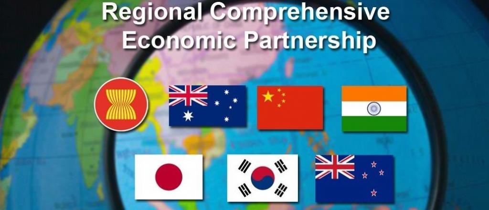
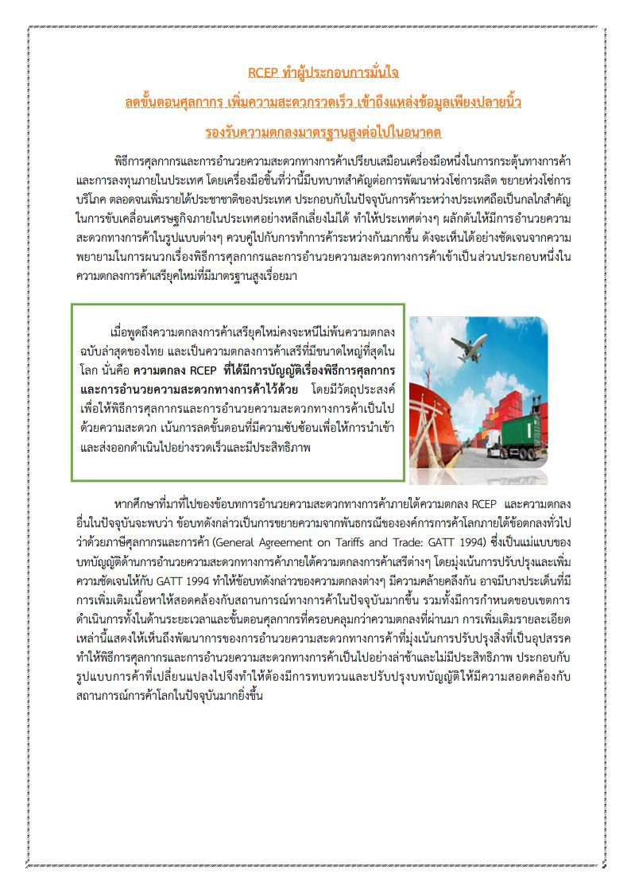
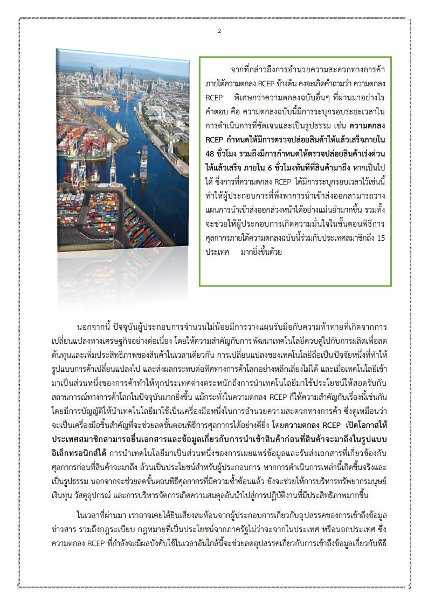
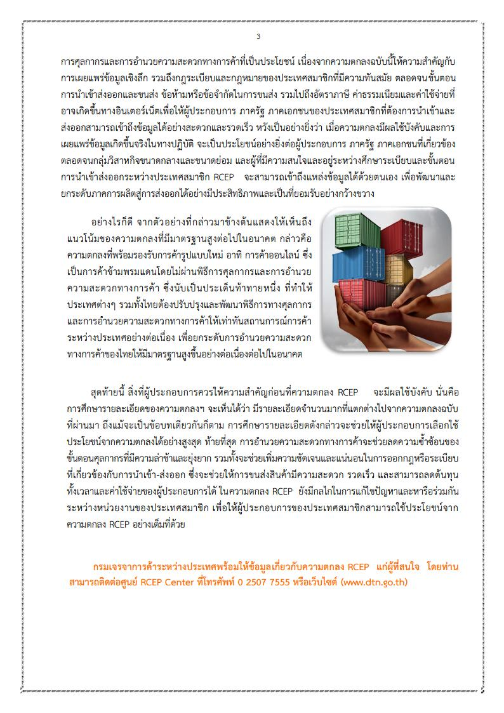



 

**ความตกลงหุ้นส่วนทางเศรษฐกิจระดับภูมิภาค  ( Regional Comprehensive Economic Partnership: RCEP)** คือ ความตกลงเขตการค้าเสรี ระหว่าง 10 ชาติสมาชิกอาเซียน และ 5 ประเทศคู่เจรจา (ได้แก่ จีน ญี่ปุ่น เกาหลีใต้ ออสเตรเลีย และนิวซีแลนด์) ซึ่งการเจรจาเกี่ยวกับ ความตกลงหุ้นส่วนทางเศรษฐกิจระดับภูมิภาคนี้ ได้เริ่มขึ้นอย่างเป็นทางการในการประชุมอาเซียนที่ประเทศกัมพูชาเมื่อเดือนพฤศจิกายน พ.ศ. 2555  โดยทุกประเทศรวมกันมีมูลค่าผลิตภัณฑ์มวลรวม ในประเทศ (GDP) ประมาณ 30% ของ GDP ของโลก และมีประชากรประมาณ 30% ของประชากรโลก ความตกลง RCEP จัดตั้งขึ้นเพื่อให้เป็นความตกลงที่ทันสมัย ครอบคลุม คุณภาพสูง และเป็นประโยชน์ร่วมกัน ซึ่งจะสร้างสภาพแวดล้อม ที่เอื้ออำนวยให้เกิดการขยายตัว ทางการค้าการลงทุนภายในภูมิภาค รวมถึงสร้างความเติบโตและการพัฒนาสู่เศรษฐกิจโลก และนำไปสู่โอกาสในการเข้าสู่ตลาด และการจ้างงานของภาคธุรกิจและ ประชาชนในภูมิภาค ความตกลงอาร์เซ็ปจะดำเนินงานควบคู่และสนับสนุนระบบการค้าพหุภาคีที่เปิดกว้าง ครอบคลุม และเป็นไปตามกฎกติกา

 ## ความเป็นมา 

ความตกลงหุ้นส่วนทางเศรษฐกิจ ระดับภูมิภาค (Regional Comprehensive Economic Partnership: RCEP) เป็นการพัฒนามาจากแนวคิด ASEAN+3/ASEAN+6 ซึ่งเป็นยุทธศาสตร์ของอาเซียน ภายใต้ AEC Blueprint ที่อาเซียนต้องการรักษาบทบาทในการเป็นศูนย์กลาง (ASEAN Centrality) ขับเคลื่อนการรวมกลุ่มเศรษฐกิจที่ใหญ่ขึ้นในภูมิภาค โดยเมื่อวันที่ 20 พฤศจิกายน 2012 ผู้นำอาเซียนและ ประเทศคู่เจรจา 6 ประเทศ (ออสเตรเลีย จีน ญี่ปุ่น อินเดีย เกาหลีใต้ และนิวซีแลนด์) ได้ออกปฏิญญาร่วม (Joint Declaration) เพื่อประกาศให้มีการเริ่มเจรจาอย่างเป็นทางการในปี 2013 และตั้งเป้าให้สรุปผลในปี 2015 อย่างไรก็ดี การเจรจายืดเยื้อจนกระทั่งปี 2019 ซึ่งเป็นปีที่ไทยเป็นเจ้าภาพการประชุมอาเซียนและ ประธานการประชุม RCEP โดยสมาชิก RCEP ทั้ง 15 ประเทศ สามารถปิดการเจรจาจัดทำความตกลงทั้ง 20 บท และการเจรจาเปิดตลาดในส่วนที่ส าคัญทุกประเด็นแล้ว และเมื่อวันที่ 15 พฤศจิกายน 2020 รัฐมนตรีของ 15 ประเทศลงนามความตกลงฯ ในการประชุม RCEP Summit ครั้งที่ 4 ผ่านระบบการประชุมทางไกลโดยมีผู้นำเข้าร่วมเป็นสักขีพยาน อีกทั้งความตกลง RCEP ยังคงเปิดให้อินเดียกลับมาเข้าร่วมความตกลงในฐานะประเทศสมาชิกดั้งเดิม

## รายชื่อภาคีที่ได้รับการยกเว้นอากรและลดอัตราอากรศุลกากรตามข้อผูกพัน ตามความตกลง RCEP

1.	เนการาบรูไน ดารุซซาลาม
2.	ประเทศออสเตรเลีย
3.	ประเทศนิวซีแลนด์
4.	ประเทศญี่ปุ่น
5.	ราชอาณาจักรกัมพูชา
6.	สาธารณรัฐสิงคโปร์
7.	สาธารณรัฐประชาชนจีน
8.	สาธารณรัฐประชาธิปไตยประชาชนลาว
9.  สาธารณรัฐสังคมนิคมเวียดนาม

## การปฏิบัติพิธีการศุลกากรสําหรับผู้นําของเข้า

**การปฏิบัติพิธีการศุลกากรกรณีทั่วไป**

- **การแสดงหลักฐานการรับรองถิ่นกําเนิดสินค้าและหนังสือรับรองการนําเข้า กรณีใช้สิทธิพิเศษทางอากรศุลกากร ณ ขณะนําของเข้า**

1. ผู้นําของเข้าต้องแสดงหลักฐานการรับรองถิ่นกําเนิดสินค้า ที่ออกตามความในหมวด 1 เกณฑ์การได้ถิ่นกําเนิดสินค้า ประเทศถิ่นกําเนิด RCEP และข้อกําหนดการส่งมอบ และตามความในหมวด 2 การรับรองถิ่นกําเนิดสินค้า ที่ผู้นําของเข้าได้เขียนหรือประทับตราเลขที่ใบขนสินค้าขาเข้าไว้ที่มุมบนด้านขวา ของหลักฐานการรับรองถิ่นกําเนิดสินค้า (Form RCEP) ต่อสํานักงานศุลกากรหรือด่านศุลกากรที่นําของเข้า ก่อนการนําของออกจากอารักขาของศุลกากร และหากมีการร้องขอจากพนักงานศุลกากร ผู้นําของเข้าต้อง แสดงหลักฐานประกอบการพิจารณาว่า สินค้ามีคุณสมบัติเป็นสินค้าที่ได้ถิ่นกําเนิดตามข้อกําหนดของบทที่ 3 กฏว่าด้วยถิ่นกําเนิดสินค้า (ตามเอกสารแนบ 1 แนบท้ายประกาศนี้)
ทั้งนี้ ให้ใช้หลักฐานการรับรองถิ่นกําเนิดสินค้า (Form RCEP) หนึ่งฉบับต่อการนําเข้า หนึ่งครั้ง
2. ในกรณีที่ผู้นําของเข้าต้องมีหนังสือรับรองการนําเข้าชิ้นส่วนยานยนต์ตามเงื่อนไข OEM (Original Equipment Manufacturing: OEM) ที่จะได้รับสิทธิชําระภาษีภายใต้ความตกลงหุ้นส่วนทาง เศรษฐกิจระดับภูมิภาค (Regional Comprehensive Economic Partnership) ตามประกาศกระทรวง อุตสาหกรรม สําหรับการนําของเข้าตามข้อ 2 (3) (ข) ของประกาศกระทรวงการคลัง ให้แสดงหนังสือรับรอง ดังกล่าว ที่ผู้นําของเข้าได้เขียนหรือประทับตราเลขที่ใบขนสินค้าขาเข้าไว้ที่มุมบนด้านขวาของหนังสือรับรองต่อ สํานักงานศุลกากร หรือด่านศุลกากรที่นําของเข้า

- **การจัดทําข้อมูลใบขนสินค้าขาเข้า กรณีใช้สิทธิพิเศษทางอากรศุลกากร ณ ขณะนําของเข้า**
1. ผู้นําของเข้าต้องตรวจสอบการขอใช้สิทธิยกเว้นอากรและลดอัตราอากรศุลกากร ตามข้อผูกพันตามความตกลง RCEP ตามประกาศกระทรวงการคลัง
2. ผู้นําของเข้าต้องตรวจสอบเกณฑ์การได้ถิ่นกําเนิดสินค้าตามหมวด 1 เกณฑ์การได้ ถิ่นกําเนิดสินค้า ประเทศถิ่นกําเนิด RCEP และข้อกําหนดการส่งมอบ และตรวจสอบหลักเกณฑ์เกี่ยวกับ หลักฐานการรับรองถิ่นกําเนิดสินค้า ตามหมวด 2 การรับรองถิ่นกําเนิดสินค้า
3. ผู้นําของเข้าต้องจัดทําข้อมูลใบขนสินค้าขาเข้าตามมาตรฐานที่กรมศุลกากรกําหนด ดังนี้ 
   
**กรณีหนังสือรับรองถิ่นกําเนิดสินค้า (Form RCEP)**  

ในแต่ละ**รายการของข้อมูลใบขนสินค้าขาเข้า** (Import Declaration Detail)  

1. ช่องรหัสสิทธิพิเศษ (Privilege Code)
- **"RIC"** สําหรับของตามบัญชีอัตราอากร 1 ท้ายประกาศ กระทรวงการคลัง
- **“R2C”** สําหรับของตามบัญชีอัตราอากร 2 ท้ายประกาศ กระทรวงการคลัง
- **“R3C”** สําหรับของตามบัญชีอัตราอากร 3 ท้ายประกาศ กระทรวงการคลัง
2. ช่องเกณฑ์ถิ่นกําเนิดสินค้า (Origin Criteria) ให้ระบุเกณฑ์ถิ่นกําเนิด สินค้าที่แสดงในหนังสือรับรองถิ่นกําเนิดสินค้า (Form RCEP)
3. ช่องรหัสประเทศกําเนิด (Origin Country Code) ให้ระบุประเทศ ถิ่นกําเนิด RCEP (RCEP Country of Origin) ที่แสดงในหนังสือรับรองถิ่นกําเนิดสินค้า (Form RCEP)

**ในส่วนใบอนุญาต (Import Declaration Detail Permit)** 

1. ช่องเลขที่ใบอนุญาต (Permit Number) ให้ระบุเลขที่หนังสือ รับรองถิ่นกําเนิดสินค้า (Form RCEP)  
2. ช่องวันที่ออกใบอนุญาต (Issue Date) ให้ระบุวันที่ออกหนังสือ รับรองถิ่นกําเนิดสินค้า (Form RCEP)
3. ช่องเลขประจําตัวของหน่วยงานผู้ออกใบอนุญาต (Permit Issue Authority) ให้ระบุรหัสประเทศภาคีผู้ส่งของออกภายใต้ความตกลง RCEP ที่ขอรับสิทธิพิเศษ

**กรณีคํารับรองถิ่นกําเนิดสินค้าโดยผู้ส่งของออกรับอนุญาต** (Declaration of Origin by an approved exporter)

ในแต่ละ**รายการของข้อมูลใบขนสินค้าขาเข้า** (Import Declaration Detail)
1. ซ่องรหัสสิทธิพิเศษ (Privilege Code) ให้ระบุ
-  **“R1D”** สําหรับของตามบัญชีอัตราอากร 1 ท้ายประกาศ กระทรวงการคลัง
- **“R2D”** สําหรับของตามบัญชีอัตราอากร 2 ท้ายประกาศ กระทรวงการคลัง
- **“R3D”** สําหรับของตามบัญชีอัตราอากร 3 ท้ายประกาศ กระทรวงการคลัง
2. ช่องหมายเลขทะเบียน Certified Exporter ของผู้ส่งของออกจาก ต่างประเทศ (Certified Exporter Number) ให้ระบุรหัสการอนุมัติของผู้ส่งของออกรับอนุญาต
3. ช่องเกณฑ์ถิ่นกําเนิดสินค้า (Origin Criteria) ให้ระบุเกณฑ์ ถิ่นกําเนิดสินค้าที่แสดงในคํารับรองถิ่นกําเนิดสินค้าโดยผู้ส่งของออกรับอนุญาต (Declaration of origin by an approved exporter)
4. ช่องรหัสประเทศกําเนิด (Origin Country Code) ให้ระบุประเทศ ถิ่นกําเนิด RCEP (RCEP Country of Origin) ที่แสดงในคํารับรองถิ่นกําเนิดสินค้าโดยผู้ส่งของออก รับอนุญาต (Declaration of Origin by an approved exporter)

**ในส่วนใบอนุญาต** (Import Declaration Detail Permit)
1. ช่องเลขที่ใบอนุญาต (Permit Number) ให้ระบุเลขที่คํารับรอง ถิ่นกําเนิดสินค้าโดยผู้ส่งของออกรับอนุญาต (Declaration of Origin by an approved exporter)
2. ช่องวันที่ออกใบอนุญาต (Issue Date) ให้ระบุวันที่ออกคํารับรอง ถิ่นกําเนิดสินค้าโดยผู้ส่งของออกรับอนุญาต (Declaration of Origin by an approved exporter)
3. ช่องเลขประจําตัวของหน่วยงานผู้ออกใบอนุญาต (Permit Issue Authority) ให้ระบุรหัสประเทศภาคีผู้ส่งของออกภายใต้ความตกลง RCEP ที่ขอรับสิทธิพิเศษ

**กรณีต้องมีหนังสือรับรองการนําเข้าชิ้นส่วนยานยนต์ตามเงื่อนไข OEM** (Original Equipment Manufacturing: OEM) ที่จะได้รับสิทธิชําระภาษี ตามประกาศกระทรวงอุตสาหกรรม ให้ระบุ เลขที่หนังสือดังกล่าวในแต่ละรายการของข้อมูลใบขนสินค้าขาเข้าในส่วนใบอนุญาต (Import Declaration Permit) ดังนี้

- ช่องเลขที่ใบอนุญาต (Permit Number) ให้ระบุเลขที่หนังสือรับรอง การนําเข้าชิ้นส่วนยานยนต์ตามเงื่อนไข OEM ที่จะได้รับสิทธิชําระภาษี ตามประกาศกระทรวงอุตสาหกรรม
- ช่องวันที่ออกใบอนุญาต (Issue Date) ให้ระบุวันที่ออกหนังสือรับรอง การนําเข้าชิ้นส่วนยานยนต์ตามเงื่อนไข OEM ที่จะได้รับสิทธิชําระภาษี ตามประกาศกระทรวงอุตสาหกรรม
- ช่องเลขประจําตัวของหน่วยงานผู้ออกใบอนุญาต (Permit Issue Authority) ให้ระบุรหัสกระทรวงอุตสาหกรรม

**กรณีผู้นําของเข้าไม่สามารถแสดงหลักฐานการรับรองถิ่นกําเนิดสินค้า ณ ขณะนําของเข้า**
ในกรณีผู้นําของเข้าไม่สามารถแสดงหลักฐานการรับรองถิ่นกําเนิดสินค้า และ/หรือหนังสือ รับรองการนําเข้าต่อสํานักงานศุลกากรหรือด่านศุลกากรที่นําของเข้า แต่ประสงค์จะขอใช้สิทธิพิเศษทางอากร ศุลกากรในการขอยกเว้นอากรหรือลดอัตราอากรศุลกากรให้ปฏิบัติดังนี้

1. การจัดทําข้อมูลใบขนสินค้าขาเข้า

ให้ผู้นําของเข้าแจ้งความประสงค์และชําระค่าอากรในอัตราปกติก่อนนําของออกจาก อารักขาของศุลกากร และจัดทําข้อมูลใบขนสินค้าขาเข้าตามมาตรฐานที่กรมศุลกากรกําหนด ดังนี้
- ช่อง Argumentative Reason Code ให้ระบุรหัสเหตุผล “P14”
- ช่อง Argumentative Privilege Code ให้ระบุรหัสสิทธิพิเศษ เป็น “RIC” หรือ “R2C” หรือ “R3C” หรือ “R1D” หรือ “R2D” หรือ “ R3D”  แล้วแต่กรณี ของแต่ละรายการในใบขนสินค้าขาเข้านั้น
- ส่งข้อมูลเข้าสู่ระบบคอมพิวเตอร์ของกรมศุลกากร หากผู้นําของเข้าได้ส่งข้อมูลเข้าสู่ระบบคอมพิวเตอร์ของกรมศุลกากรแล้ว แต่ไม่ได้บันทึกข้อมูลแจ้งความประสงค์จะขอใช้สิทธิพิเศษทางอากรศุลกากร ในการขอยกเว้นอากรหรือลดอัตราอากรศุลกากรของแต่ละรายการในใบขนสินค้าขาเข้านั้น ให้ผู้นําของเข้า ยื่นคําร้องขอแก้ไขใบขนสินค้า โดยคําร้องนั้นต้องมีคําชี้แจงเหตุผลประกอบ **ก่อนนําของออกจากอารักขาของศุลกากร**

2. แสดงหลักฐานการรับรองถิ่นกําเนิดสินค้าเพื่อขอคืนอากรภายหลังการนําเข้า ต่อสํานักงานศุลกากรหรือด่านศุลกากรที่นําของเข้า

## ประกาศกรมศุลกากร

ประกาศกรมศุลกากรที่ 237/.2564 เรื่อง **หลักเกณฑ์และพิธีการการยกเว้นอากรและอัตราอากรศุลกากรตามข้อผูกพันตามความตกลงหุ้นส่วนทางเศรษฐกิจระดับภูมิภาค**




 

<a class="badge badge-danger" href="./docs/00237/237-2564_RCEP.pdf" target="_blank" id="download_files_new">Download</a>

 
 



## ประกาศกระทรวงการคลัง

ประกาศกระทรวงการคลัง เรื่อง **การยกเว้นอากรและลดอัตราอากรศุลกากรตามข้อผูกพันตามความตกลงหุ้นส่วนทางเศรษฐกิจระดับภูมิภาค** ลงวันที่ 28 ธันวาคม 2564




 

<a class="badge badge-danger" href="./docs/rcep.pdf" target="_blank" id="download_files_new">Download</a>

 



> ที่มา : [กรมศุลกากร](https://www.customs.go.th/cont_strc_simple_net_with_download.php?ini_content=usage_fta_and_wto_01_17&ini_menu=menu_interest_and_law_160421_01&left_menu=menu_fta_and_wto)

## บทความ เรื่อง พิธีการศุลกากรและการอำนวยความสะดวกทางการค้าภายใต้ความตกลง RCEP

  

 

 

> ที่มา : [กรมเจรจาการค้าระหว่างประเทศ](https://api.dtn.go.th/files/v3/60e3f5caef4140e79155adfb/download)

## ความตกลงหุ้นส่วนทางเศรษฐกิจระดับภูมิภาค (Regional Comprehensive Economic Partnership: RCEP)

ความตกลงหุ้นส่วนทางเศรษฐกิจระดับภูมิภาค (Regional Comprehensive Economic Partnership: RCEP) เป็นความตกลงการค้าเสรี หรือ FTA ฉบับที่ 14 ของประเทศไทย นับเป็นสัญญาการค้าขนาดใหญ่ ที่ครอบคลุมราวร้อยละ 30 ของ GDP โลก ซึ่งอาเซียนเสนอเพื่อส่งเสริมการค้าระหว่างประเทศสมาชิกและการค้ากับพันธมิตรในข้อตกลงเขตการค้าเสรี (FTA) ประกอบด้วยสมาชิกอาเซียน 10 ประเทศ ได้แก่ บรูไน กัมพูชา อินโดนีเซีย ลาว มาเลเซีย เมียนมา ฟิลิปปินส์ สิงคโปร์ ไทย และเวียดนาม พร้อมด้วยคู่ค้าอาเซียนอีก 5 ประเทศ อันได้แก่ ออสเตรเลีย จีน ญี่ปุ่น นิวซีแลนด์ และเกาหลีใต้ โดยมีจุดมุ่งหมายในการขจัดอุปสรรคทางการค้าและส่งเสริมการลงทุน เพื่อช่วยให้ประเทศเศรษฐกิจเกิดใหม่ก้าวทันประเทศอื่นในโลกได้ โดย RCEP พัฒนามาจากแนวคิด ASEAN+3 / ASEAN+6 ซึ่งเป็นยุทธศาสตร์ของอาเซียนภายใต้ AEC Blueprint ที่อาเซียนต้องการรักษาบทบาทในการเป็นแกนกลาง (ASEAN Centrality) ขับเคลื่อนการรวมกลุ่มเศรษฐกิจที่ใหญ่ขึ้นในภูมิภาค โดยเมื่อวันที่ 15  พฤศจิกายน 2563 รัฐมนตรี RCEP 15 ประเทศร่วมลงนามในความตกลง RCEP ในการประชุมสุดยอด RCEP (RCEP SUMMIT) ครั้งที่ 4 ผ่านระบบการประชุมทางไกล

RCEP ใช้ระยะเวลาในการเจรจายาวนานถึง 8 ปี โดยเริ่มขึ้นเมื่อปี ค.ศ.2012 ที่ความตกลงฯ ถูกนำเสนอขึ้นมาโดยมีเป้าหมายเพื่อกระชับความสัมพันธ์ทางเศรษฐกิจเชิงลึกระหว่าง 16 ประเทศเอเชีย-แปซิฟิก และได้มีการประชุม เจรจากันหลายครั้ง จนกระทั่งสามารถหาข้อสรุปและประเทศภาคีร่วมลงนามกันเมื่อปี ค.ศ. 2020

[ASEAN  (คลิกเพื่อดูรายละเอียด)](https://asean.org/)

[RCEP (คลิกเพื่อดูรายละเอียด)](https://rcepsec.org/)

.pdf?ver=2564-12-03-092337-793&timestamp=1638502232976)  

.pdf?ver=2564-12-03-092337-823&timestamp=1638502241724)  

.zip?ver=2564-12-03-085546-827)

.pdf?ver=2564-12-03-092338-840&timestamp=1638502373505)

.zip?ver=2564-12-03-092345-323)

.pdf?ver=2564-12-03-092345-387&timestamp=1638502393906)

.zip?ver=2564-12-03-092346-120)

.pdf?ver=2564-12-03-092338-887&timestamp=1638502443193)

.zip?ver=2564-12-03-085917-863)

.pdf?ver=2564-12-03-092338-887&timestamp=1638502461985)

.zip?ver=2564-12-03-092340-167)

.pdf?ver=2564-12-03-092339-700&timestamp=1638502475912)

.pdf?ver=2564-12-03-092339-730&timestamp=1638502485155)

.zip?ver=2564-12-03-090228-497)

**ประเทศที่สามารถส่งออกเพื่อรับสิทธิยกเว้นอากรและลดอัตราอากรศุลกากร** ตั้งแต่วันที่ 1 มกราคม 2565 เป็นต้นไปภายใต้ความตกลงหุ้นส่วนทางเศรษฐกิจระดับภูมิภาค(Regional Comprehensive Economic Partnership Agreement: RCEP) ได้แก่

  

1. บรูไนดารุสซาลาม
2. ราชอาณาจักรกัมพูชา
3. สาธารณรัฐประชาธิปไตยประชาชนลาว
4. สาธารณรัฐสิงคโปร์
5. ราชอาณาจักรไทย
6. สาธารณรัฐสังคมนิยมเวียดนาม
7. เครือรัฐออสเตรเลีย  
8. สาธารณรัฐประชาชนจีน
9. ประเทศญี่ปุ่น
10. ราชอาณาจักรนิวซีแลนด์  

- [**เปรียบเทียบอัตราภาษีนำเข้าภายใต้  FTA ต่างๆ**](https://tax.dtn.go.th/)  

การพิจารณา RCEP Country of Origin สำหรับความตกลงหุ้นส่วนเศรษฐกิจระดับภูมิภาค  
(Regional Comprehensive Economic Partnership: RCEP)

**ที่มาของการระบุ** **RCEP Country of Origin**

เนื่องจากความตกลง RCEP ประกอบด้วยประเทศสมาชิกที่มีระดับการพัฒนาที่แตกต่างกัน รวมทั้งเป็นความตกลงการค้าเสรีฉบับแรกที่บางประเทศสมาชิกมีร่วมกัน เช่น จีนและญี่ปุ่น เป็นต้น ส่งผลให้ประเทศสมาชิกไม่อาจทำการเปิดตลาดให้แก่ประเทศสมาชิกอื่นๆ อย่างเท่ากันได้ ส่งผลให้การนำเข้าสินค้าชนิดเดียวกันจากประเทศสมาชิกหนึ่ง อาจได้รับสิทธิประโยชน์จากประเทศผู้นำเข้าแตกต่างจากสินค้าที่นำเข้าจากอีกประเทศสมาชิกได้ ด้วยเหตุนี้ความตกลง RCEP จึงมีการกำหนดเงื่อนไขเพิ่มเติมขึ้นมาเพื่อใช้ในการพิจารณาว่าสินค้าที่จะถูกส่งออกจะสามารถได้รับถิ่นกำเนิดของประเทศผู้ส่งออกในการได้รับสิทธิประโยชน์ทางภาษีศุลกากรหรือไม่ เพื่อป้องกันการหลบเลี่ยงอัตราภาษีที่สูงกว่าของประเทศหนึ่งในการส่งออกสินค้า ด้วยการไปดำเนินกระบวนการผลิตที่เล็กน้อยในประเทศที่ได้รับสิทธิประโยชน์ทางภาษีดีกว่า โดยประเทศสมาชิก RCEP ที่มีการเปิดตลาดที่แตกต่างกันประกอบด้วย 7 ประเทศ ได้แก่ จีน ญี่ปุ่น เกาหลี อินโดนีเซีย ฟิลิปปินส์ ไทย และ เวียดนาม

**การพิจารณา** **RCEP Country of Origin** (Article 2.6 of the RCEP Agreement)

1. สินค้าต้องเป็นสินค้าที่ได้ถิ่นกำเนิดสินค้าภายใต้ความตกลง RCEP ไม่ว่าจะด้วยเกณฑ์ WO PE หรือ PSR (CTC RVC CR)กรณีที่สินค้าอยู่ในเอกสารแนบท้ายของตารางข้อผูกพันทางภาษี (Appendix) ของประเทศผู้นำเข้า* สินค้าต้องมีกระบวนการผลิตที่ผ่านเงื่อนไขเพิ่มเติมตามที่กำหนด คือ มีสัดส่วนมูลค่าการผลิตในประเทศผู้ส่งออกไม่น้อยกว่าร้อยละ 20 (คำนวณรูปแบบเดียวกับ RVC แต่นับได้เฉพาะวัตถุดิบที่มีถิ่นกำเนิดในประเทศไทยเท่านั้น ไม่นับรวมวัตถุดิบที่ได้ถิ่นกำเนิดจากประเทศสมาชิกอื่นด้วย) หากสินค้าสัดส่วนมูลค่าการผลิตไม่น้อยกว่าร้อยละ 20 RCEP  Country of Origin ของสินค้า คือ ประเทศผู้ส่งออก หากน้อยกว่า ให้ระบุ RCEP Country of Origin  
ตามข้อ 5  (Article 2.6.3)

* ประเทศที่มีเอกสารแนบท้ายของตารางข้อผูกพันทางภาษี (Appendix) ประกอบด้วย ประเทศที่มีการเปิดตลาดสินค้าที่แตกต่างกัน 7 ประเทศเท่านั้น โดยแต่ละประเทศจะมีการกำหนดรายการสินค้าไม่เกิน 100 รายการ

2. กรณีที่สินค้าได้ถิ่นกำเนิดสินค้าด้วยเกณฑ์ PE จะต้องพิจารณาเพิ่มเติมว่า สินค้ามีกระบวนการผลิตที่เกินกว่ากระบวนการอย่างง่าย (Minimal Operation) หรือไม่ หากเกินกว่า Minimal Operation RCEP Country of Origin ของสินค้า คือ ประเทศผู้ส่งออก หากเป็นเพียง Minimal Operation ให้ระบุ RCEP Country of Origin ตามข้อ 4 (Article 2.6.2)

3. กรณีที่ไม่สามารถใช้ RCEP Country of Origin ของประเทศผู้ส่งออก ตามข้อ 2 หรือ ข้อ 3 ได้ ให้ RCEP Country of Origin เป็นประเทศที่มีสัดส่วนของวัตถุดิบที่ได้ถิ่นกำเนิดในกระบวนการผลิตสูงที่สุด

4. กรณีที่สินค้าไม่อยู่ในเอกสารแนบท้ายของตารางข้อผูกพันทางภาษี (Appendix) และได้ถิ่นกำเนิดสินค้าด้วยเกณฑ์ WO หรือ PSR การระบุ RCEP Country of Origin ของสินค้า คือ ประเทศผู้ส่งออก (Article 2.6.2)

5. ทั้งนี้ หากไม่ต้องการพิสูจน์ตามเงื่อนไขในข้อ 2 และ 3 หรือไม่สามารถพิสูจน์ได้ หรือไม่ต้องการระบุประเทศที่ได้ถิ่นกำเนิดสินค้าตามข้อ 2 3 4 และ 5 ด้วยความยินยอมของผู้นำเข้า ผู้ส่งออกสามารถเลือกที่จะระบุประเทศที่ได้ถิ่นกำเนิดสูงสุดที่ประเทศผู้นำเข้าเรียกเก็บภาษีสำหรับสินค้า ได้ ตามกรณีใดกรณีหนึ่ง ดังนี้ (Article 2.6.6)

(ก) ประเทศสมาชิกภายใต้ความตกลงการเป็นหุ้นส่วนระดับภูมิภาค (RCEP) ที่มีการนำวัตถุดิบที่ได้ถิ่นกำเนิดในภาคีสมาชิกภายใต้ความตกลงหุ้นส่วนเศรษฐกิจระดับภูมิภาค (RCEP) มาใช้ในกระบวนการผลิตในประเทศผู้ส่งออกพร้อมทั้งเครื่องหมาย “*” หลังชื่อประเทศ หรือ

(ข) ประเทศสมาชิกภายใต้ความตกลงการเป็นหุ้นส่วนระดับภูมิภาค (RCEP) ที่ประเทศผู้นำเข้าเรียกเก็บอากรในอัตราสูงสุดสำหรับการนำเข้าสินค้าดังกล่าวภายใต้ความตกลงการเป็นหุ้นส่วนระดับภูมิภาค (RCEP) พร้อมทั้งเครื่องหมาย “**”หลังชื่อประเทศ

**เอกสารแนบท้ายของตารางข้อผูกพันทางภาษี**

.pdf?ver=2564-12-03-092340-107&timestamp=1638502500226)

.pdf?ver=2564-12-03-092340-107&timestamp=1638502511786)

.pdf?ver=2564-12-03-092340-450&timestamp=1638502530388)

.pdf?ver=2564-12-03-092340-450&timestamp=1638503357337)

.pdf?ver=2564-12-03-092340-450&timestamp=1638502545321)

.pdf?ver=2564-12-03-092340-810&timestamp=1638502577553)

.pdf?ver=2564-12-03-092340-810&timestamp=1638502566472)

  

  

  

  

>  ที่มา :  [กรมการค้าต่างประเทศ](https://www.dft.go.th/th-th/DFT-Service/ServiceData-Information/dft-service-data-privilege/Detail-dft-service-data-privilege/ArticleId/20770/-Regional-Comprehensive-Economic-Partnership-RCEP)

## เอกสารที่เกี่ยวข้อง

- [ตัวอย่างและคำอธิบายรายละเอียดช่องต่างๆ ของหนังสือรับรองฯ Form RCEP](https://edi.dft.go.th/LinkClick.aspx?fileticket=7htYgJeeSiw%3d&tabid=108)
- [ความตกลง RCEP (ฉบับภาษาไทย)](https://api.dtn.go.th/files/v3/60a1dc8bef41405b8954358b/download)
- [สรุปสาระสำคัญ RCEP (ฉบับภาษาไทย)](https://api.dtn.go.th/files/v3/5fae9961ef414064d33f8927/download)
- [E-Book ความตกลง RCEP (ฉบับภาษาไทย)](https://api.dtn.go.th/rcep/RCEP3_TH/Online/index.html)
- [E-Book สรุปสาระสำคัญ RCEP (ฉบับภาษาไทย)](https://api.dtn.go.th/rcep/RCEP1_RECAP/Online/index.html)
