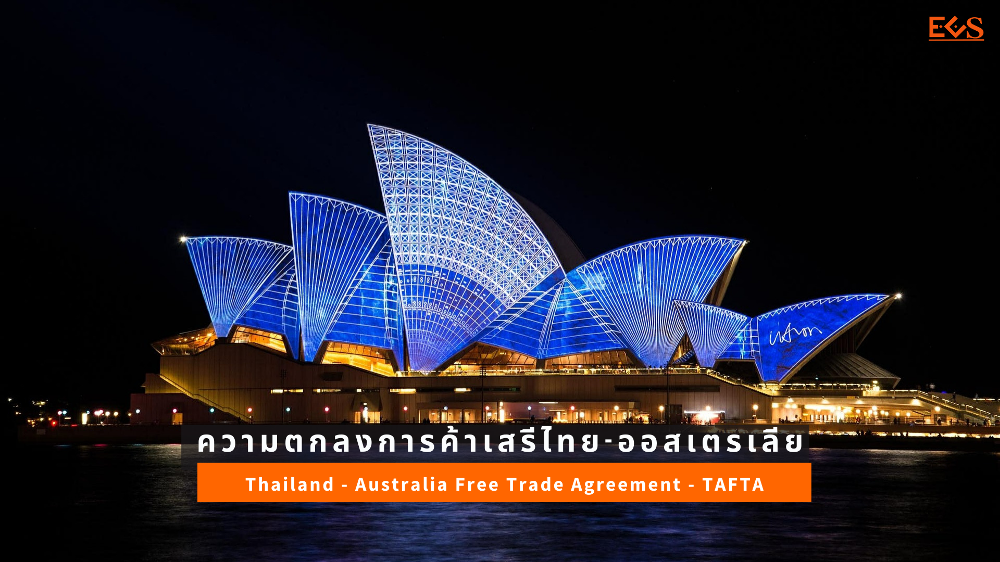




- มีผล 1 มกราคม 2548
- ไทย ปี 2560 สินค้า 99.09% ลดภาษีเป็นศูนย์แล้ว (สินค้าทุกรายการจะลดภาษีเป็นศูนย์ภายในปี 2568)
- บางสินค้ามีมาตรการปกป้องพิเศษจนถึงปี 2563 (เช่นเนื้อวัว เครื่องในวัว/หมู นมและครีมแบบผง เป็นต้น) และในรูปโควตาภาษีจนถึงปี 2568 (เช่น นมผง กาแฟ มันฝรั่ง น้าตาล เป็นต้น)
- เปิดให้ต่างชาติถือหุ้นได้ถึง 60% ในบางบริการ เช่น ศูนย์แสดงสินค้านานาชาติ หอประชุม และเหมืองแร่ 
- ออสเตรเลียสินค้าทุกรายการลดภาษีเป็นศูนย์แล้วตั้งแต่ปี 2558 เปิดให้ลงทุนทุกประเภท ยกเว้นหนังสือพิมพ์ การกระจายเสียง การขนส่งทางอากาศ และท่าอากาศยาน


## ความเป็นมา

ความตกลงการค้าเสรีไทย-ออสเตรเลีย หรือ Thailand-Australia Free Trade Agreement (TAFTA) มีผลบังคับใช้เมื่อวันที่ 1 มกราคม 2548 โดยกำหนดให้ไทยและออสเตรเลียเริ่มเปิดเสรีการค้าทั้งในด้านสินค้า การบริการ และการลงทุน ระหว่างกัน รวมทั้งร่วมมือกันแก้ไขปัญหาอุปสรรคทางการค้าที่มิใช่ภาษี เช่น มาตรการด้านสุขอนามัยที่เข้มงวดของออสเตรเลีย และมาตรการตอบโต้การทุ่มตลาด และในสาขาต่างๆ เพื่ออำนวยความสะดวกทางการค้า อาทิ พาณิชย์อิเล็กทรอนิกส์ ทรัพย์สินทางปัญญา การจัดซื้อจัดจ้างโดยรัฐ และนโยบายการแข่งขัน เป็นต้น

ความตกลง FTA ไทย-ออสเตรเลีย และไทย-นิวซีแลนด์ ถือเป็นความตกลง FTA ลำดับต้นๆ ของไทยที่มีผลใช้บังคับมาตั้งแต่ปี 2548 โดยปัจจุบันออสเตรเลีย และนิวซีแลนด์ได้ลดภาษีสินค้าทุกรายการให้กับไทยเหลือศูนย์แล้วตั้งแต่วันที่ 1 มกราคม 2558 ส่วนไทยได้ลดภาษีสินค้าเกือบทั้งหมดให้ออสเตรเลียและนิวซีแลนด์เหลือศูนย์แล้วเช่นกัน แต่ยังคงเหลือสินค้าเกษตรบางรายการ ซึ่งรวมถึงสินค้านมและผลิตภัณฑ์นมที่ไทยยังใช้มาตรการโควตาภาษีและมาตรการปกป้องพิเศษ เพื่อให้ภาคการผลิตและอุตสาหกรรมโคนมของไทยมีเวลาในการปรับตัว โดยปัจจุบันกลุ่มผลิตภัณฑ์นมไทยที่เปิดตลาดลดภาษีเหลือศูนย์แล้ว ตั้งแต่วันที่ 1 มกราคม 2559 คือ นมและครีมข้นไม่หวาน และบัตเตอร์มิลล์ แต่ยังคงเหลือสินค้าที่ไทยจะต้องทยอยเปิดตลาดให้กับออสเตรเลียและนิวซีแลนด์ ได้แก่ สินค้านมผงที่มีไขมันเกิน 1.5% (ไม่ใช้เลี้ยงทารก) ผลิตภัณฑ์ที่มีส่วนผสมของนม หางนม (เวย์) เนย ไขมันเนย (AMF)และกลุ่มสินค้าเนยแข็ง จะต้องไม่มีการจำกัดโควตาและลดภาษีเป็นศูนย์ ในปี 2564 และสินค้านมและครีม เครื่องดื่มประเภทนมปรุงแต่ง นมผงขาดมันเนย ที่จะต้องไม่มีโควตาและลดภาษีเป็นศูนย์ในปี 2568

## การลดหย่อนภาษี

### ออสเตรเลีย

1. ลดเป็น 0 ทันที จำนวน 5,083 รายการ
1. ลดเป็น 0 ภายในปี 2553 จำนวน 786 รายการ
1. ลดเป็น 0 ภายในปี 2558 จำนวน 239 รายการ

### ไทย

1. ลดเป็น 0 ทันที จำนวน 2,724 รายการ
1. ลดเป็น 0 ภายในปี 2553 จำนวน 2,411 รายการ
1. ลดเป็น 0 ภายในปี 2558 จำนวน 313 รายการ
1. ลดเป็น 0 ภายในปี 2563 จำนวน 53 รายการ และปี 2568 จำนวน 4 รายการ

## การขอใช้สิทธิลดหย่อนภาษี

สินค้าที่กำเนิดหรือผลิตได้ดังกล่าวข้างต้น จะต้องมีหนังสือรับรองแหล่งกำเนิดสินค้า ([ดูตัวอย่าง Form FTA](http://www.dft.go.th/Portals/0/%E0%B8%AA%E0%B8%B4%E0%B8%97%E0%B8%98%E0%B8%B4%E0%B8%9B%E0%B8%A3%E0%B8%B0%E0%B9%82%E0%B8%A2%E0%B8%8A%E0%B8%99%E0%B9%8C%E0%B8%97%E0%B8%B2%E0%B8%87%E0%B8%81%E0%B8%B2%E0%B8%A3%E0%B8%84%E0%B9%89%E0%B8%B2/%E0%B8%9B%E0%B8%A3%E0%B8%B0%E0%B8%81%E0%B8%B2%E0%B8%A8%E0%B8%9F%E0%B8%AD%E0%B8%A3%E0%B9%8C%E0%B8%A1%20TAFTA.pdf?ver=2560-09-29-144321-997)) ไปแสดงต่อศุลกากรประเทศผู้นำเข้า

## Rules of Origin

-   [Rules of Origin](http://www.customs.go.th/cont_strc_download.php?lang=th&current_id=142231324147505f4c464b4d464b4a)

---

## ประกาศ / กฎหมาย ที่เกี่ยวข้อง


 

### ประกาศกระทรวงการคลัง

-   [ประกาศกระทรวงการคลัง เรื่อง การยกเว้นอากรและลดอัตราอากรศุลกากรสำหรับของที่มีถิ่นกำเนิดจากออสเตรเลีย (ฉบับที่ 2) (ลงวันที่ 26 ธันวาคม 2561)](http://www.customs.go.th/cont_strc_download.php?lang=th&current_id=14232832414a505e4e464a4e464b48)
-   [ประกาศกระทรวงการคลัง เรื่อง การยกเว้นอากรและลดอัตราอากรศุลกากรสำหรับของที่มีถิ่นกำเนิดจากออสเตรเลีย ลงวันที่ 10 พฤศจิกายน 2560](http://www.customs.go.th/cont_strc_download.php?lang=th&current_id=14223132414c505e4f464a4f464b4d)
-   [ประกาศกระทรวงการคลัง เรื่อง การยกเว้นอากรและลดอัตราอากรศุลกากรสำหรับของที่มีถิ่นกำเนิดจากออสเตรเลีย (30 ธันวาคม 2559)](http://www.customs.go.th/cont_strc_download.php?lang=th&current_id=142231324149505f46464b4a464a4f)
-   [ประกาศกระทรวงการคลัง เรื่อง การยกเว้นอากรและลดอัตราอากรศุลกากรสำหรับของที่มีถิ่นกำเนิดจากออสเตรเลีย](http://www.customs.go.th/cont_strc_download.php?lang=th&current_id=142231324147505f49464b4b464b4c)



### ประกาศกรมศุลกากร

|เลขที่ประกาศ    |รายละเอียด     |
|-------|-------------------|  
|81/.2563|[การแสดงหนังสือรับรองถิ่นกำเนิดสินค้า สำหรับผู้นำของเข้าที่ได้รับผลกระทบจากการแพร่ระบาดของโรคติดเชื้อไวรัสโคโรนา 2019 (โควิด-19)](http://www.customs.go.th/cont_strc_download_with_docno_date.php?lang=th&current_id=14232832414a505f4a464b47464a4f)|     
|40/.2562|[แก้ไขเพิ่มเติมประกาศกรมศุลกากรที่ 151/.2560](http://www.customs.go.th/cont_strc_download_with_docno_date.php?lang=th&current_id=142328324146505f47464a4f464b46)|.    
|151/.2560|[หลักเกณฑ์และพิธีการการยกเว้นอากรและลดอัตราอากรศุลกากรสำหรับของที่มีถิ่นกำเนิดจากออสเตรเลีย](http://www.customs.go.th/cont_strc_download_with_docno_date.php?lang=th&current_id=14223132414b505f4b464b48464b4a)|  
|233/.2559|[หลักเกณฑ์และพิธีการการยกเว้นอากรและการลดอัตราอากรศุลกากรสำหรับของที่มีถิ่นกำเนิดจากออสเตรเลีย](http://www.customs.go.th/cont_strc_download_with_docno_date.php?lang=th&current_id=142231324149505f49464b46464a4e)|
|77/.2556|[แก้ไขเพิ่มเติมประกาศกรมศุลกากรที่ 6/.2555](http://www.customs.go.th/cont_strc_download_with_docno_date.php?lang=th&current_id=14232932404f505f49464b48)|  
|6/.2555|[หลักเกณฑ์และพิธีการการยกเว้นอากรและลดอัตราอากรศุลกากรสำหรับของที่มีถิ่นกำเนิดจากออสเตรเลีย](http://www.customs.go.th/cont_strc_download_with_docno_date.php?lang=th&current_id=14232932404e505f46464b4d)|
|127/.2549|[หลักเกณฑ์และพิธีการการยกเว้นอากรและลดอัตราอากรศุลกากรสำหรับของที่มีถิ่นกำเนิดจากออสเตรเลีย](http://www.customs.go.th/cont_strc_download_with_docno_date.php?lang=th&current_id=14232a324147505f4a464b46)|
|79/.2548|[เพิ่มเติมระเบียบพิธีการสำหรับการยกเว้นอากรและการลดอัตราอากรศุลกากรสำหรับของที่มีถิ่นกำเนิดออสเตรเลีย ตามข้อผูกพันตามความตกลงการค้าเสรีไทย-ออสเตรเลีย(Thailand-Australia Free Trade Agreement)](http://www.customs.go.th/cont_strc_download_with_docno_date.php?lang=th&current_id=14232a324146505f46464b48)|
|111/.2547|[แก้ไขเพิ่มเติมรหัสสถิติสินค้า*ความตกลงการค้าเสรีไทย-ออสเตรเลีย](http://www.customs.go.th/cont_strc_download_with_docno_date.php?lang=th&current_id=14232a32404f505e4f464b4c)|




### ประกาศสำนักพิกัดอัตราศุลกากร

-   [ประกาศกองพิกัดอัตราศุลกากร ที่ 4/.2563 เรื่อง การใช้บัญชีราคาสินค้า (Invoice) ฉบับซื้อขายในประเทศ ประกอบการปฏิบัติพิธีการศุลกากร เพื่อขอรับสิทธิพิเศษทางภาษีศุลกากรภายใต้ความตกลงเขตการค้าเสรี](http://www.customs.go.th/cont_strc_download.php?lang=th&current_id=14232832414b505e4e464b48464b4d)





### ปริมาณการนำเข้าสินค้าตามมาตรการปกป้อง ตามความตกลง ไทย-ออสเตรเลีย (Thailand - Australia FTA)

-   [ปริมาณการนำเข้าสินค้าตามมาตรปกป้อง ตามความตกลง ไทย-ออสเตรเลีย](http://www.customs.go.th/cont_strc_download.php?lang=th&current_id=142231324147505f4c464b48464a4e)

 



**ที่มาบทความ:**  

- [กรมศุลกากร](http://www.customs.go.th/cont_strc_simple_net_with_download.php?ini_content=usage_fta_and_wto_01_08&ini_menu=menu_interest_and_law_160421_01&left_menu=menu_fta_and_wto) 
- [กรมการค้าต่างประเทศ](https://www.dft.go.th/th-th/DFT-Service/ServiceData-Information/dft-service-data-privilege/Detail-dft-service-data-privilege/ArticleId/5054/th-aus-trade)

**สอบถามข้อมูลเพิ่มเติมได้ที่ :**.   
- ส่วนกฎว่าด้วยถิ่นกำเนิดสินค้า (สกก.) กองพิกัดอัตราศุลกากร (กพก.)  
- หมายเลขโทรศัพท์ : 0-2667-7014 หรือ 0-2667-6459  
- อีเมล์ : 80150000@customs.go.th


