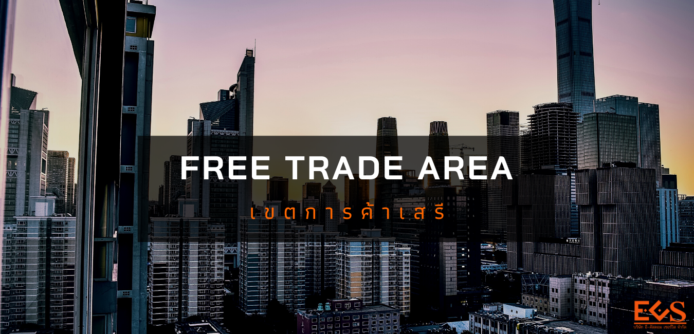
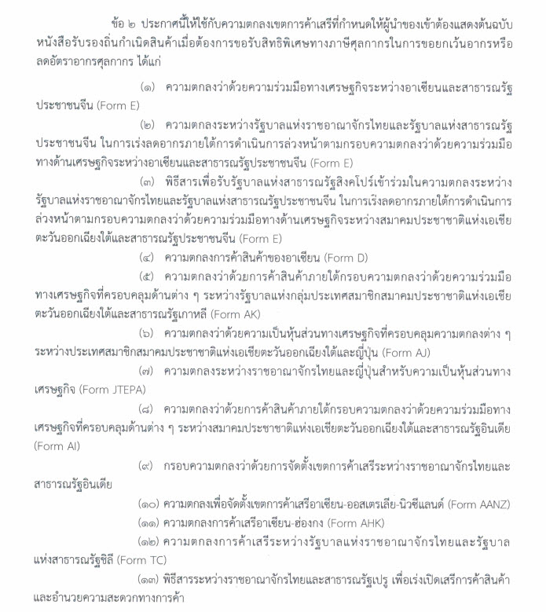

---
# Course title, summary, and position.
linktitle: เขตการค้าเสรี (Free Trade Area)
summary: Free Trade Area หรือเขตการค้าเสรี เป็นการทำความตกลงทางการค้าของประเทศ อาจเป็น 2 ประเทศ (ทวิภาคี) หรือเป็นกลุ่มประเทศ (พหุภาคี) ที่จะร่วมมือขจัดอุปสรรคทางการค้าทั้งที่เป็นภาษีศุลกากรและไม่ใช่ภาษีศุลกากร

# Page metadata.
title: เขตการค้าเสรี (Free Trade Area)
date: "2020-05-12T00:00:00Z"
lastmod: "2020-05-12T00:00:00Z"
draft: false  # Is this a draft? true/false
toc: false # Show table of contents? true/false
type: series  # Do not modify.
categories: ["สิทธิพิเศษทางการค้า"]
tags: ["FTA","เขตการค้าเสรี"]
authors: ["admin"]
# Optional header image (relative to `static/img/` folder).
menu:
  fta:
    name: สิทธิพิเศษทางการค้า
    weight: 1    
weight: 1
---

Free Trade Area หรือเขตการค้าเสรี เป็นการทำความตกลงทางการค้าของประเทศ อาจเป็น 2 ประเทศ (ทวิภาคี) หรือเป็นกลุ่มประเทศ (พหุภาคี) ที่จะร่วมมือขจัดอุปสรรคทางการค้าทั้งที่เป็นภาษีศุลกากรและไม่ใช่ภาษีศุลกากร.  

**เขตการค้าเสรี (FTA)**  คือ การรวมกลุ่มทางเศรษฐกิจของกลุ่มประเทศต่าง ๆ เพื่อให้มีการเก็บภาษีศุลกากรระหว่างกัน ในอัตราที่น้อยที่สุด หรือ ในอัตราร้อยละ 0 ซึ่งประเทศที่มีการรวมกลุ่มเขตการค้าเสรีนั้น จะได้เปรียบทางการค้ามากกว่า ประเทศที่อยู่นอกกลุ่มในเรื่องของอัตราภาษี โดยการเปิดเสรีทางการค้านั้น ไม่เพียงแต่เฉพาะด้านสินค้าเท่านั้น แต่ยังรวมถึงด้านบริการ และการลงทุนด้วย เช่น เขตการค้าเสรีในภูมิภาคอเมริกา (Free Trade Area of the Americas) เขตการค้าเสรีอเมริกาเหนือ (NAFTA) เป็นต้น.  

**เขตการค้าเสรี (Free Trade Area: FTA)** หรือข้อตกลงเขตการค้าเสรี (Free Trade Agreement: FTA) อาจดูเป็นสิ่งใหม่สำหรับคนไทยส่วนใหญ่ แต่ในความเป็นจริงแล้ว FTA เป็นสิ่งที่อยู่คู่กับคนไทยมานานแล้ว โดย FTA ฉบับแรกที่ไทยจัดทำคือข้อตกลงเขตการค้าเสรีอาเซียน (ASEAN Free Trade Area) หรือที่เรียกว่า AFTA ซึ่งมีผลบังคับใช้มาตั้งแต่ปี 2535 อย่างไรก็ตาม ถึงแม้จะอยู่คู่สังคมไทยมานานกว่าทศวรรษ FTA ก็ยังคงเป็นเสมือนกล่องปริศนาสำหรับหลายคน  จึงขอให้ข้อมูลพื้นฐานเกี่ยวกับ FTA เพื่อให้ทุกคนได้รู้จัก เข้าใจ และสามารถใช้ประโยชน์จาก FTA ได้อย่างเต็มที่

## เขตการค้าเสรี (FTA) คืออะไร?

FTA เป็นความตกลงระหว่าง 2 ประเทศขึ้นไป โดยมีวัตถุประสงค์เพื่อจะลดอุปสรรคทางการค้า ระหว่างกันให้เหลือน้อยที่สุด เพื่อให้เกิดการค้าเสรีระหว่างกัน และปัจจุบันประเทศต่าง ๆ ก็ได้ขยายขอบเขตของ FTA ให้ครอบคลุมการค้าด้านบริการ อาทิ บริการท่องเที่ยว การรักษา พยาบาล การสื่อสาร การขนส่ง ฯลฯ พร้อมกับความร่วมมือในด้านต่างๆ เช่น การลงทุน การคุ้มครองทรัพย์สินทางปัญญา และการอำนวยความสะดวกทางการค้าด้วย

## วัตถุประสงค์ของ FTA

**FTA** สะท้อนแนวคิดสำคัญทางเศรษฐศาสตร์ที่ว่า **"ประโยชน์จากการค้าระหว่างประเทศจะเกิดขึ้นสูงสุดเมื่อประเทศต่างๆ ผลิตสินค้าที่ตนมีต้นทุนในการผลิตต่ำที่สุดเมื่อเปรียบ เทียบกับประเทศอื่นๆ แล้วนำสินค้าเหล่านั้นมาค้าขายแลกเปลี่ยนกัน"** ซึ่งในโลกแห่งความเป็นจริงนั้น ประโยชน์สูงสุดดังกล่าวจะไม่เกิดขึ้น หากยังมีการเก็บภาษีขาเข้าและมีการใช้มาตรการกีดกันทางการค้าต่างๆ ซึ่งส่งผลบิดเบือนราคาที่แท้จริงของสินค้า และทำให้การค้าขายไม่เป็นไปอย่างเสรีและมีประสิทธิภาพ
พร้อมกันนี้ FTA ถือเป็นเครื่องมือทางการค้าสำคัญที่ประเทศต่างๆ สามารถใช้เพื่อขยายโอกาสในการค้า สร้างพันธมิตรทางเศรษฐกิจ พร้อมๆ กับเพิ่มความสามารถในการแข่งขันด้านราคาให้แก่สินค้าของตน เนื่องจากสินค้าที่ผลิตใน FTA จะถูกเก็บภาษีขาเข้าในอัตราที่ต่ำกว่าสินค้าที่ผลิตในประเทศอื่นๆ ที่ไม่ใช่สมาชิก FTA จึงทำให้สินค้าที่ผลิตภายในกลุ่มได้ เปรียบในด้านราคากว่าสินค้าจากประเทศนอกกลุ่ม

## ความเป็นมาของเขตการค้าเสรี

แนวคิดของการมีนโยบายการค้าเสรี คือประเทศจะเลือกผลิตสินค้าที่ตนเองถนัด และมีต้นทุนการผลิตต่ำที่สุด คือจะผลิตสินค้าที่คิดว่าประเทศตนได้เปรียบเชิงเปรียบเทียบ (Comparative Advantage) มากที่สุด แล้วนำสินค้าที่ผลิตได้นี้ไปแลกเปลี่ยน กับสินค้าที่ประเทศตนไม่ถนัด หรือเสียเปรียบ โดยแลกเปลี่ยนสินค้ากับประเทศอื่นที่ผลิตสินค้าแล้วได้เปรียบ ดังนั้นประเทศทั้งสองก็จะทำการค้าต่อกันได้ โดยต่างฝ่ายต่างสมประโยชน์กัน (Win-Win Situation) 

## นโยบายการค้าเสรี

1.  การผลิตตามหลักการแบ่งงานกันทำเลือกผลิตสินค้าที่มีต้นทุนการผลิตต่ำและประเทศมีศักยภาพในการผลิตสินค้านั้นสูง
2.  ไม่เก็บภาษีคุ้มกัน (Protective Duty) เพื่อคุ้มครองหรือปกป้องอุตสาหกรรมภายในประเทศ
3.  ไม่ให้สิทธิพิเศษหรือกีดกันสินค้าของประเทศใดประเทศหนึ่ง
4.  เรียกเก็บภาษีในอัตราเดียวและให้ความเป็นธรรมแก่สินค้าของทุกประเทศเท่ากัน ไม่มีข้อจำกัดทางการค้า (Trade Restriction) ที่เป็นอุปสรรคต่อการค้าระหว่างประเทศไม่มีการควบคุมการนำเข้า หรือการส่งออกที่เป็นอุปสรรคต่อการค้าระหว่างประเทศ ยกเว้นการควบคุมสินค้าบางอย่างที่เกี่ยวกับสุขภาพอนามัยและเป็นอันตรายต่อมนุษย์และสินค้าที่เกี่ยวด้วยศีลธรรมจรรยาหรือความมั่นคงของประเทศ

## ลักษณะสำคัญของ FTA

FTA จะมีรูปแบบเป็นอย่างไรนั้นก็ขึ้นอยู่กับประเทศคู่สัญญา FTA จะตกลงกัน ไม่มีกฎเกณฑ์กำหนดตายตัวว่า FTA จะต้องมีลักษณะอย่างไร แต่ถึงกระนั้นก็ดี ทุก FTA จะมีลักษณะพื้นฐานที่เหมือนกันอยู่ 3 ประการ คือ
- มีวัตถุประสงค์เพื่ออำนวยความสะดวกทางการค้า และไม่สร้างอุปสรรคทางการค้าเพิ่มต่อประเทศอื่นๆ ที่ไม่ใช่สมาชิก (No fortress effects)
- ครอบคลุมการค้าระหว่างประเทศมากพอ (Substantial coverage) ซึ่งเป็นกติกาที่ WTO กำหนดไว้เพื่อปกป้องและป้องกันผลกระทบของ FTA ที่จะมีต่อประเทศอื่นๆ ที่ไม่ใช่สมาชิกของ FTA นั้นๆ
- มีตารางการลดภาษีหรือเปิดเสรีที่ประเทศคู่สัญญา FTA เจรจากันว่าจะลดภาษีให้แก่กันในสินค้าใดบ้าง จะลดอย่างไร และจะใช้ระยะเวลายาวนานเท่าไรในการลดหลักเกณฑ์ในการทำ FTA ของไทย

## หลักเกณฑ์ในการจัดทำ FTA 

- การจัดทำความตกลง FTA ควรทำในกรอบกว้าง (Comprehensive) ครอบคลุมการเปิดเสรีทั้งด้านการค้าสินค้า บริการ และการลงทุน รวมทั้งมาตรการทางการค้าอื่นๆ ที่ไม่ใช่ภาษี (Non-Tariff Measure: NTM) เช่น การกำหนดมาตรฐานสินค้านำเข้า และมาตรการโควต้า และการขยายความร่วมมือทางเศรษฐกิจอื่นๆ
- การจัดทำความตกลง FTA ต้องสอดคล้องกับกฎของ WTO ซึ่งมีเงื่อนไขให้การเปิดเสรีต้องครอบคลุมการค้าสินค้าและบริการอย่างมากพอ (Substantial coverage) มี ความโปร่งใส และเปิดให้สมาชิกอื่นๆ ตรวจสอบความตกลงได้
- การจัดทำความตกลง FTA ต้องมีความยืดหยุ่น (Flexibility) สอดคล้องกับระดับการพัฒนาของประเทศคู่เจรจาเพื่อให้ได้รับผลประโยชน์ทั้งสองฝ่าย พร้อมกับยึดหลักการแลกเปลี่ยนผลประโยชน์ (Reciprocity) และเกื้อกูลซึ่งกันและกัน โดยคำนึงถึงสถานะของไทยที่เป็นประเทศกำลังพัฒนา เพื่อให้มีเวลาในการปรับตัวนานกว่า หรือมีภาระผูกพันน้อยกว่า
- การจัดทำความตกลง FTA ควรมีมาตรการป้องกันผลกระทบของการเปิดเสรีต่ออุตสาหกรรมภายใน เช่น มาตรการต่อต้านการทุ่มตลาด (Anti-dumping Measures: AD) มาตรการต่อต้านการอุดหนุน (Counter-vailing Duties: CVD) มาตรการปกป้อง (Safeguards) รวมทั้งกำหนดกลไกการยุติข้อพิพาททางการค้าอย่างเป็นธรรม

   
## เขตการค้าเสรีที่สำคัญของไทย

เขตการค้าเสรีที่มีมูลค่าสูงในทางการค้า ได้แก่ เขตการค้าเสรีอาเซียน (AFTA) เขตการค้าเสรีอาเซียน-จีน ไทย-ญี่ปุ่น อาเซียน-เกาหลี เป็นต้น

### เว็บไซต์สำหรับตรวจสอบหนังสือรับรองถิ่นกำเนิดสินค้า

ประกาศกองพิกัดอ้ตราศุลกากร ที่ 3/ 2563 เรื่อง **เว็บไซต์สำหรับตรวจสอบหนังสือรับรองถิ่นกำเนิดสินค้า**

### การแสดงหนังสือรับรองถิ่นกำเนิดสินค้า 

การแสดงหนังสือรับรองถิ่นกำเนิดสินค้า สำหรับผู้นำของเข้าที่ได้รับผลกระทบจากการแพร่ระบาดของโรคติดเชื้อไวรัสโคโรนา 2019 ให้ผู้นำเข้าสามารถแสดงสำเนาภาพถ่ายหนังสือรับรองถิ่นกำเนิดสินค้าเพื่อใช้ในการปฏิบัติพิธีการศุลกากรได้ โดยให้เพิ่มการระบุข้อความในช่อง Remark (หมายเหตุส่งกรมฯ) *ขอใช้สำเนาภาพถ่ายหนังสือรับรองถิ่นกำเนิดสินค้าไปพลางก่อนและจะแสดงต้นฉบับหนังสือรับรองถิ่นกำเนิดสินค้าในภายหลัง*

ตามประกาศกรมศุลกากรที่ 81/ 2563 เรื่อง การแสดงหนังสือรับรองถิ่นกำเนิดสินค้า สำหรับผู้นำของเข้า ที่ได้รับผลกระทบจากการแพร่ระบาดของโรคติดเชื้อไวรัสโคโรนา 2019 (โควิด-19) ตั้งแต่บัดนี้เป็นต้นไป จนถึงวันที่ 30 กันยายน 2563 [[ดาวน์โหลด]](http://www.customs.go.th/cont_strc_download_with_docno_date.php?lang=th&top_menu=menu_homepage&current_id=14232832414a505f4a464b47464a4f)  



- **สอบถามข้อมูลเพิ่มเติมได้ที่ :** ส่วนกฎว่าด้วยถิ่นกำเนิดสินค้า (สกก.) กองพิกัดอัตราศุลกากร (กพก.) 
กรมศุลกากร เลขที่ 1 ถ.สุนทรโกษา คลองเตย กทม. 10110  
- **หมายเลขโทรศัพท์ :** 0-2667-7014 หรือ 0-2667-6459  
- **อีเมล์ :** 80150000@customs.go.th



**ที่มาบทความ**  
- [กรมเจรจาการค้าระหว่างประเทศ](http://www.thaifta.com/)  
- [กรมศุลกากร](http://www.customs.go.th)
