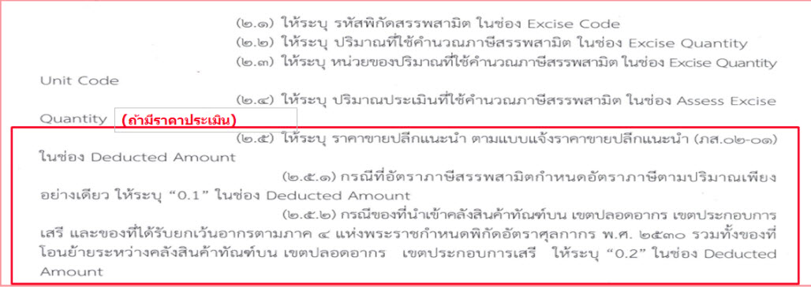

แบ่งได้เป็น 3 ประเภทคือ

1.  ให้ระบุราคาขายปลีกแนะนำตามที่ได้แจ้งไว้กับกรมสรรพสามิตที่ช่อง **Deducted Amount**
1.  กรณีสินค้าที่มี**อัตราภาษีตามปริมาณเพียงอย่างเดียว เช่น น้ำมัน และผลิตภัณฑ์น้ำมัน (น้ำมันหล่อลื่นอัตราภาษี 5 บาทต่อลิตร)** ให้ระบุ **“0.1”**
1.  กรณีสินค้าที่นำเข้า**คลังทัณฑ์บน เขตปลอดอากร เขตประกอบการเสรี และของที่ได้รับยกเว้นอากรตามภาค 4 และสินค้าที่กำหนดอัตราภาษีสรรพสามิตตามมูลค่าร้อยละศูนย์** ให้ระบุ **“0.2”**

## การระบุ EXEMPT

การระบุ EXEMPT กรณีของที่นำเข้าคลังทัณฑ์บน เขตปลอดอากร เขตประกอบการเสรี และของที่ได้รับยกเว้นอากรตามภาค 4 รวมทั้งของที่โอนย้ายระหว่างคลังสินค้าทัณฑ์บน เขตปลอดอากร เขตประกอบการเสรี

