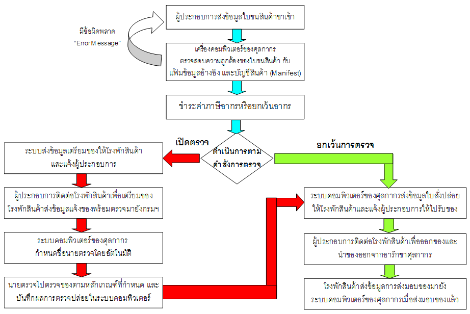

---
# Course title, summary, and position.
linktitle: คู่มือพิธีการนำเข้า  
summary: คู่มือการปฏิบัติพิธีการศุลกากรสำหรับการนำเข้า (e-Import)

title: คู่มือการปฏิบัติพิธีการศุลกากรสำหรับการนำเข้า (e-Import)
date: "2020-05-09T00:00:00Z"
lastmod: "2020-05-09T00:00:00Z"
draft: false  # Is this a draft? true/false
toc: false 
type: series  
tags: ["คู่มือการนำเข้า"]
categories: ["การนำเข้า"]
authors: ["admin"]

menu:
  import:
    parent:  การนำเข้าสินค้า (Import)
    weight: 3

weight: 3
---

คู่มือการปฏิบัติพิธีการศุลกากรทางอิเล็กทรอนิกส์ว่าด้วยกระบวนการทางศุลกากรสำหรับการนำเข้า    (e-Import) กำหนดขึ้นเพื่อประโยชน์ในการนำของเข้ามาในราชอาณาจักร ให้การปฏิบัติพิธีการศุลกากรสามารถกระทำโดยวิธีการทางอิเล็กทรอนิกส์ โดยให้ใช้บังคับเป็นการทั่วไปสำหรับการนำของเข้ามาในราชอาณาจักร
ทางเรือ ทางรถไฟ ทางรถยนต์ คนเดินเข้ามา ทางเครื่องบิน  ทางไปรษณีย์ ทางท่อขนส่งทางบก ทางสายส่งไฟฟ้า ทางเรือที่เข้าออกด่านศุลกากรทางบก เรือเล็กทางทะเลที่เข้าออกด่านศุลกากรทางทะเล ทางผู้โดยสารนำพาขึ้นอากาศยาน 

การนำของเข้ามาในราชอาณาจักร หมายถึง การนำของใด ๆ จากภายนอกราชอาณาจักรเข้ามา         ในราชอาณาจักรโดยการขนส่งทางเรือ ทางรถไฟ ทางรถยนต์ คนเดินเข้ามา ทางเครื่องบิน ทางไปรษณีย์ 
ทางท่อขนส่งทางบก ทางสายส่งไฟฟ้า ทางเรือที่เข้าออกด่านศุลกากรทางบก เรือเล็กทางทะเลที่เข้าออกด่านศุลกากรทางทะเล ทางผู้โดยสารนำพาขึ้นอากาศยาน เป็นต้น 

ในการปฏิบัติพิธีการศุลกากรหรือดำเนินการในกระบวนการทางศุลกากรกับของที่นำเข้ามาในราชอาณาจักรนั้น ให้ดำเนินการโดยวิธีการทางอิเล็กทรอนิกส์ ณ ด่านศุลกากรที่ระบุไว้ใน บัญชีสินค้าที่มีชื่อส่งของถึง

ในการปฏิบัติพิธีการหรือดำเนินการในกระบวนการทางศุลกากรกับของที่นำเข้ามาในราชอาณาจักรและจะขนเข้าเก็บในคลังสินค้าทัณฑ์บน หรือนำเข้าไปในเขตปลอดอากรและ/หรือนำเข้าไปในเขตประกอบการเสรี    
ให้ดำเนินการโดยวิธีการทางอิเล็กทรอนิกส์ ณ ด่านศุลกากรที่ระบุไว้ในบัญชีสินค้าที่มีชื่อส่งของถึง

หากเรื่องใดที่เป็นข้อปฏิบัติเฉพาะของหน่วยงานที่สำนัก/สำนักงานศุลกากรที่รับผิดชอบเสนอระเบียบปฏิบัติและขอความเห็นชอบจากกรมศุลกากร ให้กำหนดเพิ่มเติมเป็นการเฉพาะหรือแตกต่างไปจากที่กำหนด
ในคู่มือฉบับนี้ ให้ถือปฏิบัติตามข้อปฎิบัติดังกล่าวนั้น

แผนภาพแสดงกระบวนการนำเข้าด้วยวิธีทางอิเล็กทรอนิกส์ (e-Import System)

> **ที่มา** : [ประกาศกรมศุลกากรที่ 133 / 2561 เรื่อง **คู่มือการปฏิบัติพิธีการศุลกากรทางอิเล็กทรอนิกส์ว่าด้วยกระบวนการทางศุลกากรสำหรับการนำเข้า (e-Import)**](https://ecs-support.github.io/KM/customs/pages/docs/guide-import/)