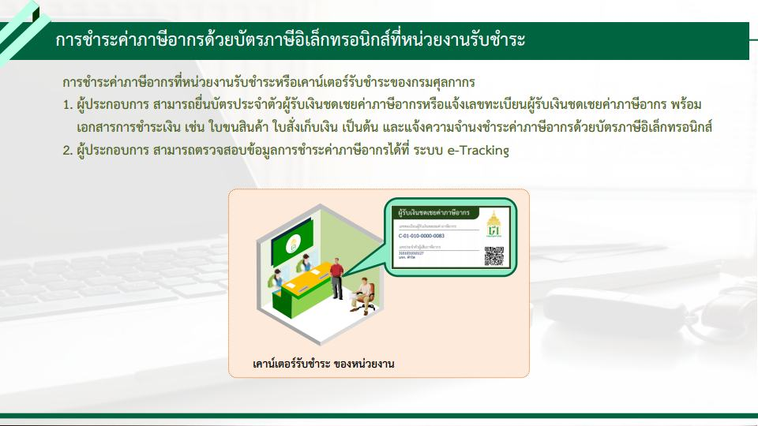

  
 



ตามที่กรมศุลกากรได้จัดงานสัมมนา **“โครงการพัฒนาระบบชำระค่าภาษีอากรด้วยบัตรภาษีอิเล็กทรอนิกส์ (Digital Tax Compensation : DTC)”** เมื่อวันที่ 20 สิงหาคม 2564 ผ่านระบบ Video Conference : Zoom Cloud Meeting ณ ห้องประชุมภาสกรวงศ์ ชั้น 2 อาคาร 1 กรมศุลกากร เพื่อให้ผู้ประกอบการหรือตัวแทนออกของเข้าใจ การชำระเงินค่าภาษีอากรด้วยบัตรภาษีอิเล็กทรอนิกส์ ซึ่งมีรายละเอียดแบ่งได้ ดังนี้

# การใช้สิทธิการชดเชยค่าภาษีอากร

สำหรับการใช้สิทธิ**การชดเชยค่าภาษีอากร สำหรับสินค้าส่งออกที่ผลิตในราชอาณาจักร** มีการปรับเปลี่ยนที่สำคัญดังนี้
## 1. รูปแบบเงินที่จะจ่ายชดเชยค่าภาษีอากร

กรมศุลกากรจะมีการเปลี่ยนแปลงรูปแบบเงินที่จะจ่ายชดเชยค่าภาษีอากร จากเดิมที่จ่ายในรูปแบบ*บัตรภาษีที่เป็นกระดาษ* เปลี่ยนเป็น*บัตรภาษีอิเล็กทรอนิกส์* ซึ่งจะเริ่มใช้งานใน*วันที่ 21 กันยายน 2564* (ตามที่ประกาศในราชกิจจานุเบกษา) ซึ่งมีการเปลี่ยนแปลงที่สำคัญคือ

## 2. การลงทะเบียนผู้มีสิทธิได้รับเงินชดเชย

สำหรับ*ผู้ที่เคยใช้สิทธิย้อนหลัง 3 ปี* _(17 ส.ค. 61 – 16 ส.ค. 64)_ และผู้ใช้สิทธิที่ยังคงมี*บัตรภาษีแบบกระดาษที่ยังไม่ได้ใช้ ณ วันที่ 20 กันยายน 2564* กรมศุลกากรจะ**กำหนดเลขทะเบียนผู้มีสิทธิได้รับเงินชดเชยค่าภาษีอากร (14 หลัก) ให้โดยอัตโนมัติ** *ทุกราย* โดยผู้ประกอบการ*ไม่ต้องลงทะเบียนแต่อย่างใด* และ*เปลี่ยนบัตรภาษี จำนวนดังกล่าวทั้งหมดที่ยังไม่หมดอายุ* เป็น**บัตรภาษีอิเล็กทรอนิกส์** *โดยมิต้องร้องขอ* โดยจะเรียงลำดับบัตรภาษีอิเล็กทรอนิกส์ตามวันที่ออกบัตรภาษีเดิม (1 ชุดคำขอฯ ซึ่งอาจมีบัตรภาษี กระดาษหลายฉบับจะเปลี่ยนเป็นบัตรภาษีอิเล็กทรอนิกส์ฉบับเดียว) โดย**บัตรภาษีอิเล็กทรอนิกส์ จะมีอายุเท่ากับบัตรภาษีเดิม**

## การบันทึกข้อมูลในใบขนสินค้าขาออก


เพิ่มเติมการระบุ**เลขทะเบียนผู้มีสิทธิได้รับเงินชดเชย (เลข 14 หลัก)** ขึ้นต้นด้วยอักษร **C** ซึ่งเป็นเลขสิทธิประโยชน์ลักษณะเดียวกันกับสิทธิ์ Freezone, มาตรา29 ฯลฯ



ศุลกากรจะออกเป็นประกาศวิธีปฏิบัติพิธีการศุลกากรเพิ่มเติมก่อนวันที่ระบบจะใช้งานจริงในวันที่ 21 กันยายน 2564 สำหรับการใช้สิทธิชดเชยค่าภาษีอากร นอกเหนือจากเรื่องที่แจ้งเปลี่ยนแปลงดังกล่าว ยังคงให้ปฏิบัติตามพระราชบัญญัติชดเชยค่าภาษีอากรสินค้าส่งออกที่ผลิตในราชอาณาจักร พ.ศ. 2524 


-------

# การชำระค่าภาษีอากรด้วยบัตรภาษีอิเล็กทรอนิกส์

 **โครงการพัฒนาระบบชำระค่าภาษีอากรด้วยบัตรภาษีอิเล็กทรอนิกส์ (Digital Tax Compensation : DTC)** เป็นความร่วมมือ ระหว่าง กรมศุลกากร กรมสรรพากร และกรมสรรพสามิต เพื่อพัฒนาระบบชำระค่าภาษีอากรด้วยบัตรภาษีอิเล็กทรอนิกส์ ทำให้ผู้ประกอบการสามารถ ชำระค่าภาษีอากรด้วยวงเงินชดเชยอิเล็กทรอนิกส์ พร้อมกับใบขนสินค้าขาเข้าและใบขนสินค้าขาออก ทำให้สามารถชำระเงินค่าภาษีอากรด้วยบัตรภาษีอิเล็กทรอนิกส์ได้ด้วยตนเองตลอด 24 ชั่วโมง และไม่ต้องเดินทางมายังกรมศุลกากร โดยจะเริ่มใช้*วันที่ 21 กันยายน 2564* เป็นต้นไป 

# การบันทึกข้อมูลในใบขนสินค้าขาเข้า

ผู้ประกอบการสามารถใช้บัตรภาษีอิเล็กทรอนิกส์ชำระค่าภาษีอากรได้ที่*กรมศุลกากร กรมสรรพากร และ กรมสรรพสามิต* ในส่วนของ การชำระค่าภาษีอากรที่กรมศุลกากรผู้ประกอบการสามารถดำเนินการได้ 2 วิธี คือ

### 1. ชำระพร้อมกับการยื่นข้อมูลใบขนสินค้า


เพิ่ม **Payment Method (วิธีการชำระค่าภาษีอากร)** = *C บัตรภาษีอิเล็กทรอนิกส์*


 

### 2. การชำระค่าภาษีอากรด้วยบัตรภาษีอิเล็กทรอนิกส์ที่หน่วยงานรับชำระ

## เอกสารที่เกี่ยวข้อง

- คู่มือการดำเนินธุรกรรมทางอิเล็กทรอนิกส์สำหรับการชดเชยค่าภาษีอากรด้วยบัตรภาษีอิเล็กทรอนิกส์ (Digital Tax Compensation) [[**ดาวน์โหลด**]](https://ecs-support.github.io/KM/customs/post/announcement/customs/2564-16/)
- เอกสารประกอบการสัมมนา [[**ดาวน์โหลด**]](/KM/customs/pages/knowledge/digital-tax/seminar/)


สอบถามรายละเอียดเพิ่มเติมได้ที่ **คลินิกสิทธิประโยชน์ทางภาษีอากร โทร. 02-6677000 ต่อ 5179**


> ที่มา : [กรมศุลกากร](www.customs.go.th)

