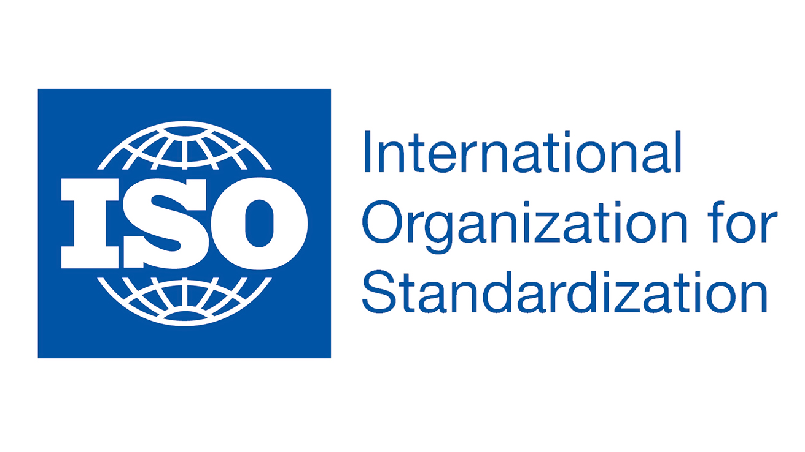


**ชื่อมาตรฐาน** ISO 27001:2013 Information Security Management System ระบบการบริหารจัดการความมั่นคงปลอดภัยของสารสนเทศ

**นิยามของความมั่นคงปลอดภัยของสารสนเทศ**

**Confidentiality การรักษาความลับ**
คุณสมบัติว่าข้อมูลจะไม่ถูกเผยแพร่หรือเปิดเผย
ให้บุคคล กิจการ หรือ กระบวนการที่ไม่ได้รับอนุญาต

**Integrity ความครบถูกต้อง**
คุณสมบัติของการปกป้องความถูกต้องและครบถ้วนของทรัพย์สิน

**Availability ความพร้อมใช้**
คุณสมบัติของการเป็นที่สามารถเข้าถึงและใช้งานได้
ตามความต้องการ โดยกิจการที่ได้รับอนุญาต

## ระบบการบริหารจัดการความมั่นคงปลอดภัยของสารสนเทศ (Information Security Management System)

มาตรฐาน ISO 27001 คือมาตรฐานสากลสำหรับระบบการจัดการความปลอดภัยของข้อมูล (Information Security Management Systems: ISMS) มาตรฐานนี้ให้ต้นแบบสำหรับการประเมินความเสี่ยง การออกแบบด้านการรักษาความปลอดภัยและการนำไปปฏิบัติ รวมถึงการบริหารจัดการความปลอดภัยมาตรฐาน ISO 27001 ได้ระบุแนวทางการดำเนินงานและการบริหารจัดการที่จะช่วยในการเก็บรักษาข้อมูลของท่านได้อย่างปลอดภัย

มาตรฐาน ISO 27001 เป็นมาตรฐานสากลเพียงมาตรฐานเดียวที่สามารถตรวจประเมินได้สำหรับระบบการจัดการความปลอดภัยของข้อมูล มาตรฐานนี้จะให้การรับรองว่าองค์กรของท่านได้ดำเนินงานโดยสอดคล้องกับกฎหมาย กฎระเบียบ ข้อบังคับ และข้อกำหนดตามสัญญาอันเกี่ยวเนื่องกับข้อมูลสำคัญ ด้วยเหตุนี้การได้รับการรับรองตามมาตรฐาน ISO 27001 จึงเป็นการพิสูจน์ให้เห็นว่า องค์กรของท่านได้มีการดำเนินการตามขั้นตอนที่จำเป็น เพื่อปกป้องข้อมูลที่สำคัญจากการเข้าถึงที่ไม่ได้รับอนุญาต

## ความจำเป็นของการรักษาความปลอดภัยของข้อมูล

ทุกวันนี้เทคโนโลยีสารสนเทศ (IT) เป็นองค์ประกอบที่สำคัญและซับซ้อนของเกือบทุกองค์กร IT หมายรวมถึงทุกอย่างตั้งแต่อีเมล์ที่คุณส่ง เอกสารที่คุณสร้างขึ้น จนถึงข้อมูลที่คุณเก็บไว้กับลูกค้าและซัพพลายเออร์ ด้วยการขยายตัวของอุปกรณ์ที่เชื่อมต่อกันได้ จึงกลายเป็นเรื่องง่าย ที่แต่ละคนจะสามารถเข้าถึงข้อมูลนี้ไม่ว่าอยู่ที่ใดของโลก และด้วยการเข้าถึงที่ง่ายขึ้นนี่เอง ก็กลายเป็นเรื่องง่ายเช่นกันสำหรับ ผู้ใช้ที่ไม่ได้รับอนุญาตที่จะเข้าถึงข้อมูลส่วนตัวขององค์กรของท่านได้

หากเราพิจารณาเหตุการณ์ที่เกิดขึ้นในปัจจุบันและข่าวรอบโลก เราจะเห็นได้ว่ามีการร้องเรียนผู้กระทำผิดด้าน IT ตัวอย่างเช่น Julian Assange ผู้ที่เป็น whistleblower ที่ปล่อยข้อมูลด้านการทูตของประเทศสหรัฐอเมริกาออกมาบนเว็บไซต์ขององค์กรของเขาที่ชื่อ “Wikileaks” ซึ่งการเผยแพร่ข้อมูลดังกล่าวนี้ สร้างความเสื่อมเสียให้แก่หน่วยสืบราชการลับของรัฐบาล ว่าทำให้ผู้อื่นตกอยู่ในอันตราย ในส่วนของภาคภาคเอกชน เราได้ยินเรื่องราวขององค์กรขนาดใหญ่ๆ เช่น American Airlines ที่เร็วๆ มีข่าวว่าหมายเลขบัตรเครดิตของผู้โดยสารจำนวนกว่า 350 ใบถูกขโมย โดยผู้ที่เป็นขโมย – คือหนึ่งในเสมียนของ สายการบิน American Airlines ซึ่งแน่นอนว่าการที่หมายเลขบัตรเครดิตถูกขโมยไปในระดับนั้น ย่อมไม่ใช่เหตุการณ์ที่เกิดขึ้นอย่างเดี่ยวๆเป็นแน่

## **ระบบการจัดการความปลอดภัยของข้อมูล (Information Security Management Systems) คืออะไร?**

นับจากอีเมล์ภายในองค์กร วัสดุ/อุปกรณ์ช่วยขาย ไปจนถึงรายงานทางการเงิน องค์กรทุกขนาดในทุกภาคอุตสาหกรรมต่างต้องมีการดำเนินการหรือการจัดการการกับข้อมูลจำนวนมากในแต่ละวัน สำหรับองค์กรหนึ่งๆเช่นองค์กรของท่าน ข้อมูลนี้ถือเป็นข้อได้เปรียบทางการแข่งขัน – เพราะมันคือข้อมูลที่บอกว่าท่านแก้ปัญหาต่างๆอย่างไร หรือท่านคว้าส่วนแบ่งของตลาดมาได้อย่างไร เป้าหมายของระบบการจัดการความปลอดภัยของข้อมูล (ISMS) คือเพื่อปกป้องข้อมูลที่สร้างความแตกต่างให้กับธุรกิจของท่าน ทั้งในแบบออนไลน์และโดยตัวบุคคล

### **หลักการของระบบการจัดการความปลอดภัยของข้อมูล**

ในขณะที่การนำระบบ ISMS ไปปฏิบัตินั้นจะแตกต่างกันไปในแต่ละองค์กร แต่มีหลักการพื้นฐานของ ISMS ที่ทุกองค์กรจะต้องปฏิบัติตามเพื่อให้เกิดประสิทธิภาพในการปกป้องทรัพย์สินสารสนเทศขององค์กร ตัวอย่างหลักการด้านล่างนี้จะช่วยแนะแนวทางเพื่อไปสู่การได้รับการรับรองมาตรตรฐาน ISO/ IEC 27001

ขั้นตอนแรกของการดำเนินการระบบ ISMS อย่างประสบผลสำเร็จ คือ การทำให้ผู้มีส่วนได้เสียที่สำคัญ (key stakeholders) ตระหนักถึงความจำเป็นของการรักษาความปลอดภัยของข้อมูล เพราะหากไม่ได้รับความร่วมมือจากผู้ที่เกี่ยวข้องทั้งหมดขององค์กร ซึ่งล้วนแต่เป็นผู้ที่ต้องปฏิบัติตาม ตรวจสอบและกำกับดูแล และคงรักษาระบบ ISMS ย่อมเป็นเรื่องยากที่จะประสบความสำเร็จในการให้ได้มาและคงรักษาไว้ซึ่งการได้รับการรับรองมาตรฐาน ISMS

เพื่อให้ระบบ ISMS ขององค์กรหนึ่งๆมีประสิทธิผล องค์กรนั้นๆต้องทำการวิเคราะห์ความจำเป็นด้านการรักษาความปลอดภัยสำหรับแต่ละทรัพย์สินสารสนเทศ และนำการควบคุมที่เหมาะสมต่างๆมาใช้เพื่อให้สามารถเก็บรักษาสินทรัพย์ดังกล่าวไว้ได้อย่างปลอดภัย สินทรัพย์สารเทศทั้งหมดไม่สามารถที่จะใช้วิธีการควบคุมเดียวกันได้ เพราะข้อมูลของแต่ละองค์กรมีรูปแบบ และขนาดที่แตกต่างกัน การควบคุมเพื่อการรักษาความปลอดภัยของข้อมูลก็เช่นเดียวกันที่ย่อมต้องแตกต่างกันตามความเหมาะสม

การนำระบบ ISMS ปฏิบัตินั้นไม่ได้เป็นโครงการที่มีระยะเวลาคงที่ตายตัว เพื่อให้องค์กรปลอดภัยจากภัยคุกคามทางข้อมูลต่างๆ ระบบ ISMS จำเป็นที่จะต้องเติบโตและพัฒนาอย่างต่อเนื่องเพื่อสนองตอบต่อสภาพทางเทคนิคที่มีการเปลี่ยนแปลงอย่างรวดเร็ว ด้วยเหตุนี้การประเมินซ้ำอย่างต่อเนื่องของระบบการจัดการความปลอดภัยของข้อมูลจึงเป็นสิ่งที่ต้องทำอย่างขาดไม่ได้ การทดสอบและการประเมินระบบ ISMS ที่บ่อยครั้ง ช่วยให้องค์กรสามารถที่จะรู้ได้ว่าข้อมูลต่างๆของพวกเขานั้นยังคงได้รับการปกป้องเป็นอย่างดี หรือจำเป็นต้องมีการปรับเปลี่ยนแก้ไขใดๆ หรือไม่

### **ระบบการจัดการความปลอดภัยของข้อมูลถือเป็นกระบวนการหนึ่ง**

เช่นเดียวกันกับองค์กรที่ต้องปรับตัวให้เข้ากับสภาวะแวดล้อมทางธุรกิจที่มีการเปลี่ยนแปลง ระบบการจัดการความปลอดภัยของข้อมูลก็ต้องมีการปรับให้เข้ากับความก้าวหน้าทางเทคโนโลยีที่มีการเปลี่ยนแปลงอย่างรวดเร็วและข้อมูลใหม่ๆขององค์กร และเพื่อที่จะปรับตัวให้เข้ากับสภาวะเงื่อนไขการเปลี่ยนแปลงเหล่านี้ มาตรฐาน ISO/IEC 27001 จึงใช้วิธีการบริหารจัดการเชิงกระบวนการสำหรับระบบ ISMS โดยการประยุกต์ใช้หลักการ Plan- Do-Check-Act

### **ภาพรวมของการรับรองระบบ**

หน่วยรับรองที่ได้รับการรับรองระบบงาน ตัวอย่างเช่น PJR อาจรับรองระบบ ISMS ของท่านตามมาตรฐาน ISO/IEC 27001 การได้รับการรับรองดังกล่าวจะช่วยสร้างความน่าเชื่อถือให้กับองค์กรของท่านซึ่งมีความจำเป็นต่อธุรกิจในปัจจุบันที่อยู่ในโลกที่อุดมไปด้วยข้อมูล การรับรองระบบมาตรฐาน ISO/IEC 27001 เหมือนกับมาตรฐาน ISO มาตรฐานอื่นๆ นั่นคือต้องมีกระบวนการตรวจประเมิน 3 ระยะ ดังนี้:

การทบทวนระบบ ISMS อย่างไม่เป็นทางการ – ในการตรวจประเมินระยะที่ 1 สำหรับมาตรฐาน ISO/IEC 27001 ผู้ตรวจประเมินจะทำการทบทวนและตรวจสอบระบบ ISMS ของท่านอย่างไม่เป็นทางการ การทบทวนตรวจสอบนี้ จะหมายรวมถึงการดำเนินการต่างๆ เช่น การตรวจสอบการมีอยู่ของเอกสารที่สำคัญในระบบ ISMS และตรวจสอบระบบ ISMS โดยภาพรวม เป้าหมายของการตรวจประเมินระยะที่ 1 คือ เพื่อให้ผู้ตรวจประเมินรู้จักและคุ้นเคยกับองค์กรของท่าน รวมถึงเพื่อให้ท่านได้ทำความรู้จักกับผู้ตรวจประเมิน

การตรวจประเมินความสอดคล้องอย่างเป็นทางการ – การตรวจประเมินระยะที่ 2 สำหรับมาตรฐาน ISO/IEC 27001เป็นการตรวจประเมินอย่างเป็นทางการ  
การตรวจประเมินระยะที่ 2 นี้ คือการทบทวนตรวจสอบและทดสอบระบบการจัดการความปลอดภัยของข้อมูลขององค์กรของท่านอย่างละเอียดโดยเทียบกับข้อกำหนดของมาตรฐาน ISO/IEC 27001 ในระหว่างดำเนินการตรวจประเมินระยะนี้ ผู้ตรวจประเมินจะทำการสัมภาษณ์พนักงานที่มีความสำคัญ เพื่อที่จะทดสอบความเข้าใจในระบบ ISMS ระบบขององค์กรที่สอดคล้องกับมาตรฐาน ISO 27001 การตรวจสอบนี้จะทำให้ ISMS ของคุณได้รับการรับรองมาตรฐาน ISO/IEC 27001 หากระบบขององค์กรของท่านมีความสอดคล้องกับข้อกำหนดของมาตรฐาน ISO 27001 การตรวจประเมินนี้จะส่งผลต่อระบบ ISMS ของท่านที่จะขอรับการรับรองมาตรฐาน ISO/IEC 27001

การตรวจประเมินติดตามผล–ระยะสุดท้ายของการรับรองมาตรฐานระบบ ISO/IEC 27001 คือ การตรวจประเมินเพื่อทำให้มั่นใจว่าระบบ ISMS ของท่านได้รับการประเมินและปรับปรุงอย่างต่อเนื่อง การตรวจประเมินติดตามผลจะถูกดำเนินการอย่างน้อยที่สุดปีละหนึ่งครั้ง โดยมีจุดประสงค์เพื่อเป็นการยืนยันว่าองค์กรของท่านยังคงมีความลอดคล้องกับมาตรฐาน การตรวจประเมินติดตามผลนี้อาจถูกดำเนินการบ่อยครั้งกว่าในช่วงเริ่มต้นของการนำระบบไปปฏิบัติ

การตัดสินใจที่จะดำเนินการเพื่อให้ได้รับการรับรองมาตรฐานระบบการจัดการความปลอดภัยของข้อมูลนั้นถือเป็นก้าวสำคัญขององค์กรหนึ่งๆ แต่ผลตอบแทนที่จะได้รับนั้นก็มีความคุ้มค่ามาก การติดอาวุธให้กับองค์กรด้วยการมีระบบ ISMS ที่ได้รับการรับรอง องค์กรของท่านจะสามารถยื่นเสนอราคาแข่งขันได้ง่ายขึ้น ดึงดูดลูกค้าได้มากขึ้น และสามารถสร้างความมั่นใจให้กับผู้มีส่วนได้เสียได้ว่าข้อมูลที่ช่วยให้ธุรกิจของท่านดำเนินอยู่ได้นั้นได้รับการปกป้องเป็นอย่างดี

## **ประวัติของ ISO/IEC 27001**

มาตรฐาน ISO/IEC 27001 ไม่ใช่มาตรฐานระบบ ISMS มาตรฐานแรก ในปี 1995 (พ.ศ.2538) กลุ่ม BSI (British Standards Institution) ได้ตีพิมพ์มาตรฐาน BS 7799 โดย BS 7799 ได้อธิบายเกี่ยวกับวิธีปฏิบัติที่เป็นเลิศสำหรับการจัดการความปลอดภัยของข้อมูล ในปี 1999 (พ.ศ.2542) BSI ตีพิมพ์ส่วนที่สองของมาตรฐาน BS 7799 นั่นคือ BS 7799 -2 ซึ่งมุ่งเน้นไปที่วิธีการนำระบบ ISMS ไปปฏิบัติ ภายหลังจากมีการแก้ไขในปี 2002 มาตรฐาน BS 7799-2 ได้รวมเอา หลักการ Plan-Do-Check-Act เข้ามาประกอบ ซึ่งสอดรับกับมาตรฐานอื่นๆ เช่น ISO 9000 มาตรฐาน BS 7799-2 นี้ ภายหลังได้ถูกนำมาประยุกต์ใช้โดย ISO จนในเดือนพฤศจิกายนปี 2005 จึงได้กลายเป็นมาตรฐาน ISO/IEC 27001

## ประโยชน์ของ ISO 27001

การได้รับการรับรองโดยบุคคลที่ 3 ตามมาตรฐาน ISO 27001 ได้รวมประโยชน์ไว้อย่างมากมายทั้งสำหรับองค์กรและผู้มีส่วนได้เสียขององค์กร

ประโยชน์ประการหนึ่งคือ การได้รับการรับรองมาตรฐาน ISO 27001 จะช่วยเพิ่มความน่าเชื่อถือขององค์กรของท่าน ด้วยความครบถ้วนสมบูรณ์ของข้อมูลและระบบต่างๆของท่านที่ได้รับการรับรองโดยบุคคลที่ 3 เป็นสร้างความมั่นใจให้กับซัพพลายเออร์ ลูกค้า และผู้มีส่วนได้เสียอื่นๆ ว่า องค์กรของท่านได้มีการดำเนินมาตรการที่จำเป็นเพื่อปกป้องข้อมูลขององค์กร นอกจากให้ความอุ่นใจให้กับลูกค้าปัจจุบันของท่านแล้ว ISO 27001 ยังสามารถช่วยท่านในการดึงดูดลูกค้ใหม่ที่ใส่ใจในเรื่องการรักษาความปลอดภัย

นอกจากนี้การได้รับการรับรองมาตรฐาน ISO 27001 ยังสามารถช่วยเสริมสร้างความรู้สึกเกี่ยวกับการรักษาความลับทั่วทั้งองค์กรได้อีกด้วย นี้เป็นเรื่องสำคัญเพราะข้อมูลที่สำคัญไม่ได้ถูกเก็บไว้เฉพาะในเซิร์ฟเวอร์และฮาร์ดไดรฟ์เท่านั้น แต่มันสามารถถูกเข้าถึงและจดจำได้โดยบุคคล/พนักงานในองค์กรของท่านเองอีกด้วย การได้รับการรับรองมาตรฐาน ISO 27001 สามารถเปลี่ยนวัฒนธรรมองค์กรของท่านได้ ทำให้มันเป็นสิ่งหนึ่งที่สร้างมูลค่าให้กับข้อมูลส่วนตัวของบริษัทของท่าน

## ใครที่ต้องการมาตรฐาน ISO 27001?

องค์กรที่ถือครองและดูแลข้อมูลที่สำคัญและเป็นความลับ คือ ผู้ที่ควรจะได้รับการรับรองมาตรฐาน ISO 27001 โดยเฉพาะอย่างยิ่ง บริษัทในภาคอุตสาหกรรมด้านการดูแลสุขภาพ ด้านการเงิน และ IT จะได้รับประโยชน์อย่างมากจากการได้รับการรับรองมาตรฐานระบบ ISMS
