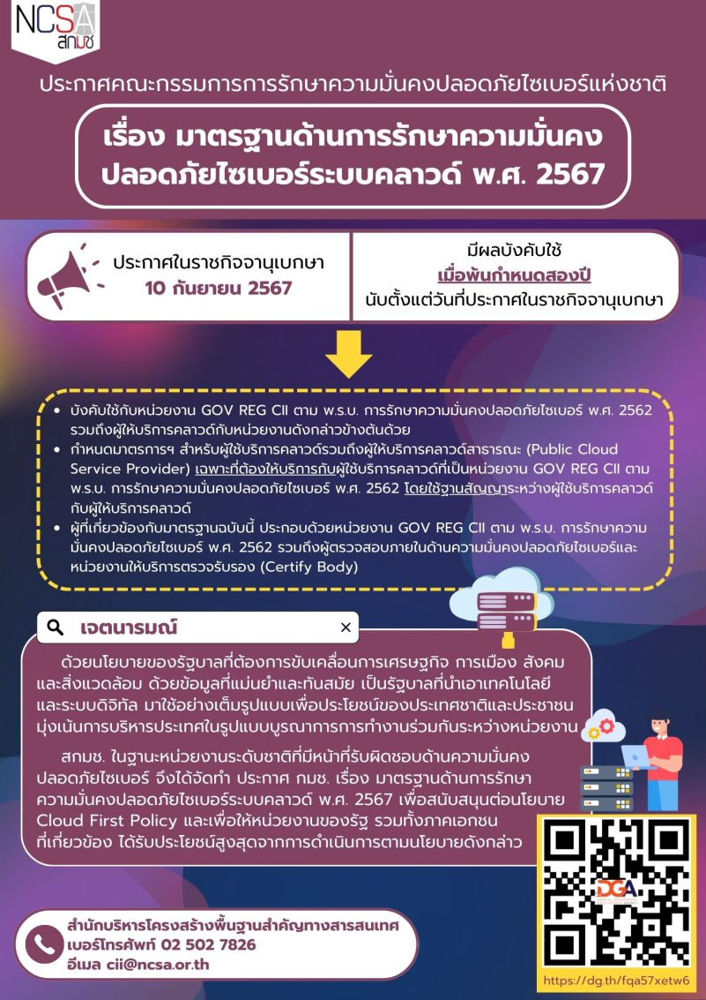

ร่างมาตรฐานความปลอดภัยไซเบอร์ระบบคลาวด์ (Cloud Security) ได้ผ่านการพิจารณาโดยคณะกรรมการการรักษาความมั่นคงปลอดภัยไซเบอร์แห่งชาติ (กมช.) เมื่อวันที่ 31 กรกฎาคม 2567 ล่าสุดได้มีการประกาศในราชกิจจานุเบกษา เมื่อ*วันที่ 10 กันยายน 2567* ที่ผ่านมา มีผลบังคับใช้เมื่อพ้นกำหนดสองปี นับตั้งแต่วันที่ประกาศในราชกิจจานุเบกษา
สรุปข้อกำหนด ประกาศ : มาตรฐานความปลอดภัยไซเบอร์ระบบคลาวด์ ได้ดังนี้ 
-	ประกาศดังกล่าวบังคับใช้กับหน่วยงาน GOV, REG, CII (GOV ย่อมาจาก Government, REG ย่อมาจาก Regulator, CII ย่อมาจาก Critical Information Infrastructure) ตาม พ.ร.บ. การรักษาความมั่นคงปลอดภัยไซเบอร์ พ.ศ. 2562 รวมถึงผู้ให้บริการคลาวด์ กับหน่วยงานดังกล่าวด้วย
-	กำหนดมาตรฐานสำหรับผู้ใช้บริการคลาวด์ ร่วมกับผู้ให้บริการคลาวด์สาธารณะ (Public Cloud Service Provider) เฉพาะที่ต้องได้รับการรับรองให้เป็นผู้ให้บริการคลาวด์ที่ผ่านเกณฑ์ของ GOV, REG, CII ตาม พ.ร.บ. การรักษาความมั่นคงปลอดภัยไซเบอร์ พ.ศ. 2562 โดยใช้มาตรฐานการรับรองผู้ใช้บริการคลาวด์ที่ผ่านการรับรองแล้ว
-	ผู้ให้บริการคลาวด์และหน่วยงานที่ประกอบด้วยหน่วยงาน GOV, REG, CII จะต้องปฏิบัติตาม พ.ร.บ. การรักษาความมั่นคงปลอดภัยไซเบอร์ พ.ศ. 2562 รวมถึงผู้ตรวจสอบภายนอกด้านความมั่นคงปลอดภัยไซเบอร์และหน่วยงานให้บริการตรวจรับรอง (Certify Body)

**โครงสร้างมาตรฐาน** กำหนดไว้ 2 ส่วนหลัก คือ 
1.	 การกำกับดูแลด้านความมั่นคงปลอดภัยระบบคลาวด์ (Cloud Security Governance) นโยบายด้านความมั่นคงปลอดภัยสารสนเทศ (Information Security Policies)
  
  -	โครงสร้างองค์กรด้านความมั่นคงปลอดภัยสารสนเทศ (Organization of Information Security)
  -	การปฏิบัติตามกฎ ระเบียบ ข้อบังคับ (Compliance)

2.	การปฏิบัติและการรักษาความมั่นคงปลอดภัยโครงสร้างพื้นฐานระบบคลาวด์ (Cloud Infrastructure Security and Operation)
  -	การบริหารทรัพยากรมนุษย์ (Human Resource Security)
  -	การจัดการทรัพย์สิน (Asset Management)
  -	การควบคุมการเข้าถึง (Access Control)
  -	การเข้ารหัส (Cryptography)
  -	การรักษาความปลอดภัยทางกายภาพและสภาพแวดล้อม (Physical and Environment Security)
  -	การรักษาความมั่นคงปลอดภัยการปฏิบัติการ (Operations Security)
  -	การรักษาความมั่นคงปลอดภัยเครือข่าย (Communication Security)
  -	การจัดหา การพัฒนา และการบำรุงรักษา (System Acquisition, Development, and Maintenance)
  -	การจัดการผู้ให้บริการภายนอก (Supplier Relationships)
  -	การจัดการเหตุคุกคามทางสารสนเทศ (Information Security Incident Management)  

อ่านรายละเอียดเพิ่มเติมได้ที่ : [มาตรฐานด้านความมั่นคงปลอดภัยไซเบอร์ระบบคลาวด์](https://drive.ncsa.or.th/s/rZisADdG8rqjxCJ)

## นโยบายคลาวด์ในต่างประเทศ
-	สหรัฐฯ มี Federal Cloud Computing Strategy (Cloud Smart) เป็นการปรับปรุงจาก Cloud First Policy ของปี 2010 ประกาศใช้ในปี 2011 พัฒนาขึ้นเพื่อเพิ่มประสิทธิภาพการทำงานของ ระบบไอทีภาครัฐ โดยเน้นไปที่การเพิ่มความปลอดภัย (Security), ประสิทธิภาพ (Efficiency), และการดูแลข้อมูล (Data Management) ของระบบคลาวด์
-	สหภาพยุโรปมีนโยบาย Cloud First เช่นกัน แต่สิ่งที่เพิ่มมา คือ มีการผลักดันโครงการคลาวด์ภายใต้กรอบงาน European Open Science Cloud (EOSC) เพื่อสนับสนุนการวิจัยและนวัตกรรม โดยให้ความสำคัญกับการแลกเปลี่ยนข้อมูลวิทยาศาสตร์ และการร่วมมือระหว่างประเทศสมาชิก
-	อังกฤษ มี Government Cloud Strategy (G-Cloud) มุ่งเน้นการใช้บริการคลาวด์เพื่อประหยัดงบประมาณ และเพิ่มประสิทธิภาพการทำงานของภาครัฐ โดยสร้าง Digital Marketplace ให้กับภาครัฐในการเลือกใช้บริการจากผู้ให้บริการคลาวด์ที่ผ่านการรับรอง
-	สิงคโปร์ มี Government Commercial Cloud (GCC) หรือ แผนกลยุทธ์คลาวด์ เพื่อให้หน่วยงานรัฐสามารถใช้ประโยชน์จากโซลูชันคลาวด์สาธารณะที่มีคุณภาพ โดยส่งเสริมความยืดหยุ่น ให้เกิดการปฏิบัติที่รวดเร็ว และลดต้นทุนในการบริหารจัดการไอที







ดาวน์โหลดประกาศ 

<a class="badge badge-danger" href="./docs.pdf" target="_blank" id="download_files_new">ดาวน์โหลดประกาศ</a>

  

- [กลับเมนูหลัก](../../section/)

> ที่มาบทความ : [OneFence](https://www.onefence.co/cloud-security-policy-thai-out-now/)

> ที่มาประกาศ : [คณะกรรมการการรักษาความมั่นคงปลอดภัยไซเบอร์แห่งชาติ](https://drive.ncsa.or.th/s/rPWACibPZKsRocm?)