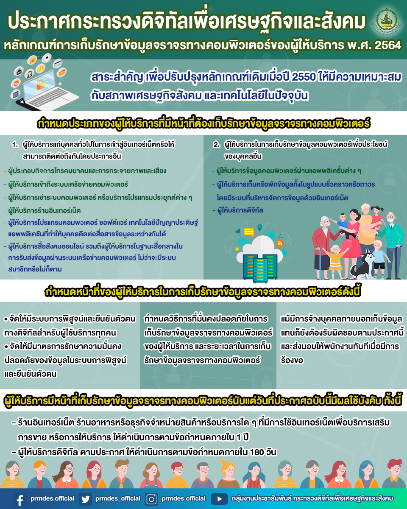

กระทรวงดิจิทัลเพื่อเศรษฐกิจและสังคม ได้ออกประกาศ ลงวันที่ 13 สิงหาคม 2564 เรื่อง หลักเกณฑ์การเก็บรักษาข้อมูลจราจรทางคอมพิวเตอร์ของผู้ให้บริการ พ.ศ. 2564 โดยเป็นการปรับปรุงหลักเกณฑ์การเก็บรักษาข้อมูลจราจรทางคอมพิวเตอร์ของผู้ให้บริการให้มีความเหมาะสมกับสภาวะเศรษฐกิจ สังคม และเทคโนโลยีในปัจจุบัน

ประกาศนี้ให้ใช้บังคับตั้งแต่วันถัดจากวันประกาศในราชกิจจานุเบกษาเป็นต้นไป (ประกาศในราชกิจจานุเบกษา เล่ม 138 ตอนพิเศษ 188 ง วันที่ 13 สิงหาคม 2564) และให้ยกเลิกประกาศกระทรวงเทคโนโลยีสารสนเทศและการสื่อสาร เรื่อง หลักเกณฑ์การเก็บรักษาข้อมูลจราจรทางคอมพิวเตอร์ของผู้ให้บริการ พ.ศ. 2550







ดาวน์โหลดประกาศ

- [กลับเมนูหลัก](../../section/)

> ที่มา : [ราชกิจจานุเบกษา](http://www.ratchakitcha.soc.go.th/DATA/PDF/2564/E/188/T_0009.PDF)