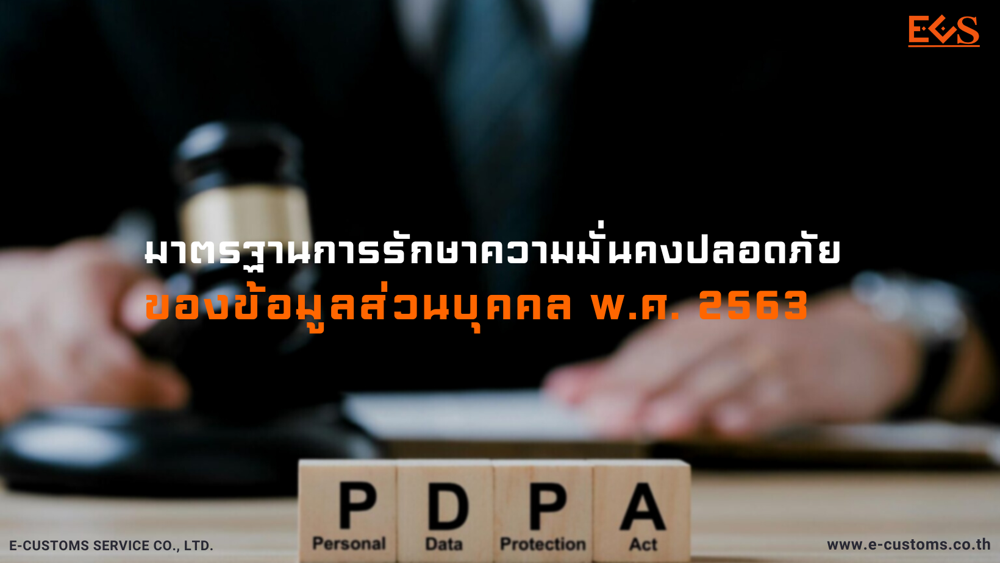

**ประกาศกระทรวงดิจิทัลเพื่อเศรษฐกิจและสังคม** เรื่อง *มาตรฐานการรักษาความมั่นคงปลอดภัยของข้อมูลส่วนบุคคล พ.ศ. 2563*

โดยที่มาตรา 3 วรรคสอง แห่งพระราชกฤษฎีกากำหนดหน่วยงานและกิจการที่ผู้ควบคุม ข้อมูลส่วนบุคคลไม่อยู่ภายใต้ บังคับแห่งพระราชบัญญัติคุ้มครองข้อมูลส่วนบุคคล พ.ศ. 2562 พ.ศ. 2563 กำหนดให้ผู้ควบคุมข้อมูล ซึ่งเป็นหน่วยงาน หรือกิจการตามบัญชีท้ายพระราชกฤษฎีกาดังกล่าวต้องจัดให้มี มาตรการรักษาความปลอดภัยของข้อมูลส่วนบุคคล ให้เป็นไปตามมาตรฐานที่กระทรวงดิจิทัลเพื่อเศรษฐกิจและสังคมกำหนด จึงออกประกาศไว้
ดังนี้

**ข้อ 2** ประกาศนี้ให้ใช้บังคับตั้งแต่วันถัดจากวันประกาศในราชกิจจานุเบกษา*จนถึงวันที่ 31 พฤษภาคม 2564*

**ข้อ 3** ในประกาศนี้
**“ผู้ควบคุมข้อมูลส่วนบุคคล”** หมายความว่า *ผู้ควบคุมข้อมูลส่วนบุคคลซึ่งเป็นหน่วยงาน หรือกิจการตามบัญชีท้ายพระราชกฤษฎีกากำหนดหน่วยงานและกิจการที่ผู้ควบคุมข้อมูลส่วนบุคคล
ไม่อยู่ภายใต้บังคับแห่งพระราชบัญญัติคุ้มครองข้อมูลส่วนบุคคล พ.ศ. 2562 พ.ศ. 2563*

**“ความมั่นคงปลอดภัยของข้อมูลส่วนบุคคล”** หมายความว่า *การธำรงไว้ซึ่งความลับ (confidentiality) ความถูกต้องครบถ้วน (integrity) และสภาพพร้อมใช้งาน (availability) ของข้อมูลส่วนบุคคล ทั้งนี้ เพื่อป้องกันการสูญหาย เข้าถึง ใช้ เปลี่ยนแปลง แก้ไข หรือเปิดเผย ข้อมูลส่วนบุคคลโดยมิชอบ*

**ข้อ 4** ผู้ควบคุมข้อมูลส่วนบุคคลต้องแจ้งมาตรการรักษาความมั่นคงปลอดภัยของข้อมูล ส่วนบุคคลตามประกาศนี้ ให้แก่บุคลากร พนักงาน ลูกจ้างหรือบุคคลที่เกี่ยวข้องทราบ รวมถึง สร้างเสริมความตระหนักรู้ด้านความสำคัญของการคุ้มครองข้อมูลส่วนบุคคลให้กับกลุ่มบุคคลดังกล่าวปฏิบัติตามมาตรการที่กำหนดอย่างเคร่งครัด

**ข้อ 5** ผู้ควบคุมข้อมูลส่วนบุคคลต้องจัดให้มีมาตรการรักษาความมั่นคงปลอดภัยของข้อมูลส่วนบุคคล ซึ่งควรครอบคลุมถึงมาตรการป้องกันด้านการบริหารจัดการ (administrative safeguard) มาตรการป้องกันด้านเทคนิค (technical safeguard) และมาตรการป้องกันทางกายภาพ (physical safeguard) ในเรื่องการเข้าถึงหรือควบคุมการใช้งานข้อมูลส่วนบุคคล (access control) โดยอย่างน้อย ต้องประกอบด้วยการดำเนินการ ดังต่อไปนี้
1.	การควบคุมการเข้าถึงข้อมูลส่วนบุคคลและอุปกรณ์ในการจัดเก็บและประมวลผลข้อมูลส่วนบุคคลโดยคำนึงถึงการใช้งานและความมั่นคงปลอดภัย
2.	การกำหนดเกี่ยวกับการอนุญาตหรือการกำหนดสิทธิในการเข้าถึงข้อมูลส่วนบุคคล 
3.	การบริหารจัดการการเข้าถึงของผู้ใช้งาน (user access management) เพื่อควบคุม การเข้าถึงข้อมูลส่วนบุคคลเฉพาะผู้ที่ได้รับอนุญาตแล้ว
4.	การกำหนดหน้าที่ความรับผิดชอบของผู้ใช้งาน (user responsibilities) เพื่อป้องกัน การเข้าถึงข้อมูลส่วนบุคคลโดยไม่ได้รับอนุญาต การเปิดเผย การล่วงรู้ หรือการลักลอบทำสำเนาข้อมูลส่วนบุคคล การลักขโมยอุปกรณ์จัดเก็บหรือประมวลผลข้อมูลส่วนบุคคล
5.	การจัดให้มีวิธีการเพื่อให้สามารถตรวจสอบย้อนหลังเกี่ยวกับการเข้าถึง เปลี่ยนแปลง ลบ หรือถ่ายโอนข้อมูลส่วนบุคคล ให้สอดคล้องเหมาะสมกับวิธีการและสื่อที่ใช้ในการเก็บรวบรวม ใช้ หรือเปิดเผยข้อมูลส่วนบุคคล

**ข้อ 6** ผู้ควบคุมข้อมูลส่วนบุคคลอาจเลือกใช้มาตรฐานการรักษาความมั่นคงปลอดภัยของข้อมูลส่วนบุคคลที่แตกต่างไปจากประกาศฉบับนี้ได้ หากมาตรฐานดังกล่าวมีมาตรการรักษาความมั่นคงปลอดภัย*ไม่ต่ำกว่า*ที่กำหนดในประกาศนี้

**ข้อ 7** ให้รัฐมนตรีว่าการกระทรวงดิจิทัลเพื่อเศรษฐกิจและสังคมรักษาการตามประกาศนี้ และให้มีอำนาจตีความและวินิจฉัยปัญหาอันเกิดจากการปฏิบัติตามประกาศนี้ *ประกาศ ณ วันที่ 24 มิถุนายน พ.ศ. 2563*







 

ดาวน์โหลดประกาศ

- [กลับเมนูหลัก](../../section/)

> ที่มา : [สำนักงานพัฒนาธุรกรรมทางอิเล็กทรอนิกส์](https://www.etda.or.th/getattachment/fa9266c8-e8b8-4201-9180-449be880078f/%E0%B8%9E%E0%B8%A3%E0%B8%B0%E0%B8%A3%E0%B8%B2%E0%B8%8A%E0%B8%9A%E0%B8%8D%E0%B8%8D%E0%B8%95%E0%B8%A5%E0%B8%82%E0%B8%AA%E0%B8%97%E0%B8%98-(%E0%B8%89%E0%B8%9A%E0%B8%9A%E0%B8%97-5)-%E0%B8%9E-%E0%B8%A8-2565.aspx)