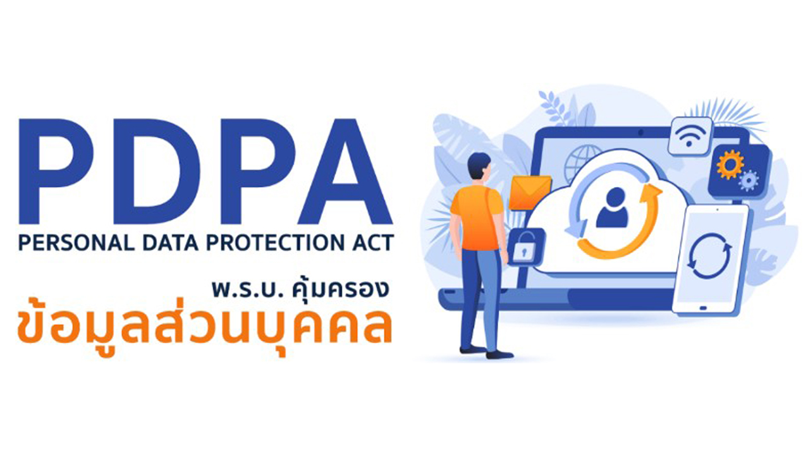

**ประกาศกระทรวงดิจิทัลเพื่อเศรษฐกิจและสังคม** เรื่อง *การยกเว้นการบันทึกรายการของผู้ควบคุมข้อมูลส่วนบุคคลซึ่งเป็นกิจการขนาดเล็ก พ.ศ. 2565*

ผู้ควบคุมข้อมูลส่วนบุคคลตามประกาศฯ ฉบับดังกล่าวหมายถึง บริษัท ห้างหุ้นส่วนทั้งเป็นนิติบุคคลและไม่เป็นนิติบุคคล หรือผู้ประกอบธุรกิจฟรีแลนซ์ ที่มีการเก็บรวบรวม ใช้ หรือเปิดเผยข้อมูลส่วนบุคคลของลูกค้าหรือพนักงาน โดยผู้ประกอบการที่มีลักษณะตามที่กำหนดไว้ในประกาศฯ ได้รับการยกเว้นไม่ต้องทำ *“บันทึกรายการ”* ดังนี้

- วิสาหกิจขนาดย่อมหรือวิสาหกิจขนาดกลางตามกฎหมายว่าด้วยการส่งเสริมวิสาหกิจขนาดกลางและขนาดย่อม 
- วิสาหกิจชุมชนหรือเครือข่ายวิสาหกิจชุมชน
- วิสาหกิจเพื่อสังคมหรือกลุ่มกิจการเพื่อสังคม
- สหกรณ์ ชุมนุมสหกรณ์ หรือกลุ่มเกษตรกรตามกฎหมายว่าด้วยสหกรณ์
- มูลนิธิ สมาคม องค์กรศาสนา หรือองค์กรที่ไม่แสวงหากำไร
- กิจการในครัวเรือนหรือกิจการอื่นในลักษณะเดียวกัน

ตามกฎกระทรวงกําหนดลักษณะของวิสาหกจิขนาดกลางและขนาดย่อม พ.ศ. 2562 แบ่งประเภทวิสาหกิจไว้ดังนี้ 

ทั้งนี้ ผู้ให้บริการที่ได้รับการยกเว้น ต้องไม่เป็นผู้ให้บริการที่ต้องเก็บรักษาข้อมูลจราจร ทางคอมพิวเตอร์ตามกฎหมายว่าด้วยการกระทำความผิดเกี่ยวกับคอมพิวเตอร์ที่มีการเก็บรวบรวมข้อมูลส่วนบุคคลปริมาณมากประเภทต่อไปนี้

- ผู้ประกอบกิจการโทรคมนาคมและ กิจการกระจายภาพและเสียง (Telecom and Broadcast Carrier)
- ผู้ให้บริการการเข้าถึงระบบเครือข่ายคอมพิวเตอร์ (Access Service Provider) 
- ผู้ให้บริการเช่าระบบคอมพิวเตอร์เพื่อให้บริการโปรแกรมประยุกต์ต่างๆ (Hosting Service Provider)
- ผู้ให้บริการแอปพลิเคชันติดต่อสื่อสารข้อมูลถึงกัน (Online Application Store)
- ผู้ให้บริการสื่อสังคมออนไลน์  
- ผู้ให้บริการข้อมูลคอมพิวเตอร์ผ่านแอปพลิเคชันต่างๆ (Content and Application Service Provider) 
- ผู้ให้บริการคลาวด์ซึ่งให้บริการโดยตรงกับผู้ใช้งาน เช่น IaaS PaaS SaaS CDN
- ผู้ให้บริการดิจิทัลที่ใช้เครือข่ายคอมพิวเตอร์เป็นส่วนหนึ่งของการให้บริการ (Digital Service Provider)

อย่างไรก็ตาม ผู้ประกอบการที่ได้รับการยกเว้นไม่ต้องทำ **“บันทึกรายการ”** ยังมีหน้าที่อื่น ๆ ตามที่กฎหมายกำหนด อาทิ ยังต้องแจ้งประกาศการคุ้มครองข้อมูลส่วนบุคคล (Privacy Notice) และมีมาตรการรักษาความมั่นคงปลอดภัยที่เหมาะสมกับขนาดและประเภทของกิจการ เป็นต้น







 

ดาวน์โหลดประกาศ

- [กลับเมนูหลัก](../../section/)

> ที่มา : [ราชกิจจานุเบกษา](https://www.ratchakitcha.soc.go.th/DATA/PDF/2565/E/140/T_0024.PDF)