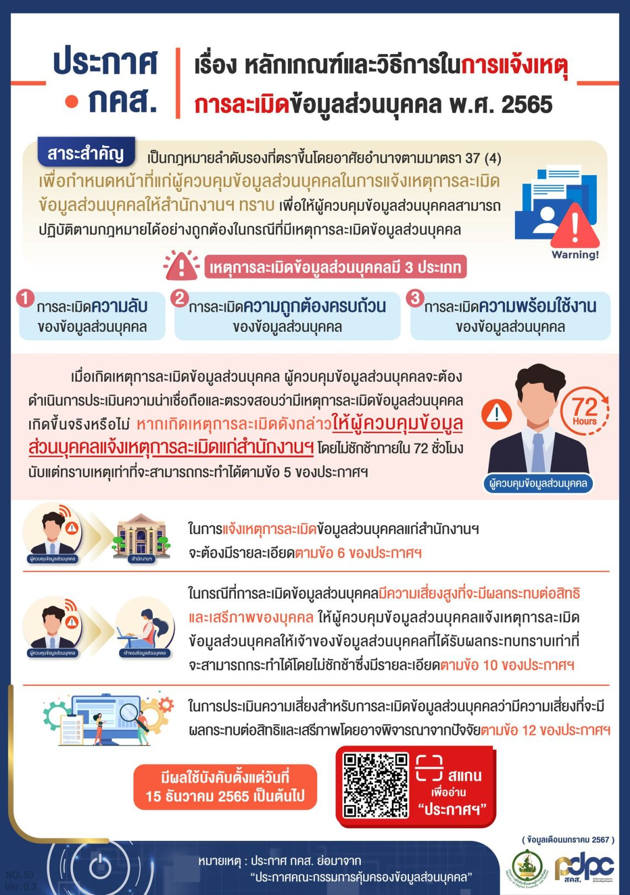

**ประกาศกระทรวงดิจิทัลเพื่อเศรษฐกิจและสังคม** เรื่อง *หลักเกณฑ์และวิธีการในการแจ้งเหตุการละเมิดข้อมูลส่วนบุคคล พ.ศ. 2565*


เมื่อวันที่ 15 ธันวาคม 2565 ที่ผ่านมา คณะกรรมการคุ้มครองส่วนบุคคล ได้เผยแพร่ประกาศฉบับใหม่ที่มีเนื้อหาเกี่ยวกับ วิธีการในการแจ้งเหตุละเมิดข้อมูลส่วนบุคคล โดยมีใจความสำคัญอยู่ที่รายละเอียดและขั้นตอนที่ Data Controller ต้องปฏิบัติเมื่อเกิดเหตุละเมิด รายละเอียดที่ต้องคำนึงในการประเมินความเสี่ยง และการแจ้งเหตุละเมิดข้อมูลส่วนบุคคลแก่เจ้าของข้อมูลส่วนบุคคล รวมถึงรายละเอียดอื่นๆ ที่เป็นประโยชน์ต่อผู้ควบคุมข้อมูลส่วนบุคคล รายละเอียดมีดังนี้

## ความหมายของ การละเมิดข้อมูลส่วนบุคคล

**"การละเมิดข้อมูลส่วนบุคคล"** หมายถึง การละเมิดมาตรการรักษาความมั่นคงปลอดภัยที่ทำให้เกิดการสูญหาย เข้าถึง ใช้ เปลี่ยนแปลง แก้ไข หรือเปิดเผยข้อมูลส่วนบุคคลโดยปราศจากอำนาจ หรือโดยมิชอบ ไม่ว่าจะเกิดจากเจตนา ความจงใจ ความประมาทเลินเล่อ การกระทำโดยปราศจากอำนาจหรือโดยมิชอบ การกระทำความผิดเกี่ยวกับคอมพิวเตอร์ ภัยคุกคามทางไซเบอร์ ข้อผิดพลาดบกพร่องหรืออุบัติเหตุ หรือเหตุอื่นใด

## 5 ขั้นตอนเตรียมพร้อม สำหรับ Data Controller หากได้รับแจ้งข้อมูลว่า มี หรือ น่าจะมีเหตุละเมิดข้อมูลส่วนบุคคล

1.  ‌ประเมินความน่าเชื่อถือของข้อมูล และตรวจสอบข้อเท็จจริงเกี่ยวกับการละเมิด โดยตรวจสอบมาตรการรักษาความมั่นคงปลอดภัยของข้อมูลส่วนบุคคล รวมถึงการประเมินความเสี่ยงจากการละเมิดข้อมูลส่วนบุคคล
2.  หากประเมินความเสี่ยงแล้วพบว่า การละเมิดดังกล่าวมีความเสี่ยงสูงที่จะมีผลกระทบต่อสิทธิและเสรีภาพของบุคคล ให้ดำเนินการป้องกัน ระงับ หรือแก้ไขเพื่อให้การละเมิดดังกล่าวสิ้นสุด หรือไม่ให้การละเมิดส่งผลกระทบเพิ่มเติม โดยทันทีเท่าที่จะทำได้
3.  เมื่อพิจารณาแล้วเห็นว่า มีเหตุอันควรเชื่อว่ามีการละเมิดเกิดขึ้นจริง ให้แจ้งเหตุดังกล่าวแก่ PDPC (*ภายใน 72 ชั่วโมง*) *นับแต่พบเหตุละเมิด* เว้นแต่เป็นกรณีไม่มีความเสี่ยง
4.  กรณีมีความเสี่ยงสูง ต้องแจ้งเหตุละเมิดให้เจ้าของข้อมูลส่วนบุคคลทราบ พร้อมกับแนวทางการเยียวยา (โดยไม่ชักช้า)
5.  ดำเนินการตามมาตรการที่จำเป็น เหมาะสม เพื่อระงับ ตอบสนอง แก้ไขเหตุละเมิด และป้องกันเหตุละเมิด และผลกระทบที่อาจเกิดในลักษณะเดียวกันในอนาคต รวมถึงการทบทวน security measures ให้เหมาะสม โดยคำนึงถึงระดับความเสี่ยง บริบท สภาพแวดล้อม ลักษณะการประมวลผลข้อมูลส่วนบุคคล

## รายละเอียดการแจ้งเหตุละเมิดข้อมูลส่วนบุคคล ต่อ คณะกรรมการคุ้มครองข้อมูลส่วนบุคคล

## การแจ้งเหตุละเมิดข้อมูลส่วนบุคคลแก่ เจ้าของข้อมูลส่วนบุคคล (Data Subject)

หาก Data Controller หรือ Data Processor ประเมินแล้วพบว่าการละเมิดข้อมูลส่วนบุคคลที่เกิดขึ้น มีความเสี่ยงสูงที่จะมีผลกระทบต่อสิทธิเสรีภาพของบุคคล ให้แจ้งเหตุละเมิดแก่เจ้าของข้อมูลที่ได้รับผลกระทบ (โดยไม่ชักช้า) โดยต้องมีรายละเอียดดังนี้

1.  ‌ข้อมูลโดยสังเขปเกี่ยวกับลักษณะของการละเมิดข้อมูลส่วนบุคคล
2.  ช่องทางติดต่อ DPO หรือบุคคลที่ได้รับมอบหมายให้ประสานงาน
3.  ผลกระทบที่อาจเกิดขึ้น
4.  แนวทางเยียวยาความเสียหาย มาตรการที่จะป้องกัน ระงับ แก้ไขเหตุละเมิด รวมถึงข้อแนะนำเกี่ยวกับมาตรการที่ Data Subject อาจดำเนินการได้ เพื่อป้องกัน ระงับ แก้ไข เยียวยาความเสียหาย







 

ดาวน์โหลดประกาศ

- [กลับเมนูหลัก](../../section/)

> ที่มาบทความ : [t-reg](https://t-reg.co/blog/news/guideline-for-data-breach-report-pdpa-law/)  
> ที่มา : [ราชกิจจานุเบกษา](https://www.ratchakitcha.soc.go.th/DATA/PDF/2565/E/292/T_0007.PDF)