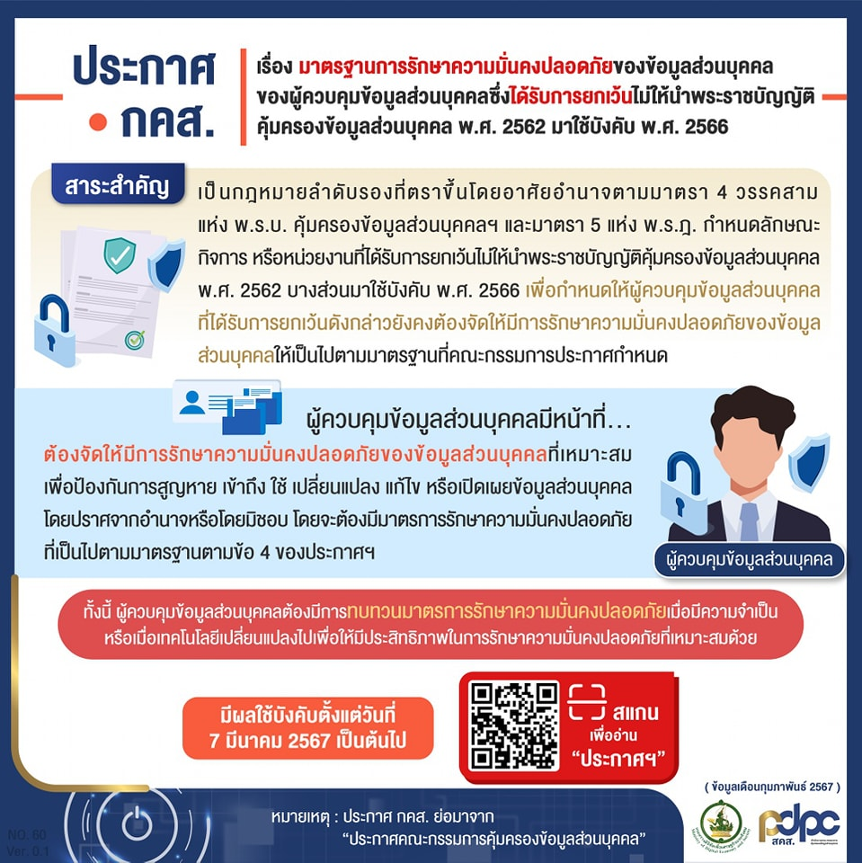
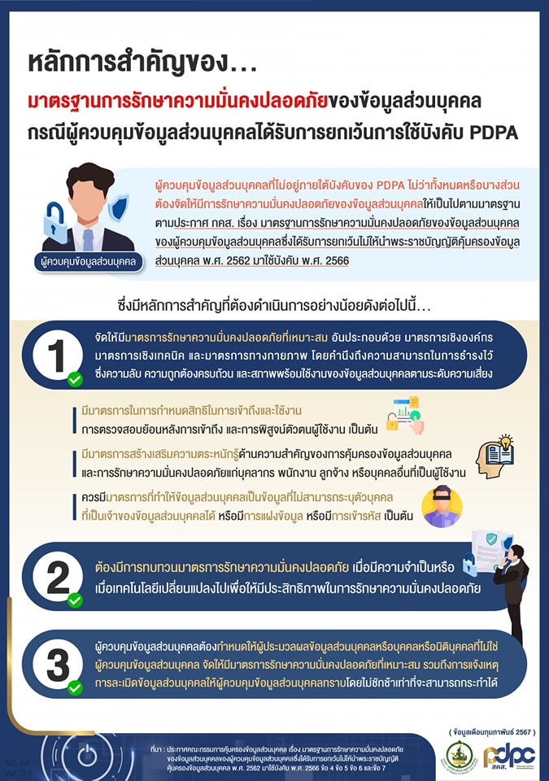


สืบเนื่องจากมาตรา 4 วรรคสามแห่ง พระราชบัญญัติคุ้มครองข้อมูลส่วนบุคคล พ.ศ. 2562 ประกอบมาตรา 5 แห่งพระราชกฤษฎีกา 


กำหนดลักษณะ กิจการ หรือหน่วยงานที่ได้รับการยกเว้นไม่ให้นำพระราชบัญญัติคุ้มครองข้อมูลส่วนบุคคล พ.ศ. 2562 บางส่วนมาใช้บังคับ พ.ศ. 2566 กำหนดให้ผู้ควบคุมข้อมูลส่วนบุคคลที่ได้รับการยกเว้น ไม่ให้นำพระราชบัญญัติ 2562 มาใช้บังคับ ต้องจัดให้มีการรักษาความมั่นคงปลอดภัยของข้อมูลส่วนบุคคลให้เป็นไปตามมาตรฐานที่คณะกรรมการคุ้มครองข้อมูลส่วนบุคคลประกาศกำหนด โดยสำนักงานคณะกรรมการคุ้มครองข้อมูลส่วนบุคคลได้มีประกาศ เรื่อง มาตรฐานการรักษาความมั่นคงปลอดภัยของข้อมูลส่วนบุคคล ของผู้ควบคุมข้อมูลส่วนบุคคล ซึ่งได้รับการยกเว้นไม่ให้นำพระราชบัญญัติคุ้มครองข้อมูลส่วนบุคคล พ.ศ. 2562 มาใช้บังคับ พ.ศ. 2566 ขึ้น มีผลใช้บังคับ*ตั้งแต่วันที่ 7 มีนาคม พ.ศ.2567* อันมีสาระสำคัญดังต่อไปนี้

1. ผู้ควบคุมข้อมูลส่วนบุคคลที่ได้รับการยกเว้นตามประกาศคณะกรรมการคุ้มครองข้อมูลส่วนบุคคลฯ หมายความว่า ผู้ควบคุมข้อมูลส่วนบุคคลที่ได้รับการยกเว้นไม่ให้นำพระราชบัญญัติคุ้มครองข้อมูลส่วนบุคคล พ.ศ. 2562 มาใช้บังคับตามมาตรา 4 วรรคหนึ่ง (2) (3) (4) (5) และ (6) แห่งพระราชบัญญัติคุ้มครองข้อมูลส่วนบุคคล พ.ศ. 2562 และผู้ควบคุมข้อมูลส่วนบุคคลที่ได้รับยกเว้น ไม่ให้นำบทบัญญัติแห่งพระราชบัญญัติคุ้มครองข้อมูลส่วนบุคคล พ.ศ. 2562 ทั้งหมดหรือแต่บางส่วนมาใช้บังคับตามที่กำหนดในพระราชกฤษฎีกาตามมาตรา 4 วรรคสอง แห่งพระราชบัญญัติคุ้มครองข้อมูลส่วนบุคคล พ.ศ. 2562

2. ผู้ควบคุมข้อมูลส่วนบุคคลมีหน้าที่ที่สำคัญ คือ ต้องจัดให้มีการรักษาความมั่นคงปลอดภัยของข้อมูลส่วนบุคคลที่เหมาะสม เพื่อป้องกันการสูญหาย เข้าถึง ใช้ เปลี่ยนแปลง แก้ไข หรือเปิดเผยข้อมูลส่วนบุคคลโดยปราศจากอำนาจหรือโดยมิชอบ โดยจะต้องมีมาตรการรักษาความมั่นคงปลอดภัยที่เป็นไปตามมาตรฐานที่สำคัญ คือ มาตรการรักษาความมั่นคงปลอดภัยดังกล่าว จะต้องครอบคลุมการเก็บรวบรวม ใช้ และเปิดเผยข้อมูลส่วนบุคคล ไม่ว่าข้อมูลส่วนบุคคลดังกล่าวจะอยู่ในรูปแบบเอกสาร หรือในรูปแบบอิเล็กทรอนิกส์ หรือรูปแบบอื่นใดก็ตาม ซึ่งจะต้องประกอบด้วยมาตรการเชิงองค์กร (organizational measures)
และมาตรการเชิงเทคนิค (technical measures) ที่เหมาะสม ซึ่งอาจรวมถึงมาตรการทางกายภาพ (physical measures) ที่จำเป็นด้วย  อีกทั้งจะต้องดำเนินการตั้งแต่การระบุความเสี่ยงที่สำคัญที่อาจจะเกิดขึ้นกับทรัพย์สินสารสนเทศ (information assets) ที่สำคัญ การป้องกันความเสี่ยงที่สำคัญที่อาจจะเกิดขึ้น การตรวจสอบและเฝ้าระวังภัยคุกคามและเหตุการละเมิดข้อมูลส่วนบุคคล การเผชิญเหตุเมื่อมีการตรวจพบภัยคุกคามและเหตุการละเมิดข้อมูลส่วนบุคคล และการรักษาและฟื้นฟูความเสียหายที่เกิดจากภัยคุกคาม 
หรือเหตุการละเมิดข้อมูลส่วนบุคคลด้วย ทั้งนี้ เท่าที่จำเป็นเหมาะสม และเป็นไปได้ตามระดับความเสี่ยง รวมถึงมาตรการรักษาความมั่นคงปลอดภัยดังกล่าวจะต้องคำนึงถึงความสามารถในการธำรงไว้ซึ่งความลับ (confidentiality) ความถูกต้องครบถ้วน (integrity) และสภาพพร้อมใช้งาน (availability) ของข้อมูล
ส่วนบุคคลไว้ได้อย่างเหมาะสมตามระดับความเสี่ยงอีกด้วย

3. ผู้ควบคุมข้อมูลส่วนบุคคลจะต้องทบทวนมาตรการรักษาความมั่นคงปลอดภัย
เมื่อมีความจำเป็นหรือเมื่อเทคโนโลยีเปลี่ยนแปลงไปเพื่อให้มีประสิทธิภาพในการรักษาความมั่นคงปลอดภัยที่เหมาะสม โดยคำนึงถึงระดับความเสี่ยงตามปัจจัยทางเทคโนโลยี บริบท สภาพแวดล้อม มาตรฐานที่เป็นที่ยอมรับสำหรับหน่วยงานหรือกิจการในประเภทหรือลักษณะเดียวกันหรือใกล้เคียงกัน ลักษณะและวัตถุประสงค์ของการเก็บรวบรวม ใช้ และเปิดเผยข้อมูลส่วนบุคคล ทรัพยากรที่ต้องใช้และความเป็นไปได้ในการดำเนินการประกอบกัน

4. ในกรณีที่ผู้ควบคุมข้อมูลส่วนบุคคลมีผู้ประมวลผลข้อมูลส่วนบุคคล หรือบุคคล
หรือนิติบุคคลอื่นที่ไม่เป็นผู้ควบคุมข้อมูลส่วนบุคคล ซึ่งดำเนินการเกี่ยวกับการเก็บรวบรวม ใช้หรือเปิดเผยข้อมูลส่วนบุคคลตามคำสั่งหรือในนามของผู้ควบคุมข้อมูลส่วนบุคคล ให้ผู้ควบคุมข้อมูลส่วนบุคคลพิจารณากำหนดให้ผู้ประมวลผลข้อมูลส่วนบุคคล หรือบุคคลหรือนิติบุคคลนั้นจัดให้มีมาตรการรักษาความมั่นคงปลอดภัยของข้อมูลส่วนบุคคลที่เหมาะสม เพื่อป้องกันการสูญหาย เข้าถึง ใช้ เปลี่ยนแปลง แก้ไข หรือเปิดเผยข้อมูลส่วนบุคคลโดยปราศจากอำนาจหรือโดยมิชอบ รวมทั้งแจ้งให้ผู้ควบคุมข้อมูลส่วนบุคคลทราบถึงเหตุการละเมิดข้อมูลส่วนบุคคลที่เกิดขึ้นโดยไม่ชักช้าเท่าที่จะสามารถกระทำได้ โดยมาตรการรักษาความมั่นคงปลอดภัยดังกล่าว จะต้องเป็นไปตามมาตรฐานโดยคำนึงถึงระดับความเสี่ยงตามลักษณะและวัตถุประสงค์ของการเก็บรวบรวม ใช้ และเปิดเผยข้อมูลส่วนบุคคล ตลอดจนโอกาสเกิดและผลกระทบจากเหตุการละเมิดข้อมูลส่วนบุคคล

5. ในกรณีที่ผู้ควบคุมข้อมูลส่วนบุคคลมีหน้าที่ตามกฎหมายอื่นในการจัดให้มีมาตรการรักษาความมั่นคงปลอดภัยที่เหมาะสม เพื่อป้องกันการสูญหาย เข้าถึง ใช้ เปลี่ยนแปลง แก้ไขหรือเปิดเผยข้อมูลส่วนบุคคลโดยปราศจากอำนาจหรือโดยมิชอบ ให้ผู้ควบคุมข้อมูลส่วนบุคคลดำเนินการตามกฎหมายนั้น แต่มาตรการรักษาความมั่นคงปลอดภัยดังกล่าวของผู้ควบคุมข้อมูลส่วนบุคคล จะต้องเป็นไปตามมาตรฐานที่กำหนดในประกาศนี้ด้วย

จากที่กล่าวมาข้างต้นเห็นได้ว่า ถึงแม้ว่าจะเป็นผู้ควบคุมข้อมูลส่วนบุคคลซึ่งได้รับการยกเว้นไม่ให้นำ พระราชบัญญัติคุ้มครองข้อมูลส่วนบุคคล พ.ศ. 2562 มาใช้บังคับตามความในพระราชกฤษฎีกากำหนดลักษณะ กิจการ 
หรือหน่วยงานที่ได้รับการยกเว้นไม่ให้นำพระราชบัญญัติคุ้มครองข้อมูลส่วนบุคคล พ.ศ. 2562 บางส่วนมาใช้บังคับ พ.ศ. 2566 ก็ตาม แต่ผู้ควบคุมข้อมูลส่วนบุคคลดังกล่าวก็ยังคงต้องจัดให้มีการรักษาความมั่นคงปลอดภัยของข้อมูลส่วนบุคคลให้เป็นไปตามมาตรฐานที่คณะกรรมการคุ้มครองข้อมูลส่วนบุคคลประกาศกำหนด เพื่อประโยชน์ในการคุ้มครองข้อมูลส่วนบุคคลอย่างเหมาะสมและมีประสิทธิภาพ







 

ดาวน์โหลดประกาศ

- [กลับเมนูหลัก](../../section/)

----

> ที่มา : 
> - [กรุงเทพธุรกิจ](https://www.bangkokbiznews.com/news/news-update/1105157)
> - [คณะกรรมการคุ้มครองข้อมูลส่วนบุคคล](https://www.pdpc.or.th/2271/)