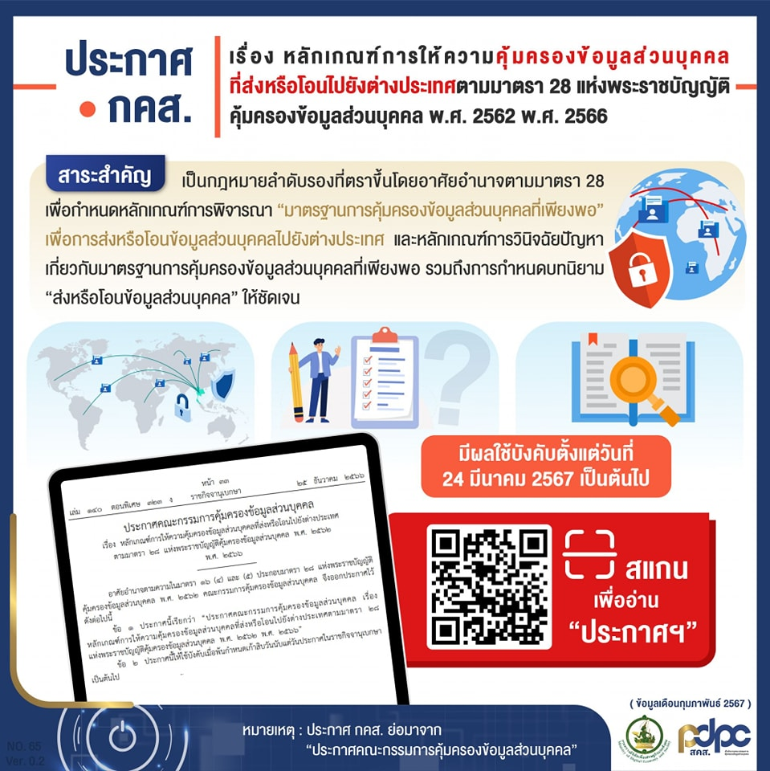
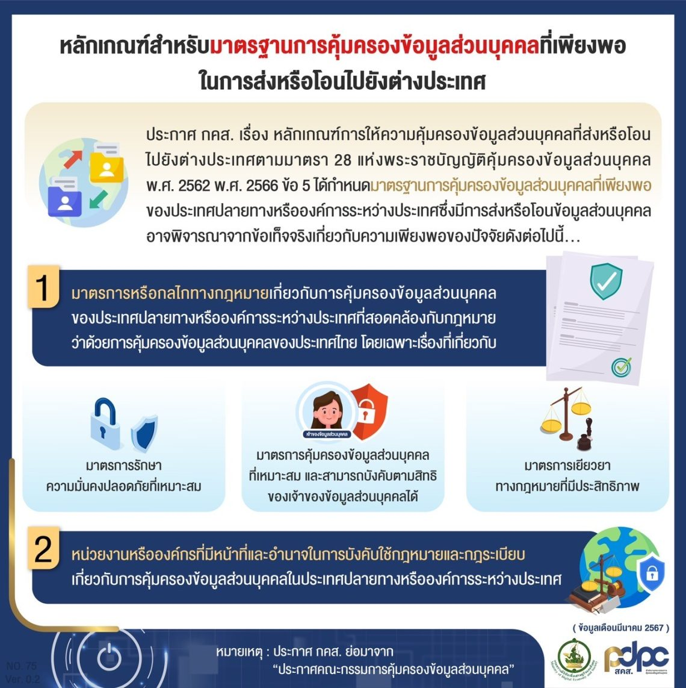

---
title: หลักเกณฑ์การให้ความคุ้มครองข้อมูลส่วนบุคคลที่ส่งหรือโอนไปยังต่างประเทศตามมาตรา 28 แห่งพระราชบัญญัติคุ้มครองข้อมูลส่วนบุคคล พ.ศ. 2562 พ.ศ. 2566
subtitle: 	ประกาศคณะกรรมการคุ้มครองข้อมูลส่วนบุคคล เรื่อง หลักเกณฑ์การให้ความคุ้มครองข้อมูลส่วนบุคคลที่ส่งหรือโอนไปยังต่างประเทศตามมาตรา 28 แห่งพระราชบัญญัติคุ้มครองข้อมูลส่วนบุคคล พ.ศ. 2562 พ.ศ. 2566
summary: 	ประกาศคณะกรรมการคุ้มครองข้อมูลส่วนบุคคล เรื่อง หลักเกณฑ์การให้ความคุ้มครองข้อมูลส่วนบุคคลที่ส่งหรือโอนไปยังต่างประเทศตามมาตรา 28 แห่งพระราชบัญญัติคุ้มครองข้อมูลส่วนบุคคล พ.ศ. 2562 พ.ศ. 2566
authors:
  - admin
tags: ["คุ้มครองข้อมูลส่วนบุคคล"]
categories: ["ISO-27001","ประกาศ"]
date: "2023-12-25"
lastMod: "2023-12-25"
publishDate: "2023-12-25"
featured: false
draft:  false
type: documents

image:
  placement:
  caption:
  focal_point: ""
  preview_only: true
------



ในโลกที่ข้อมูลเป็นสินทรัพย์สำคัญขององค์กร หลักการสำคัญด้านการคุ้มครองข้อมูลส่วนบุคคลประการหนึ่งที่ประเทศต่าง ๆ กำหนดขึ้นเพื่อคุ้มครองสิทธิในความเป็นส่วนตัวของเจ้าของข้อมูลส่วนบุคคล


ในโลกที่ข้อมูลเป็นสินทรัพย์สำคัญขององค์กร หลักการสำคัญด้านการคุ้มครองข้อมูลส่วนบุคคลประการหนึ่งที่ประเทศต่าง ๆ กำหนดขึ้นเพื่อคุ้มครองสิทธิในความเป็นส่วนตัวของเจ้าของข้อมูลส่วนบุคคลได้แก่ การกำหนดมาตรฐานและวิธีการส่งหรือโอนข้อมูลส่วนบุคคลไปยังต่างประเทศ เพื่อเป็นหลักประกันว่าข้อมูลส่วนบุคคลจะได้รับการคุ้มครองในประเทศผู้รับโอนข้อมูลด้วยมาตรฐานที่เหมาะสมตามที่ประเทศผู้ส่งออกข้อมูลกำหนด

พระราชบัญญัติคุ้มครองข้อมูลส่วนบุคคล พ.ศ. 2562 กำหนดหน้าที่และมาตรการเกี่ยวกับการส่งหรือโอนข้อมูลส่วนบุคคลไปยังต่างประเทศไว้ในมาตรา 28 และมาตรา 29 และมีการกำหนดรายละเอียดเพิ่มเติมตามประกาศของคณะกรรมการคุ้มครองข้อมูลส่วนบุคคล (**“คณะกรรมการ”**) จำนวน 2 ฉบับ โดยได้ประกาศในราชกิจจานุเบกษาเมื่อวันที่ 25 ธันวาคม 2566 และจะใช้บังคับ*ตั้งแต่วันที่ 24 มีนาคม 2567* เป็นต้นมาได้แก่

1.	ประกาศคณะกรรมการคุ้มครองข้อมูลส่วนบุคคล เรื่อง หลักเกณฑ์การให้ความคุ้มครองข้อมูลส่วนบุคคลที่ส่งหรือโอนไปยังต่างประเทศ ตามมาตรา 28 แห่งพระราชบัญญัติคุ้มครองข้อมูลส่วนบุคคล พ.ศ. 2562 พ.ศ. 2566 (**“ประกาศคณะกรรมการตามมาตรา 28”**) และ

2. ประกาศคณะกรรมการคุ้มครองข้อมูลส่วนบุคคล เรื่อง หลักเกณฑ์การให้ความคุ้มครองข้อมูลส่วนบุคคลที่ส่งหรือโอนไปยังต่างประเทศ ตามมาตรา 29 แห่งพระราชบัญญัติคุ้มครองข้อมูลส่วนบุคคลพ.ศ. 2562 พ.ศ. 2566 (**“ประกาศคณะกรรมการตามมาตรา 29”**)

ทั้งนี้ ประกาศคณะกรรมการทั้ง 2 ฉบับ ได้กำหนดนิยามคำว่า **“ส่งหรือโอนข้อมูลส่วนบุคคล”** ให้ชัดเจนยิ่งขึ้น โดยไม่รวมถึงการส่งและรับข้อมูลส่วนบุคคลในลักษณะที่เป็นเพียงสื่อกลาง (intermediary) ในการส่งผ่านข้อมูล (data transit) ระหว่างระบบคอมพิวเตอร์หรือระบบเครือข่ายหรือการเก็บพักข้อมูล (data storage) ที่ไม่มีบุคคลภายนอกเข้าถึงข้อมูลส่วนบุคคลได้ นอกจากผู้ควบคุมข้อมูลส่วนบุคคล หรือผู้ประมวลผลข้อมูลส่วนบุคคลที่เป็นผู้ส่งข้อมูลนั้น เช่น การส่งข้อมูลผ่านระบบเครือข่ายในต่างประเทศ หรือการส่งข้อมูลผ่านระบบของผู้ให้บริการระบบคลาวด์ (cloud computing service provider) ที่ไม่มีบุคคลใดนอกจากผู้ควบคุมข้อมูลส่วนบุคคลหรือผู้ประมวลผลข้อมูลส่วนบุคคลที่เป็นผู้ส่งข้อมูล ที่สามารถเข้าถึงข้อมูลส่วนบุคคลได้ เนื่องจากมีมาตรการทางเทคนิคหรือเงื่อนไขทางกฎหมายรองรับ

ประกาศคณะกรรมการตาม*มาตรา 28* ได้กำหนดหลักเกณฑ์การให้ความคุ้มครองข้อมูลส่วนบุคคลที่ส่งหรือโอนไปยังต่างประเทศ ในเรื่องดังต่อไปนี้

## หลักเกณฑ์การให้ความคุ้มครองข้อมูลส่วนบุคคล 

กรณีประเทศปลายทางหรือองค์การระหว่างประเทศที่รับข้อมูลส่วนบุคคลจะถือว่ามี **“มาตรฐานการคุ้มครองข้อมูลส่วนบุคคลที่เพียงพอ”** (เทียบกับ **“Adequacy Decision”** ของ GDPR) เมื่อประเทศปลายทางหรือองค์การระหว่างประเทศนั้น
1.	มีมาตรการหรือกลไกทางกฎหมายเกี่ยวกับการคุ้มครองข้อมูลส่วนบุคคล ที่สอดคล้องกับกฎหมายว่าด้วยการคุ้มครองข้อมูลส่วนบุคคลของประเทศไทย โดยเฉพาะหน้าที่ของผู้ควบคุมข้อมูลส่วนบุคคล ในการจัดให้มีมาตรการรักษาความมั่นคงปลอดภัยที่เหมาะสม มาตรการคุ้มครองข้อมูลส่วนบุคคลที่เหมาะสม และสามารถบังคับตามสิทธิของเจ้าของข้อมูลส่วนบุคคลได้ และมาตรการเยียวยาทางกฎหมายที่มีประสิทธิภาพ
2.	มีหน่วยงานหรือองค์กรที่มีหน้าที่ และอำนาจในการบังคับใช้กฎหมาย และกฎระเบียบเกี่ยวกับการคุ้มครองข้อมูลส่วนบุคคล ในประเทศปลายทางหรือองค์การระหว่างประเทศ

## หลักเกณฑ์การวินิจฉัยปัญหาเกี่ยวกับมาตรฐานการคุ้มครองข้อมูลส่วนบุคคลที่เพียงพอ 
1.	ผู้ที่จะเสนอปัญหาเกี่ยวกับมาตรฐานการคุ้มครองข้อมูลส่วนบุคคลที่เพียงพอให้คณะกรรมการวินิจฉัย อาจเป็นผู้ควบคุมข้อมูลส่วนบุคคล หรือสำนักงานคณะกรรมการคุ้มครองข้อมูลส่วนบุคคล (**“สำนักงาน”**) เป็นผู้เสนอเองก็ได้  
2.	ในการวินิจฉัยปัญหาเกี่ยวกับมาตรฐานการคุ้มครองข้อมูลส่วนบุคคลที่เพียงพอ คณะกรรมการอาจพิจารณาวินิจฉัยเป็นรายกรณี หรือพิจารณากำหนดรายชื่อประเทศปลายทางหรือองค์การระหว่างประเทศที่รับข้อมูลส่วนบุคคล ซึ่งถือว่ามีมาตรฐานการคุ้มครองข้อมูลส่วนบุคคลที่เพียงพอก็ได้ 
3.	สำนักงานอาจขอให้คณะกรรมการทบทวนคำวินิจฉัยได้ เมื่อมีหลักฐานใหม่ทำให้เชื่อได้ว่าประเทศปลายทางหรือองค์การระหว่างประเทศที่รับข้อมูลส่วนบุคคลมีการพัฒนาจนมีมาตรฐานการคุ้มครองข้อมูลส่วนบุคคลที่เพียงพอ หรือกรณีอื่นที่เห็นสมควร
4.	ในการดำเนินการเพื่อเสนอเรื่องให้คณะกรรมการวินิจฉัย ให้สำนักงานจัดทำเป็นรายงานมาตรฐานการคุ้มครองข้อมูลส่วนบุคคลของประเทศปลายทางหรือองค์การระหว่างประเทศ โดยสำนักงานอาจจัดทำเองหรือเสนอรายงานของหน่วยงานอื่นก็ได้

ซึ่งการมีผลใช้บังคับของประกาศทั้งสองฉบับดังกล่าวจะช่วยส่งเสริมความเชื่อมั่นด้านการคุ้มครองข้อมูลส่วนบุคคลของประเทศ ความเชื่อมั่นต่อระบบเศรษฐกิจดิจิทัล และเพื่อให้ประเทศไทยมีมาตรฐานด้านการคุ้มครองข้อมูลส่วนบุคคลเทียบเท่ามาตรฐานสากล.







 

ดาวน์โหลดประกาศ

- [กลับเมนูหลัก](../../section/)

> ที่มา : 
> - [กรุงเทพธุรกิจ](https://www.bangkokbiznews.com/news/news-update/1115730)
> - [คณะกรรมการคุ้มครองข้อมูลส่วนบุคคล](https://www.pdpc.or.th/2500/)

