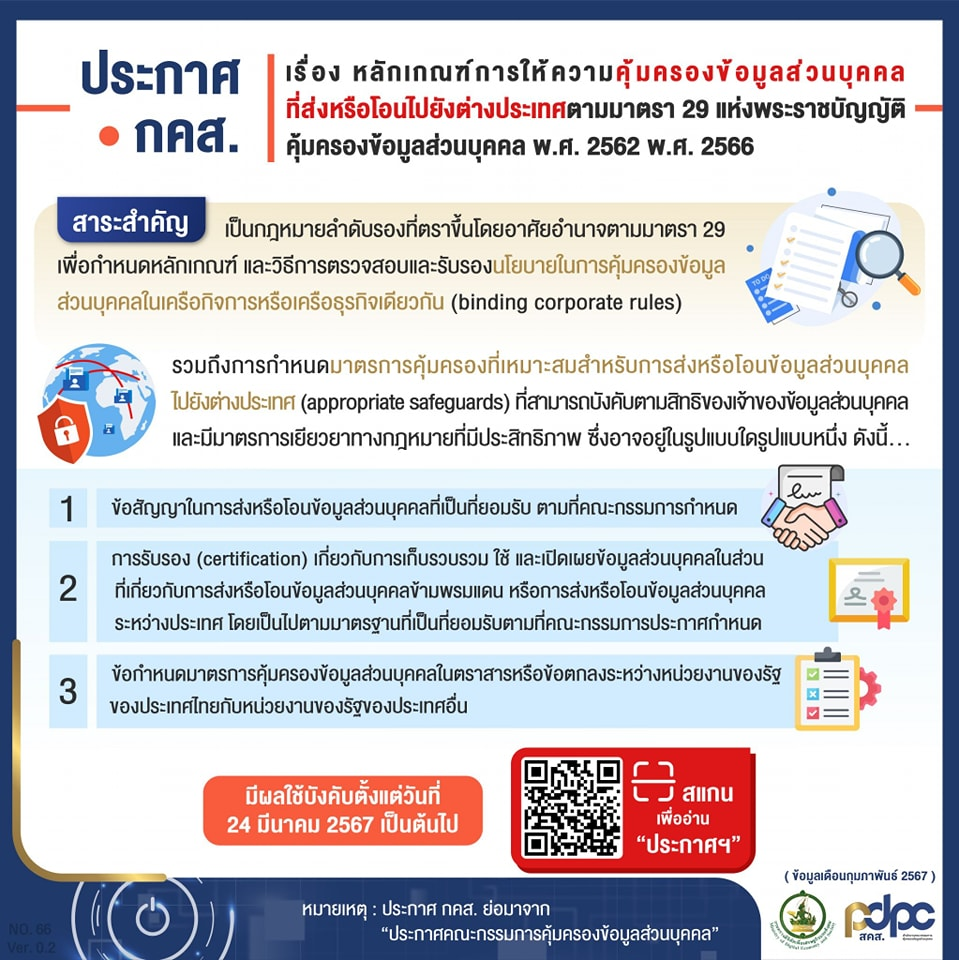
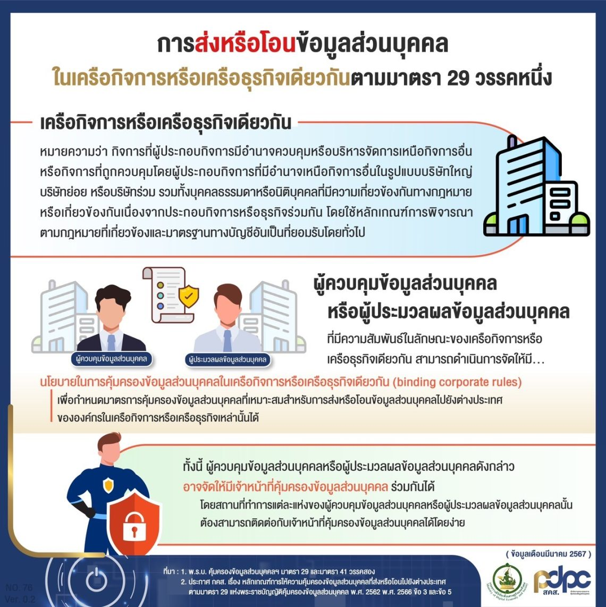









 

ดาวน์โหลดประกาศ

- [กลับเมนูหลัก](../../section/)

> ที่มา : 
> - [กรุงเทพธุรกิจ](https://www.bangkokbiznews.com/news/news-update/1115730)
> - [คณะกรรมการคุ้มครองข้อมูลส่วนบุคคล](https://www.pdpc.or.th/2507/)

