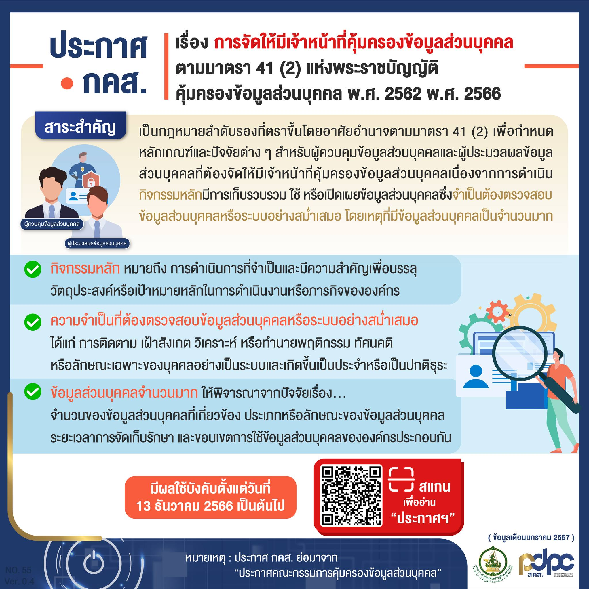


เจ้าหน้าที่คุ้มครองข้อมูลส่วนบุคคล (Data Protection Officer: DPO) ถือเป็นบุคคลที่สำคัญ ในการช่วยให้การดำเนินการด้านการคุ้มครองข้อมูลส่วนบุคคลเป็นไปได้อย่างถูกต้องและครบถ้วน ตามที่กฎหมายกำหนด


เนื่องจากเจ้าหน้าที่คุ้มครองข้อมูลส่วนบุคคลเป็นกลไกสำคัญ ที่จะช่วยให้ผู้ควบคุมข้อมูลส่วนบุคคลหรือผู้ประมวลผลข้อมูลส่วนบุคคลดำเนินการให้เป็นไปตามกฎหมายว่าด้วยการคุ้มครองข้อมูลส่วนบุคคลได้อย่างมีประสิทธิภาพ

ด้วยเหตุนี้ พระราชบัญญัติคุ้มครองข้อมูลส่วนบุคคล พ.ศ. 2562  มาตรา 41 จึงได้กำหนดให้ผู้ควบคุมข้อมูลส่วนบุคคลและผู้ประมวลผลข้อมูลส่วนบุคคลต้องจัดให้มี DPO ในกรณีดังต่อไปนี้

(1) ผู้ควบคุมข้อมูลส่วนบุคคลหรือผู้ประมวลผลข้อมูลส่วนบุคคลเป็นหน่วยงานของรัฐ
ตามที่คณะกรรมการประกาศกำหนด

(2) การดำเนินกิจกรรมของผู้ควบคุมข้อมูลส่วนบุคคล หรือผู้ประมวลผลข้อมูลส่วนบุคคลในการเก็บรวบรวม ใช้ หรือเปิดเผย จำเป็นต้องตรวจสอบข้อมูลส่วนบุคคลหรือระบบอย่างสม่ำเสมอโดยเหตุที่มีข้อมูลส่วนบุคคลเป็นจำนวนมากตามที่คณะกรรมการประกาศกำหนด

(3) กิจกรรมหลัก (core activities) ของผู้ควบคุมข้อมูลส่วนบุคคลหรือผู้ประมวลผลข้อมูลส่วนบุคคลเป็นการเก็บรวบรวม ใช้ หรือเปิดเผยข้อมูลส่วนบุคคลตามมาตรา 26

โดยมีรายละเอียดของการแต่งตั้ง DPO ในแต่ละกรณีดังนี้

1. ประกาศคณะกรรมการคุ้มครองข้อมูลส่วนบุคคล เรื่อง ผู้ควบคุมข้อมูลส่วนบุคคล
และผู้ประมวลผลข้อมูลส่วนบุคคล ที่เป็นหน่วยงานของรัฐซึ่งต้องจัดให้มีเจ้าหน้าที่คุ้มครองข้อมูลส่วนบุคคล พ.ศ. 2566 มีผลใช้บังคับวันที่ 16 ตุลาคม 2566 กำหนดให้ผู้ควบคุมข้อมูลส่วนบุคคลหรือผู้ประมวลผลข้อมูลส่วนบุคคล ที่เป็นหน่วยงานของรัฐตามตามาตรา 41 (1) ที่ประกาศฯ กำหนด จำเป็นต้องจัดให้มี DPO ขึ้น ซึ่งประกาศฯ ฉบับดังกล่าวกำหนดหน่วยงานของรัฐไว้ในบัญชีท้ายประกาศจำนวน 66 ประเภทหน่วยงาน โดยในระยะแรกเป็นการกำหนดให้หน่วยงานของรัฐที่มีความพร้อม และมีลักษณะที่จำเป็นต้องจัดให้มี DPO ก่อนและจะได้กำหนดหน่วยงานของรัฐแห่งอื่นเพิ่มเติม
ตามความเหมาะสมต่อไป

2. ประกาศคณะกรรมการคุ้มครองข้อมูลส่วนบุคคล เรื่อง การจัดให้มีเจ้าหน้าที่คุ้มครองข้อมูลส่วนบุคคลตามมาตรา 41 (2) แห่งพระราชบัญญัติคุ้มครองข้อมูลส่วนบุคคล พ.ศ. 2562 พ.ศ. 2566
มีผลใช้บังคับวันที่ 13 ธันวาคม 2566 กำหนดให้ผู้ควบคุมข้อมูลส่วนบุคคลหรือผู้ประมวลผลข้อมูลส่วนบุคคลตามาตรา 41 (2) ที่มีการดำเนินกิจกรรมหลัก (core activities) ในการเก็บรวบรวม ใช้ หรือเปิดเผย จำเป็นต้องตรวจสอบข้อมูลส่วนบุคคลหรือระบบอย่างสม่ำเสมอ (regular and systematic monitoring)  โดยเหตุที่มีข้อมูลส่วนบุคคลเป็นจำนวนมาก (on a large scale) จำเป็นต้องจัดให้มี DPO ขึ้น เพื่อประโยชน์ในการคุ้มครองข้อมูลส่วนบุคคล โดยมีรายละเอียดที่สำคัญ ดังต่อไปนี้

  2.1 กิจกรรมหลัก (core activities) คือ การดำเนินการที่จำเป็นและมีความสำคัญเพื่อบรรลุวัตถุประสงค์หรือเป้าหมายหลัก ในการดำเนินงานในกิจการหรือภารกิจของผู้ควบคุมข้อมูลส่วนบุคคลหรือผู้ประมวลผลข้อมูลส่วนบุคคล แต่ไม่รวมถึงกิจกรรมเสริมที่เป็นเพียงงานสนับสนุนในการดำเนินงานของผู้ควบคุมข้อมูลส่วนบุคคลหรือผู้ประมวลผลข้อมูลส่วนบุคคล ซึ่งไม่ใช่การดำเนินการที่จำเป็น และมีความสำคัญเพื่อบรรลุวัตถุประสงค์หรือเป้าหมายหลักในการดำเนินงานในกิจการ หรือภารกิจของผู้ควบคุมข้อมูลส่วนบุคคลหรือผู้ประมวลผลข้อมูลส่วนบุคคล เช่น งานสนับสนุนด้านบุคลากร (HR) ซึ่งเป็นเพียงงานสนับสนุนสำหรับการให้บริการรับจ้างขนส่งสินค้า เป็นต้น

  2.2 ต้องตรวจสอบข้อมูลส่วนบุคคลหรือระบบอย่างสม่ำเสมอ โดยพิจารณาได้จากการดำเนินกิจกรรมหลักที่มีการติดตาม (track) เฝ้าสังเกต (monitor) วิเคราะห์ หรือทำนายพฤติกรรม ทัศนคติ หรือลักษณะเฉพาะของบุคคล (profile) ซึ่งโดยทั่วไปจะมีการเก็บรวบรวม ใช้ หรือเปิดเผยข้อมูลส่วนบุคคลอย่างเป็นระบบ (systematic) และเกิดขึ้นเป็นประจำหรือเป็นปกติธุระ (regular) เช่น การเก็บรวบรวม ใช้ หรือเปิดเผยข้อมูลส่วนบุคคลเกี่ยวกับการใช้งานของผู้ถือบัตรสมาชิก บัตรโดยสารสาธารณะ บัตรอิเล็กทรอนิกส์ หรือบัตรอื่นใดในลักษณะเดียวกันซึ่งผู้ให้บริการบัตรหรือบุคคลอื่นใดสามารถตรวจสอบรายละเอียดข้อมูลการใช้งานบัตรได้ เป็นต้น

  2.3 มีข้อมูลส่วนบุคคลเป็นจำนวนมาก (on a large scale) เช่น

  - มีจำนวนเจ้าของข้อมูลส่วนบุคคลที่มีการเก็บรวบรวม ใช้ หรือเปิดเผยข้อมูลส่วนบุคคลตั้งแต่ 100,000 รายขึ้นไป หรือกรณีอื่นใดตามที่ประกาศกำหนด
  - การดำเนินการเพื่อวัตถุประสงค์ด้านการโฆษณาตามพฤติกรรม (behavioral advertising)ผ่านโปรแกรมค้นหา (search engine) หรือสื่อสังคมออนไลน์ (social media) ที่มีผู้ใช้งานอย่างกว้างขวาง
  - การดำเนินงานปกติโดยบริษัทตามกฎหมายว่าด้วยประกันชีวิต บริษัทตามกฎหมายว่าด้วยประกันวินาศภัย ผู้ประกอบธุรกิจสถาบันการเงินตามกฎหมายว่าด้วยธุรกิจสถาบันการเงิน
  - การดำเนินการของผู้รับบริการโดยผู้รับใบอนุญาตประกอบกิจการโทรคมนาคมแบบที่สามตามกฎหมายว่าด้วยการประกอบกิจการโทรคมนาคม ซึ่งได้แก่ผู้ประกอบกิจการโทรคมนาคมที่มีโครงข่ายเป็นของตนเอง ซึ่งเป็นการประกอบกิจการที่มีวัตถุประสงค์ในการให้บริการแก่บุคคลทั่วไปจำนวนมาก หรืออาจมีผลกระทบโดยนัยสำคัญต่อการแข่งขันโดยเสรีอย่างเป็นธรรม หรืออาจกระทบต่อประโยชน์สาธารณะ หรือมีเหตุจำเป็นต้องคุ้มครองผู้บริโภคเป็นพิเศษ

3. กิจกรรมหลัก (core activities) ของผู้ควบคุมข้อมูลส่วนบุคคลหรือผู้ประมวลผลข้อมูลส่วนบุคคลเป็นการเก็บรวบรวม ใช้ หรือเปิดเผยข้อมูลส่วนบุคคลตามมาตรา 26 ในกรณีนี้ไม่จำเป็นต้องมีประกาศคณะกรรมการคุ้มครองข้อมูลส่วนบุคคลอย่างเช่นในกรณีของ DPO ตามมาตรา 41 (1) หรือ (2) โดยผู้ควบคุมข้อมูลส่วนบุคคลหรือผู้ประมวลผลข้อมูลส่วนบุคคลจะต้องจัดให้มี DPO หากกิจกรรมหลักของผู้ควบคุมข้อมูลส่วนบุคคลหรือผู้ประมวลผลข้อมูลส่วนบุคคลเป็นการเก็บรวบรวม ใช้ หรือเปิดเผยข้อมูลส่วนบุคคลเกี่ยวกับเชื้อชาติ เผ่าพันธุ์ ความคิดเห็นทางการเมือง ความเชื่อในลัทธิ ศาสนาหรือปรัชญา พฤติกรรมทางเพศ ประวัติอาชญากรรม ข้อมูลสุขภาพ ความพิการ ข้อมูลสหภาพแรงงาน ข้อมูลพันธุกรรม ข้อมูลชีวภาพ ฯลฯ 

ดังนั้น เมื่อผู้ควบคุมข้อมูลส่วนบุคคลหรือผู้ประมวลผลข้อมูลส่วนบุคคลเข้าหลักเกณฑ์ข้อหนึ่งข้อใดตามที่มาตรา 41 บัญญัติไว้ ผู้ควบคุมข้อมูลส่วนบุคคลหรือผู้ประมวลผลข้อมูลส่วนบุคคลดังกล่าวจะต้องจัดให้มี DPO ขึ้นมา ทำหน้าที่ตามที่พระราชบัญญัติคุ้มครองข้อมูลส่วนบุคคล พ.ศ. 2562 กำหนด  และการไม่แต่งตั้งอาจมีความรับผิดต้องระวางโทษปรับทางปกครองไม่เกินหนึ่งล้านบาท







 

ดาวน์โหลดประกาศ

- [กลับเมนูหลัก](../../section/)

> ที่มา : 
> - [กรุงเทพธุรกิจ](https://www.bangkokbiznews.com/tech/gadget/1095991)
> - [คณะกรรมการคุ้มครองข้อมูลส่วนบุคคล](https://www.pdpc.or.th/2384/)