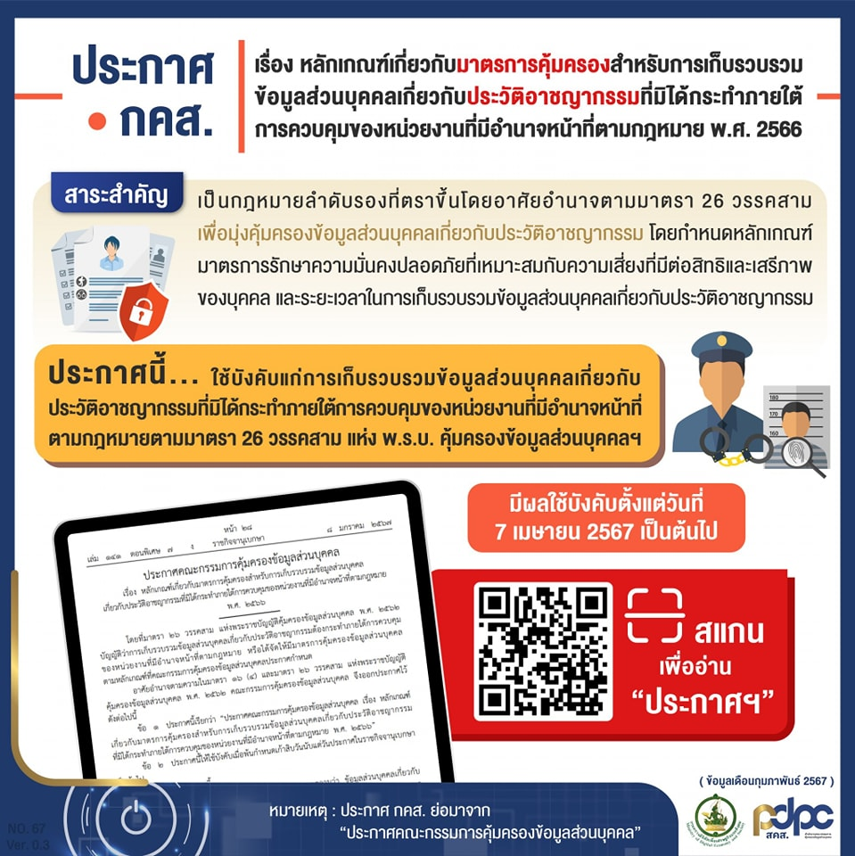
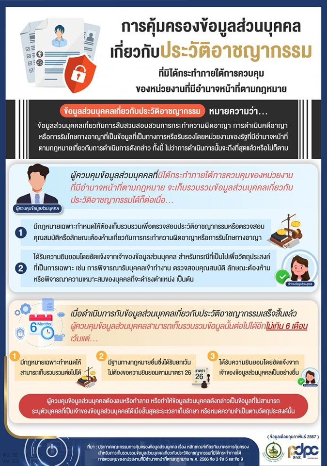

**"ข้อมูลประวัติอาชญากรรม"** ดำเนินการไม่ถูกต้อง **"อาจติดคุก"** เพราะแม้การตรวจสอบประวัติอาชญากรรมนับเป็นหนึ่งในขั้นตอนการ **"คัดกรอง"** ก่อนการจ้างงาน ทั้งบางธุรกิจหรือสถานประกอบการยังกำหนดเป็นมาตรฐานการควบคุมที่สำคัญและเป็นชอบด้วยกฎหมาย เนื่องจากเป็นเหตุผลด้านความปลอดภัยของการให้บริการที่จำเป็นต้องมีมาตรการขั้นสูงในการคัดกรอง เช่น พนักงานรักษาความปลอดภัย พนักงานด้านการเงิน พนักงานที่ดูแลระบบสารสนเทศ แม่บ้าน ช่างซ่อมบำรุงในอาคาร พนักงานขับรถขนเงิน พนักงานขับรถสาธารณะ หรือพนักงานขับรถส่งอาหาร ฯลฯ

ด้วยเหตุนี้ จึงมีประกาศคณะกรรมการคุ้มครองข้อมูลส่วนบุคคลเกี่ยวกับประวัติอาชญากรรมออกมา และมีผลบังคับใช้แล้วใน*วันที่ 7 เมษายน 2567* ดังนั้น การที่นายจ้างจะตรวจสอบข้อมูลประวัติอาชญากรรมของผู้สมัคร จึงต้องพิจารณาถึงประกาศฯฉบับนี้
โดยประกาศ **“คณะกรรมการคุ้มครองข้อมูลส่วนบุคคล เรื่องหลักเกณฑ์เกี่ยวกับมาตรการคุ้มครองสำหรับการเก็บรวบรวมข้อมูลส่วนบุคคลเกี่ยวกับประวัติอาชญากรรม ที่มิได้กระทำการควบคุมของหน่วยงานที่มีอำนาจหน้าที่ตามกฎหมาย พ.ศ. 2566 ”** เป็นกฎหมายลำดับรองว่าด้วยเรื่องของมาตรการเก็บรวบรวมข้อมูลส่วนบุคคลเกี่ยวกับอาชญากรรมตามที่ สคส. กำหนด ได้แก่ วัตถุประสงค์ในการเก็บ ระยะเวลาการเก็บ ข้อยกเว้นกรณีหากจำเป็นต้องเก็บเกินเวลา และการลบทำลาย/ทำเป็นข้อมูลไม่สามารถระบุตัวตนได้
หลักเกณฑ์ในการเก็บรวบรวมและเก็บรักษาข้อมูลส่วนบุคคลเกี่ยวกับประวัติอาชญากรรม
จากประกาศฯ การเก็บข้อมูลประวัติอาชญากรรมสามารถทำได้ ภายใต้วัตถุประสงค์ ดังนี้
1. การพิจารณารับบุคคลเข้าทำงาน หรือการตรวจสอบคุณสมบัติ ลักษณะต้องห้ามหรือพิจารณาความเหมาะสมของบุคคลที่จะดำรงตำแหน่งใด
บางกรณีที่สามารถเก็บรวบข้อมูลส่วนบุคคลเกี่ยวกับประวัติอาชญากรรม โดยที่ **“กฎหมายกำหนด”** ให้สามารถเก็บรวบรวมต่อไปได้



**ตัวอย่างเช่น** – การรับสมัครผู้ที่ดำรงตำแหน่งเจ้าหน้าที่รักษาความปลอดภัย (รปภ.) ต่าง ๆ ไม่ว่าจะเป็นทั้งองค์กรหรือบริษัท จัดตั้งด้วยตัวเอง ซึ่งรวมไปถึงการใช้บริการ Outsource จากองค์กรหรือบริษัทที่ให้บริการด้านรักษาความปลอดภัย จึงจำเป็นต้องใช้ข้อมูลส่วนตัวเกี่ยวกับประวัติอาชญากรรมเพื่อการพิจารณารับเข้าทำงานหรือใช้บริการได้ด้วย

2. การตรวจสอบคุณสมบัติหรือลักษณะต้องห้ามของบุคคลในการออกใบอนุญาตต่าง ๆ
ซึ่งดำเนินการโดยหน่วยงานของรัฐ หรือผู้ควบคุมข้อมูลส่วนบุคคลที่ได้รับมอบหมายให้ปฏิบัติหน้าที่ในการใช้อำนาจแทนหน่วยงานของรัฐ


**ตัวอย่างเช่น** – การออกใบอนุญาตขับขี่ประเภท 2 ให้กับบุคคลขับรถรับจ้างทั้งประจำทางและไม่ประจำทาง เพื่อการพิจารณาในการออกใบอนุญาตของกรมขนส่งทางบก

3. การตรวจสอบคุณสมบัติหรือลักษณะต้องห้ามของบุคคลในการอนุญาตต่าง ๆ โดยผู้ควบคุมข้อมูลส่วนบุคคลอื่น ที่นอกเหนือจากข้อ (2)
 

โดยภายใต้วัตถุประสงค์ตามข้างต้นนี้ต้องได้รับ**ความยินยอมโดยชัดแจ้ง** หรือมี**ฐานทางกฎหมายรองรับ**ให้สามารถเก็บรวบรวมได้  ซึ่งต้องแจ้งผลกระทบระหว่างการให้ – ไม่ให้ความยินยอม ในขั้นตอนการขอความยินยอม และแจ้งให้ทราบว่าจะมีการตรวจประวัติอาชญากรรมตั้งแต่ขั้นตอนแรก เช่น ขั้นตอนการประกาศรับสมัคร การสรรหา การรับเลือก 
เมื่อประมวลผลหรือใช้ข้อมูลส่วนบุคคลเกี่ยวกับประวัติอาชญากรรมเสร็จแล้ว ผู้ควบคุมข้อมูลส่วนบุคคล (Data Controller) สามารถเก็บข้อมูลนั้นต่อไปได้อีก *“ไม่เกิน 6 เดือน”* หากเกินระยะเวลาดังกล่าว จะต้องมีกฎหมายกำหนดเฉพาะ หรือมีฐานทางกฎหมายตาม PDPA หรือต้องขอความยินยอมจากเจ้าของข้อมูล แต่ถ้าไม่มีกฎหมายกำหนด ไม่มีฐานกฎหมาย และไม่ได้ขอความยินยอม ผู้ควบคุมข้อมูลส่วนบุคคล ต้องลบ ทำลาย หรือทำให้ข้อมูลไม่สามารถระบุถึงเจ้าของข้อมูลส่วนบุคคลได้
แต่กฎหมายยังมี **“ข้อยกเว้น”** ในกรณีที่จำเป็นต้องเก็บข้อมูลเกี่ยวกับประวัติอาชญากรรม นอกเหนือจากระยะเวลาที่กฎหมายกำหนดไว้ด้วย ตามกรณีดังนี้
1. มีกฎหมายเฉพาะกำหนดให้สามารถเก็บรักษาต่อไปได้
บางกรณีที่สามารถเก็บรวบข้อมูลส่วนบุคคลเกี่ยวกับประวัติอาชญากรรม โดยที่ **“กฎหมายกำหนด”** ให้สามารถเก็บรวบรวมต่อไปได้

**ตัวอย่างเช่น** – มีกฎหมายเฉพาะที่กำหนดให้องค์กรจะต้องเก็บประวัติอาชญากรรมของพนักงานเป็นเวลา 10 ปีองค์กรจึงสามารถเก็บได้มากกว่า 6 เดือน

2. มีฐานทางกฎหมายอื่นซึ่งได้รับการยกเว้นไม่ต้องขอความยินยอมตามมาตรา 26
กรณีที่ไม่มีกฎหมายอื่นกำหนดให้เก็บ แต่มี **“ฐานทางกฎหมายตามที่ PDPA กำหนด”** ให้เก็บได้มากกว่า 6 เดือน

**ตัวอย่างเช่น** – องค์กรจำเป็นจะต้องเก็บประวัติอาชญากรรมของพนักงานไว้ เนื่องจากมีการฟ้องร้องคดีซึ่งประวัติอาชญากรรมเป็นหลักฐานในการต่อสู้คดี องค์กรสามารถใช้ฐานตามมาตราา 26 (อนุมาตรา 4) จึงเก็บประวัติอาชญากรรมได้มากกว่า 6  เดือน

3. ได้รับความยินยอมโดยชัดแจ้งจากเจ้าของข้อมูลส่วนบุคคลเป็นอย่างอื่น
กรณีที่จำเป็นต้องขอตรวจสอบประวัติอาชญากรรม จำเป็นต้องได้รับ **“ความยินยอม”** โดยชัดแจ้งจากเจ้าของข้อมูลส่วนบุคคล

## การขอเอกสารตรวจสอบประวัติอาชญากรรมอย่างไร ไม่ผิดกฎหมาย PDPA

โดยหลักการ **"ประวัติอาชญากรรม"** เป็นข้อมูลส่วนบุคคลอ่อนไหว (Sensitive Data) ซึ่ง PDPA หรือพระราชบัญญัติคุ้มครองข้อมูลส่วนบุคคล พ.ศ.2562 ระบุว่า **"ห้าม"** ไม่ให้เก็บรวบรวมข้อมูลส่วนบุคคลอ่อนไหวที่อาจจะส่งผลกระทบต่อร่างกายและจิตใจของบุคคลนั้นโดยไม่ได้รับ **"ความยินยอม"** โดยชัดแจ้งจากเจ้าของข้อมูลส่วนบุคคล หรือไม่มีฐานทางกฎหมายอื่นรองรับ

## 5 สิ่งต้องระวัง! นายจ้างที่เก็บใช้ข้อมูลอาชญากรรม
ตามที่ระบุในข้างต้นว่า ข้อมูลประวัติอาชญากรรม เป็นข้อมูลส่วนบุคคลอ่อนไหว และกฎหมายอนุญาตให้ประมวลผลในกรณีที่จำเป็นเท่านั้น อย่างไรก็ตาม นายจ้างจะต้องมีความระมัดระวัง และควรทำความเข้าใจข้อบังคับของกฎหมาย PDPA ดังนี้
1. **ประวัติอาชญากรรมคืออะไร:** ประวัติอาชญากรรม หมายความว่า ข้อมูลส่วนบุคคลเกี่ยวกับการสืบสวนสอบสวนการกระทำผิดอาญา การดำเนินคดี หรือการรับโทษทางอาญา ที่เป็นข้อมูลที่เป็นทางการหรือรับรองโดยหน่วยงานของรัฐที่มีอำนาจหน้าที่เกี่ยวกับการดำเนินการดังกล่าว ทั้งนี้ ไม่ว่าการดำเนินการนั้นจะถึงที่สุดหรือไม่ก็ตาม 
ดังนั้น หากนายจ้าง **"จำเป็น"** ต้องขอตรวจสอบประวัติอาชญากรรม จะต้องใช้ความระมัดระวังในการตรวจสอบมากขึ้น เนื่องจากคำนิยามได้กำหนดขอบเขตของประวัติอาชญากรรมให้กว้างกว่าความเข้าใจทั่วไป โดยครอบคลุมขั้นตอนตั้งแต่การสืบสวนสอบสวน จนถึงการรับโทษทางอาญา และไม่จำเป็นว่าจะถึงที่สุดแล้วหรือไม่ 
2. **แอบตรวจสอบข้อมูลประวัติอาชญากรรมนั้นผิดกฎหมาย:** แม้จะอ้างว่าเพื่อความปลอดภัย เพื่อความจำเป็นและเหตุผลร้อยแปดพันประการ แต่อย่างไรเสีย การที่นายจ้าง **"แอบ"** ตรวจสอบประวัติอาชญากรรมของผู้สมัครงานโดยไม่มีฐานทางกฎหมายจะทำไม่ได้ โดยประกาศฉบับนี้กำหนดให้บริษัทพิจารณาว่ามีกฎหมายเฉพาะที่บังคับให้ต้องตรวจประวัติอาชญากรรมตำแหน่งนั้นหรือไม่ เช่น กฎหมายว่าด้วยการป้องกันและปราบปรามการฟอกเงินกำหนดให้นายจ้างต้องตรวจประวัติอาชญากรรมในบางตำแหน่ง แต่หากไม่มีกฎหมายกำหนดให้ต้องตรวจ นายจ้างจะต้องขอความยินยอมจากผู้สมัครงาน
3. **ต้องแจ้งเจ้าของข้อมูลบุคคลตามกฎหมาย:** ในกรณีที่ตำแหน่งงานใดต้องมีการตรวจประวัติอาชญากรรม นายจ้างจะต้องแจ้งให้ผู้สมัครงานทราบตั้งแต่ขั้นตอนการสรรหาหรือประกาศรับสมัคร เพื่อให้ผู้สมัครงานได้ทราบและตัดสินใจว่าจะสมัครงานในตำแหน่งนี้หรือไม่ 
นอกจากนี้ หากตำแหน่งดังกล่าวต้องขอความยินยอมในการตรวจ นายจ้างจะต้องแจ้งผลกระทบของการไม่ให้หรือถอนความยินยอมให้แก่ผู้สมัครงานทราบในตอนที่ขอความยินยอมด้วย
4. **เก็บประวัติอาชญากรรมนานเกินไปมีความเสี่ยง:** ข้อมูลประวัติอาชญากรรมมีความเสี่ยงต่อการละเมิดในหลายประเด็น และอาจส่งผลร้ายทั้งเจ้าของข้อมูลส่วนบุคคล ดังนั้นประกาศฉบับนี้จึงกำหนดให้เก็บไว้ได้ไม่เกิน 6 เดือนนับแต่วันที่นายจ้างใช้งานเรียบร้อยแล้ว เว้นแต่มีกฎหมายเฉพาะกำหนดให้เก็บได้นานกว่า หรือมีฐานทางกฎหมายอื่น หรือต้องขอความยินยอมเพื่อเก็บไว้นานกว่าระยะเวลาดังกล่าว
5. **รักษาประวัติอาชญากรรมให้ปลอดภัย:** นายจ้างต้องจัดให้มีมาตรการรักษาความมั่นคงปลอดภัย ของข้อมูลประวัติอาชญากรรมที่เหมาะสมกับความเสี่ยงที่มีต่อสิทธิเสรีภาพของเจ้าของข้อมูลส่วนบุคคล โดยมีมาตรฐานขั้นต่ำตามประกาศคณะกรรมการคุ้มครองข้อมูลส่วนบุคคลที่ออกมาตามมาตรา 37 (1)







 

ดาวน์โหลดประกาศ

- [กลับเมนูหลัก](../../section/)

> ที่มา : 
> - [คณะกรรมการคุ้มครองข้อมูลส่วนบุคคล](https://www.pdpc.or.th/2564/)
> - [PDPA Thailand](https://pdpathailand.com/news-article/criminal-profilers/)