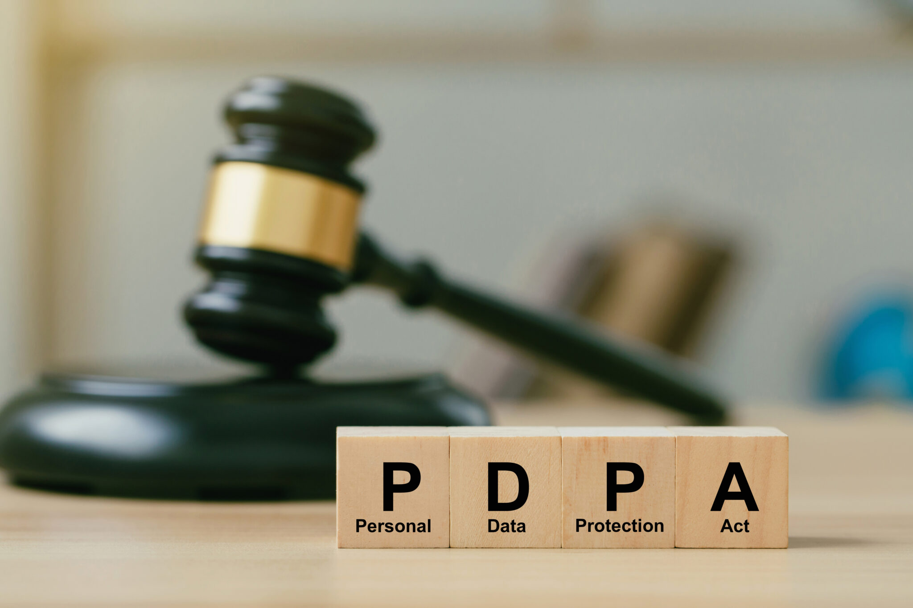

กฎหมายคุ้มครองข้อมูลส่วนบุคคลนั้น เป็นผลมาจากการเปลี่ยนผ่านเข้าสู่ดิจิทัล ซึ่งส่งผลให้มีการล่วงละเมิดสิทธิในข้อมูลส่วนบุคคลเพิ่มมากขึ้น จึงทำให้ภาครัฐ ต้องมีการคุ้มครองความเป็นส่วนตัวของประชากรในประเทศ ซึ่งถือเป็นส่วนหนึ่งของการรักษาความปลอดภัยของข้อมูล (Data Security) ครอบคลุมข้อมูลส่วนบุคคลประเภทต่างๆ ตั้งแต่ ชื่อ นามสกุล ที่อยู่ เบอร์โทรศัพท์ ไปจนถึงอีเมล์ หมายเลขบัตรประจำตัวประชาชน และ อื่นๆ นอกจากนี้ กฎหมายยังคุ้มครองไปถึงข้อมูลส่วนบุคคลที่มีความอ่อนไหว (Sensitive Data) เช่น เชื้อชาติ เผ่าพันธุ์ ความเห็นทางการเมือง ความเชื่อ ลัทธิ ศาสนา พฤติกรรมทางเพศ ประวัติอาชญากรรม ข้อมูลทางด้านสุขภาพ ข้อมูลทางพันธุกรรม และ ข้อมูลชีวภาพ โดยสาระสำคัญและแนวทางในการปฏิบัติตามกฎหมายคุ้มครองข้อมูลส่วนบุคคลของไทยฉบับนี้ ซึ่งมีการปรับเปลี่ยนไปจากร่างพรบ. คุ้มครองข้อมูลสวนบุคคล (ฉบับเก่า) ดังนี้



การเก็บรวบรวม การใช้ หรือ การเปิดเผยข้อมูลส่วนบุคคล ต้องได้รับการยินยอมจากเจ้าของข้อมูล โดยต้องมีการยอมรับเป็นลายลักษณ์อักษร หรือ ผ่านทางระบบอิเล็กทรอนิกส์ โดยขอบเขตการบังคับใช้ในร่างพรบ. ฉบับล่าสุดยังได้ขยายขอบเขตครอบคลุมถึงกรณีผู้ควบคุมข้อมูล (Data Controller) และผู้ประมวลผลข้อมูลส่วนบุคคล (Data Processor) ที่อยู่นอกประเทศโดยมี

1. การเสนอขายสินค้าหรือบริการแก่เจ้าของข้อมูลซึ่งอยู่ในประเทศ ไม่ว่าจะมีการชำระเงินหรือไม่ และ  
1. การเฝ้าติดตามพฤติกรรมของเจ้าของข้อมูลที่เกิดขึ้นในประเทศ





- ต้องแจ้งเจ้าของข้อมูลถึงวัตถุประสงค์ในการเก็บ ใช้ หรือ เปิดเผย และต้องไม่ใช้ข้อมูลนอกเหนือจากวัตถุประสงค์ที่แจ้ง





- ต้องมีมาตรการรักษาความปลอดภัยของข้อมูลที่ถูกเก็บรักษาในประเทศ หรือกรณีการโอนย้ายข้อมูลไปนอกประเทศ ประเทศปลายทางต้องมีมาตรการรักษาความปลอดภัยข้อมูลส่วนบุคคลที่เพียงพอ และจะต้องมีการจัดทำรายงานวัดผลการป้องกันข้อมูลตามกฎหมายด้วย





- โดยเจ้าของมีสิทธิในการขอเคลื่อนย้ายข้อมูลส่วนบุคคลของตน มีสิทธิขอรับสำเนาข้อมูลส่วนบุคคลที่เกี่ยวกับตน รวมถึงมีสิทธิโต้แย้ง หรือ คัดค้านการเก็บรวบรวม ใช้ หรือเปิดเผยข้อมูล เพิ่มเติมจากการมีสิทธิเข้าถึง และขอให้เปิดเผยถึงการได้มาซึ่งข้อมูล ขอให้ลบทำลาย หรือเปลี่ยนแปลงข้อมูลที่องค์กรต่างๆ นำไปใช้





  - หน่วยงานภาครัฐต้องมีการแต่งตั้งหน้าที่ของผู้ควบคุมข้อมูลส่วนบุคคล หรือ ผู้ประมวลผลข้อมูลส่วนบุคคลไว้ชัดเจน โดยผู้ควบคุมข้อมูลโดยมีหน้าที่ในการขอความยินยอม บันทึกและป้องกันไม่ให้มีการละเมิดข้อมูลส่วนบุคคลโดยมิชอบ และต้องมีมาตรการในการเก็บรักษาข้อมูลที่เหมาะสมรวมทั้งจัดทำบันทึก ตามคำสั่งหรือในนามของผู้ควบคุมข้อมูลส่วนบุุคคล ดังนั้น ควรมีการประเมินผลกระทบ วางกลยุทธ์ในการเตรียมความพร้อม และนำเทคโนโลยีเข้าไปช่วยในการบริหารจัดการข้อมูลอย่างมีประสิทธิภาพ น่าจะช่วยให้องค์กรสามารถรับมือกับข้อกฎหมายฉบับนี้ได้อย่างสัมฤทธิ์ผลมากยิ่งขึ้นไป






## สาระสำคัญและแนวทางในการปฏิบัติตามกฎหมาย



- ให้เก็บรวบรวมข้อมูลส่วนบุคคลได้เท่าที่จำเป็นภายใต้วัตถุประสงค์อันชอบด้วยกฎหมาย
- ห้ามมิให้ผู้ควบคุมข้อมูลส่วนบุคคลใช้หรือเปิดเผยข้อมูลส่วนบุคคลโดยไม่ได้รับความยินยอมจากเจ้าของข้อมูลส่วนบุคคล เว้นแต่เป็นข้อมูลส่วนบุคคลที่เก็บรวบรวมได้ โดยได้รับการยกเว้น เช่น เพื่อประโยชน์สาธารณะหรือตามที่กฎหมายอื่น ๆ กำหนดไว้ เป็นต้น





- ขอเข้าถึงและขอรับสำเนาข้อมูลส่วนบุคคลของตน หรือขอให้เปิดเผยถึงการได้มาซึ่งข้อมูลของตน โดยผู้ควบคุมข้อมูลส่วนบุคคลดำเนินการตามคำขอ ภายใน 30 วัน
- ขอคัดค้านการเก็บรวบรวม ใช้ หรือเปิดเผยข้อมูลส่วนบุคคลที่เกี่ยวกับตนเมื่อใดก็ได้
- ขอให้ดำเนินการลบ ทำลาย ระงับการใช้ชั่วคราวหรือทำให้เป็นข้อมูลที่ไม่สามารถระบุตัวบุคคลที่เป็นเจ้าของได้เมื่อมีเหตุอันควร





- ผู้ควบคุมข้อมูลส่วนบุคคล/ผู้ประมวลผลข้อมูลส่วนบุคคล ฝ่าฝืน/ไม่ปฏิบัติ ตาม พ.ร.บ. จนทำให้เกิดความเสียหายต่อเจ้าของข้อมูลส่วนบุคคล ต้องชดใช้ค่าสินไหมทดแทนแก่เจ้าของข้อมูลส่วนบุคคล
- มีอายุความ 3 ปี นับแต่วันที่ผู้เสียหายรู้ถึงความเสียหาย
- หรือมีอายุความ 10 ปี นับแต่วันที่มีการละเมิดข้อมูลส่วนบุคคล





**โทษอาญา**
- ทำให้ผู้อื่นเสียหาย เสียชื่อเสียง ถูกดูหมิ่นถูกเกลียดชัง ได้รับความอับอาย จำคุกไม่เกิน 6 เดือน/ปรับไม่เกิน 500,000 บาท/ทั้งจำทั้งปรับ
- แสวงหาประโยชน์ที่มิชอบด้วยกฎหมาย จำคุกไม่เกิน 1 ปี/ปรับไม่เกิน 1,000,000 บาท/ทั้งจำทั้งปรับ
- ผู้ใดล่วงรู้ข้อมูลส่วนบุคคลของผู้อื่น โดยนำข้อมูลไปเปิดเผยแก่ผู้อื่น จำคุกไม่เกิน 6 เดือน/ปรับไม่เกิน 500,000 บาท /ทั้งจำทั้งปรับ
  
**โทษทางปกครอง**
- ผู้ควบคุมข้อมูลส่วนบุคคล/ผู้ประมวลผลข้อมูลส่วนบุคคล ไม่ปฏิบัติตาม พ.ร.บ.ต้องโทษปรับทางปกครองสูงสุดไม่เกิน 5,000,000 บาท โดยขึ้นอยู่กับมาตราที่ฝ่าฝืน





## พระราชบัญญัติคุ้มครองข้อมูลส่วนบุคคล พ.ศ. 2562




 

ดาวน์โหลดประกาศ

> ที่มา : [สำนักงานพัฒนาธุรกรรมทางอิเล็กทรอนิกส์](https://ictlawcenter.etda.or.th/laws/detail/DP-Act-2562)