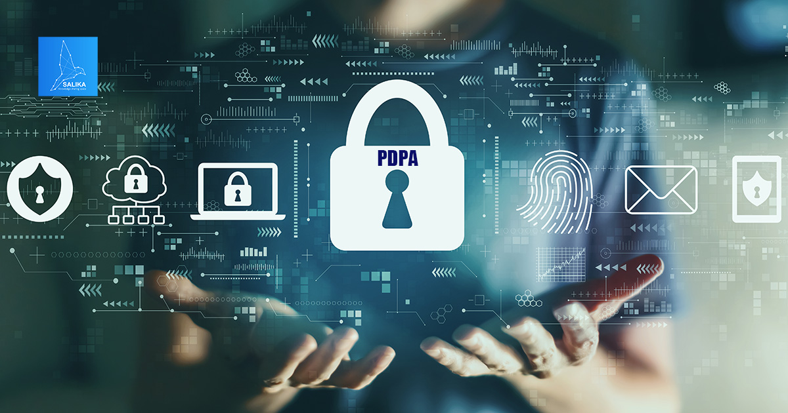



 
1 มิถุนายน 2567 ครบรอบ 2 ปีบังคับใช้กฎหมาย PDPA หรือ พ.ร.บ.คุ้มครองข้อมูลส่วนบุคคล พ.ศ. 2562 ทั้งฉบับอย่างสมบูรณ์ ซึ่งตลอดระยะเวลา 2 ปีที่ผ่านมาทางคณะกรรมการคุ้มครองข้อมูลส่วนบุคคล (สคส.) ได้มีการออกกฎหมายลำดับรอง หรือที่เรียกกันว่า **“กฎหมายลูก”** ออกมาหลายฉบับ เพื่อให้ทุกท่านที่เกี่ยวข้องได้รับรู้และได้ศึกษาเพื่อป้องกันความผิดพลาดจากการปฏิบัติงานที่ไม่สอดคล้องกับกฎหมายคุ้มครองข้อมูลส่วนบุคคล จึงขอชวนทุกท่านที่เกี่ยวข้องมาอัปเดตกฎหมายลูกสำคัญที่องค์กรควรรู้ มีรายละเอียดดังนี้

 ## กฎหมายลูก ประเภทที่ 1: พระราชกฤษฎีกา


  **พระราชกฤษฎีกากำหนดลักษณะ กิจการ หรือหน่วยงาน ที่ได้รับการยกเว้นไม่ให้นำพระราชบัญญัติคุ้มครองข้อมูลส่วนบุคคล พ.ศ. 2562 บางส่วนมาใช้บังคับ (ประกาศ 17 สิงหาคม 2566)** [(ดาวน์โหลด)](../pdpa-decree-2562/)


หน่วยงานหรือองค์กรที่มีลักษณะตามประกาศฉบับนี้ ได้รับการยกเว้นการทำตาม PDPA ในบางส่วน (การขอความยินยอมและการขอใช้สิทธิของเจ้าของข้อมูลส่วนบุคคล) เช่น กิจกรรมการป้องกันและปราบปรามการทุจริต การฟอกเงิน การดำเนินการเกี่ยวกับภาษีเงินได้บุคคลธรรมดา ภาษีที่ดิน เป็นต้น อย่างไรก็ตามทุกองค์กรยังคงต้องจัดให้มีมาตรการรักษาความมั่นคงปลอดภัยของข้อมูลส่วนบุคคลที่เหมาะสม

-------

## กฎหมายลูก ประเภทที่ 2: ประกาศคณะกรรมการคุ้มครองข้อมูลส่วนบุคคล


  **การยกเว้นการบันทึกรายการของผู้ควบคุมข้อมูลส่วนบุคคลซึ่งเป็นกิจการขนาดเล็ก (ประกาศ 20 มิถุนายน 2565)** [(ดาวน์โหลด)](../pdpa-2565-01/)


กิจการขนาดเล็กตามประกาศฉบับนี้ ไม่จำเป็นต้องบันทึกรายการของกิจกรรมการประมวลผลข้อมูลส่วนบุคคล (RoPA) ตามกระบวนการของ PDPA ครบทุกเรื่อง โดยสามารถทำเป็นบางข้อ หรือแบบย่อสำหรับส่งสำนักงานคณะกรรมการคุ้มครองข้อมูลส่วนบุคคล (สคส.) ตรวจสอบได้

**ผู้ควบคุมข้อมูลส่วนบุคคลที่เป็นกิจการขนาดเล็กที่ได้รับการยกเว้น:**
- วิสาหกิจขนาดย่อมหรือขนาดกลาง  
- วิสาหกิจชุมชนหรือเครือข่ายวิสาหกิจชุมชน
- วิสาหกิจเพื่อสังคมหรือกลุ่มกิจการเพื่อสังคม
- สหกรณ์ ชุมนุมสหกรณ์ หรือกลุ่มเกษตรกร
- มูลนิธิ สมาคม องค์กรศาสนา หรือองค์กรที่ไม่แสวงหากำไร
- กิจการในครัวเรือนหรือกิจการอื่นในลักษณะเดียวกัน


**ข้อจำกัด**

1.  ผู้ได้รับยกเว้น**ต้องไม่เป็น**ผู้ให้บริการที่ต้องเก็บรักษาข้อมูลการเข้าชม การใช้งาน หรือการมีส่วนร่วมของผู้ใช้งาน และไม่รวมผู้ให้บริการร้านอินเทอร์เน็ต และ
2. การยกเว้นไม่รวมถึงกรณีที่มีการเก็บรวบรวม ใช้ หรือเปิดเผยข้อมูลส่วนบุคคล ที่มีความเสี่ยงสูงต่อสิทธิและเสรีภาพของเจ้าของข้อมูล หรือกรณีที่ไม่ใช่การดำเนินการเป็นครั้งคราว หรือเกี่ยวข้องกับข้อมูลส่วนบุคคลอ่อนไหวตามมาตรา 26
 

----------------

## หลักเกณฑ์และวิธีการในการจัดทำและเก็บรักษาบันทึกรายการของกิจกรรมการประมวลผลข้อมูลส่วนบุคคล สำหรับผู้ประมวลผลข้อมูลส่วนบุคคล


  **หลักเกณฑ์และวิธีการในการจัดทำและเก็บรักษาบันทึกรายการของกิจกรรมการประมวลผลข้อมูลส่วนบุคคล สำหรับผู้ประมวลผลข้อมูลส่วนบุคคล (ประกาศ 20 มิถุนายน 2565)** [(ดาวน์โหลด)](../pdpa-2565-02/)


ผู้ประมวลผลข้อมูลส่วนบุคคลต้องจัดทำบันทึกรายการของกิจกรรมการประมวลผลข้อมูลส่วนบุคคล หรือที่เรารู้จักกันในนาม Record of Processing Activities (RoPA) ประกอบด้วยรายละเอียดเป็นอย่างน้อย ดังนี้

- ชื่อและข้อมูลติดต่อของผู้ประมวลผลข้อมูล
- ชื่อและข้อมูลติดต่อของผู้ควบคุมข้อมูล
- หมวดหมู่ของข้อมูลส่วนบุคคลที่ประมวลผล
- ผู้รับข้อมูลส่วนบุคคล (ถ้ามี)
- การส่งหรือโอนข้อมูลส่วนบุคคลไปต่างประเทศ (ถ้ามี)
- ระยะเวลาการเก็บรักษาข้อมูล
- มาตรการรักษาความมั่นคงปลอดภัยของข้อมูล


**ข้อจำกัด**  

**บันทึกต้องทำเป็นลายลักษณ์อักษรหรือระบบอิเล็กทรอนิกส์** **ปรับปรุงให้เป็นปัจจุบันอยู่อย่างสม่ำเสมอ** *จัดเก็บไว้อย่างน้อย 3 ปีนับตั้งแต่วันที่เลิกประมวลผลข้อมูล* และต้องนำส่งบันทึกฯ ให้สำนักงานคณะกรรมการคุ้มครองข้อมูลส่วนบุคคล (สคส.) เมื่อได้รับการร้องขอ  
 



**ผู้ประมวลผลข้อมูลขนาดเล็ก**(*พนักงานไม่เกิน 50 คนและรายได้ไม่เกิน 100 ล้านบาท*) อาจได้รับการยกเว้นบางข้อกำหนด

 

-----------------

## มาตรการรักษาความมั่นคงปลอดภัยของผู้ควบคุมข้อมูลส่วนบุคคล


  **มาตรการรักษาความมั่นคงปลอดภัยของผู้ควบคุมข้อมูลส่วนบุคคล พ.ศ. 2565 (ประกาศ 20 มิถุนายน 2565)** [(ดาวน์โหลด)](../pdpa-2565-03/)


ขั้นตอนและมาตรฐานขั้นต่ำที่ผู้ควบคุมข้อมูลส่วนบุคคลจำเป็นต้องปฏิบัติตามเพื่อรักษาความมั่นคงปลอดภัยของข้อมูลส่วนบุคคล (Data Security) ประกอบด้วย

**มาตรการหลัก:**

- ต้องมีทั้งมาตรการเชิงองค์กร เชิงเทคนิค และเชิงกายภาพ
- คำนึงถึงการระบุความเสี่ยง การป้องกัน การตรวจสอบ การเผชิญเหตุ รวมถึงการฟื้นฟู
- มีการรักษาความลับ, ความถูกต้องครบถ้วน และความพร้อมใช้งานของข้อมูล (Confidentiality, Integrity, and Availability)
- ครอบคลุมทุกส่วนประกอบของระบบสารสนเทศที่เกี่ยวข้อง

**การควบคุมการเข้าถึงข้อมูล:**
- มีการพิสูจน์และยืนยันตัวตนผู้ร้องขอเข้าถึงข้อมูลส่วนบุคคล
- มีการอนุญาต/กำหนดสิทธิการเข้าถึงและใช้งานตามความเหมาะสม
- มีการบริหารจัดการสิทธิผู้ใช้งานที่ดี
- มีการกำหนดขอบเขตความรับผิดชอบของผู้ใช้งาน
- มีระบบสามารถตรวจสอบย้อนหลังได้

**การสร้างความตระหนักรู้:**  มีการฝึกอบรมเพิ่มความรู้และแจ้งนโยบายแก่บุคลากรที่เกี่ยวข้อง

**การทบทวนมาตรการ:**  ต้องทบทวนเมื่อจำเป็นหรือเมื่อเทคโนโลยีเปลี่ยนแปลง หรือเมื่อเกิดเหตุละเมิดข้อมูลส่วนบุคคล

**ข้อกำหนดสำหรับผู้ประมวลผลข้อมูล:**  ผู้ควบคุมข้อมูลต้องกำหนดให้ผู้ประมวลผลมีมาตรการรักษาความมั่นคงปลอดภัยที่เหมาะสม และต้องแจ้งเหตุละเมิดข้อมูลส่วนบุคคลให้ผู้ควบคุมข้อมูลทราบ

**ความสัมพันธ์กับกฎหมายอื่น:**  หากมีกฎหมายอื่นกำหนดมาตรการไว้ ต้องปฏิบัติตามกฎหมายนั้นและต้องไม่ต่ำกว่ามาตรฐานขั้นต่ำในประกาศนี้

--------------

## หลักเกณฑ์การพิจารณาออกคำสั่งลงโทษปรับทางปกครองของคณะกรรมการผู้เชี่ยวชาญ


*  **หลักเกณฑ์การพิจารณาออกคำสั่งลงโทษปรับทางปกครองของคณะกรรมการผู้เชี่ยวชาญ พ.ศ. 2565 (ประกาศ 20 มิถุนายน 2565)** [(ดาวน์โหลด)](../pdpa-2565-04/)

*  **หลักเกณฑ์การพิจารณาออกคำสั่งลงโทษปรับทางปกครองของคณะกรรมการผู้เชี่ยวชาญ (ฉบับที่ 2) พ.ศ. 2567 (ประกาศ 8 พฤษภาคม 2567)** [(ดาวน์โหลด)](../pdpa-2567-01/)



โทษทางปกครองเป็นสิ่งที่องค์กรต่างไม่อยากโดนภายใต้กฎหมาย PDPA เพราะอาจโดนปรับเป็นล้าน! โดยกฎหมายรองฉบับนี้ ออกมาเพื่อกำหนดมาตรฐานการพิจารณาหรือตัดสินโทษของคณะกรรมการผู้เชี่ยวชาญให้ชัดเจนมากขึ้น ดังนี้

**หลักเกณฑ์การพิจารณาออกคำสั่งลงโทษปรับทางปกครอง**

- คำนึงถึงปัจจัยต่างๆ เช่น รายละเอียดการกระทำผิด ความร้ายแรง ขนาดกิจการ ผลกระทบ ประโยชน์ที่เจ้าของข้อมูลส่วนบุคคลจะได้รับและผลกระทบต่อผู้ควบคุมข้อมูลส่วนบุคคลหรือผู้ประมวลผลข้อมูลส่วนบุคคล มูลค่าความเสียหาย ประวัติการถูกลงโทษ การเยียวยาและการบรรเทาความเสียหาย การชดใช้ค่าสินไหมทดแทน  
- แบ่งระดับความร้ายแรงเป็น 2 กรณี:  
    1. *กรณีไม่ร้ายแรง* > ให้ตักเตือนหรือสั่งให้แก้ไขก่อน
    2. *กรณีร้ายแรงหรือไม่ปฏิบัติตามคำเตือน* > สั่งลงโทษปรับทางปกครอง

**กระบวนการออกคำสั่งและบังคับโทษ**

- คำสั่งทางปกครองต้องทำเป็นหนังสือ ระบุรายละเอียดการพิจารณาและเหตุผล ประกอบด้วย ข้อเท็จจริงอันเป็นสาระสำคัญในการกระทำความผิด ข้อกฎหมายที่เกี่ยวข้อง ข้อพิจารณาและข้อสนับสนุนในการใช้ดุลยพินิจ และรายละเอียดของการปฏิบัติตามคำสั่ง
- หากไม่ชำระค่าปรับ ให้มีหนังสือเตือนและอาจนำไปสู่การยึด อายัด หรือขายทอดตลาดทรัพย์สิน
- คำสั่งของคณะกรรมการผู้เชี่ยวชาญให้เป็นที่สุด

--------------

## หลักเกณฑ์และวิธีการในการแจ้งเหตุการละเมิดข้อมูลส่วนบุคคล


  **หลักเกณฑ์และวิธีการในการแจ้งเหตุการละเมิดข้อมูลส่วนบุคคล (ประกาศ 15 ธันวาคม 2565)** [(ดาวน์โหลด)](../pdpa-2565-05/)


*เมื่อเกิดเหตุการณ์การละเมิดข้อมูลส่วนบุคคลขึ้น* เช่น มีข้อมูลรั่วไหล ข้อมูลเสียหาย ระบบขององค์กรถูกแฮกและเกิดการโจรกรรมข้อมูล เป็นต้น องค์กรมีหน้าที่จะต้องรายงานเหตุการณ์ต่อสำนักงานคณะกรรมการคุ้มครองข้อมูลส่วนบุคคล (สคส.) โดยกฎหมายลูกฉบับนี้ได้กำหนดหน้าที่ที่ผู้ควบคุมข้อมูลต้องกระทำเมื่อเกิดเหตุละเมิด ดังนี้

- ประเมินความน่าเชื่อถือของข้อมูลและตรวจสอบข้อเท็จจริงโดยเร็ว
- ดำเนินมาตรการป้องกัน ระงับ หรือแก้ไขทันทีหากมีความเสี่ยงสูง
- *แจ้งสำนักงานฯ ภายใน 72 ชั่วโมงนับแต่ทราบเหตุ*  **เว้นแต่ไม่มีความเสี่ยงต่อสิทธิและเสรีภาพของบุคคล** สามารถแจ้งเป็นลายลักษณ์อักษรหรือผ่านทางอิเล็กทรอนิกส์ โดยระบุลักษณะการละเมิด ข้อมูลติดต่อ ผลกระทบที่อาจเกิดขึ้น และมาตรการที่ใช้ในการแก้ไขปัญหาการละเมิด
- แจ้งเจ้าของข้อมูลโดยเร็วหากมีความเสี่ยงสูงที่จะกระทบสิทธิและเสรีภาพ ให้ระบุลักษณะการละเมิด ข้อมูลติดต่อ ผลกระทบที่อาจเกิด และแนวทางเยียวยา
- ดำเนินมาตรการแก้ไขและป้องกันการเกิดซ้ำ

---------------

## การจัดให้มีเจ้าหน้าที่คุ้มครองข้อมูลส่วนบุคคล


  **การจัดให้มีเจ้าหน้าที่คุ้มครองข้อมูลส่วนบุคคลตามมาตรา 41 (2) แห่งพระราชบัญญัติคุ้มครองข้อมูลส่วนบุคคล พ.ศ. 2562 (ประกาศ 14 กันยายน 2566)** [(ดาวน์โหลด)](../pdpa-2566-05/)


**คุณจำเป็นต้องมี DPO หรือไม่?** 

องค์กรจำเป็นต้องแต่งตั้งเจ้าหน้าที่คุ้มครองข้อมูลส่วนบุคคล (Data Protection Officer: DPO) หากเข้าข่ายตามเกณฑ์ใดเกณฑ์หนึ่งภายใต้ประกาศฉบับนี้ ดังนี้

1.  ดำเนินกิจกรรมที่จำเป็นต้องตรวจสอบข้อมูลส่วนบุคคลหรือระบบอย่างสม่ำเสมอ
2.  มีข้อมูลส่วนบุคคลเป็นจำนวนมาก โดยพิจารณาตามเกณฑ์  
    2.1 จำนวนเจ้าของข้อมูลที่เกี่ยวข้อง  
    2.2 ปริมาณ ประเภท หรือลักษณะของข้อมูล  
    2.3 ระยะเวลาหรือความคงอยู่ของการเก็บข้อมูล  
    2.4 ขอบเขตการใช้ข้อมูลขององค์กร  

**กรณีที่ถือว่ามีกิจกรรมที่จำเป็นต้องตรวจสอบข้อมูลส่วนบุคคลหรือระบบอย่างสม่ำเสมอ:**

- ติดตาม เฝ้าสังเกต วิเคราะห์ หรือทำนายพฤติกรรมของบุคคล
- เก็บข้อมูลการใช้งานบัตรสมาชิกหรือบัตรโดยสารสาธารณะ
- ตรวจสอบสถานะหรือประวัติลูกค้าก่อนทำสัญญา
- ยิงโฆษณาตามพฤติกรรม
- เก็บข้อมูลโดยผู้ให้บริการเครือข่ายคอมพิวเตอร์หรือโทรคมนาคม
- เฝ้าระวังและรักษาความปลอดภัยตามสถานที่ต่างๆ

**กรณีที่ถือว่ามีข้อมูลส่วนบุคคลเป็นจำนวนมาก:**

- มีจำนวนเจ้าของข้อมูล*ตั้งแต่ 100,000 รายขึ้นไป*
- เก็บข้อมูลโดยผู้รับใบอนุญาตประกอบกิจการโทรคมนาคมแบบที่สาม


*ข้อกำหนดอื่น ๆ ในการแต่งตั้ง DPO:*

**เจ้าหน้าที่คุ้มครองข้อมูลส่วนบุคคลอาจปฏิบัติหน้าที่อื่นได้ แต่ต้องไม่ขัดแย้งกับหน้าที่ตามกฎหมายคุ้มครองข้อมูลส่วนบุคคล และผู้ควบคุมหรือผู้ประมวลผลข้อมูลส่วนบุคคลต้องรับรองกับ สคส.ว่าเป็นเช่นนั้นจริง**


------------

## มาตรการรักษาความมั่นคงปลอดภัยของข้อมูลส่วนบุคคลของผู้ควบคุมข้อมูลซึ่งได้รับการยกเว้น


  **มาตรการรักษาความมั่นคงปลอดภัยของข้อมูลส่วนบุคคลของผู้ควบคุมข้อมูลซึ่งได้รับการยกเว้นไม่ให้นำพระราชบัญญัติคุ้มครองข้อมูลส่วนบุคคล พ.ศ. 2562 มาใช้บังคับ พ.ศ. 2566 (ประกาศ 8 ธันวาคม 2566)** [(ดาวน์โหลด)](../pdpa-2566-02/)


หลายองค์กรที่ได้รับการยกเว้นตาม**พระราชกฤษฎีกากำหนดลักษณะ กิจการ หรือหน่วยงาน ที่ได้รับการยกเว้นไม่ให้นำพระราชบัญญัติคุ้มครองข้อมูลส่วนบุคคล พ.ศ. 2562 บางส่วนมาใช้บังคับ พ.ศ. 2566** แม้จะไม่ต้องทำตามกฎหมาย PDPA ในบางส่วน แต่ยังคงจำเป็นต้องมีมาตรการและมาตรฐานขั้นต่ำในรักษาความมั่นคงปลอดภัยของข้อมูลส่วนบุคคลเช่นเดียวกับองค์กรอื่น ๆ ที่ไม่ได้รับการยกเว้น ประกอบด้วย

**มาตรการหลัก:**
- ต้องมีทั้งมาตรการเชิงองค์กร เชิงเทคนิค และเชิงกายภาพ
- คำนึงถึงการระบุความเสี่ยง การป้องกัน การตรวจสอบ การเผชิญเหตุ รวมถึงการฟื้นฟู
- มีการรักษาความลับ, ความถูกต้องครบถ้วน และความพร้อมใช้งานของข้อมูล (Confidentiality, Integrity, and Availability)
- ครอบคลุมทุกส่วนประกอบของระบบสารสนเทศที่เกี่ยวข้อง

**การควบคุมการเข้าถึงข้อมูล:**
- มีการพิสูจน์และยืนยันตัวตนผู้ร้องขอเข้าถึงข้อมูลส่วนบุคคล
- มีการบริหารจัดการสิทธิผู้ใช้งานที่ดี
- มีการกำหนดขอบเขตความรับผิดชอบของผู้ใช้งาน
- มีระบบสามารถตรวจสอบย้อนหลังได้

**การสร้างความตระหนักรู้:**  มีการฝึกอบรมเพิ่มความรู้และแจ้งนโยบายแก่บุคลากรที่เกี่ยวข้อง  
**การทบทวนมาตรการ:**  ต้องทบทวนเมื่อจำเป็นหรือเมื่อเทคโนโลยีเปลี่ยนแปลง หรือเมื่อเกิดเหตุละเมิดข้อมูลส่วนบุคคล  
**ข้อกำหนดสำหรับผู้ประมวลผลข้อมูล:**  ผู้ควบคุมข้อมูลต้องกำหนด ให้ผู้ประมวลผลมีมาตรการรักษาความมั่นคงปลอดภัยที่เหมาะสม และต้องแจ้งเหตุละเมิดข้อมูลส่วนบุคคลให้ผู้ควบคุมข้อมูลทราบ  
**ความสัมพันธ์กับกฎหมายอื่น:**  หากมีกฎหมายอื่นกำหนดมาตรการไว้ ต้องปฏิบัติตามกฎหมายนั้น และต้องไม่ต่ำกว่ามาตรฐานขั้นต่ำในประกาศนี้  

------------------

## มาตรการปกป้องที่เหมาะสมเพื่อคุ้มครองสิทธิและเสรีภาพของเจ้าของข้อมูลส่วนบุคคล เพื่อการจัดทำเอกสารประวัติศาสตร์หรือจดหมายเหตุ


  **มาตรการปกป้องที่เหมาะสมเพื่อคุ้มครองสิทธิและเสรีภาพของเจ้าของข้อมูลส่วนบุคคลสำหรับการเก็บรวบรวมข้อมูลส่วนบุคคล เพื่อบรรลุวัตถุประสงค์เกี่ยวกับการจัดทำเอกสารประวัติศาสตร์หรือจดหมายเหตุเพื่อประโยชน์สาธารณะ พ.ศ. 2566 (ประกาศ 8 ธันวาคม 2566)** [(ดาวน์โหลด)](../pdpa-2566-01/)


กฎหมาย PDPA อนุญาตให้สามารถเก็บรวบรวมข้อมูลส่วนบุคคล เพื่อใช้ในการบันทึกเหตุการณ์ เรื่องราว เอกสาร หลักฐาน หรือข้อมูลเพื่อเป็นประโยชน์สาธารณะ (รวมถึงจดหมายเหตุตามกฎหมายว่าด้วยจดหมายเหตุแห่งชาติ) ในการเก็บรวบรวมข้อมูลโดยไม่ได้รับความยินยอมดังกล่าว จะต้องจัดให้มีมาตรการที่เหมาะสมเพื่อคุ้มครองสิทธิเสรีภาพของเจ้าของข้อมูลส่วนบุคคล ดังนี้

- มาตรการเชิงองค์กร มาตรการเชิงเทคนิค และมาตรการเชิงกายภาพเพื่อเก็บรวบรวมข้อมูลส่วนบุคคลเท่าที่จำเป็น
- มีมาตรการรักษาความมั่นคงปลอดภัยของข้อมูลขั้นต่ำเป็นอย่างน้อย


**อาจพิจารณาใช้การทำข้อมูลให้ไม่สามารถระบุตัวตนได้ (Anonymization) การแฝงข้อมูล (Pseudonymization) การเข้ารหัสข้อมูล (Encryption) ประกอบตามความเหมาะสมและระดับความเสี่ยงด้วย**
 

----------------------

## หลักเกณฑ์การให้ความคุ้มครองข้อมูลส่วนบุคคลที่ส่งหรือโอนไปยังต่างประเทศ ตามมาตรา 28


  **หลักเกณฑ์การให้ความคุ้มครองข้อมูลส่วนบุคคลที่ส่งหรือโอนไปยังต่างประเทศ ตามมาตรา 28 แห่งพระราชบัญญัติคุ้มครองข้อมูลส่วนบุคคล พ.ศ. 2562 พ.ศ. 2566 (ประกาศ 25 ธันวาคม 2566)** [(ดาวน์โหลด)](../pdpa-2566-03/)


การส่งหรือโอนข้อมูลส่วนบุคคลไปยังต่างประเทศอย่างถูกต้อง ปลอดภัย ไม่ละเมิด PDPA สามารถกระทำได้หากประเทศปลายทางในการส่งหรือโอนข้อมูลจะมีมาตรฐานการคุ้มครองข้อมูลส่วนบุคคลที่เพียงพอ ยกเว้น:

-   ปฏิบัติตามความจำเป็นตามกฎหมาย
-   ได้รับความยินยอมจากเจ้าของข้อมูลส่วนบุคคล
-   ปฏิบัติตามสัญญาที่เจ้าของข้อมูลส่วนบุคคลเป็นคู่สัญญา
-   ปฏิบัติตามสัญญาระหว่างผู้ควบคุมข้อมูลส่วนบุคคลกับบุคคลอื่น เพื่อประโยชน์ของเจ้าของข้อมูลส่วนบุคคล
- ป้องกันหรือระงับอันตรายต่อชีวิต ร่างกาย หรือสุขภาพของเจ้าของข้อมูลส่วนบุคคล หรือบุคคลอื่น เมื่อเจ้าของข้อมูลส่วนบุคคลไม่สามารถให้ความยินยอมได้
- ดำเนินภารกิจเพื่อประโยชน์สาธารณะ

**ประเทศปลายทางในการส่งหรือโอนข้อมูลที่มีมาตรฐานการคุ้มครองข้อมูลส่วนบุคคลที่เพียงพอ** พิจารณาจาก 
1.  มีมาตรการหรือกลไกทางกฎหมาย (มาตรการ) เกี่ยวกับการคุ้มครองข้อมูลส่วนบุคคลที่สอดคล้องกับกฎหมายว่าด้วยการคุ้มครองข้อมูลส่วนบุคคลของประเทศไทย
2. มีหน่วยงานหรือองค์กรที่มีหน้าที่และอำนาจในการบังคับใช้กฎหมายและระเบียบเกี่ยวกับการคุ้มครองข้อมูลส่วนบุคคล

ประเทศปลายทางจะได้รับการพิจารณามาตรฐานการคุ้มครองข้อมูลส่วนบุคคลว่ามีความสอดคล้องและเพียงพอผ่านคณะกรรมการคุ้มครองข้อมูลส่วนบุคคล โดยสำนักงานฯ จะกำหนดรายชื่อประเทศ/องค์การระหว่างประเทศที่มีมาตรฐานเพียงพอในการเป็นปลายทางรับข้อมูลส่วนบุคคลจากไทย ผู้ควบคุมข้อมูลส่วนบุคคลสามารถเสนอให้มีการวินิจฉัยมาตรฐานของประเทศปลายทางที่ต้องการส่งหรือโอนข้อมูลส่วนบุคคลไปเพิ่มเติมได้

-------------

## หลักเกณฑ์การให้ความคุ้มครองข้อมูลส่วนบุคคลที่ส่งหรือโอนไปยังต่างประเทศ ตามมาตรา 29


  **หลักเกณฑ์การให้ความคุ้มครองข้อมูลส่วนบุคคลที่ส่งหรือโอนไปยังต่างประเทศ ตามมาตรา 29 แห่งพระราชบัญญัติคุ้มครองข้อมูลส่วนบุคคล พ.ศ. 2562 พ.ศ. 2566 (ประกาศ 25 ธันวาคม 2566)** [(ดาวน์โหลด)](../pdpa-2566-04/)


การส่งหรือโอนข้อมูลส่วนบุคคลไปยังต่างประเทศสามารถกระทำได้หากผู้ส่งหรือโอนข้อมูลส่วนบุคคลและผู้รับข้อมูลส่วนบุคคล ณ ต่างประเทศอยู่ในเครือเดียวกัน และได้จัดทำ**นโยบายในการคุ้มครองข้อมูลส่วนบุคคลในเครือกิจการหรือเครือธุรกิจเดียวกัน (Binding Corporate Rules)** แล้ว

**Binding Corporate Rules จะต้อง:**

- ได้รับการตรวจสอบและรับรองจากสำนักงานคณะกรรมการคุ้มครองข้อมูลส่วนบุคคล (สคส.) ว่าเป็นไปตามหลักเกณฑ์และมาตรฐานที่กฎหมายกำหนด
- มีผลและสภาพบังคับทางกฎหมายกับทุกบุคคลหรือนิติบุคคลในเครือกิจการ รวมถึงผู้ประมวลผลข้อมูล ผู้ส่งหรือโอนข้อมูล และผู้รับข้อมูล
- สอดคล้องกับกฎหมายว่าด้วยการคุ้มครองข้อมูลส่วนบุคคล และมีผลผูกพันต่อบุคลากร พนักงาน ลูกจ้าง หรือบุคคลที่เกี่ยวข้อง
- มีข้อกำหนดที่รับรองการคุ้มครองข้อมูลส่วนบุคคล สิทธิของเจ้าของข้อมูล และการร้องเรียน 
- มีมาตรการในการคุ้มครองข้อมูลและรักษาความมั่นคงปลอดภัยที่สอดคล้องกับกฎหมาย โดยมาตรการรักษาความมั่นคงปลอดภัยต้องเป็นไปตามมาตรฐานขั้นต่ำที่กฎหมายกำหนด

ในกรณีที่ยังไม่มีคำวินิจฉัยเกี่ยวกับมาตรฐานการคุ้มครองข้อมูลส่วนบุคคลที่เพียงพอของประเทศปลายทาง หรือยังไม่มีนโยบายในการคุ้มครองข้อมูลส่วนบุคคลในเครือกิจการหรือเครือธุรกิจเดียวกันตามข้างต้น ผู้ควบคุมข้อมูลส่วนบุคคลหรือผู้ประมวลผลข้อมูลส่วนบุคคลอาจส่งหรือโอนข้อมูลส่วนบุคคลไปยังต่างประเทศได้ โดยจัดให้มีมาตรการคุ้มครองที่เหมาะสม (Appropriate Safeguards) แบ่งออกหลายรูปแบบ คือ

- ข้อสัญญาในการส่งหรือโอนข้อมูลส่วนบุคคลที่เป็นที่ยอมรับ
- การรับรอง (Certification) เกี่ยวกับการเก็บรวบรวม ใช้ และเปิดเผยข้อมูลส่วนบุคคลของผู้ควบคุมข้อมูลส่วนบุคคลหรือผู้ประมวลผลข้อมูลส่วนบุคคล ว่าเป็นไปตามมาตรฐานที่ยอมรับ
- ข้อกำหนดมาตรการคุ้มครองข้อมูลส่วนบุคคลในตราสาร หรือข้อตกลงที่มีผลผูกพันทางกฎหมาย และสามารถใช้บังคับได้ ระหว่างหน่วยงานของรัฐของประเทศไทยกับหน่วยงานของรัฐของประเทศอื่น

-----------

## มาตรการที่เหมาะสมสำหรับการเก็บรวบรวมข้อมูลส่วนบุคคลเพื่อให้บรรลุวัตถุประสงค์ที่เกี่ยวกับการศึกษาวิจัยหรือสถิติ


  **มาตรการที่เหมาะสมสำหรับการเก็บรวบรวมข้อมูลส่วนบุคคลเพื่อให้บรรลุวัตถุประสงค์ที่เกี่ยวกับการศึกษาวิจัยหรือสถิติตามมาตรา 29 (1) และการศึกษาวิจัยทางวิทยาศาสตร์ ประวัติศาสตร์ หรือสถิติ หรือประโยชน์สาธารณะอื่นตามมาตรา 26 (5) (ง) แห่งพระราชบัญญัติคุ้มครองข้อมูลส่วนบุคคล พ.ศ. 2562 พ.ศ. 2566 (ประกาศ 8 มกราคม 2567)** [(ดาวน์โหลด)](../pdpa-2566-06/)


การเก็บรวบรวมข้อมูลส่วนบุคคลโดยไม่ได้รับความยินยอมจากเจ้าของข้อมูลส่วนบุคคลสามารถกระทำได้ เพื่อบรรลุวัตถุประสงค์เกี่ยวกับการศึกษาวิจัยและสถิติ โดยจะต้องจัดให้มีมาตรการที่เหมาะสม เพื่อคุ้มครองสิทธิเสรีภาพของเจ้าของข้อมูลส่วนบุคคล ดังนี้

- มีมาตรการเชิงองค์กร มาตรการเชิงเทคนิค และมาตรการเชิงกายภาพเพื่อเก็บรวบรวมข้อมูลส่วนบุคคลเท่าที่จำเป็น โดยคำนึงถึงหลักทางวิชาการประกอบ
- มีมาตรการรักษาความมั่นคงปลอดภัยของข้อมูลขั้นต่ำเป็นอย่างน้อย ครอบคลุมทุกขั้นตอนการศึกษาวิจัย
- คำนึงถึงมาตรฐานทางจริยธรรมที่เกี่ยวข้องและเป็นที่ยอมรับ

อาจพิจารณาใช้การทำข้อมูลให้ไม่สามารถระบุตัวตนได้ (Anonymization) การแฝงข้อมูล (Pseudonymization) การเข้ารหัสข้อมูล (Encryption) ประกอบตามความเหมาะสมและระดับความเสี่ยงด้วย

ส่วนการเก็บรวบรวมข้อมูลส่วนบุคคลประเภทพิเศษ (อ่อนไหว) เพื่อวัตถุประสงค์เดียวกันนี้ นอกเหนือจากการจัดให้มีมาตรการที่เหมาะสมเช่นเดียวกันกับข้อมูลส่วนบุคคลทั่วไปข้างต้นแล้ว ต้องพิจารณาถึงเหตุผลความจำเป็นในการเก็บข้อมูลประเภทนี้เป็นกรณีพิเศษ และจัดให้มีคณะกรรมการจริยธรรมการวิจัยให้เป็นผู้พิจารณาอนุมัติหรือรับรอง

**ข้อกำหนดอื่น ๆ เกี่ยวกับการขอความยินยอม**

- แม้ไม่ต้องขอความยินยอมในการเก็บรวบรวมข้อมูลส่วนบุคคล แต่ต้องขอความยินยอมในการเข้าร่วมการวิจัย
- ต้องแจ้งข้อมูลเกี่ยวกับวัตถุประสงค์ รายละเอียด และสิทธิของผู้เข้าร่วมการวิจัย
- มีข้อจำกัดในการปกปิดข้อมูลหรือหลอกลวงผู้เข้าร่วมการวิจัย

------------------

## หลักเกณฑ์เกี่ยวกับมาตรการคุ้มครองสำหรับการเก็บรวบรวมข้อมูลส่วนบุคคลเกี่ยวกับประวัติอาชญากรรม


  **หลักเกณฑ์เกี่ยวกับมาตรการคุ้มครองสำหรับการเก็บรวบรวมข้อมูลส่วนบุคคลเกี่ยวกับประวัติอาชญากรรมที่มิได้กระทำภายใต้การควบคุมของหน่วยงานที่มีอำนาจหน้าที่ตามกฎหมาย พ.ศ. 2566 (ประกาศ 8 มกราคม 2567)** [(ดาวน์โหลด)](../pdpa-2566-07/)


หลักเกณฑ์การประมวลผลข้อมูลส่วนบุคคลที่เกี่ยวกับประวัติอาชญากรรมที่ HR ทุกคนต้องรู้ ประมวลผลต้องระมัดระวังเป็นพิเศษเพราะเป็นข้อมูลอ่อนไหวตามกฎหมาย PDPA หากไม่ได้เป็นหน่วยงานของรัฐที่มีอำนาจหน้าที่ตามกฎหมายโดยตรง (องค์กรธุรกิจทั่วไป) จะสามารถเก็บรวบรวมข้อมูลอาชญากรรมของบุคคลได้ภายใต้วัตถุประสงค์

- การพิจารณาบุคคลเข้าทำงาน
- การตรวจสอบคุณสมบัติหรือลักษณะต้องห้ามของบุคคล
- การพิจารณาความเหมาะสมของบุคคลที่จะให้ดำรงตำแหน่ง
- การตรวจสอบคุณสมบัติหรือลักษณะต้องห้ามในการอนุญาต ออกใบอนุญาต อนุมัติ จดทะเบียน รับแจ้ง รับจดแจ้ง ออกอาชญาบัตร รับรอง เห็นชอบ ให้ความเห็น พิจารณา พิจารณาอุทธรณ์ ร้องทุกข์ หรือร้องเรียน
- การดำเนินการ เยียวยา ให้ได้รับสวัสดิการ หรือให้บริการอื่นแก่บุคคล

โดย**ภายหลังใช้งานเสร็จตามวัตถุประสงค์ข้างต้น** *องค์กรสามารถเก็บประวัติอาชญากรรมไว้ได้อีกไม่เกิน 6 เดือน* เว้นแต่จะได้รับความยินยอมโดยชัดแจ้งจากเจ้าของข้อมูลส่วนบุคคลเป็นอย่างอื่น หรือมีข้อยกเว้นอื่น ๆ ตามที่กฎหมายกำหนด


**จะเห็นได้ว่ามีการให้คำนิยาม การปฏิบัติ และการขยายความตัวมาตราของ พ.ร.บ.คุ้มครองข้อมูลส่วนบุคคล พ.ศ. 2562 ในหลาย ๆ จุด ซึ่งในอนาคตยังมีโอกาสที่กฎหมายลำดับรองหรือกฎหมายลูกจะถูกประกาศออกมาอีก องค์กรมีความจำเป็นต้องอัปเดตความรู้ ความเข้าใจ แนวทางการทำงานหรือการปฏิบัติด้านการคุ้มครองข้อมูลส่วนบุคคลขององค์กรให้สอดคล้องกับกฎหมายฯ ทั้งหมด**
 

- [กลับเมนูหลัก](../../section/)

> Reference : [PDPA Thailand](https://pdpathailand.com/pdpa-news/secondary-pdpa-regulations/)

 

