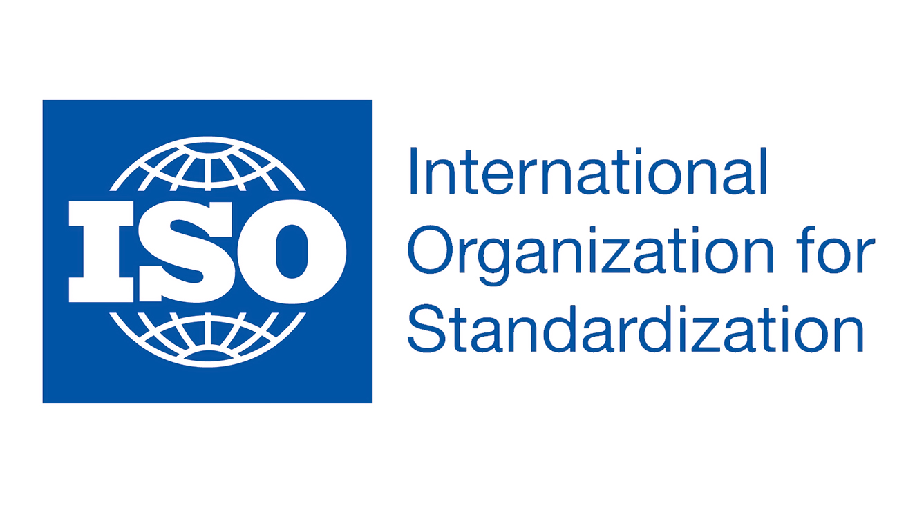

ความก้าวหน้าของเทคโนโลยีสารสนเทศที่เพิ่มมากขึ้น ส่งผลให้ความต้องการในการดูแลความมั่นคงปลอดภัยของ สารสนเทศเพิ่มสูงขึ้นด้วย องค์กรต่างๆ ทั้งภาครัฐและภาคเอกชนต่างก็ให้ความส าคัญอย่างมากต่อการพัฒนาระบบเพื่อ การดูแลรักษาความมั่นคงปลอดภัยของสารสนเทศขององค์กร มีการพัฒนามาตรฐานเกี่ยวกับการดูแลรักษาความมั่นคง ปลอดภัยสารสนเทศออกมาอย่างต่อเนื่อง เพื่อป้องกันความเสียหายที่จะเกิดขึ้นจากภัยคุกคามในรูปแบบต่างๆ ที่มีต่อ ระบบสารสนเทศขององค์กร ซึ่งนับวันจะทวีความรุนแรง และท้าทายต่อผู้บริหารองค์กรที่รับผิดชอบในการดูแลระบบเป็น อย่างมาก 

มาตรฐาน ISO/IEC27001 เป็นมาตรฐานที่พัฒนาขึ้นโดย ISO (International Organization for Standardization) โดย เป็นข้อกำหนดสำหรับการพัฒนาระบบบริหารความมั่นคงปลอดภัยสารสนเทศ (Information security management system, ITSM) เพื่อสร้างความมั่นใจถึงความมีประสิทธิผลและประสิทธิภาพของความมั่นคงปลอดภัยสารสนเทศของ องค์กร รวมถึงการด าเนินการที่สอดคล้องตามข้อกำหนดด้านระบบความมั่นคงปลอดภัยทั้งของลูกค้า ข้อกฏหมาย และ ระเบียบข้อบังคับต่างๆ ที่เกี่ยวข้องด้วย

นอกจากมาตรฐาน ISO/IEC 27001 แล้ว ยังได้มีการพัฒนามาตรฐานขึ้นมาอีกฉบับหนึ่งคือมาตรฐาน ISO/IEC 17799 (Information technology –Security techniques – Code of practices for information security management) ซึ่ง เป็นมาตรฐานที่ระบุถึงแนวปฏิบัติส าหรับการประเมินและจัดการความเสี่ยง รวมถึงแนวทางในการควบคุม ตามมาตรฐาน ISO/IEC 27001 โดยล่าสุดได้ออกมาเป็นรุ่นที่ 2 (Version 2) แล้วในปี 2005 (ปีเดียวกับมาตรฐาน ISO/IEC 27001)

ข้อกำหนดของมาตรฐาน ISO/IEC 27001 ได้แบ่งเนื้อหาของข้อกำหนดออกเป็น 2 ส่วนประกอบด้วย ส่วนของการบริหาร จัดการระบบความมั่นคงปลอดภัยสารสนเทศ และส่วนของรายการควบคุม และวัตถุประสงค์ของการควบคุม

> ส่วนที่ 1 ระบบบริหารจัดการความปลอดภัยสำหรับสารสนเทศ

### ข้อกำหนดทั่วไป

องค์กรจะต้องกำหนด ลงมือปฎิบัติ ดำเนินการ เฝ้าระวัง ทบทวน บำรุงรักษาและปรับปรุงระบบบริหารจัดการความมั่นคงปลอดภัย ตามที่ได้กำหนดไว้เป็นลายลักษณ์อักษร ภายในกรอบกิจกรรมการดำเนินการทางธุรกิจต่างๆ รวมทั้งความเสี่ยงที่เกี่ยวข้อง  แนวทางที่ใช้ในมาตรฐานฉบับนี้จะใช้กระบวนการ Plan-Do-Check-Act หรือ P-D-C-A มาประยุกต์ใช้

> ภาพที่ 2 แผนภาพแสดงวงจรการบริหารจัดการความมั่นคงปลอดภัยตามขั้นตอน Plan-Do-Check-Act  

จากภาพที่ 2 แสดงให้เห็นถึงแบบจำลองขั้นตอนการทำงานของระบบ ISMS ที่ตรงตามความต้องการของกลุ่มองค์กร รวมถึงระบบการปฎิบัติงานต่างๆ ที่เกิดขึ้นทำให้ระบบการรักษาความปลอดภัยข้อมูลตรงตามความต้องการและความคาดหมายได้   ซึ่งแต่ละขั้นตอนประกอบด้วยรายละเอียดโดยย่อดังต่อไปนี้ 

1.  Plan คือการวางแผน/กำหนดนโยบายความมั่นคงและจัดทำระบบ ISMS 
2.  Do คือการลงมือปฎิบัติหรือดำเนินการตามระบบ ISMS 
3.  Check คือการตรวจสอบและทบทวนผลการดำเนินการตามระบบ ISMS และ 
4.  Act คือ การแก้ไขปรับปรุง/บำรุงรักษาหรือปรับปรุงคุณภาพของระบบ ISMS

### กำหนดและบริหารจัดการ ระบบบริหารจัดการความมั่นคงปลอดภัย

1. กำหนดระบบบริหารจัดการความมั่นคงปลอดภัย (Plan) โดยองค์กรควรกำหนดขอบเขตของระบบบริหารจัดการความมั่นคงปลอดภัยและกำหนดนโยบายความมั่นคงปลอดภัย โดยพิจารณาถึงลักษณะของธุรกิจ องค์กร สถานที่ตั้ง ทรัพย์สิน และเทคโนโลยี นอกจากนี้ ยังต้องกำหนดวิธีการประเมินความเสี่ยงที่เป็นรูปธรรมขององค์กร ระบบความเสี่ยง วิเคราะห์และประเมินความเสี่ยง ระบุและประเมินทางเลือกในการจัดการกับความเสี่ยงการดำเนินการที่เป็นไปได้ เลือกวัตถุประสงค์และมาตรการทางด้านความปลอดภัยเพื่อจัดการกับความเสี่ยง ขออนุมัติและความเห็นชอบสำหรับความเสี่ยงที่ยังหลงเหลืออยู่ในระบบบริหารจัดการความมั่นคงปลอดภัย ขอการอนุมัติเพื่อลงมือปฎิบัติและดำเนินการ และสุดท้ายคือ จัดทำเอกสาร SoA (Statement of Applicability) แสดงการใช้งานมาตรฐานตามที่แสดงไวในส่วนของมาตรฐานการรักษาความมั่นคงปลอดภัยในการประกอบธุรกรรมทางด้านอิเล็กทรอนิกส์  
2. ลงมือปฎิบัติและดำเนินการระบบบริหารจัดการความมั่นคงปลอดภัย (Do) โดยองค์กรควรจัดทำแผนการจัดการความเสี่ยง ลงมือปฎิบัติตามแผนการจัดการความเสี่ยงและตามมาตรฐานที่เลือกไว้ กำหนดวิธีการในการวัดความสัมฤทธิ์ผลของมาตรการที่เลือกมาใช้งาน จัดทำและลงมือปฎิบัติตามแผนการอบรมและสร้างความตระหนัด บริหารจัดการดำเนินงานและบริหารทรัพยากรสำหรับระบบบริหารจัดการความมั่นคงปลอดภัย รวมถึงจัดทำและลงมือปฎิบัติตามขั้นตอนปฎิบัติและมาตรการอื่นๆ ซึ่งช่วยในการตรวจจับและรับมือกับเหตุการณ์ทางด้านความมั่นคงปลอดภัย
3. เฝ้าระวังและทบทวนระบบบริหารจัดการความมั่นคงปลอดภัย (Check) โดยองค์กรควรลงมือปฎิบัติตามขั้นตอนปฎิบัติและมาตรการอื่นๆ สำหรับการเฝ้าระวังและทบทวน ดำเนินการทบทวนความสัมฤทธิ์ผลของระบบบริหารจัดการความมั่นคงปลอดภัยอย่างสม่ำเสมอ วัดความสัมฤทธิ์ผลของมาตรการทางด้านความมั่นคงปลอดภัย ทบทวนผลการประเมินความเสี่ยงตามรอบระยะเวลาที่กำหนดไว้กับระดับความเสี่ยงที่เหลืออยู่และระดับความเสี่ยงที่ยอมรับได้ ดำเนินการตรวจสอบและทบทวนระบบบริหารจัดการความมั่นคงปลอดภัย ปรับปรุงแผนทางด้านความปลอดภัยโดยนำผลของการเฝ้าระวังและทบทวนกิจกรรมต่างๆ มาพิจารณาร่วมด้วย และบันทึกการดำเนินการซึ่งอาจมีผลกระทบต่อความสัมฤทธิ์ผลหรือประสิทธิภาพของระบบบริหารจัดการความมั่นคงปลอดภัย  
4. บำรุงรักษาและปรับปรุงระบบบริหารจัดการด้านความมั่นคงปลอดภัย (Act) โดยองค์กรควรปรับปรุงระบบบริหารจัดการความมั่นคงปลอดภัยตามที่ระบุไว้ รวมถึงการใช้มาตรการเชิงแก้ไข ป้องกัน และใช้บทเรียนจากประสบการณ์ทางด้านความมั่นคงปลอดภัยขององค์กรเองและองค์กรอื่น แจ้งการปรับปรุงและดำเนินการให้แก่ทุกหน่วยงานที่เกี่ยวข้อง และตรวจสอบว่าการปรับปรุงที่ทำไปแล้วนั้นบรรลุตามวัตถุประสงค์ที่กำหนดไว้หรือไม่

### ข้อกำหนดทางด้านการจัดทำเอกสาร

1. ความต้องการทั่วไป เอกสารที่จำเป็นต้องจัดทำจะรวมถึงบันทึกแสดงการตัดสินใจของผู้บริหาร ได้แก่  นโยบายความมั่นคงปลอดภัย ขอบเขตของระบบบริหารจัดการความมั่นคงปลอดภัย วิธีการประเมินความเสี่ยง เป็นต้น  
2. การบริหารจัดการเอกสาร ซึ่งเอกสารตามข้อกำหนดของระบบบริหารจัดการความมั่นคงปลอดภัยจะต้องได้รับการป้องกันและควบคุม ขั้นตอนการปฎิบัติที่เกี่ยวข้องกับการจัดการเอกสาร ได้แก่ อนุมัติการใช้งานเอกสารก่อนที่จะเผยแพร่ ทบทวน ปรับปรุงและอนุมัติเอกสารตามความจำเป็น ระบุการเปลี่ยนแปลงและสภานภาพของเอกสารปัจจุบัน เป็นต้น  
3. การบริหารจัดการบันทึกข้อมูลหรือฟอร์มต่างๆ องค์กรจะต้องมีการกำหนด จัดทำและบำรุงรักษาบันทึกข้อมูลหรือฟอร์ต่างๆ เพื่อใช้เป็นหลักฐานแสดงความสอดคล้องกับข้อกำหนดและการดำเนินการที่มีประสิทธิภาพของระบบบริหารจัดการความมั่นคงปลอดภัย
   
## 2. หน้าที่ความรับผิดชอบของผู้บริหาร

1. การให้ความสำคัญในการบริหารจัดการ โดยผู้บริหารจะต้องแสดงถึงการให้ความสำคัญต่อการกำหนดการลงมือปฎิบัติการ ดำเนินการ เฝ้าระวัง การทบทวน การบำรุงรักษาและการปรับปรุงระบบบริหารจัดการความมั่นคงปลอดภัย  
2. การบริหารจัดการทรัพยากรที่จำเป็นและการอบรม การสร้างความตระหนัก และการเพิ่มขีดความสามารถเพื่อให้บุคลากรทั้งหมด ที่ได้รับมอบหมายหน้าที่ สามารถปฎิบัติงานได้ตามที่กำหนดไว้ในนโยบายความมั่นคงปลอดภัย
 
## 3. การตรวจสอบภายในระบบบริหารจัดการความมั่นคงปลอดภัย 

องค์กรควรดำเนินการตรวจสอบภายในตามรอบระยะเวลาที่กำหนดไว้เพื่อตรวจสอบว่า วัตถุประสงค์ มาตรการ กระบวนการ และขั้นตอนปฎิบัติของระบบบริหารจัดการความมั่นคงปลอดภัยมีความสอดคล้องกับข้อกำหนดในมาตรฐานฉบับนี้และกฎหมาย ระเบียบ ข้อบังคับต่างๆ รวมถึงสอดคล้องกับข้อกำหนดด้านความมั่นคงปลอดภัย และได้รับการลงมือปฎิบัติและบำรุงรักษาอย่างสัมฤทธิ์ผลและเป็นไปตามที่คาดหมายไว้ นอกจากนี้ องค์กรจะต้องวางแผนตรวจสอบภายในโดยพิจารณาถึงสถานาพและความสำคัญของกระบวนการและส่วนต่างๆ ที่จะได้รับการตรวจสอบและผลการตรวจสอบในครั้งที่ผ่านมา รวมถึงองค์กรจะต้องระบุหน้าที่ความรับผิดชอบและข้อกำหนดต่างๆ ในการวางแผนและดำเนินการตรวจสอบ จัดทำรายงานผลการตรวจสอบและบันทึกข้อมูลของการตรวจสอบนั้น

## 4. การทบทวนระบบบริหารจัดการความมั่นคงปลอดภัยโดยผู้บริหาร 

ผู้บริหารจะต้องทบทวนระบบบริหารจัดการความมั่นคงปลอดภัยตามรอบระยะเวลาที่กำหนดไว้ (เช่นปีละ 1 ครั้ง) เพื่อให้มีการดำเนินการที่เหมาะสม พอเพียงและสัมฤทธิ์ผล การทบทวนจะต้องรวมถึงการปรับปรุงหรือเปลี่ยนแปลงระบบบริหารจัดการความมั่นคงปลอดภัย ซึ่งหมายรวมถึงนโยบายความมั่นคงปลอดภัยและวัตถุประสงค์ทางด้านความปลอดภัย ผลของการทบทวนจะต้องได้รับการบันทึกไว้อย่างเป็นลายลักษณ์อักษรแ

1. **นโยบายความมั่นคงปลอดภัย (Security policy)** ประกอบด้วยนโยบายความมั่นคงปลอดภัยสำหรับสารสนเทศ ซึ่งมีวัตถุประสงค์เพื่อกำหนดทิศทางและให้การสนับสนุนการดำเนินการด้านความมั่นคงปลอดภัยสำหรับสารสนเทศขององค์กร เพื่อให้เป็นไปตามหรือสอดคล้องกับข้อกำหนดทางธุรกิจ กฎหมายและระเบียบปฎิบัติที่เกี่ยวข้อง โดยผู้บริหารองค์กรจะต้องมีการจัดทำนโยบายที่เป็นลายลักษณ์อักษร รวมถึงการทบทวนนโยบายตามระยะเวลาที่กำหนดหรือมีการเปลี่ยนแปลงที่สำคัญขององค์กร  
2. **โครงสร้างด้านความมั่นคงปลอดภัยสำหรับองค์กร (Internal organization)** โดยได้กล่าวถึงบทบาทของผู้บริหารองค์กรและหัวหน้างานสารสนเทศ ในด้านต่างๆ ดังต่อไปนี้
    - โครงสร้างทางด้านความมั่นคงปลอดภัยภายในองค์กร เพื่อบริหารและจัดการความมั่นคงปลอดภัยสำหรับสารสนเทศขององค์กร  
    - โครงสร้างทางด้านความมั่นคงปลอดภัยที่เกี่ยวข้องกับลูกค้าหรือหน่วยงานภายนอก เพื่อบริหารจัดการความมั่นคงปลอดภัย สำหรับสารสนเทศและอุปกรณ์ประมวลผลสารสนเทศ ขององค์กรที่ถูกเข้าถึง ถูกประมวลผล หรือถูกใช้ในการติดต่อสื่อสารกับลูกค้าหรือหน่วยงานภายนอก

3. **การบริหารจัดการทรัพย์สินขององค์กร (Asset management)** โดยได้กล่าวถึงบทบาทของหัวหน้างานสารสนเทศและหัวหน้างานพัสดุในด้านต่างๆ ดังต่อไปนี้
    - หน้าที่ความรับผิดชอบต่อทรัพย์สินขององค์กร เพื่อป้องกันทรัพย์สินขององค์กรจากความเสียหายที่อาจขึ้นได้
    - การจัดหมวดหมู่สารสนเทศ เพื่อกำหนดระดับของการป้องกันสารสนเทศขององค์กรอย่างเหมาะสม

4. **ความมั่นคงปลอดภัยที่เกี่ยวข้องกับบุคลากร (Human resources security)** โดยได้กล่าวถึงบทบาทของผู้บริหารสารสนเทศ หัวหน้างานสารสนเทศ หัวหน้างานบุคคลและหัวหน้างานที่เกี่ยวข้องในต่างๆ ดังต่อไปนี้
    - การสร้างความมั่นคงปลอดภัยก่อนการจ้างงาน เพื่อให้พนักงานและผู้เกี่ยวข้องจากหน่วยงานภายนอก เข้าใจถึงบทบาทและหน้าที่ความรับผิดชอบของตน และเพื่อลดความเสี่ยงอันเกิดจากการขโมย การฉ้อโกง และการใช้อุปกรณ์ผิดวัตถุประสงค์  
    - การสร้างความมั่นคงปลอดภัยในระหว่างการจ้างงาน เพื่อให้พนักงานและผู้เกี่ยวข้องจากหน่วยงานภายนอก ได้ตระหนักถึงภัยคุกคามและปัญหาที่เกี่ยวข้องกับความมั่นคงปลอดภัย หน้าที่ความรับผิดชอบและทำความเข้าใจกับนโยบาย เพื่อลดความเสี่ยงอันเกิดจากความผิดพลาดในการปฎิบัติหน้าที่  
    - การสิ้นสุดและการเปลี่ยนการจ้างงาน เพื่อให้พนักงานและผู้เกี่ยวข้องจากหน่วยงานภายนอกได้ทราบถึงหน้าที่ความรับผิดชอบและบทบาทของตน เมื่อสิ้นสุดการจ้างงานหรือมีการเปลี่ยนการจ้างงาน

5. **การสร้างความมั่นคงปลอดภัยทางกายภาพและสิ่งแวดล้อม (Physical and environmental security)** โดยได้กล่าวถึงบทบาทของหัวหน้างานสารสนเทศและหัวหน้างานอาคารในด้านต่างๆ ดังต่อไปนี้
    - บริเวณที่ต้องมีการรักษาความมั่นคงปลอดภัย เพื่อป้องกัยการเข้าถึงทางกายภาพโดยไม่ได้รับอนุญาต การก่อให้เกิดความเสียหาย และการก่อกวนหรือแทรกแซงต่อทรัพย์สินสารสนเทศขององค์กร  
    - ความมั่นคงปลอดภัยของอุปกรณ์ เพื่อป้องกันการสูญหาย การเกิดความเสียหาย การถูกขโมย หรือการถูกเปิดเผยโดยไม่ได้รับอนุญาตของทรัพย์สินขององค์กร และทำให้กิจกรรมการดำเนินงานต่างๆ ขององค์กรเกิดการติดขัดหรือหยุดชะงัก  
  
6. **การบริหารจัดการด้านการสื่อสารและการดำเนินงานของเครือข่ายสารสนเทศขององค์กร (Communications and operations management)** โดยได้กล่าวถึงบทบาทของผู้บริหารองค์กร ผู้บริหารสารสนเทศ หัวหน้างานสารสนเทศ ผู้ที่เป็นเจ้าของกระบวนการทางธุรกิจและพนักงานสารสนเทศในด้านต่างๆ ดังต่อไปนี้
    - การกำหนดหน้าที่ความรับผิดชอบและขั้นตอนการปฎิบัติงาน เพื่อให้การดำเนินงานที่เกี่ยวข้องกับอุปกรณ์ประมวลผลสารสนเทศเป็นไปอย่างถูกต้องและปลอดภัย
    - การบริหารจัดการการให้บริการของหน่วยงานภายนอก เพื่อจัดทำและรักษาระดับความมั่นคงปลอดภัยของการปฎิบัติหน้าที่โดยหน่วยงานภายนอกให้เป็นไปตามข้อตกลงที่จัดทำไว้ระหว่างองค์กรกับหน่วยงานภายนอก
    - การวางแผนและการตรวจรับทรัพยากรสารสนเทศ เพื่อลดความเสี่ยงจากความล้มเหลวของระบบ
    - การป้องกันโปรแกรมที่ไม่ประสงค์ดี เพื่อรักษาซอฟต์แวร์และสารสนเทศให้ปลอดภัยจากการถูกทำลายโดยซอฟต์แวร์ที่ไม่ประสงค์ดี
    - การสำรองข้อมูล เพื่อรักษาความถูกต้องสมบูรณ์และความพร้อมใช้ของสารสนเทศและอุปกรณ์ประมวลผลสารสนเทศ
    - การบริหารจัดการทางด้านความปลอดภัยสำหรับเครือข่ายขององค์กร เพื่อป้องกันสารสนเทศบนเครือข่ายและโครงสร้างพื้นฐานที่สนับสนุนการทำงานของเครือข่าย
    - การจัดการสื่อที่ใช้ในการบันทึกข้อมูล เพื่อป้องกันการเปิดเผย การเปลี่ยนแปลงแก้ไข การลบหรือทำลายทรัพย์สินสารสนเทศโดยไม่ได้รับอนุญาต และการติดขัดหรือหยุดชะงักทางธุรกิจ
    - การแลกเปลี่ยนสารสนเทศ เพื่อรักษาความมั่นคงปลอดภัยของสารสนเทศและซอฟต์แวร์ที่มีการแลกเปลี่ยนกันภายในองค์กร และที่มีการแลกเปลี่ยนกับหน่วยงานภายนอก
    - การสร้างความมั่นคงปลอดภัยสำหรับบริการพาณิชย์อิเล็กทรอนิกส์ เพื่อสร้างความมั่นคงปลอดภัยสำหรับบริการพาณิชย์อิเล็กทรอนิกส์และในการใช้งาน
    - การเฝ้าระวังทางด้านความมั่นคงปลอดภัย เพื่อตรวจจับกิจจกรรมการประมวลผลสารสนเทศที่ไม่ได้รับอนุญาต

7. **การควบคุมการเข้าถึง (Access control)** โดยได้กล่าวถึงบทบาทของผู้บริหารสารสนเทศ หัวหน้างานสารสนเทศ ผู้ดูแลระบบและพนักงานในด้านต่างๆ ดังต่อไปนี้

    - ข้อกำหนดทางธุรกิจสำหรับการควบคุมการเข้าถึงสารสนเทศ เพื่อควบคุมการเข้าถึงสารสนเทศ
    - การบริหารจัดการการเข้าถึงของผู้ใช้ เพื่อควบคุมการเข้าถึงระบบสารสนเทศเฉพาะผู้ที่ได้รับอนุญาตแล้วและป้องกันการเข้าถึงโดยไม่ได้รับอนุญาต
    - หน้าที่ความรับผิดชอบของผู้ใช้งาน เพื่อป้องกันการเข้าถึงโดยไม่ได้รับอนุญาต การเปิดเผยหรือการขโมยสารสนเทศและอุปกรณ์ประมวลผลสารสนเทศ
    - การควบคุมการเข้าถึงเครือข่ายที่ไม่ได้รับอนุญาต
    - การควบคุมการเข้าถึงระบบปฎิบัติการที่ไม่ได้รับอนุญาต
    - การควบคุมการเข้าถึง Application และสารสนเทศที่ไม่ได้รับอนุญาต
    - การควบคุมอุปกรณ์สื่อสารประเภทพกพาและการปฎิบัติงานจากภายนอกเพื่อสร้างความมั่นคงปลอดภัยให้กับอุปกรณ์และการปฎิบัติงานที่เกี่ยวข้อง

8. **การจัดหา การพัฒนาและการบำรุงรักษาระบบสารสนเทศ (Information systems acquisition, development and maintenance)** โดยได้กล่าวถึงบทบาทของหัวหน้างานสารสนเทศ ผู้พัฒนาระบบ และผู้เป็นเจ้าของระบบในด้านต่างๆ ดังต่อไปนี้
    - ข้อกำหนดด้านความมั่นคงปลอดภัยสำหรับระบบสารสนเทศ เพื่อให้การจัดหาและพัฒนาระบบสารสนเทศ ได้พิจารณาถึงประเด็นทางด้านความมั่นคงปลอดภัยเป็นองค์ประกอบพื้นฐานที่สำคัญ
    - การประมวลผลสารสนเทศใน Application เพื่อป้องกันความผิดพลาดในสารสนเทศ การสูญหายของสารสนเทศ การเปล่ยนแปลงสารสนเทศโดยไม่ได้รับอนุญาต หรือการใช้งานสารสนเทศผิดวัตถุประสงค์
    - มาตรการการเข้ารหัสข้อมูล เพื่อรักษาความลับของข้อมูล ยืนยันตัวตนของผู้ส่งข้อมล หรือรักษาความถูกต้องสมบูรณ์ของข้อมูล โดยใช้วิธีการทางการเข้ารหัสข้อมูล
    - การสร้างความมั่นคงปลอดภัยให้กับไฟล์ของระบบที่ให้บริการ
    - การสร้างความมั่นคงปลอดภัยสำหรับกระบวนการในการพัฒนาระบบและกระบวนการสนับสนุน เพื่อรักษาความมั่นคงปลอดภัยสำหรับซอฟต์แวร์และสารสนเทศของระบบ
    - การบริหารจัดการช่องโหว่ในฮาร์ดแวร์และซอฟต์แวร์ เพื่อลดความเสี่ยงจากการโจมตีโดยอาศัยช่องโหว่ทางเทคนิคที่มีการเผยแพร่หรือตีพิมพ์ในสถานที่ต่างๆ

9. **การบริหารจัดการเหตุการณ์ที่เกี่ยวข้องกับความมั่นคงปลอดภัยขององค์กร (Information security incident management)** โดยได้กล่าวถึงบทบาทของหัวหน้างานสารสนเทศ หัวหน้างานนิติกร ผู้ดูแลระบบและพนักงานในด้านต่างๆ ดังต่อไปนี้
    - การรายงานเหตุการณ์และจุดอ่อนที่เกี่ยวข้องกับความมั่นคงปลอดภัย เพื่อให้เหตุการณ์และจุดอ่อนที่เกี่ยวข้องกับความมั่นคงปลอดภัย ของระบบสารสนเทศขององค์กรได้รับการดำเนินการที่ถูกต้องในช่วงระยะเวลาที่เหมาะสม
    - การบริหารจัดการและการปรับปรุงแก้ไขต่อเหตุการณ์ที่เกี่ยวข้องกับความมั่นคงปลอดภัย เพื่อให้มีวิธีการที่สอดคล้อง และได้ผลในการบริหารจัดการเหตุการณ์ที่เกี่ยวข้อง กับความมั่นคงปลอดภัยสำหรับสารสนเทศขององค์กร และบันทึกข้อมูลที่เกี่ยวข้องกับการทบทวนจะต้องได้รับการบำรุงรักษาไว้

> **ส่วนที่ 2 มาตรการการจัดการด้านความมั่นคงปลอดภัยสำหรับสารสนเทศ** (อ้างอิงมาตรฐาน ISO/IEC 27001 Annex A และศึกษารายละเอียดวิธีปฎิบัติทางเทคนิคจาก ISO/IEC 17799:2005)

1. **การบริหารความต่อเนื่องในการดำเนินงานขององค์กร (Business continuity management)** โดยได้กล่าวถึงบทบาทของผู้บริหารสารสนเทศ และหัวหน้างานสารสนเทศ ที่เกี่ยวกับหัวข้อพื้นฐานสำหรับการบริหารความต่อเนื่องในการดำเนินงานขององค์กร เพื่อป้องกันการติดขัดหรือการหยุดชะงักของกิจกรรมต่างๆ ทางธุรกิจเพื่อป้องกันกระบวนการทางธุรกิจที่สำคัญอันเป็นผลมาจากการล้มเหลวหรือหายนะที่มีต่อระบบสารสนเทศ และเพื่อให้สามารถกู้ระบบกลับคืนมาได้ภายในระยะเวลาที่เหมาะสม
2. **การปฎิบัติตามข้อกำหนด (Compliance)** โดยได้กล่าวถึงบทบาทของหัวหน้างานสารสนเทศและหัวหน้างานนิติกร  ในด้านต่างๆ ดังต่อไปนี้
    - การปฏิบัติตามข้อกำหนดทางกฎหมาย เพื่อหลีกเลี่ยงการละเมิดข้อกำหนดทางกฎหมาย ระเบียบปฏิบัติ ข้อกำหนดในสัญญา และข้อกำหนดทางด้านความมั่นคงปลอดภัยอื่นๆ
    - การปฎิบัติตามนโยบาย มาตรฐานความปลอดภัยและข้อกำหนดทางเทคนิค เพื่อให้ระบบเป็นตามนโยบายและมาตรฐานความมั่นคงปลอดภัยตามที่องค์กรกำหนดไว้
    - การตรวจประเมินระบบสารสนเทศ เพื่อตรวจประเมินระบบสารสนเทศให้ได้ประสิทธิภาพสูงสุดและมีการแทรกแซงหรือทำให้หยุดชะงักต่อกระบวนการทางธุรกิจน้อยที่สุด

> Reference : http://prowcharinrat.blogspot.com/2016/05/iso-27001.html