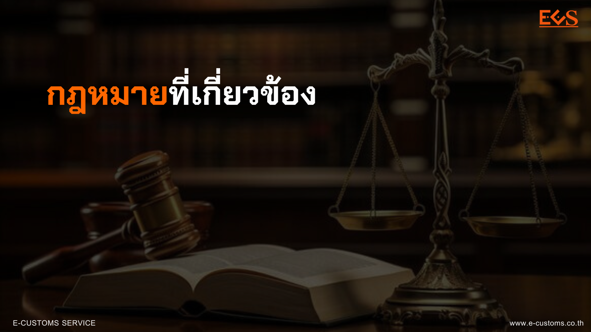

+++
# Hero widget.
widget = "blank"  # See https://sourcethemes.com/academic/docs/page-builder/
headless = false  # This file represents a page section.
active = true  # Activate this widget? true/false
weight = 10  # Order that this section will appear.
title = "กฎหมายที่เกี่ยวข้อง"
+++

## กฎหมายการกระทำความผิดเกี่ยวกับคอมพิวเตอร์  



- พระราชบัญญัติการกระทำความผิดทางคอมพิวเตอร์ พ.ศ. 2550 [(ดาวน์โหลด)](../law/com-act-2550/)
- พระราชบัญญัติว่าด้วยการกระทำความผิดเกี่ยวกับคอมพิวเตอร์ (ฉบับที่ 2) พ.ศ. 2560 [(ดาวน์โหลด)](../law/com-2-act-2560/)




- ประกาศกระทรวงดิจิทัลเพื่อเศรษฐกิจและสังคม เรื่อง ลักษณะและวิธีการส่ง และลักษณะและปริมาณของข้อมูลความถี่และวิธีการส่ง ซึ่งไม่ก่อให้เกิดความเดือดร้อนรำคาญแก่ผู้รับ พ.ศ. 2560 [(ดาวน์โหลด)](../law/computer/2560-01/)

- ประกาศกระทรวงดิจิทัลเพื่อเศรษฐกิจและสังคม เรื่อง หลักเกณฑ์การเก็บรักษาข้อมูลจราจรทางคอมพิวเตอร์ของผู้ให้บริการ พ.ศ. 2564 [(ดาวน์โหลด)](../law/computer-traffic-2564/)




## กฎหมายธุรกรรมทางอิเล็กทรอนิกส์



- พระราชบัญญัติว่าด้วยธุรกรรมทางอิเล็กทรอนิกส์ พ.ศ. 2544 [(ดาวน์โหลด)](../law/eta-act-2544/)
- พระราชบัญญัติว่าด้วยธุรกรรมทางอิเล็กทรอนิกส์ (ฉบับที่ 2) พ.ศ. 2551 [(ดาวน์โหลด)](../law/eta-2-act-2551/)
- พระราชบัญญัติว่าด้วยธุรกรรมทางอิเล็กทรอนิกส์ (ฉบับที่ 3) พ.ศ. 2562 [(ดาวน์โหลด)](../law/eta-3-act-2562/)
- พระราชบัญญัติว่าด้วยธุรกรรมทางอิเล็กทรอนิกส์ (ฉบับที่ 4) พ.ศ. 2562 [(ดาวน์โหลด)](../law/eta-4-act-2562/)
- พระราชบัญญัติ การรักษาความมั่นคงปลอดภัยไซเบอร์ พ.ศ. 2562 [(ดาวน์โหลด)](../law/cyber-act-2562/)




- พระราชกฤษฎีกาว่าด้วยวิธีการแบบปลอดภัยในการทำธุรกรรมทางอิเล็กทรอนิกส์ พ.ศ. 2553 [(ดาวน์โหลด)](../law/safe-act-2553/)





- ประกาศคณะกรรมการธุรกรรมทางอิเล็กทรอนิกส์ เรื่อง แนวทางการใช้บริการคลาวด์ พ.ศ. 2562 [(ดาวน์โหลด)](../law/cloud-2562/)
- ประกาศคณะกรรมการธุรกรรมทางอิเล็กทรอนิกส์ เรื่อง มาตรฐานการรักษาความมั่นคงปลอดภัยของระบบสารสนเทศตามวิธีการแบบปลอดภัย พ.ศ. 2555 [(ดาวน์โหลด)](../law/safe-act-2555/)
- ประกาศคณะกรรมการธุรกรรมทางอิเล็กทรอนิกส์ เรื่อง ประเภทของธุรกรรมทางอิเล็กทรอนิกส์ และหลักเกณฑ์การประเมินระดับผลกระทบของธุรกรรมทางอิเล็กทรอนิกส์ตามวิธีการแบบปลอดภัย พ.ศ. 2555 [(ดาวน์โหลด)](../law/safe-act-2555-2/)
- ประกาศ กมช. เรื่อง การกำหนดหลักเกณฑ์ ลักษณะหน่วยงานที่มีภารกิจหรือให้บริการเป็นหน่วยงานโครงสร้างพื้นฐานสำคัญทางสารสนเทศ และการมอบหมายการควบคุมและกำกับดูแล พ.ศ. 2564 [(ดาวน์โหลด)](http://www.ratchakitcha.soc.go.th/DATA/PDF/2564/E/194/T_0014.PDF)





## กฎหมายคุ้มครองข้อมูลส่วนบุคคล



* พระราชบัญญัติคุ้มครองข้อมูลส่วนบุคคล พ.ศ. 2562 [(ดาวน์โหลด)](../law/personal-act-2562/)




* พระราชกฤษฎีกากำหนดลักษณะ กิจการ หรือหน่วยงาน ที่ได้รับการยกเว้นไม่ให้นำพระราชบัญญัติคุ้มครองข้อมูลส่วนบุคคล พ.ศ. 2562 บางส่วนมาใช้บังคับ [(ดาวน์โหลด)](../law/pdpa-decree-2562/)




* ประกาศกระทรวงดิจิทัลเพื่อเศรษฐกิจและสังคม เรื่อง มาตรฐานการรักษาความมั่นคงปลอดภัยของข้อมูลส่วนบุคคล พ.ศ. 2563 [(ดาวน์โหลด)](../law/pdpa-2563/)
* ประกาศกระทรวงดิจิทัลเพื่อเศรษฐกิจและสังคม เรื่อง มาตรฐานการรักษาความมั่นคงปลอดภัยของข้อมูลส่วนบุคคล (ฉบับที่ 2) พ.ศ. 2564 [(ดาวน์โหลด)](../law/pdpa-2564/)
-------
* ประกาศคณะกรรมการคุ้มครองข้อมูลส่วนบุคคล เรื่อง การยกเว้นการบันทึกรายการของผู้ควบคุมข้อมูลส่วนบุคคลซึ่งเป็นกิจการขนาดเล็ก พ.ศ. 2565 [(ดาวน์โหลด)](../law/pdpa-2565-01/)
* ประกาศคณะกรรมการคุ้มครองข้อมูลส่วนบุคคล เรื่อง หลักเกณฑ์และวิธีการในการจัดทำและเก็บรักษาบันทึกรายการของกิจกรรมการประมวลผลข้อมูลส่วนบุคคลสำหรับผู้ประมวลผลข้อมูลส่วนบุคคล พ.ศ. 2565 [(ดาวน์โหลด)](../law/pdpa-2565-02/)
* ประกาศคณะกรรมการคุ้มครองข้อมูลส่วนบุคคล เรื่อง มาตรการรักษาความมั่นคงปลอดภัยของผู้ควบคุมข้อมูลส่วนบุคคล พ.ศ. 2565 [(ดาวน์โหลด)](../law/pdpa-2565-03/)
* ประกาศคณะกรรมการคุ้มครองข้อมูลส่วนบุคคล เรื่อง หลักเกณฑ์การพิจารณาออกคำสั่งลงโทษปรับทางปกครองของคณะกรรมการผู้เชี่ยวชาญ พ.ศ. 2565 [(ดาวน์โหลด)](../law/pdpa-2565-04/)
* ประกาศคณะกรรมการคุ้มครองข้อมูลส่วนบุคคล เรื่อง หลักเกณฑ์และวิธีการในการแจ้งเหตุการละเมิดข้อมูลส่วนบุคคล พ.ศ. 2565 [(ดาวน์โหลด)](../law/pdpa-2565-05/)
-----------
* ประกาศคณะกรรมการคุ้มครองข้อมูลส่วนบุคคล เรื่อง มาตรการปกป้องที่เหมาะสมเพื่อคุ้มครองสิทธิและเสรีภาพของเจ้าของข้อมูลส่วนบุคคล สำหรับการเก็บรวบรวมข้อมูลส่วนบุคคล เพื่อให้บรรลุวัตถุประสงค์ที่เกี่ยวกับการจัดทำเอกสารประวัติศาสตร์หรือจดหมายเหตุเพื่อประโยชน์สาธารณะ พ.ศ. 2566 [(ดาวน์โหลด)](../law/pdpa-2566-01/)
* ประกาศคณะกรรมการคุ้มครองข้อมูลส่วนบุคคล เรื่อง มาตรฐานการรักษาความมั่นคงปลอดภัยของข้อมูลส่วนบุคคลของผู้ควบคุมข้อมูลส่วนบุคคลซึ่งได้รับการยกเว้นไม่ให้นำพระราชบัญญัติคุ้มครองข้อมูลส่วนบุคคล พ.ศ. 2562 มาใช้บังคับ พ.ศ. 2566 [(ดาวน์โหลด)](../law/pdpa-2566-02/)
* ประกาศคณะกรรมการคุ้มครองข้อมูลส่วนบุคคล เรื่อง หลักเกณฑ์การให้ความคุ้มครองข้อมูลส่วนบุคคลที่ส่งหรือโอนไปยังต่างประเทศตามมาตรา 28 แห่งพระราชบัญญัติคุ้มครองข้อมูลส่วนบุคคล พ.ศ. 2562 พ.ศ. 2566 [(ดาวน์โหลด)](../law/pdpa-2566-03/)
* ประกาศคณะกรรมการคุ้มครองข้อมูลส่วนบุคคล เรื่อง หลักเกณฑ์การให้ความคุ้มครองข้อมูลส่วนบุคคลที่ส่งหรือโอนไปยังต่างประเทศตามมาตรา 29 แห่งพระราชบัญญัติคุ้มครองข้อมูลส่วนบุคคล พ.ศ. 2562 พ.ศ. 2566 [(ดาวน์โหลด)](../law/pdpa-2566-04/)
* ประกาศคณะกรรมการคุ้มครองข้อมูลส่วนบุคคล เรื่อง การจัดให้มีเจ้าหน้าที่คุ้มครองข้อมูลส่วนบุคคลตามมาตรา 41 (2) แห่งพระราชบัญญัติคุ้มครองข้อมูลส่วนบุคคล พ.ศ. 2562 พ.ศ. 2566 [(ดาวน์โหลด)](../law/pdpa-2566-05/)
* ประกาศคณะกรรมการคุ้มครองข้อมูลส่วนบุคคล เรื่อง มาตรการที่เหมาะสมสำหรับการเก็บรวบรวมข้อมูลส่วนบุคคลเพื่อให้บรรลุวัตถุประสงค์ที่เกี่ยวกับการศึกษาวิจัยหรือสถิติตามมาตรา 24 (1) และการศึกษาวิจัยทางวิทยาศาสตร์ ประวัติศาสตร์ หรือสถิติ หรือประโยชน์สาธารณะอื่นตามมาตรา 26 (5) (ง) แห่งพระราชบัญญัติคุ้มครองข้อมูลส่วนบุคคล พ.ศ. 2562 พ.ศ. 2566 [(ดาวน์โหลด)](../law/pdpa-2566-06/)
* ประกาศคณะกรรมการคุ้มครองข้อมูลส่วนบุคคล เรื่อง หลักเกณฑ์เกี่ยวกับมาตรการคุ้มครองสำหรับการเก็บรวบรวมข้อมูลส่วนบุคคลเกี่ยวกับประวัติอาชญากรรมที่มิได้กระทำภายใต้การควบคุมของหน่วยงานที่มีอำนาจหน้าที่ตามกฎหมาย พ.ศ. 2566 [(ดาวน์โหลด)](../law/pdpa-2566-07/)
-----------------

* ประกาศคณะกรรมการคุ้มครองข้อมูลส่วนบุคคล เรื่อง หลักเกณฑ์การพิจารณาออกคำสั่งลงโทษปรับทางปกครองของคณะกรรมการผู้เชี่ยวชาญ (ฉบับที่ 2) พ.ศ. 2567[(ดาวน์โหลด)](../law/pdpa-2567-01/)




  - อัปเดตกฎหมายลูก PDPA ที่องค์กรควรรู้ [(ดาวน์โหลด)](../law/secondary-pdpa-regulations/)
  - สรุปสาระสำคัญพระราชบัญญัติคุ้มครองข้อมูลส่วนบุคคล พ.ศ. 2562 [(ดาวน์โหลด)](https://www.mdes.go.th/law/detail/3821-%E0%B8%AA%E0%B8%A3%E0%B8%B8%E0%B8%9B%E0%B8%AA%E0%B8%B2%E0%B8%A3%E0%B8%B0%E0%B8%AA%E0%B8%B3%E0%B8%84%E0%B8%B1%E0%B8%8D%E0%B8%9E%E0%B8%A3%E0%B8%B0%E0%B8%A3%E0%B8%B2%E0%B8%8A%E0%B8%9A%E0%B8%B1%E0%B8%8D%E0%B8%8D%E0%B8%B1%E0%B8%95%E0%B8%B4%E0%B8%84%E0%B8%B8%E0%B9%89%E0%B8%A1%E0%B8%84%E0%B8%A3%E0%B8%AD%E0%B8%87%E0%B8%82%E0%B9%89%E0%B8%AD%E0%B8%A1%E0%B8%B9%E0%B8%A5%E0%B8%AA%E0%B9%88%E0%B8%A7%E0%B8%99%E0%B8%9A%E0%B8%B8%E0%B8%84%E0%B8%84%E0%B8%A5-%E0%B8%9E-%E0%B8%A8--%E0%B9%92%E0%B9%95%E0%B9%96%E0%B9%92)
  -   แผ่นพับสาระสำคัญพระราชบัญญัติคุ้มครองข้อมูลส่วนบุคคล พ.ศ. 2562 [(ดาวน์โหลด)](https://www.mdes.go.th/law/detail/3822-%E0%B9%81%E0%B8%9C%E0%B9%88%E0%B8%99%E0%B8%9E%E0%B8%B1%E0%B8%9A%E0%B8%AA%E0%B8%B2%E0%B8%A3%E0%B8%B0%E0%B8%AA%E0%B8%B3%E0%B8%84%E0%B8%B1%E0%B8%8D%E0%B8%9E%E0%B8%A3%E0%B8%B0%E0%B8%A3%E0%B8%B2%E0%B8%8A%E0%B8%9A%E0%B8%B1%E0%B8%8D%E0%B8%8D%E0%B8%B1%E0%B8%95%E0%B8%B4%E0%B8%84%E0%B8%B8%E0%B9%89%E0%B8%A1%E0%B8%84%E0%B8%A3%E0%B8%AD%E0%B8%87%E0%B8%82%E0%B9%89%E0%B8%AD%E0%B8%A1%E0%B8%B9%E0%B8%A5%E0%B8%AA%E0%B9%88%E0%B8%A7%E0%B8%99%E0%B8%9A%E0%B8%B8%E0%B8%84%E0%B8%84%E0%B8%A5-%E0%B8%9E-%E0%B8%A8--%E0%B9%92%E0%B9%95%E0%B9%96%E0%B9%92 "แผ่นพับสาระสำคัญพระราชบัญญัติคุ้มครองข้อมูลส่วนบุคคล พ.ศ. ๒๕๖๒")    
  -  ประโยชน์พระราชบัญญัติคุ้มครองข้อมูลส่วนบุคคล พ.ศ. 2562 [(ดาวน์โหลด)](https://www.mdes.go.th/law/detail/3823-%E0%B8%9B%E0%B8%A3%E0%B8%B0%E0%B9%82%E0%B8%A2%E0%B8%8A%E0%B8%99%E0%B9%8C%E0%B8%9E%E0%B8%A3%E0%B8%B0%E0%B8%A3%E0%B8%B2%E0%B8%8A%E0%B8%9A%E0%B8%B1%E0%B8%8D%E0%B8%8D%E0%B8%B1%E0%B8%95%E0%B8%B4%E0%B8%84%E0%B8%B8%E0%B9%89%E0%B8%A1%E0%B8%84%E0%B8%A3%E0%B8%AD%E0%B8%87%E0%B8%82%E0%B9%89%E0%B8%AD%E0%B8%A1%E0%B8%B9%E0%B8%A5%E0%B8%AA%E0%B9%88%E0%B8%A7%E0%B8%99%E0%B8%9A%E0%B8%B8%E0%B8%84%E0%B8%84%E0%B8%A5-%E0%B8%9E-%E0%B8%A8--%E0%B9%92%E0%B9%95%E0%B9%96%E0%B9%92 "ประโยชน์พระราชบัญญัติคุ้มครองข้อมูลส่วนบุคคล พ.ศ. ๒๕๖๒")    
  -    สาระสำคัญพระราชบัญญัติคุ้มครองข้อมูลส่วนบุคคล พ.ศ. 2562 หัวข้อ ข้อมูลส่วนบุคคล (Personal Data) [(ดาวน์โหลด)](https://www.mdes.go.th/law/detail/3824-%E0%B8%AA%E0%B8%B2%E0%B8%A3%E0%B8%B0%E0%B8%AA%E0%B8%B3%E0%B8%84%E0%B8%B1%E0%B8%8D%E0%B8%9E%E0%B8%A3%E0%B8%B0%E0%B8%A3%E0%B8%B2%E0%B8%8A%E0%B8%9A%E0%B8%B1%E0%B8%8D%E0%B8%8D%E0%B8%B1%E0%B8%95%E0%B8%B4%E0%B8%84%E0%B8%B8%E0%B9%89%E0%B8%A1%E0%B8%84%E0%B8%A3%E0%B8%AD%E0%B8%87%E0%B8%82%E0%B9%89%E0%B8%AD%E0%B8%A1%E0%B8%B9%E0%B8%A5%E0%B8%AA%E0%B9%88%E0%B8%A7%E0%B8%99%E0%B8%9A%E0%B8%B8%E0%B8%84%E0%B8%84%E0%B8%A5-%E0%B8%9E-%E0%B8%A8--%E0%B9%92%E0%B9%95%E0%B9%96%E0%B9%92-%E0%B8%AB%E0%B8%B1%E0%B8%A7%E0%B8%82%E0%B9%89%E0%B8%AD-%E0%B8%82%E0%B9%89%E0%B8%AD%E0%B8%A1%E0%B8%B9%E0%B8%A5%E0%B8%AA%E0%B9%88%E0%B8%A7%E0%B8%99%E0%B8%9A%E0%B8%B8%E0%B8%84%E0%B8%84%E0%B8%A5--Personal-Data-)    
  -  สาระสำคัญพระราชบัญญัติคุ้มครองข้อมูลส่วนบุคคล พ.ศ. 2562 หัวข้อ การเก็บรวบรวม ใช้ หรือเปิดเผยข้อมูลส่วนบุคคล [(ดาวน์โหลด)](https://www.mdes.go.th/law/detail/3825-%E0%B8%AA%E0%B8%B2%E0%B8%A3%E0%B8%B0%E0%B8%AA%E0%B8%B3%E0%B8%84%E0%B8%B1%E0%B8%8D%E0%B8%9E%E0%B8%A3%E0%B8%B0%E0%B8%A3%E0%B8%B2%E0%B8%8A%E0%B8%9A%E0%B8%B1%E0%B8%8D%E0%B8%8D%E0%B8%B1%E0%B8%95%E0%B8%B4%E0%B8%84%E0%B8%B8%E0%B9%89%E0%B8%A1%E0%B8%84%E0%B8%A3%E0%B8%AD%E0%B8%87%E0%B8%82%E0%B9%89%E0%B8%AD%E0%B8%A1%E0%B8%B9%E0%B8%A5%E0%B8%AA%E0%B9%88%E0%B8%A7%E0%B8%99%E0%B8%9A%E0%B8%B8%E0%B8%84%E0%B8%84%E0%B8%A5-%E0%B8%9E-%E0%B8%A8--%E0%B9%92%E0%B9%95%E0%B9%96%E0%B9%92-%E0%B8%AB%E0%B8%B1%E0%B8%A7%E0%B8%82%E0%B9%89%E0%B8%AD-%E0%B8%81%E0%B8%B2%E0%B8%A3%E0%B9%80%E0%B8%81%E0%B9%87%E0%B8%9A%E0%B8%A3%E0%B8%A7%E0%B8%9A%E0%B8%A3%E0%B8%A7%E0%B8%A1-%E0%B9%83%E0%B8%8A%E0%B9%89-%E0%B8%AB%E0%B8%A3%E0%B8%B7%E0%B8%AD%E0%B9%80%E0%B8%9B%E0%B8%B4%E0%B8%94%E0%B9%80%E0%B8%9C%E0%B8%A2%E0%B8%82%E0%B9%89%E0%B8%AD%E0%B8%A1%E0%B8%B9%E0%B8%A5%E0%B8%AA%E0%B9%88%E0%B8%A7%E0%B8%99%E0%B8%9A%E0%B8%B8%E0%B8%84%E0%B8%84%E0%B8%A5)    
  -   สาระสำคัญพระราชบัญญัติคุ้มครองข้อมูลส่วนบุคคล พ.ศ.2562 หัวข้อ การเก็บรวบรวม ใช้ หรือเปิดเผยข้อมูลส่วนบุคคลที่มีความละเอียดอ่อน (Sensitive Personal Data) [(ดาวน์โหลด)](https://www.mdes.go.th/law/detail/3826-%E0%B8%AA%E0%B8%B2%E0%B8%A3%E0%B8%B0%E0%B8%AA%E0%B8%B3%E0%B8%84%E0%B8%B1%E0%B8%8D%E0%B8%9E%E0%B8%A3%E0%B8%B0%E0%B8%A3%E0%B8%B2%E0%B8%8A%E0%B8%9A%E0%B8%B1%E0%B8%8D%E0%B8%8D%E0%B8%B1%E0%B8%95%E0%B8%B4%E0%B8%84%E0%B8%B8%E0%B9%89%E0%B8%A1%E0%B8%84%E0%B8%A3%E0%B8%AD%E0%B8%87%E0%B8%82%E0%B9%89%E0%B8%AD%E0%B8%A1%E0%B8%B9%E0%B8%A5%E0%B8%AA%E0%B9%88%E0%B8%A7%E0%B8%99%E0%B8%9A%E0%B8%B8%E0%B8%84%E0%B8%84%E0%B8%A5-%E0%B8%9E-%E0%B8%A8-%E0%B9%92%E0%B9%95%E0%B9%96%E0%B9%92-%E0%B8%AB%E0%B8%B1%E0%B8%A7%E0%B8%82%E0%B9%89%E0%B8%AD-%E0%B8%81%E0%B8%B2%E0%B8%A3%E0%B9%80%E0%B8%81%E0%B9%87%E0%B8%9A%E0%B8%A3%E0%B8%A7%E0%B8%9A%E0%B8%A3%E0%B8%A7%E0%B8%A1-%E0%B9%83%E0%B8%8A%E0%B9%89-%E0%B8%AB%E0%B8%A3%E0%B8%B7%E0%B8%AD%E0%B9%80%E0%B8%9B%E0%B8%B4%E0%B8%94%E0%B9%80%E0%B8%9C%E0%B8%A2%E0%B8%82%E0%B9%89%E0%B8%AD%E0%B8%A1%E0%B8%B9%E0%B8%A5%E0%B8%AA%E0%B9%88%E0%B8%A7%E0%B8%99%E0%B8%9A%E0%B8%B8%E0%B8%84%E0%B8%84%E0%B8%A5%E0%B8%97%E0%B8%B5%E0%B9%88%E0%B8%A1%E0%B8%B5%E0%B8%84%E0%B8%A7%E0%B8%B2%E0%B8%A1%E0%B8%A5%E0%B8%B0%E0%B9%80%E0%B8%AD%E0%B8%B5%E0%B8%A2%E0%B8%94%E0%B8%AD%E0%B9%88%E0%B8%AD%E0%B8%99--Sensitive-Personal-Data-)    
  -   สาระสำคัญพระราชบัญญัติคุ้มครองข้อมูลส่วนบุคคล พ.ศ. 2562 หัวข้อ สิทธิของเจ้าของข้อมูลส่วนบุคคล (Data Subject Right) [(ดาวน์โหลด)](https://www.mdes.go.th/law/detail/3827-%E0%B8%AA%E0%B8%B2%E0%B8%A3%E0%B8%B0%E0%B8%AA%E0%B8%B3%E0%B8%84%E0%B8%B1%E0%B8%8D%E0%B8%9E%E0%B8%A3%E0%B8%B0%E0%B8%A3%E0%B8%B2%E0%B8%8A%E0%B8%9A%E0%B8%B1%E0%B8%8D%E0%B8%8D%E0%B8%B1%E0%B8%95%E0%B8%B4%E0%B8%84%E0%B8%B8%E0%B9%89%E0%B8%A1%E0%B8%84%E0%B8%A3%E0%B8%AD%E0%B8%87%E0%B8%82%E0%B9%89%E0%B8%AD%E0%B8%A1%E0%B8%B9%E0%B8%A5%E0%B8%AA%E0%B9%88%E0%B8%A7%E0%B8%99%E0%B8%9A%E0%B8%B8%E0%B8%84%E0%B8%84%E0%B8%A5-%E0%B8%9E-%E0%B8%A8--%E0%B9%92%E0%B9%95%E0%B9%96%E0%B9%92-%E0%B8%AB%E0%B8%B1%E0%B8%A7%E0%B8%82%E0%B9%89%E0%B8%AD-%E0%B8%AA%E0%B8%B4%E0%B8%97%E0%B8%98%E0%B8%B4%E0%B8%82%E0%B8%AD%E0%B8%87%E0%B9%80%E0%B8%88%E0%B9%89%E0%B8%B2%E0%B8%82%E0%B8%AD%E0%B8%87%E0%B8%82%E0%B9%89%E0%B8%AD%E0%B8%A1%E0%B8%B9%E0%B8%A5%E0%B8%AA%E0%B9%88%E0%B8%A7%E0%B8%99%E0%B8%9A%E0%B8%B8%E0%B8%84%E0%B8%84%E0%B8%A5--Data-Subject-Right-)    
  -  สาระสำคัญพระราชบัญญัติคุ้มครองข้อมูลส่วนบุคคล พ.ศ. 2562 หัวข้อ ความรับผิดและบทลงโทษ ตามพระราชบัญญัติคุ้มครองข้อมูลส่วนบุคคล พ.ศ. 2562 [(ดาวน์โหลด)](https://www.mdes.go.th/law/detail/3828-%E0%B8%AA%E0%B8%B2%E0%B8%A3%E0%B8%B0%E0%B8%AA%E0%B8%B3%E0%B8%84%E0%B8%B1%E0%B8%8D%E0%B8%9E%E0%B8%A3%E0%B8%B0%E0%B8%A3%E0%B8%B2%E0%B8%8A%E0%B8%9A%E0%B8%B1%E0%B8%8D%E0%B8%8D%E0%B8%B1%E0%B8%95%E0%B8%B4%E0%B8%84%E0%B8%B8%E0%B9%89%E0%B8%A1%E0%B8%84%E0%B8%A3%E0%B8%AD%E0%B8%87%E0%B8%82%E0%B9%89%E0%B8%AD%E0%B8%A1%E0%B8%B9%E0%B8%A5%E0%B8%AA%E0%B9%88%E0%B8%A7%E0%B8%99%E0%B8%9A%E0%B8%B8%E0%B8%84%E0%B8%84%E0%B8%A5-%E0%B8%9E-%E0%B8%A8--%E0%B9%92%E0%B9%95%E0%B9%96%E0%B9%92-%E0%B8%AB%E0%B8%B1%E0%B8%A7%E0%B8%82%E0%B9%89%E0%B8%AD-%E0%B8%84%E0%B8%A7%E0%B8%B2%E0%B8%A1%E0%B8%A3%E0%B8%B1%E0%B8%9A%E0%B8%9C%E0%B8%B4%E0%B8%94%E0%B9%81%E0%B8%A5%E0%B8%B0%E0%B8%9A%E0%B8%97%E0%B8%A5%E0%B8%87%E0%B9%82%E0%B8%97%E0%B8%A9-%E0%B8%95%E0%B8%B2%E0%B8%A1%E0%B8%9E%E0%B8%A3%E0%B8%B0%E0%B8%A3%E0%B8%B2%E0%B8%8A%E0%B8%9A%E0%B8%B1%E0%B8%8D%E0%B8%8D%E0%B8%B1%E0%B8%95%E0%B8%B4%E0%B8%84%E0%B8%B8%E0%B9%89%E0%B8%A1%E0%B8%84%E0%B8%A3%E0%B8%AD%E0%B8%87%E0%B8%82%E0%B9%89%E0%B8%AD%E0%B8%A1%E0%B8%B9%E0%B8%A5%E0%B8%AA%E0%B9%88%E0%B8%A7%E0%B8%99%E0%B8%9A%E0%B8%B8%E0%B8%84%E0%B8%84%E0%B8%A5-%E0%B8%9E-%E0%B8%A8--%E0%B9%92%E0%B9%95%E0%B9%96%E0%B9%92)    
  -  หนังสือกฎหมายคุ้มครองข้อมูลส่วนบุคคล พิมพ์ครั้งที่ 1 [(ดาวน์โหลด)](https://www.mdes.go.th/law/detail/3829-%E0%B8%AB%E0%B8%99%E0%B8%B1%E0%B8%87%E0%B8%AA%E0%B8%B7%E0%B8%AD%E0%B8%81%E0%B8%8E%E0%B8%AB%E0%B8%A1%E0%B8%B2%E0%B8%A2%E0%B8%84%E0%B8%B8%E0%B9%89%E0%B8%A1%E0%B8%84%E0%B8%A3%E0%B8%AD%E0%B8%87%E0%B8%82%E0%B9%89%E0%B8%AD%E0%B8%A1%E0%B8%B9%E0%B8%A5%E0%B8%AA%E0%B9%88%E0%B8%A7%E0%B8%99%E0%B8%9A%E0%B8%B8%E0%B8%84%E0%B8%84%E0%B8%A5-%E0%B8%9E%E0%B8%B4%E0%B8%A1%E0%B8%9E%E0%B9%8C%E0%B8%84%E0%B8%A3%E0%B8%B1%E0%B9%89%E0%B8%87%E0%B8%97%E0%B8%B5%E0%B9%88-%E0%B9%91)    
  -   หนังสือกฎหมายคุ้มครองข้อมูลส่วนบุคคล พิมพ์ครั้งที่ 2 [(ดาวน์โหลด)](https://www.mdes.go.th/law/detail/3830-%E0%B8%AB%E0%B8%99%E0%B8%B1%E0%B8%87%E0%B8%AA%E0%B8%B7%E0%B8%AD%E0%B8%81%E0%B8%8E%E0%B8%AB%E0%B8%A1%E0%B8%B2%E0%B8%A2%E0%B8%84%E0%B8%B8%E0%B9%89%E0%B8%A1%E0%B8%84%E0%B8%A3%E0%B8%AD%E0%B8%87%E0%B8%82%E0%B9%89%E0%B8%AD%E0%B8%A1%E0%B8%B9%E0%B8%A5%E0%B8%AA%E0%B9%88%E0%B8%A7%E0%B8%99%E0%B8%9A%E0%B8%B8%E0%B8%84%E0%B8%84%E0%B8%A5-%E0%B8%9E%E0%B8%B4%E0%B8%A1%E0%B8%9E%E0%B9%8C%E0%B8%84%E0%B8%A3%E0%B8%B1%E0%B9%89%E0%B8%87%E0%B8%97%E0%B8%B5%E0%B9%88-%E0%B9%92 "หนังสือกฎหมายคุ้มครองข้อมูลส่วนบุคคล พิมพ์ครั้งที่ 2")





## กฎหมายทรัพย์สินทางปัญญา
> กฎหมายทรัพย์สินทางปัญญาที่เกี่ยวข้องกับธุรกรรมทางอิเล็กทรอนิกส์



- พระราชบัญญิตลิขสิทธิ์ พ.ศ. 2537 [(ดาวน์โหลด)](../law/copyright-act-2537/)
- พระราชบัญญัติลิขสิทธิ์ (ฉบับที่ 2) พ.ศ. 2558 [(ดาวน์โหลด)](../law/copyright-2-act-2558/)
- พระราชบัญญัติลิขสิทธิ์ (ฉบับที่ 3) พ.ศ. 2558 [(ดาวน์โหลด)](../law/copyright-3-act-2558/)
- พระราชบัญญัติลิขสิทธิ์ (ฉบับที่ 4) พ.ศ. 2561 [(ดาวน์โหลด)](../law/copyright-4-act-2561/)
- พระราชบัญญัติลิขสิทธิ์ (ฉบับที่ 5) พ.ศ. 2565 [(ดาวน์โหลด)](../law/copyright-5-act-2565/)





- พระราชบัญญัติเครื่องหมายการค้า พ.ศ. 2534 [(ดาวน์โหลด)](../law/intellectual-property/trademark/2534/)
- พระราชบัญญัติเครื่องหมายการค้า (ฉบับที่ 2) พ.ศ. 2543 [(ดาวน์โหลด)](../law/intellectual-property/trademark/2543/)
- พระราชบัญญัติเครื่องหมายการค้า (ฉบับที่ 3) พ.ศ. 2559 [(ดาวน์โหลด)](../law/intellectual-property/trademark/2559/)

