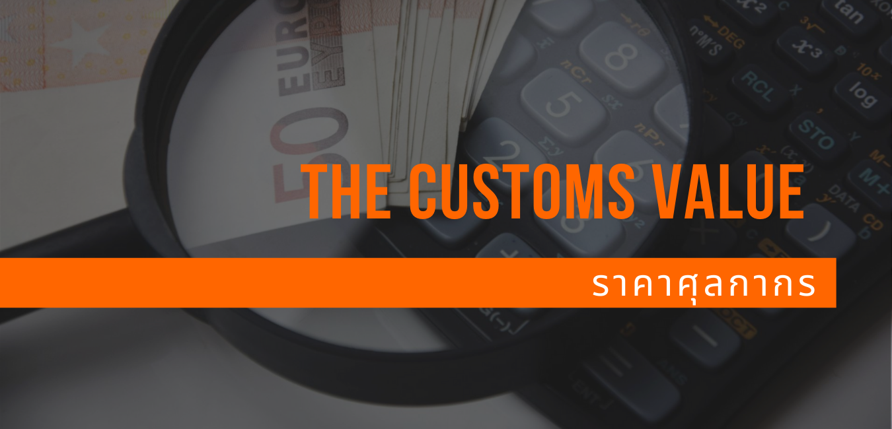

ของที่นำเข้ามาในประเทศไทย (นอกจากของบางอย่างที่ได้รับการยกเว้นแล้ว) จะต้องเสียภาษีศุลกากรและภาษีอื่น ๆ ตามที่ พระราชบัญญัติศุลกากร พ.ศ.2560 และตามที่กฎหมายอื่นกำหนด โดยหากเป็นการชำระอากร ตามราคาแล้ว ภาษีศุลกากรจะคำนวณจากราคาศุลกากรเป็นพื้นฐาน ทั้งนี้การกำหนดราคาศุลกากรเป็นไปตามพระราชบัญญัติศุลกากร พ.ศ. 2560 และกฎระเบียบที่เกี่ยวข้องอื่นๆ

ในขณะที่การค้าระหว่างประเทศขยายตัวอย่างรวดเร็ว และธุรกรรมทางการค้ามีความซับซ้อนมากขึ้น ทั้งในแง่ของการผลิตสินค้าและ ผู้เกี่ยวข้องในห่วงโซ่อุปทาน การกำหนดราคาศุลกากรจึงมีความสำคัญมากขึ้นด้วยเช่นกัน ทั้งนี้เพื่อให้การจัดเก็บภาษีอากร เป็นไปอย่างมีประสิทธิภาพ สะดวกรวดเร็ว ถูกต้อง โปร่งใส เป็นธรรม และสามารถคาดการณ์ได้

> **Content**

.

