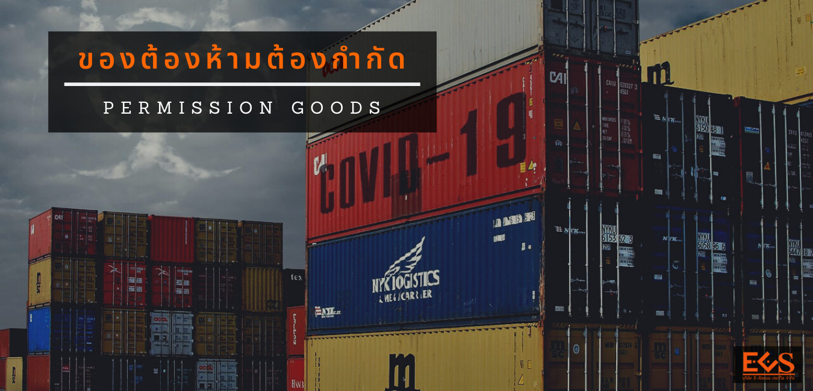

{}

## ของต้องห้าม

**ของต้องห้าม** หมายถึงของที่มีกฎหมายกำหนดห้ามนำเข้ามาหรือส่งออกไปนอกราชอาณาจักรโดยเด็ดขาด และในบางกรณีห้ามการส่งผ่านด้วย ผู้ใดนำสินค้าต้องห้ามเข้ามาหรือส่งออกไปนอกราชอาณาจักรจะมีความผิดต้องรับโทษตามกฎหมายที่เกี่ยวข้องและเป็นความผิดตามมาตรา 244 และ มาตรา 246 แห่งพระราชบัญญัติศุลกากร พ.ศ. 2560 ด้วย ตัวอย่างสินค้าต้องห้ามในการนำเข้า-ส่งออก มีดังนี้

- วัตถุลามก การนำเข้าและส่งออกวัตถุลามก ไม่ว่าจะอยู่ในรูปแบบหนังสือ ภาพเขียน ภาพพิมพ์ ภาพระบายสี สิ่งที่พิมพ์ขึ้น รูปภาพ ภาพโฆษณา เครื่องหมาย รูปถ่าย และภาพยนตร์ลามกหรือวัตถุลามกอื่น ๆ 
- สินค้าที่มีตราหรือลวดลายเป็นรูปธงชาติ 
- ยาเสพติดให้โทษ 
- เงินตรา พันธบัตร ใบสำคัญรับดอกเบี้ยพันธบัตรอันเป็นของปลอมหรือแปลง เหรียญกษาปณ์ที่ทำให้น้ำหนักลดลงโดยทุจริต ดวงตราแผ่นดิน รอยตราแผ่นดินหรือพระปรมาภิไธย ดวงตราหรือรอยตราของทางราชการอันเป็นของปลอม 
- สินค้าละเมิดลิขสิทธิ์ เช่น แถบบันทึกเสียง (เทปเพลง) แผ่นบันทึกเสียง (คอมแพคดิสก์) แถบบันทึกภาพ (วีดีโอเทป) โปรแกรม คอมพิวเตอร์ หนังสือ หรือสินค้าอื่นใดที่ทำซ้ำหรือดัดแปลงงานอันมีลิขสิทธิ์ของผู้อื่น 
- สินค้าปลอมแปลงหรือเลียนแบบเครื่องหมายการค้า

## ของต้องกำกัด

**ของต้องกำกัด** หมายถึงสินค้าที่มีกฎหมายกำหนดว่าหากจะมีการนำเข้า-ส่งออกหรือผ่านราชอาณาจักรจะต้องได้รับอนุญาตหรือปฏิบัติให้ครบถ้วนตามที่กำหนดไว้ในกฎหมายนั้น ๆ เช่น ต้องมีใบอนุญาตการนำเข้าและส่งออก ต้องปฏิบัติตามประกาศอันเกี่ยวกับฉลากหรือใบรับรองการวิเคราะห์ หรือเอกสารกำกับยา เป็นต้น ผู้ใดนำของต้องกำกัดเข้ามา หรือส่งออก หรือส่งผ่านราชอาณาจักรโดยมิได้รับอนุญาตหรือไม่ปฏิบัติตามกฎหมายที่กำหนดไว้ให้ครบถ้วน จะมีความผิดตามที่กำหนดไว้ในกฎหมายนั้น ๆ และเป็นความผิดตามมาตรา 244 และ มาตรา 246 แห่งพระราชบัญญัติศุลกากร พ.ศ. 2560 ด้วย ตัวอย่างสินค้าที่มีมาตรการนำเข้า,สินค้าที่มีมาตรการส่งออก,สินค้ามาตรฐานและมาตรฐานสินค้า

## พิกัดอัตราศุลกากร และรหัสสถิติที่ต้องมีใบอนุญาต

- [พิกัดอัตราศุลกากร และรหัสสถิติที่ต้องมีใบอนุญาต](https://ecs-support.github.io/KM/reference/permission.html)
- [พิกัดอัตราศุลกากร และรหัสสถิติที่ต้องมีใบอนุญาต (Excel)](https://ecs-support.github.io/KM/reference/static/files/permission_goods.xlsx)
- [รหัสยกเว้นไม่ต้องมีใบอนุญาต/ใบรับรอง](https://ecs-support.github.io/KM/reference/exampt.html)

------

## การเชื่อมโยงข้อมูลผ่านระบบ NSW สำหรับใช้ในการผ่านพิธีการศุลกากรแบบไร้เอกสาร  

> ข้อมูล ณ เดือนมีนาคม 2563

**มี 32 หน่วยงาน** เชื่อมโยงข้อมูลผ่านระบบ NSW สำหรับใช้ในการผ่านพิธีการศุลกากรแบบไร้เอกสาร และกระบวนงานที่เกี่ยวข้องกับโลจิสติกส์ ประกอบด้วย

1. กรมศุลกากร
2. กรมโรงงานอุตสาหกรรม
3. กรมทรัพยากรธรณี
4. กรมควบคุมโรค
5. กรมป่าไม้
6. สำนักงานคณะกรรมการส่งเสริมการลงทุน
7. กรมวิทยาศาสตร์การแพทย์
8. กสทช.
9. กรมอุตสาหกรรมพื้นฐานและการเหมืองแร่
10. กรมเชื้อเพลิงธรรมชาติ
11. กรมอุทยานแห่งชาติ สัตว์ป่า และพันธุ์พืช
12. กรมการขนส่งทางบก
13. กรมการอุตสาหกรรมทหาร
14. การยางแห่งประเทศไทย
15. การท่าเรือแห่งประเทศไทย
16. การนิคมอุตสาหกรรมแห่งประเทศไทย
17. สถาบันไฟฟ้าและอิเล็กทรอนิกส์
18. สำนักงานคณะกรรมการอ้อยและน้ำตาลทราย
19. สำนักงานมาตรฐานสินค้าเกษตรและอาหารแห่งชาติ
20. กรมการค้าภายใน
21. กรมสรรพสามิต
22. สำนักงานมาตรฐานผลิตภัณฑ์อุตสาหกรรม
23. สำนักงานคณะกรรมการอาหารและยา
24. สำนักงานปรมาณูเพื่อสันติ
25. กรมธุรกิจพลังงาน
26. กรมศิลปากร
27. กรมประมง
28. กรมวิชาการเกษตร
29. กรมการปกครอง
30. กรมการค้าต่างประเทศ
31. กรมปศุสัตว์
32. หอการค้าไทยและสภาหอการค้าแห่งประเทศไทย 

 

{}
สอบถามข้อมูลเพิ่มเติมได้ที่ : กองกฎหมาย (กกม.)  
กรมศุลกากร เลขที่ 1 ถ.สุนทรโกษา คลองเตย กทม. 10110  
หมายเลขโทรศัพท์ : 0-2667-6002  
อีเมล์ : 65000100@customs.go.th  
{}

>ที่มา : [กรมศุลกากร](http://www.customs.go.th/cont_strc_simple.php?ini_content=business_160426_03_160930_01_160930_01&ini_menu=menu_goods_control_permit&lang=th&left_menu=menu_goods_control_permit)  
>วันที่ปรับปรุงล่าสุด : 8 มกราคม 2561. 