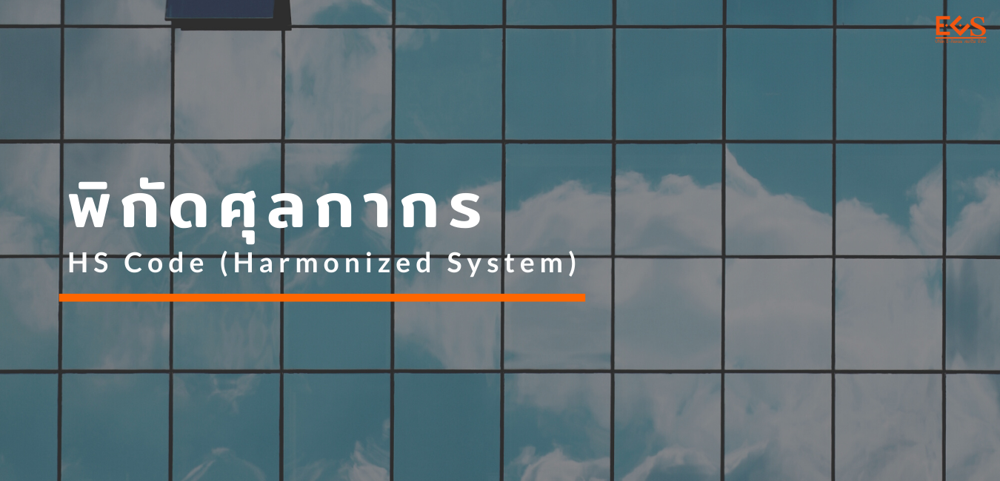
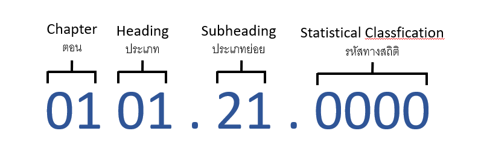
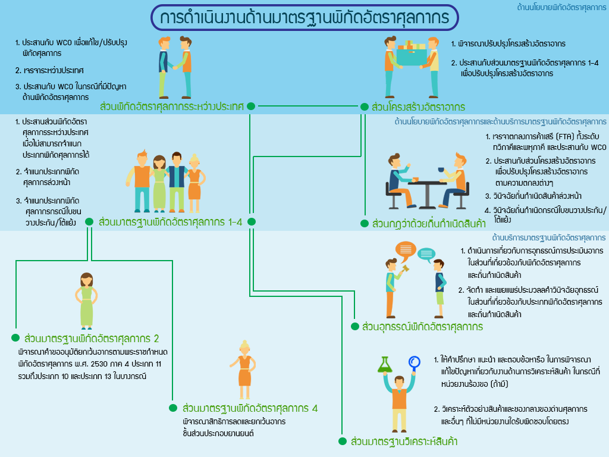

{}

## พิกัดศุลกากร HS Code คืออะไร

 เนื่องจากในแต่ละประเทศ แต่ละเมือง ย่อมมีประเภทของสินค้า และวัตถุดิบที่แตกต่างกันออกไป รวมถึงในแต่ละที่อาจเรียกชื่อแตกต่างกันด้วย จึงได้มีการคิดข้อกำหนดของประเภทและชนิดสินค้าให้มีความเข้าใจตรงกันทั่วโลก และมีความเป็นสากล จึงมีการรวมกลุ่มกันขึ้นมาเพื่อกำหนดเกณฑ์ที่ชื่อว่า “HS Code” ขึ้นมา

พิกัดศุลกากร หรือ HS Code (Harmonized System) มีการยอมรับและประกาศใช้โดยองค์การศุลกากรโลก (World Customs Organization: WCO) เป็นความร่วมมือของสมาชิกกว่า 176 ประเทศ รวมประเทศไทยของเราด้วย ที่เข้าร่วมมาตั้งแต่วันที่ 4 กุมภาพันธ์ พ.ศ. 2515 ซึ่งถือเป็นระบบสากลทางการค้าระหว่างประเทศ สำหรับประเทศไทย มีการนำระบบพิกัดศุลกากรมาใช้เมื่อวันที่ 1 มกราคม พ.ศ. 2531 แทนที่รหัสพิกัดศุลกากรของ Customs Co-operation Council ที่เราใช้กันมาตั้งแต่ปี พ.ศ. 2503 

ระบบพิกัดศุลกากรฮาร์โมไนซ์จำแนกประเภทสิ่งของเป็น 21 หมวด และ 97 ตอน เป็นการกำหนดตัวเลขทั้งหมด 11 หลัก โดย 6 หลัก แรกจะเป็นเลขที่กำหนดขึ้นโดยองค์การศุลกากรโลก (World Customs Organization : WCO) ระบบการจำแนกชนิดสินค้าได้รับการยอมรับจากประเทศภาคีสมาชิกของ องค์การการค้าโลก (World Trade Organization: WTO) เพื่อนำไปใช้เป็นสากลในทางการค้า และ 2 หลักถัดมาจะเป็นการแสดงพิกัดฮาร์โมไนซ์อาเซียน (CEPT Code) ส่วนเลข 3 หลักหลังนั้นจะเป็นรหัสสถิติที่กำหนดโดยแต่ละประเทศนั่นเอง ซึ่งสามารถแบ่งตัวเลขออกเป็นหมวดต่าง ๆ ได้ดังนี้

### เลข 4 ตัวแรก

มาจากเลขชุด 6 ตัวของพิกัดศุลกากร จะเป็นประเภท (Heading No.) แยกเป็น

- 2 ตัวแรกเป็นเลขลำดับของ “ตอน”
- 2 ตัวหลังเป็นเลขลำดับของ “ประเภท” ที่อยู่ในตอนนั้น

ตัวอย่างเช่น ตอนที่ 29 กำหนดให้เป็นเคมีภัณฑ์อินทรีย์ และประเภทที่ 29.07 คือ ฟีนอลและฟีนอลแอลกอฮอลล์

### เลข 4 ตัวต่อมา

เป็นลำดับของ “ประเภทย่อย” (Subheading No.) ประกอบไปด้วย

- เลข 2 ตัวแรก เป็นเลข 2 ตัวที่เหลือจากเลขชุด 6 ตัวของพิกัดศุลกากร
- เลข 2 ตัวหลัง เป็นประเภทย่อยระบบพิกัด

เลข 2 ตัวหลังนี้ เช่น ประเทศไทยใช้ระบบพิกัดศุลกากรอาเซียน (CEPT Code / the AHTN Protocol) ก็จะเป็นเลขขอพิกัดนี้ เมื่อรวมกับข้อ 1 จะเป็น 8 ตัว (ส่วนใหญ่เป็นเลข 8 ตัว) ตัวอย่างเช่น 2907.10.00 คือ ฟีนอล (ไฮดรอกซิเบนซิน)

### เลข 3 ตัวสุดท้าย

คือ เลขรหัสสถิติ (Statistics code) ซึ่งเป็นรหัสสินค้า (Code for goods) และรหัสหน่วยสินค้า (Unit of goods) โดยตัวเลข 3 หลักสุดท้าย จะเป็นรหัสสถิติที่กำหนดโดยแต่ละประเทศ ทำให้รวมแล้วมี 11 ตัว (มาจากข้อ 1 และข้อ 2 แล้วต่อท้ายอีก 3 ตัวนั่นเอง) และที่ต่อท้ายมากับเลขชุด 11 หลักของพิกัดรหัสสถิติ คือ รหัสหน่วยสินค้า (Unit of goods) เช่น KGM (กิโลกรัม), C62 (ชิ้น/หน่วย), LTR (ลิตร) หรือ MTR (เมตร) เป็นต้น

	 	 

## การหาพิกัดศุลกากร และรหัสพิกัดสินค้า

เราสามารถค้นหาพิกัดศุลกากร ได้ที่เว็บไซต์กรมศุลกากร  [ค้นหาพิกัด](http://itd.customs.go.th/igtf/th/main_frame.jsp) หรือที่  [Tariff e-service](http://tariffeservice.customs.go.th/ITRF/) หรือค้นหาผ่านทาง Mobile Application ได้แล้วนะครับ ภายใต้ชื่อ **“HS Check”** ทั้งบน [Google Play](https://play.google.com/store/apps/details?id=com.igtfTCD&hl=th) และ [App Store](https://itunes.apple.com/th/app/hs-check/id1190764347?l=th&mt=8)

การดำเนินงานด้านมาตรฐานพิกัดอัตราศุลกากร ของกรมศุลกากร อยู่ภายใต้การกำกับของรองอธิบดีที่รับผิดชอบและสำนักพิกัดอัตราศุลกากร 
กำหนดไว้เป็นสองระดับคือด้านนโยบายพิกัดฯ และด้านบริการมาตรฐานพิกัดฯ โดยมีกิจกรรมและแนวทางการดำเนินงานตามแผนภาพต่อไปนี้

>สอบถามข้อมูลเพิ่มเติมได้ที่ : กองพิกัดอัตราศุลกากร (กพก.)  
หมายเลขโทรศัพท์ : 0-2667-7372  
อีเมล์ : 80000100@customs.go.th  

Reference:
- https://vayoit.com/blog/hs-code/