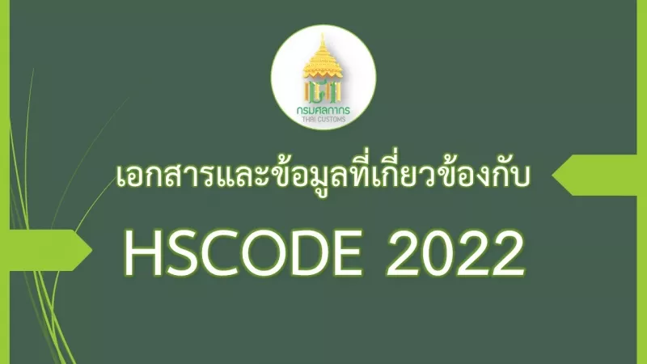

+++
# Hero widget.
widget = "blank"  # See https://sourcethemes.com/academic/docs/page-builder/
headless = false  # This file represents a page section.
active = true  # Activate this widget? true/false
weight = 20  # Order that this section will appear.

title = "เอกสารและข้อมูลที่เกี่ยวกับพิกัดศุลกากรระบบฮาร์โมไนซ์ 2022"
+++

  

### Reference Files (มีผลบังคับใช้ตั้งแต่วันที่ 1 มกราคม พ.ศ. 2565)

-   [Reference Files](https://www.customs.go.th/list_strc_download.php?lang=th&left_menu=nmenu_esevice_006&current_id=142231324147505f4b464b46)

  

### ประกาศที่เกี่ยวข้อง

-   [พระราชกำหนดพิกัดอัตราศุลกากร (ฉบับที่ 7) พ.ศ. 2564](https://www.customs.go.th/cont_strc_simple_with_date.php?current_id=142329324146505e4e464b4a464b46)
-   [รหัสสถิติสินค้า ฉบับปี พ.ศ. 2565 ตามประกาศกรมศุลกากรที่ 194/.2564](https://www.customs.go.th/data_files/4f76551d2bb65596ad8568aebefd2f97.pdf)

### เอกสารที่เกี่ยวข้อง  
-   [Updated คำอธิบายพิกัดศุลกากรฮาร์โมไนซ์อาเซียน ฉบับปี 2022 (AHTN 2022 's SEN)](http://www.customs.go.th/data_files/d5ec9d109d80fa83275bdc52972b2065.pdf)
-   [Updated Text of AHTN 2022 (พิกัดฯ ภาษาอังกฤษเพื่อการอ้างอิง)](http://www.customs.go.th/data_files/3a4ffe38a9a5a67e1e4724218016c369.pdf)
-   [Updated ตารางเทียบพิกัดศุลกากร AHTN 2017- AHTN 2022](http://www.customs.go.th/data_files/d752ea14badcb188d8efc85681ea03a4.pdf)
-   [แจ้งแนวทางในการส่งข้อมูลใบขนสินค้าตาม HSCODE](https://www.customs.go.th/data_files/a1433d64923dd1ade50c715fda5aee00.pdf)
- [การรับหนังสือรับรองถิ่นกำเนิดสินค้าภายใต้ JTEPA ในรูปแบบเอกสารอิเล็กทรอนิกส์ (JTEPA in PDF 2022)](https://www.customs.go.th/cont_strc_simple_with_date.php?current_id=142329324146505f46464b46464b4a)
-   [ข่าวสารด้านกฎว่าด้วยถิ่นกำเนิดสินค้า ROO news](https://www.customs.go.th/cont_strc_simple_with_date.php?current_id=142329324146505f46464b46464b4b)
- [คลิปวิดีโองานสัมมนาความรู้ด้านกฎว่าด้วยถิ่นกำเนิดสินค้า วันที่ 14 -15 ธันวาคม 2564](https://www.customs.go.th/cont_strc_simple_with_date.php?current_id=142329324146505f46464b46464b49)
- [บันทึกการสัมมนาพิกัดศุลกากรฯ ฉบับปี 2022 (หน่วยงานภาครัฐ) เมื่อวันที่ 15 ธันวาคม 2564](https://www.customs.go.th/cont_strc_simple_with_date.php?current_id=142329324146505e4f464b4b464b49)
-   [วีดีโอบันทึกการสัมมนาพิกัดศุลกากรระบบฮาร์โมไนซ์และพิกัดศุลกากรฮาร์โมไนซ์อาเซียน ฉบับปี 2022 สำหรับบุคคลทั่วไป](https://www.customs.go.th/cont_strc_simple_with_date.php?current_id=142329324146505e4e464b4a464b47)  

### ประกาศกระทรวงการคลัง

-   [การกำหนดให้ของได้รับยกเว้นจากบทบังคับตามความในมาตรา 10 แห่งพระราชกำหนดพิกัดอัตราศุลกากร พ.ศ. 2530](https://www.customs.go.th/cont_strc_download_with_docno_date.php?lang=th&top_menu=menu_homepage&current_id=142329324146505f47464a4f464a4e)
-   [การลดอัตราอากรและยกเว้นอากรศุลกากรตามมาตรา 12 แห่งพระราชกำหนดพิกัดอัตราศุลกากร พ.ศ. 2530](https://www.customs.go.th/cont_strc_download_with_docno_date.php?lang=th&top_menu=menu_homepage&current_id=142329324146505f47464a4f464a4f)
-   [การลดอัตราอากรศุลกากรสำหรับของที่มีถิ่นกำเนิด จากสาธารณรัฐประชาธิปไตยประชาชนลาว](https://www.customs.go.th/cont_strc_download_with_docno_date.php?lang=th&top_menu=menu_homepage&current_id=142329324146505f47464a4f464b46)
-   [การยกเว้นอากรและลดอัตราอากรศุลกากรสำหรับของที่มีถิ่นกำเนิดจากสาธารณรัฐเปรู](https://www.customs.go.th/cont_strc_download_with_docno_date.php?lang=th&top_menu=menu_homepage&current_id=142329324146505f47464b47464b46)
-   [การยกเว้นอากรและลดอัตราอากรศุลกากรสำหรับของที่มีถิ่นกำเนิดจากนิวซีแลนด์](https://www.customs.go.th/cont_strc_download_with_docno_date.php?lang=th&top_menu=menu_homepage&current_id=142329324146505f47464b47464a4f)
-   [การยกเว้นอากรศุลกากรสำหรับของที่มีถิ่นกำเนิดจากสาธารณรัฐสิงคโปร์](https://www.customs.go.th/cont_strc_download_with_docno_date.php?lang=th&top_menu=menu_homepage&current_id=142329324146505f47464b47464a4e)
-   [การยกเว้นอากร ลด และเพิ่มอัตราอากรศุลกากร สำหรับของที่มีถิ่นกำเนิดจากสาธารณรัฐประชาธิปไตยประชาชนลาว](https://www.customs.go.th/cont_strc_download_with_docno_date.php?lang=th&top_menu=menu_homepage&current_id=142329324146505f47464b46464b4d)
-   [การยกเว้นอากรและการลดอัตราอากรศุลกากรสำหรับของที่มีถิ่นกำเนิดจากสาธารณรัฐอินเดีย](https://www.customs.go.th/cont_strc_download_with_docno_date.php?lang=th&top_menu=menu_homepage&current_id=142329324146505f47464b46464b4c)
-   [การยกเว้นอากรศุลกากรสำหรับของที่มีถิ่นกำเนิดจากสาธารณรัฐประชาชนจีน](https://www.customs.go.th/cont_strc_download_with_docno_date.php?lang=th&top_menu=menu_homepage&current_id=142329324146505f47464b46464b4b)
-   [การยกเว้นอากรและลดอัตราอากรศุลกากรสำหรับของที่มีถิ่นกำเนิดจากสาธารณรัฐชิลี](https://www.customs.go.th/cont_strc_download_with_docno_date.php?lang=th&top_menu=menu_homepage&current_id=142329324146505f47464b46464b4a)
-   [การยกเว้นอากรและลดอัตราอากรศุลกากรสำหรับของที่มีถิ่นกำเนิดจากออสเตรเลีย](https://www.customs.go.th/cont_strc_download_with_docno_date.php?lang=th&top_menu=menu_homepage&current_id=142329324146505f47464b46464b49)
-   [การยกเว้นอากรและลดอัตราอากรศุลกากร ตามข้อผูกพันตามความตกลงหุ้นส่วนทางเศรษฐกิจระดับภูมิภาค](https://www.customs.go.th/cont_strc_download_with_docno_date.php?lang=th&top_menu=menu_homepage&current_id=142329324146505f47464b46464b47)
-   [การยกเว้นอากรศุลกากรสำหรับของที่มีถิ่นกำเนิดจากสาธารณรัฐแห่งสหภาพเมียนมา](https://www.customs.go.th/cont_strc_download_with_docno_date.php?lang=th&top_menu=menu_homepage&current_id=142329324146505f47464b46464a4e)
-   [การยกเว้นอากรและลดอัตราอากรศุลกากรสำหรับของที่มีถิ่นกำเนิดจากญี่ปุ่น](https://www.customs.go.th/cont_strc_download_with_docno_date.php?lang=th&top_menu=menu_homepage&current_id=142329324146505f47464a4f464b4d)
-   [การยกเว้นอากรศุลกากรสำหรับสินค้าอัญมณีและเครื่องประดับ ที่นำเข้ามาแสดงและจาหน่ายในงานแสดงสินค้าอัญมณีและเครื่องประดับไทย](https://www.customs.go.th/cont_strc_download_with_docno_date.php?lang=th&top_menu=menu_homepage&current_id=142329324146505f47464a4f464b4c)
-   [การยกเว้นอากรสำหรับของที่นำเข้ามาในพื้นที่พัฒนาร่วม](https://www.customs.go.th/cont_strc_download_with_docno_date.php?lang=th&top_menu=menu_homepage&current_id=142329324146505f47464a4f464b4b)
-   [การลดอัตราอากรศุลกากรสำหรับการให้สิทธิพิเศษทางการค้าระหว่างประเทศกำลังพัฒนา](https://www.customs.go.th/cont_strc_download_with_docno_date.php?lang=th&top_menu=menu_homepage&current_id=142329324146505f47464a4f464b4a)
-   [การยกเว้นอากรสำหรับของที่มีถิ่นกำเนิดจากประเทศพัฒนาน้อยที่สุด](https://www.customs.go.th/cont_strc_download_with_docno_date.php?lang=th&top_menu=menu_homepage&current_id=142329324146505f47464a4f464b49)
-   [การยกเว้นอากรศุลกากรสำหรับของที่นำเข้ามาเพื่อใช้รักษา วินิจฉัย หรือป้องกันโรคติดเชื้อไวรัสโคโรนา 2019 (ฉบับที่ 4)](https://www.customs.go.th/cont_strc_download_with_docno_date.php?lang=th&top_menu=menu_homepage&current_id=142329324146505f47464a4f464b48)
-   [การยกเว้นอากรและลดอัตราอากรศุลกากรสำหรับของที่มีถิ่นกำเนิดจากอาเซียน](https://www.customs.go.th/cont_strc_download_with_docno_date.php?lang=th&top_menu=menu_homepage&current_id=142329324146505f47464a4f464b47)
-   [การยกเว้นอากรและลดอัตราอากรศุลกากรสำหรับเขตการค้าเสรีอาเซียน - สาธารณรัฐเกาหลี](https://www.customs.go.th/cont_strc_download_with_docno_date.php?lang=th&top_menu=menu_homepage&current_id=142329324146505f47464a4e464b4d)
-   [การยกเว้นอากรและลดอัตราอากรศุลกากรสำหรับเขตการค้าเสรีอาเซียน - ญี่ปุ่น](https://www.customs.go.th/cont_strc_download_with_docno_date.php?lang=th&top_menu=menu_homepage&current_id=142329324146505f47464a4e464b4c)
-   [การยกเว้นอากรและลดอัตราอากรศุลกากรสำหรับเขตการค้าเสรีอาเซียน - สาธารณรัฐอินเดีย](https://www.customs.go.th/cont_strc_download_with_docno_date.php?lang=th&top_menu=menu_homepage&current_id=142329324146505f47464a4e464b4b)
-   [การยกเว้นอากรและลดอัตราอากรศุลกากรสําหรับเขตการค้าเสรีอาเซียน - จีน](https://www.customs.go.th/cont_strc_download_with_docno_date.php?lang=th&top_menu=menu_homepage&current_id=142329324146505f47464a4e464b48)
-   [การยกเว้นอากรและลดอัตราอากรศุลกากรสำหรับเขตการค้าเสรีอาเซียน - ฮ่องกง](https://www.customs.go.th/cont_strc_download_with_docno_date.php?lang=th&top_menu=menu_homepage&current_id=142329324146505f47464a4e464b4a)
-   [การยกเว้นอากรและลดอัตราอากรศุลกากร สําหรับเขตการค้าเสรีอาเซียน - ออสเตรเลีย - นิวซีแลนด์](https://www.customs.go.th/cont_strc_download_with_docno_date.php?lang=th&top_menu=menu_homepage&current_id=142329324146505f47464a4e464b47)
-   [การยกเว้นอากร ลด และเพิ่มอัตราอากรศุลกากรตามข้อผูกพัน ในความตกลงมาร์ราเกชจัดตั้งองค์การการค้าโลก](https://www.customs.go.th/cont_strc_download_with_docno_date.php?lang=th&top_menu=menu_homepage&current_id=142329324146505f47464b47464b47)

  

### ประกาศกรมศุลกากร

-   [(215/.2564) หลักเกณฑ์และพิธีการการยกเว้นอากรและลดอัตราอากรศุลกากรสำหรับเขตการค้าเสรีอาเซียน-ออสเตรเลีย-นิวซีแลนด์](https://www.customs.go.th/cont_strc_download_with_docno_date.php?lang=th&top_menu=menu_homepage&current_id=142329324146505f46464b47464a4f)
-   [(216/.2564) หลักเกณฑ์และพิธีการการยกเว้นอากรและลดอัตราอากรศุลกากรสำหรับของที่มีถิ่นกำเนิดจากออสเตรเลีย](https://www.customs.go.th/cont_strc_download_with_docno_date.php?lang=th&top_menu=menu_homepage&current_id=142329324146505f46464b47464b46)
-   [(217/.2564) หลักเกณฑ์และพิธีการการยกเว้นอากรและลดอัตราอากรศุลกากรสำหรับของที่มีถิ่นกำเนิดจากนิวซีแลนด์](https://www.customs.go.th/cont_strc_download_with_docno_date.php?lang=th&top_menu=menu_homepage&current_id=142329324146505f46464b47464b47)
-   [(218/.2564) หลักเกณฑ์และพิธีการการยกเว้นอากรและลดอัตราอากรศุลกากรสำหรับเขตการค้าเสรีอาเซียน-จีน](https://www.customs.go.th/cont_strc_download_with_docno_date.php?lang=th&top_menu=menu_homepage&current_id=142329324146505f46464b47464b48)
-   [(219/.2564) หลักเกณฑ์และพิธีการการยกเว้นอากรศุลกากรสำหรับของที่มีถิ่นกำเนิดจากสาธารณรัฐประชาชนจีน](https://www.customs.go.th/cont_strc_download_with_docno_date.php?lang=th&top_menu=menu_homepage&current_id=142329324146505f46464b47464b49)
-   [(220/.2564) หลักเกณฑ์และพิธีการการยกเว้นอากรศุลกากรสำหรับของที่มีถิ่นกำเนิดจากสาธารณรัฐสิงคโปร์](https://www.customs.go.th/cont_strc_download_with_docno_date.php?lang=th&top_menu=menu_homepage&current_id=142329324146505f46464b49464a4e)
-   [(226/.2564) หลักเกณฑ์และพิธีการการยกเว้นอากรและลดอัตราอากรศุลกากรสำหรับของที่มีถิ่นกำเนิดจากสาธารณรัฐเปรู](https://www.customs.go.th/cont_strc_download_with_docno_date.php?lang=th&top_menu=menu_homepage&current_id=142329324146505f46464b47464b4a)
-   [(227/.2564) หลักเกณฑ์และพิธีการการยกเว้นอากรและลดอัตราศุลกากรสำหรับของที่มีถิ่นกำเนิดจากสาธารณรัฐชิลี](https://www.customs.go.th/cont_strc_download_with_docno_date.php?lang=th&top_menu=menu_homepage&current_id=142329324146505f46464b48464b48)
-   [(228/.2564) หลักเกณฑ์และพิธีการการยกเว้นอากรและลดอัตราศุลกากรสำหรับเขตการค้าเสรีอาเซียน-สาธารณรัฐอินเดีย](https://www.customs.go.th/cont_strc_download_with_docno_date.php?lang=th&top_menu=menu_homepage&current_id=142329324146505f46464b48464b47)
-   [(229/.2564) หลักเกณฑ์และพิธีการการยกเว้นอากรและลดอัตราอากรศุลกากรสำหรับของที่มีถิ่นกำเนิดจากอาเซียน](https://www.customs.go.th/cont_strc_download_with_docno_date.php?lang=th&top_menu=menu_homepage&current_id=142329324146505f46464b48464b46)
-   [(230/.2564) หลักเกณฑ์และพิธีการการยกเว้นอากรและลดอัตราศุลกากรสำหรับเขตการค้าเสรีอาเซียน-ญี่ปุ่น](https://www.customs.go.th/cont_strc_download_with_docno_date.php?lang=th&top_menu=menu_homepage&current_id=142329324146505f46464b48464b4c)
-   [(231/.2564) หลักเกณฑ์และพิธีการการยกเว้นอากรและลดอัตราอากรศุลกากรสำหรับของที่มีถิ่นกำเนิดจากญี่ปุ่น](https://www.customs.go.th/cont_strc_download_with_docno_date.php?lang=th&top_menu=menu_homepage&current_id=142329324146505f46464b48464a4f)
-   [(232/.2564) หลักเกณฑ์และพิธีการการยกเว้นอากรและลดอัตราอากรศุลกากรสำหรับของที่มีถิ่นกำเนิดจากสาธารณรัฐอินเดีย](https://www.customs.go.th/cont_strc_download_with_docno_date.php?lang=th&top_menu=menu_homepage&current_id=142329324146505f46464b48464a4e)
-   [(233/.2564) หลักเกณฑ์และพิธีการการยกเว้นอากรและลดอัตราศุลกากรสำหรับเขตการค้าเสรีอาเซียน-ฮ่องกง](https://www.customs.go.th/cont_strc_download_with_docno_date.php?lang=th&top_menu=menu_homepage&current_id=142329324146505f46464b47464b4d)
-   [(234/.2564) หลักเกณฑ์และพิธีการการยกเว้นอากรและลดอัตราศุลกากรสำหรับเขตการค้าเสรีอาเซียน-สาธารณรัฐเกาหลี](https://www.customs.go.th/cont_strc_download_with_docno_date.php?lang=th&top_menu=menu_homepage&current_id=142329324146505f46464b47464b4c)
-   [(235/.2564) หลักเกณฑ์และพิธีการการลดอัตราอากรศุลกากรสำหรับการให้สิทธิพิเศษทางการค้าระหว่างประเทศกำลังพัฒนา](https://www.customs.go.th/cont_strc_download_with_docno_date.php?lang=th&top_menu=menu_homepage&current_id=142329324146505f46464b48464b49)
-   [(236/.2564) หลักเกณฑ์และพิธีการการยกเว้นอากรสำหรับของที่มีถิ่นกำเนิดจากประเทศพัฒนาน้อยที่สุด](https://www.customs.go.th/cont_strc_download_with_docno_date.php?lang=th&top_menu=menu_homepage&current_id=142329324146505f46464b48464b4a)
-   [(237/.2564) หลักเกณฑ์และพิธีการการยกเว้นอากรและอัตราอากรศุลกากรตามข้อผูกพันตามความตกลงหุ้นส่วนทางเศรษฐกิจระดับภูมิภาค](https://www.customs.go.th/cont_strc_download_with_docno_date.php?lang=th&top_menu=menu_homepage&current_id=142329324146505f46464b4b464b4c)
-   [(238/.2564) หลักเกณฑ์และพิธีการการยกเว้นอากร ลดและเพิ่มอัตราอากรศุลกากรตามข้อผูกพันในความตกลงมาร์ราเกชจัดตั้งองค์การการค้าโลก](https://www.customs.go.th/cont_strc_download_with_docno_date.php?lang=th&top_menu=menu_homepage&current_id=142329324146505f46464b4d464b48)
-   [(239/.2564) หลักเกณฑ์และพิธีการการยกเว้นอากร ลดและเพิ่มอัตราอากรศุลกากรสำหรับของที่มีถิ่นกำเนิดจากสาธารณรัฐประชาธิปไตยประชาชนลาว](https://www.customs.go.th/cont_strc_download_with_docno_date.php?lang=th&top_menu=menu_homepage&current_id=142329324146505f46464b4d464b49)
-   [(240/.2564) พิธีการศุลกากรสำหรับของที่ได้รับยกเว้นจากบทบังคับมตามความในมาตรา 10 แห่งพระราชกำหนดพิกัดอัตราศุลกากร พ.ศ.2530](https://www.customs.go.th/cont_strc_download_with_docno_date.php?lang=th&top_menu=menu_homepage&current_id=142329324146505f47464a4e464b46)
-   [(241/.2564) หลักเกณฑ์และพิธีการสำหรับการใช้หนังสือค้ำประกันของธนาคารแทนการชำระอากรกรณีการขอรับของออกไปก่อนได้รับอนุมัติให้ลดอัตราอากรหรือยกเว้นอากรศุลกากร](https://www.customs.go.th/cont_strc_download_with_docno_date.php?lang=th&top_menu=menu_homepage&current_id=142329324146505f47464a4e464a4f)
-   [(242/.2564) หลักเกณฑ์และพิธีการศุลกากรสำหรับการยกเว้นอากรศุลกากร สำหรับสินค้าอัญมณีและเครื่องประดับที่นำเข้ามาแสดงและจำหน่ายในงานแสดงสินค้าอัญมณีและเครื่องประดับไทย](https://www.customs.go.th/cont_strc_download_with_docno_date.php?lang=th&top_menu=menu_homepage&current_id=142329324146505f47464a4e464a4e)
-   [(243/.2564) หลักเกณฑ์และพิธีการการยกเว้นอากรศุลกากรสำหรับของที่มีถิ่นกำเนิดจากสาธารณรัฐแห่งสหภาพเมียนมา](https://www.customs.go.th/cont_strc_download_with_docno_date.php?lang=th&top_menu=menu_homepage&current_id=142329324146505f46464b4d464b4d)
-   [(244/.2564) หลักเกณฑ์และพิธีการการลดอัตราอากรศุลกากรสำหรับของที่มีถิ่นกำเนิดจากสาธารณประชาธิปไตยประชาชนลาว](https://www.customs.go.th/cont_strc_download_with_docno_date.php?lang=th&top_menu=menu_homepage&current_id=142329324146505f46464b4d464b4b)
-   [(245/.2564) หลักเกณฑ์ วิธีการ และเงื่อนไขการปฏิบัติพิธีการศุลกากรในการยกเว้นอากรศุลกากร สำหรับของที่นำเข้ามาเพื่อใช้รักษา วินิจฉัย หรือป้องกันโรคติดเชื้อไวรัสโคโรนา 2019](https://www.customs.go.th/cont_strc_download_with_docno_date.php?lang=th&top_menu=menu_homepage&current_id=142329324146505f46464b4d464b4c)
-   [(246/.2564) หลักเกณฑ์และพิธีการสำหรับการลดอัตราอากรและยกเว้นอากรศุลกากรตามมาตรา 12 แห่งพระราชกำหนดพิกัดอัตราศุลกากร พ.ศ.2530](https://www.customs.go.th/cont_strc_download_with_docno_date.php?lang=th&top_menu=menu_homepage&current_id=142329324146505f46464b4d464b4a)

  

### ประกาศการเชื่อมโยงข้อมูลใบอนุญาตกับหน่วยงานอื่น ๆ

-   [(196/.2564) การเชื่อมโยงข้อมูลใบอนุญาต/ใบรับรองอิเล็กทรอนิกส์ ร่วมกับสำนักงานมาตรฐานสินค้าเกษตรและอาหารแห่งชาติ](https://www.customs.go.th/cont_strc_download_with_docno_date.php?lang=th&top_menu=menu_homepage&current_id=142329324146505e4f464b4d464b49)
-   [(197/.2564) การเชื่อมโยงข้อมูลใบอนุญาต/ใบรับรองอิเล็กทรอนิกส์ ร่วมกับกรมทรัพยากรธรณี](https://www.customs.go.th/cont_strc_download_with_docno_date.php?lang=th&top_menu=menu_homepage&current_id=142329324146505e4f464b4d464b48)
-   [(198/.2564) การเชื่อมโยงข้อมูลใบอนุญาต/ใบรับรองอิเล็กทรอนิกส์ ร่วมกับกรมอุตสาหกรรมพื้นฐานและการเหมืองแร่](https://www.customs.go.th/cont_strc_download_with_docno_date.php?lang=th&top_menu=menu_homepage&current_id=142329324146505e4f464b4d464b47)
-   [(199/.2564) การเชื่อมโยงข้อมูลใบอนุญาต/ใบรับรองอิเล็กทรอนิกส์ร่วมกับกรมสรรพสามิต](https://www.customs.go.th/cont_strc_download_with_docno_date.php?lang=th&top_menu=menu_homepage&current_id=142329324146505e4f464b4d464b46)
-   [(200/.2564) การเชื่อมโยงข้อมูลใบอนุญาต/ใบรับรองอิเล็กทรอนิกส์ ร่วมกับกรมธุรกิจพลังงาน](https://www.customs.go.th/cont_strc_download_with_docno_date.php?lang=th&top_menu=menu_homepage&current_id=142329324146505e4f464b4c464b4a)
-   [(201/.2564) การเชื่อมโยงข้อมูลใบอนุญาต/ใบรับรองอิเล็กทรอนิกส์ร่วมกับกรมอุทยานแห่งชาติ สัตว์ป่า และพันธุ์พืช](https://www.customs.go.th/cont_strc_download_with_docno_date.php?lang=th&top_menu=menu_homepage&current_id=142329324146505e4f464b4c464b47)
-   [(202/.2564) การเชื่อมโยงข้อมูลใบอนุญาต/ใบรับรองอิเล็กทรอนิกส์ ร่วมกับกรมป่าไม้](https://www.customs.go.th/cont_strc_download_with_docno_date.php?lang=th&top_menu=menu_homepage&current_id=142329324146505e4f464b4c464b4b)
-   [(203/.2564) การเชื่อมโยงข้อมูลใบอนุญาต/ใบรับรองอิเล็กทรอนิกส์ ร่วมกับการยางแห่งประเทศไทย](https://www.customs.go.th/cont_strc_download_with_docno_date.php?lang=th&top_menu=menu_homepage&current_id=142329324146505e4f464b4c464b4c)
-   [(204/.2564) การเชื่อมโยงข้อมูลใบอนุญาต/ใบรับรองอิเล็กทรอนิกส์ ร่วมกับสำนักงานคณะกรรมการกิจการกระจายเสียง กิจการโทรทัศน์ และกิจการโทรคมนาคมแห่งชาติ](https://www.customs.go.th/cont_strc_download_with_docno_date.php?lang=th&top_menu=menu_homepage&current_id=142329324146505e4f464b4c464b4d)
-   [(205/.2564) การเชื่อมโยงข้อมูลใบอนุญาต/ใบรับรองอิเล็กทรอนิกส์ร่วมกับกรมปศุสัตว์](https://www.customs.go.th/cont_strc_download_with_docno_date.php?lang=th&top_menu=menu_homepage&current_id=142329324146505e4f464b4d464a4e)
-   [(206/.2564) การเชื่อมโยงข้อมูลใบอนุญาต/ใบรับรองอิเล็กทรอนิกส์ร่วมกับกรมประมง](https://www.customs.go.th/cont_strc_download_with_docno_date.php?lang=th&top_menu=menu_homepage&current_id=142329324146505e4f464b4d464a4f)
-   [(207/.2564) การเชื่อมโยงข้อมูลใบอนุญาต/ใบรับรองอิเล็กทรอนิกส์ร่วมกับสำนักงานคณะกรรมการอ้อยและน้ำตาลทราย](https://www.customs.go.th/cont_strc_download_with_docno_date.php?lang=th&top_menu=menu_homepage&current_id=142329324146505f46464a4e464b4c)
-   [(208/.2564) การเชื่อมโยงข้อมูลใบอนุญาต/ใบรับรองอิเล็กรอนิกส์ร่วมกับกรมการอุตสาหกรรมทหาร](https://www.customs.go.th/cont_strc_download_with_docno_date.php?lang=th&top_menu=menu_homepage&current_id=142329324146505f46464a4e464b4b)
-   [(209/.2564) การเชื่อมโยงข้อมูลใบอนุญาต/ใบรับรองอิเล็กทรอนิกส์ร่วมกับสำนักงานปรมาณูเพื่อสันติ](https://www.customs.go.th/cont_strc_download_with_docno_date.php?lang=th&top_menu=menu_homepage&current_id=142329324146505f46464a4e464b4d)
-   [(210/.2564) การเชื่อมโยงข้อมูลใบอนุญาต/ใบรับรองอิเล็กทรอนิกส์ร่วมกับกรมการปกครอง](https://www.customs.go.th/cont_strc_download_with_docno_date.php?lang=th&top_menu=menu_homepage&current_id=142329324146505f46464a4f464a4f)
-   [(211/.2564) การเชื่อมโยงข้อมูลใบอนุญาต/ใบรับรองอิเล็กทรอนิกส์ร่วมกับกรมการค้าภายใน](https://www.customs.go.th/cont_strc_download_with_docno_date.php?lang=th&top_menu=menu_homepage&current_id=142329324146505f46464a4f464b46)
-   [(212/.2564) การเชื่อมโยงข้อมูลใบอนุญาต/ใบรับรองอิเล็กทรอนิกส์ร่วมกับกรมวิทยาศาสตร์การแพทย์](https://www.customs.go.th/cont_strc_download_with_docno_date.php?lang=th&top_menu=menu_homepage&current_id=142329324146505f46464a4f464b47)
-   [(213/.2564) การเชื่อมโยงข้อมูลใบอนุญาต/ใบรับรองอิเล็กทรอนิกส์ร่วมกับกรมศิลปากร](https://www.customs.go.th/cont_strc_download_with_docno_date.php?lang=th&top_menu=menu_homepage&current_id=142329324146505f46464a4f464b48)
-   [(214/.2564) การเชื่อมโยงข้อมูลใบอนุญาต/ใบรับรองอิเล็กทรอนิกส์ร่วมกับกรมการค้าต่างประเทศ](https://www.customs.go.th/cont_strc_download_with_docno_date.php?lang=th&top_menu=menu_homepage&current_id=142329324146505f46464a4f464b49)
-   [(221/.2564) การเชื่อมโยงข้อมูลใบอนุญาต/ใบรับรองอิเล็กทรอนิกส์ร่วมกับสำนักงานมาตรฐานผลิตภัณฑ์อุตสาหกรรม](https://www.customs.go.th/cont_strc_download_with_docno_date.php?lang=th&top_menu=menu_homepage&current_id=142329324146505f46464a4f464b4d)
-   [(222/.2564) การเชื่อมโยงข้อมูลใบอนุญาต/ใบรับรองอิเล็กทรอนิกส์ร่วมกับกรมโรงงานอุตสาหกรรม](https://www.customs.go.th/cont_strc_download_with_docno_date.php?lang=th&top_menu=menu_homepage&current_id=142329324146505f46464b46464a4e)
-   [(224/.2564) การเชื่อมโยงข้อมูลใบอนุญาต/ใบรับรองอิเล็กทรอนิกส์ร่วมกับกรมวิชาการเกษตร](https://www.customs.go.th/cont_strc_download_with_docno_date.php?lang=th&top_menu=menu_homepage&current_id=142329324146505f46464b46464b4c)
-   [(225/.2564) การเชื่อมโยงข้อมูลใบอนุญาต/ใบรับรองอิเล็กทรอนิกส์ร่วมกับสำนักงานคณะกรรมการอาหารและยา](https://www.customs.go.th/cont_strc_download_with_docno_date.php?lang=th&top_menu=menu_homepage&current_id=142329324146505f46464b46464b4d)

  

### Contact Point

-   [รายชื่อ Contact Point](https://www.customs.go.th/cont_strc_simple_with_date.php?current_id=142329324146505f46464a4e464a4e)

> วันที่ปรับปรุงล่าสุด : 31 ธันวาคม 2564.  

> ที่มา : [กรมศุลกากร](https://www.customs.go.th/cont_strc_simple.php?ini_content=hscode_2022_doc)