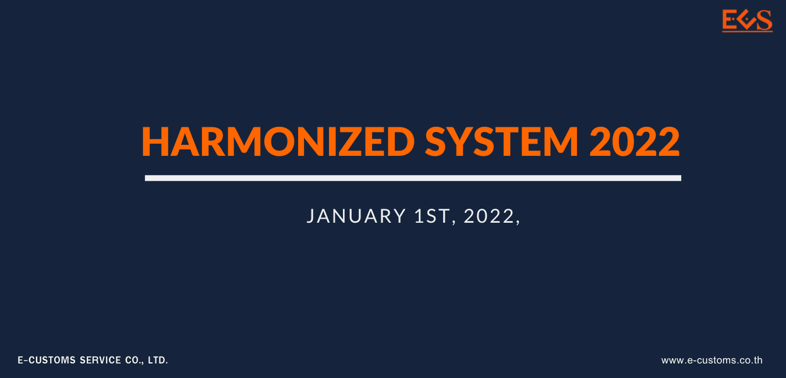
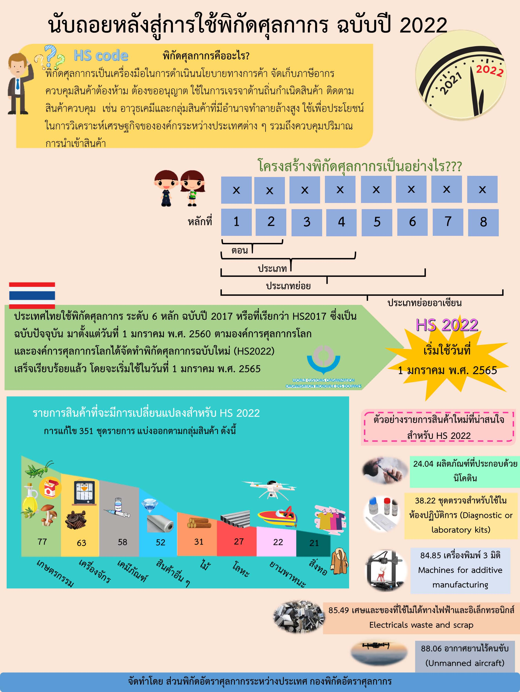
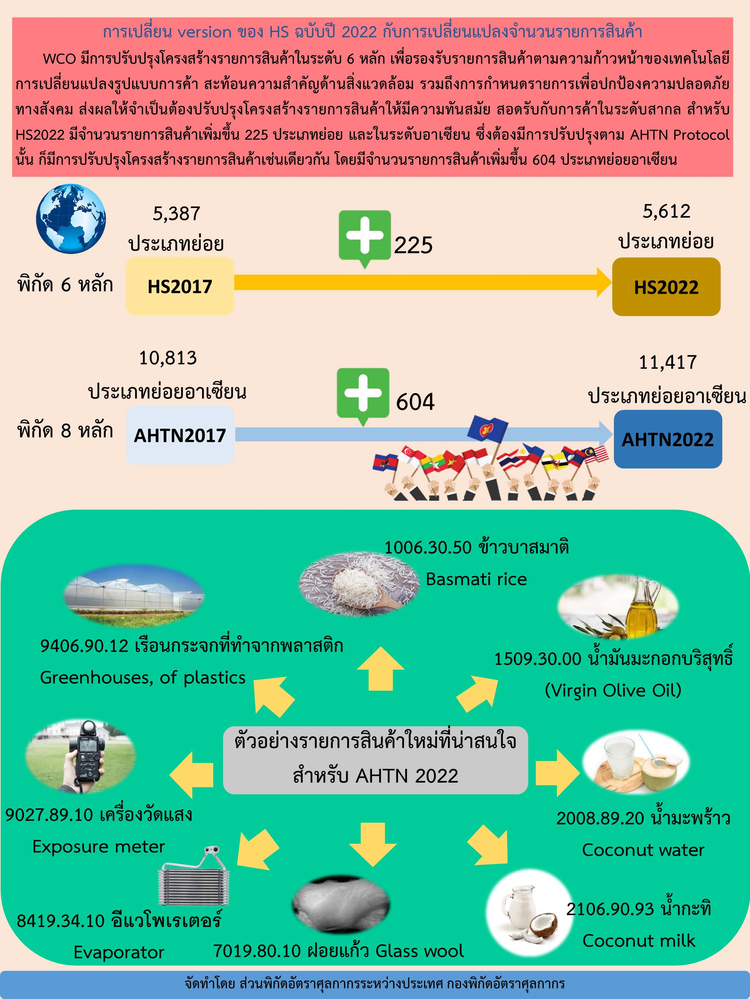

+++
# Hero widget.
widget = "blank"  # See https://sourcethemes.com/academic/docs/page-builder/
headless = true  # This file represents a page section.
active = true  # Activate this widget? true/false
weight = 10  # Order that this section will appear.

title = "พิกัดศุลกากรระบบฮาร์โมไนซ์ HS 2022"
+++

## กรมศุลกากรจะนำพิกัดศุลกากรระบบฮาโมไนซ์อาเซียน (AHTN) ฉบับปี 2022 มาใช้ เริ่ม 1 มกราคม 2565 เป็นต้นไป

>วันที่ปรับปรุงล่าสุด : 19 สิงหาคม 2564.  
>ที่มา : [กรมศุลกากร](https://www.customs.go.th/cont_strc_simple_with_date.php?lang=th&top_menu=menu_homepage&ini_menu=menu_public_relations_160421_04&left_menu=menu_public_relations_160421_04_160421_01&current_id=14232932404e505f4d464b4a464a4f)