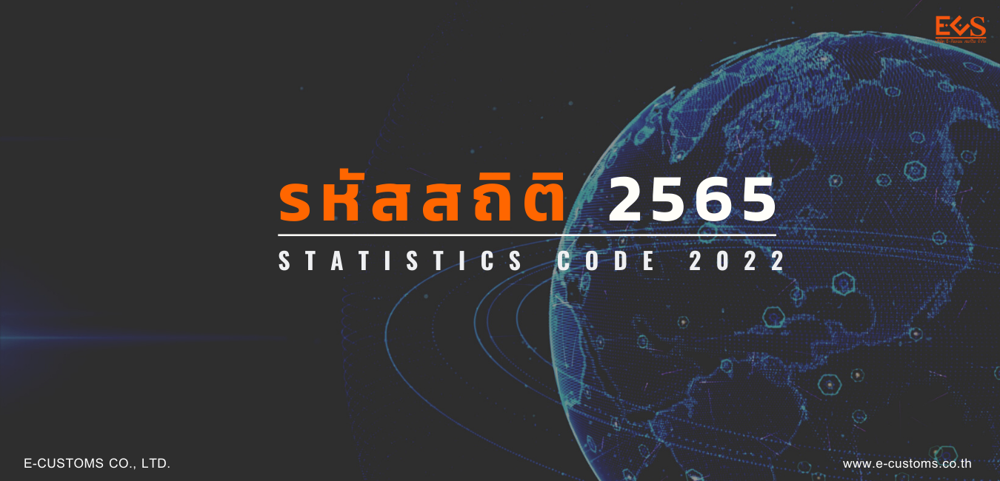

จัดแบ่งกลุ่มสินค้าตามขั้นตอนการผลิตออกเป็น **21 หมวด 97 ตอน**



-   [01  สัตว์มีชีวิต](./01/)
-   [02  เนื้อสัตว์และส่วนอื่นของสัตว์ที่บริโภคได้](./02/)
-   [03  ปลา สัตว์น้ำจำพวกครัสตาเซีย โมลลุสก์ และสัตว์น้ำที่ไม่มีกระดูกสันหลังอื่น ๆ](./03/)
-   [04  ผลิตภัณฑ์นม ไข่สัตว์ปีก น้ำผึ้งธรรมชาติ ผลิตภัณฑ์จากสัตว์ที่บริโภคได้ ซึ่งไม่ได้ระบุหรือรวมไว้ในที่อื่น](./04/)
-   [05  ผลิตภัณฑ์จากสัตว์ที่ไม่ได้ระบุหรือรวมไว้ในที่อื่น](./05/)





-   [06  ต้นไม้ และพืชอื่น ๆ ที่มีชีวิต หัว รากและสิ่งที่คล้ายกัน ดอกไม้และใบไม้ที่ใช้ประดับ](./06/)
-   [07  พืชผักรวมทั้งรากและหัวบางชนิดที่บริโภคได้](./07/)
-   [08  ผลไม้และลูกนัตที่บริโภคได้ เปลือกผลไม้จำพวกส้มหรือเปลือกแตงโม](./08/)
-   [09  กาแฟ ชา ชามาเต้ และเครื่องเทศ](./09/)
-   [10  ธัญพืช](./10/)
-   [11  ผลิตภัณฑ์ของอุตสาหกรรมโม่สีเมล็ดธัญพืช มอลต์ สตาร์ช อินูลิน และกลูเทนจากข้าวสาลี](./11/)
-   [12  เมล็ดพืชและผลไม้ ที่มีน้ำมัน เมล็ดธัญพืช เมล็ดพืชและผลไม้เบ็ดเตล็ด พืชที่ใช้ในอุตสาหกรรม หรือใช้เป็นยาฟาง และหญ้าแห้งที่ใช้เป็นอาหารสัตว์](./12/)
-   [13  ครั่ง รวมทั้งกัม เรซิน น้ำเลี้ยง (แซป) และสิ่งสกัดอื่น ๆ จากพืช](./13/)
-   [14  วัตถุจากพืชที่ใช้ถักสาน ผลิตผลจากพืชที่ไม่ได้ระบุหรือรวมไว้ในที่อื่น](./14/)
 




-   [15   ไขมันและน้ำมันที่ได้จากสัตว์หรือพืช และผลิตภัณฑ์ที่แยกได้จากไขมันและน้ำมันดังกล่าว ไขมันที่บริโภคได้ซึ่งจัดทำแล้ว ไขที่ได้จากสัตว์หรือพืช](./15/)
 




-   [16  ของปรุงแต่งจากเนื้อสัตว์ ปลา หรือสัตว์น้ำจำพวกครัสตาเซีย โมลลุสก์ หรือจากสัตว์น้ำที่ไม่มีกระดูกสันหลังอื่น ๆ](./16/)
-   [17  น้ำตาลและขนมทำจากน้ำตาล (ชูการ์คอนแฟกชันเนอรี)](./17/)
-   [18  โกโก้และของปรุงแต่งที่ทำจากโกโก้](./18/)
-   [19  ของปรุงแต่งจากธัญพืช แป้ง สตาร์ช หรือนม ผลิตภัณฑ์อาหารจำพวกเพสทรี](./19/)
-   [20  ของปรุงแต่งทำจากพืชผัก ผลไม้ ลูกนัต หรือจากส่วนอื่นของพืช](./20/)
-   [21  ของปรุงแต่งเบ็ดเตล็ดที่ทำจากพืช](./21/)
-   [22  เครื่องดื่มสุรา น้ำส้มสายชู](./22/)
-   [23  กากและเศษที่เหลือจากอุตสาหกรรมผลิตอาหาร อาหารที่จัดทำไว้สำหรับการเลี้ยงสัตว์](./23/)
-   [24  ยาสูบและผลิตภัณฑ์ที่ใช้แทนยาสูบ](./24/)
 

  


-   [28  เคมีภัณฑ์อนินทรีย์ สารประกอบอินทรีย์ประเภทสารประกอบอนินทรีย์ ของโลหะมีค่า และโลหะจำพวกแรร์เอิร์ท ของธาตุกัมมันตรังสีหรือไอโซโทป](./28/)
-   [29  เคมีภัณฑ์อินทรีย์](./29/)
-   [30  ผลิตภัณฑ์ทางเภสัชสัชกรรม](./30/)
-   [31  ปุ๋ย](./31/)
-   [32  สิ่งสกัดที่ใช้ฟอกหนังหรือย้อมสี แทนนินและอนุพันธ์ของแทนนิน สีย้อม สารสี (พิกเมนต์)และวัตถุแต่งสี อื่นๆ สีทาและวานิชพัตตี้และมาสติกอื่นๆรวมทั้งหมึก](./32/)
-   [33  เอสเซนเชียลออยล์และเรซินนอยด์ เครื่องหอม เครื่องสำอางหรือสิ่งปรุงแต่งสำหรับประทินร่างกายหรือประเทืองโฉมเครื่องประเทืองโฉม (ทอยเล็ดเพรพาเรชัน)](./33/)
-   [34  สบู่ สารอินทรีย์ที่เป็นตัวลดแรงตึงผิว สิ่งปรุงแต่งที่ใช้ซักล้าง สิ่งปรุงแต่งที่ใช้หล่อลื่น ไขเทียม ไขปรุงแต่ง สิ่งปรุงแต่งที่ใช้ขัดเงาหรือขัดถู เทียนไข และของที่คล้ายกัน เพสต์สำหรับทำแบบ "ไขที่ใช้ทางทันตกรรม" สิ่งปรุงแต่งทางทันตกรรมซึ่งมีปลาสเตอร์เป็นหลัก](./34/)
-   [35  สารแอลบูมินอยด์ โมดิไฟด์ สตาร์ช กาว เอนไซม์](./35/)
-   [36  วัตถุระเบิด ผลิตภัณฑ์จำพวกดอกไม้เพลิง ไม้ขีดไฟ แอลลอยด์ที่ทำให้เกิดประกายไฟ สิ่งปรุงแต่งที่สันดาปได้บางชนิด](./36/)
-   [37  ของที่ใช้ในการถ่ายรูปหรือถ่ายภาพยนตร์](./37/)
-   [38  เคมีภัณฑ์เบ็ดเตล็ด](./38/)
 




-   [39  พลาสติกและของที่ทำด้วยพลาสติก](./39/)
-   [40  ยาง และของทำด้วยยาง](./40/)
 




-   [41  หนังดิบ(นอกจากเฟอร์) และหนังฟอก](./41/)
-   [42  เครื่องหนัง เครื่องอานและเครื่องเทียมลาก เครื่องใช้สำหรับเดินทาง กระเป๋าถือและภาชนะที่คล้ายกัน ของที่ทำด้วยไส้สัตว์(นอกจากไส้ตัวไหม)](./42/)
-   [43  หนังเฟอร์ เฟอร์เทียม และผลิตภัณฑ์ของดังกล่าว](./43/)

 




-   [44  ไม้และของทำด้วยไม้ ถ่านไม้](./44/)
-   [45  ไม้ก๊อก และของทำด้วยไม้ก๊อก](./45/)
-   [46  ผลิตภัณฑ์ทำด้วยฟาง ทำด้วยเอสพาร์โตหรือวัตถุถักสานอื่นๆ เครื่องจักสานและเครื่องสาน](./46/)
 




-   [47  เยื่อไม้หรือเยื่อไม้ที่ได้จากวัตถุจำพวกเส้นใยเซลลูโลสอื่นๆ เศษและของที่ใช้ไม่ได้ที่เป็นกระดาษหรือกระดาษแข็ง](./47/)
-   [48  กระดาษและกระดาษแข็ง ของทำด้วยเยื่อกระดาษหรือทำด้วยกระดาษหรือกระดาษแข็ง](./48/)
-   [49  หนังสือที่พิมพ์เป็นเล่ม หนังสือพิมพ์ รูปภาพ และผลิตภัณฑ์อื่นๆ ของอุตสาหกรรมการพิมพ์ ต้นฉบับเขียนหรือดีดพิมพ์ และแปลน](./49/)
 




-   [50  ไหม](./50/)
-   [51  ขนแกะ ขนละเอียดหรือขนหยาบของสัตว์ ด้ายขนม้าและผ้าทอ](./51/)
-   [52  ฝ้าย](./52/)
-   [53  เส้นใยสิ่งทอจากพืชอื่นๆ ด้ายกระดาษ และผ้าทอจากด้ายกระดาษ](./53/)
-   [54  ใยยาวประดิษฐ์](./54/)
-   [55  เส้นใยสั้นประดิษฐ์](./55/)
-   [56  แวดดิ้ง สักหลาดและผ้าไม่ทอ ด้ายชนิดพิเศษ เชือกชนิดทไวน์ ชนิดคอร์เดจ ชนิดโรปและเคเบิล และของทำด้วยสิ่งดังกล่าว](./56/)
-   [57  พรมและสิ่งทอปูพื้นอื่นๆ](./57/)
-   [58  ผ้าทอชนิดพิเศษ ผ้าสิ่งทอที่ทำปุยแบบทัฟต์ ผ้าลูกไม้เทเพสทรี ผ้าที่ใช้ตกแต่ง ผ้าปัก](./58/)
-   [59  ผ้าสิ่งทอที่อาบซึม เคลือบ หุ้มหรืออัดเป็นชั้น ของทำด้วยสิ่งทอชนิดที่เหมาะสำหรับใช้ในอุตสาหกรรม](./59/)
-   [60  ผ้าถักแบบนิตหรือแบบโครเชต์](./60/)
-   [61  เครื่องแต่งกายและของที่ใช้ประกอบกับเครื่องแต่งกาย ถักแบบนิตหรือแบบโครเชต์](./61/)
-   [62  เครื่องแต่งกายและของที่ใช้ประกอบกับเครื่องแต่งกาย ที่ไม่ได้ถักแบบนิตหรือแบบโครเชต์](./62/)
-   [63  ของทำด้วยสิ่งทอที่จัดทำแล้วอื่นๆ ของเป็นชุด เสื้อผ้าที่ใช้แล้วและของที่ใช้แล้วทำด้วยสิ่งทอ ผ้าขี้ริ้ว](./63/)
 




-   64  รองเท้า สนับแข้งและของที่คล้ายกัน รวมทั้งส่วนประกอบของของดังกล่าว
-   65  เครื่องสวมศรีษะและส่วนประกอบของเครื่องสวมศรีษะ
-   66  ร่ม ร่มปักกันแดด ไม้เท้า ไม้เท้าที่เป็นที่นั่ง แส้(วิป) แส้ขี่ม้าและส่วนประกอบของของดังกล่าว
-   67  ขนแข็งและขนอ่อนของสัตว์ปีกที่จัดเตรียมแล้ว และของทำด้วยของดังกล่าว ดอกไม้เทียม ของทำด้วยผมคน
 




-   68  ของทำด้วยหิน ปลาสเตอร์ ซีเมนต์ แอสแบสทอส ไมกา หรือวัตถุที่คล้ายกัน
-   69  ผลิตภัณฑ์เซรามิก
-   70  แก้วและเครื่องแก้ว
 




-   71  ไข่มุกธรรมชาติ หรือไข่มุกเลี้ยง รัตนชาติหรือกึ่งรัตนชาติ โลหะมีค่า โลหะที่หุ้มติดด้วยโลหะมีค่า และของที่ทำด้วยของดังกล่าว เครื่องเพชรพลอย และรูปพรรณที่เป็นของเทียม เหรียญกษาปณ์
 




-   72  เหล็กและเหล็กกล้า
-   73  ของทำด้วยเหล็กหรือเหล็กกล้า
-   74  ทองแดงและชองทำด้วยทองแดง
-   75  นิกเกิลและของทำด้วยนิกเกิล
-   76  อะลูมิเนียมและของทำด้วยอะลูมิเนียม
-   78  ตะกั่วและของทำด้วยตะกั่ว
-   79  สังกะสีและของทำด้วยสังกะสี
-   80  ดีบุกและของทำด้วยดีบุก
-   81  โลหะสามัญชนิดอื่น เซอร์เมต และของทำด้วยของดังกล่าว
-   82  เครื่องมือ เครื่องใช้ ของใช้ชนิดมีคม ช้อนและส้อม ทำด้วยโลหะสามัญ ส่วนประกอบของของดังกล่าวทำด้วยโลหะสามัญ
-   83  ของเบ็ดเตล็ดทำด้วยโลหะสามัญ
 




-   84  เครื่องปฏิกรณ์นิวเคลียร์ บอยเลอร์ เครื่องจักร เครื่องใช้กล และส่วนประกอบของเครื่องดังกล่าว
-   85  เครื่องจักรไฟฟ้า เครื่องอุปกรณ์ไฟฟ้า และส่วนประกอบของเครื่องดังกล่าว เครื่องบันทึกเสียงและเครื่องถอดเสียง เครื่องบันทึกและเครื่องถอดภาพ และเสียงทางโทรทัศน์ รวมทั้งส่วนประกอบและอุปกรณ์ของเครื่องดังกล่าว
 




-   86  หัวรถจักรของรถไฟหรือรถราง รถที่เดินบนรางและส่วนประกอบของของดังกล่าว สิ่งติดตั้งถาวรและอุปกรณ์ติดตั้งสำหรับรางรถไฟหรือรถราง และส่วนประกอบของสิ่งดังกล่าว เครื่องอุปกรณ์กล (รวมถึงที่เป็นเครื่องกลไฟฟ้า) สำหรับให้สัญญาณทางจราจรทุกชนิด
-   87  ยานบกนอกจากรถที่เดินบนรางรถไฟหรือรางรถราง ส่วนประกอบและอุปกรณ์ประกอบของยานดังกล่าว
-   88  อากาศยาน ยานอวกาศ และส่วนประกอบของยานดังกล่าว
-   89  เรือและสิ่งก่อสร้างลอยน้ำ
 




-   [90  อุปกรณ์และเครื่องอุปกรณ์ที่ใช้ในทางทัศนศาสตร์ การถ่ายรูป การถ่ายทำภาพยนตร์ การวัด การตรวจสอบ การวัดความเที่ยง การแพทย์หรือการศัลยกรรม รวมทั้งส่วนประกอบ และอุปกรณ์ประกอบของของดังกล่าว](./90/)
-   [91  นาฬิกาชนิดคล็อกและชนิดวอตซ์ และส่วนประกอบของนาฬิกาดังกล่าว](./91/)
-   [92  เครื่องดนตรี รวมทั้งส่วนประกอบและอุปกรณ์ประกอบของเครื่องดนตรี](./92/)
 




-   [93  อาวุธและกระสุน รวมทั้งส่วนประกอบและอุปกรณ์ประกอบของของดังกล่าว](./93/)
 




-   [94  เฟอร์นิเจอร์ เครื่องเตียง ฟูก ฐานรองฟูก เบาะ และสิ่งตกแต่งยัดไส้ที่คล้ายกัน เครื่องประทีปโคมไฟ ที่ไม่ได้ระบุหรือรวมไว้ในที่อื่น เครื่องหมายที่มีแสงสว่าง แผ่นป้ายชื่อที่มีแสงสว่างและของที่คล้ายกัน รวมทั้งอาคารสำเร็จรูป](./94/)
-   [95  ของเล่น ของเล่นเกม และของใช้ที่จำเป็นในการเล่นกีฬา ส่วนประกอบและอุปกรณ์ประกอบของของดังกล่าว](./95/)
-   [96  ผลิตภัณฑ์เบ็ดเตล็ด](./96/)
 




-   [97  ศิลปกรรม ของที่นักสะสมรวบรวม และโบราณวัตถุ](./97/)
 


 

- [สินค้าเคมีภัณฑ์](./aa/)
- [สินค้าเหล็กและเหล็กกล้า](./ab/)

