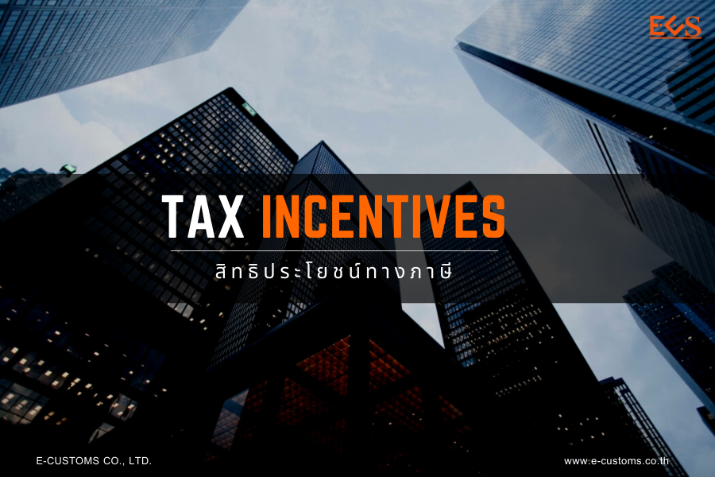

พระราชบัญญัติศุลกากร พ.ศ. 2560 ซึ่งมีผลบังคับใช้ตั้งแต่ 13 พฤศจิกายน 2560 เป็นต้นมา ได้ยกเลิกบรรดาพระราชบัญญัติศุลกากรทุกฉบับที่เคยมีมา โดยได้จัดหมวดหมู่ของกฎหมายออกเป็น 9 หมวด และมีจำนวนถึง 3 หมวดที่บัญญัติในเรื่องสิทธิประโยชน์ทางภาษีอากร กล่าวคือ

1.  หมวดที่ 2 ส่วนที่ 3 ว่าด้วยเรื่อง การคืนอากร ซึ่งมีมาตรา 29 เป็นบทบัญญัติที่สำคัญ
2.  หมวดที่ 5 ว่าด้วยเรื่อง คลังสินค้าทัณฑ์บน โรงพักสินค้า ที่มั่นคง และท่าเรือรับอนุญาต
3.  หมวดที่ 6 ว่าด้วยเรื่อง เขตปลอดอากร และผู้ประกอบกิจการในเขตปลอดอากร

ซึ่งบทบัญญัติของกฎหมาย 3 หมวดดังกล่าวข้างต้น ได้บัญญัติถึงหลักการด้านสิทธิประโยชน์ทางภาษีอากรในมิติต่าง ๆ การออกกฎกระทรวง การให้อำนาจอธิบดี กำหนดหลักเกณฑ์ วิธีการ และเงื่อนไขในการขอหลักการ อนุญาต จัดตั้ง ประกอบกิจการ เพิกถอน และการยกเลิกกิจกรรมต่าง ๆ ที่ว่าด้วยเรื่องสิทธิประโยชน์ทางภาษีอากรตามกฎหมายของศุลกากร

สำหรับผู้ที่สนใจที่จะใช้สิทธิประโยชน์ทางภาษีอากร  ตามบทบัญญัติของกฎหมายศุลกากรทั้ง 3 หมวด ตลอดถึงการขอชดเชยค่าภาษีอากรสินค้าส่งออกที่ผลิตในราชอาณาจักรอย่างละเอียด สามารถสอบถามข้อมูลเพิ่มเติมได้ที่ 
{} 
คลินิกสิทธิประโยชน์ทางภาษีอากร ชั้น 2 อาคารเฉลิมพระเกียรติฯ 
โทรศัพท์ 0-2667-7000 ต่อ 5179 หรือ  
E-mail: taxinclinic@customs.go.th หรือ  
taxinclinic@gmail.com 
โดยเปิดทำการทุกวันจันทร์  – ศุกร์ เวลา 09:30  – 16:00 น.
{}