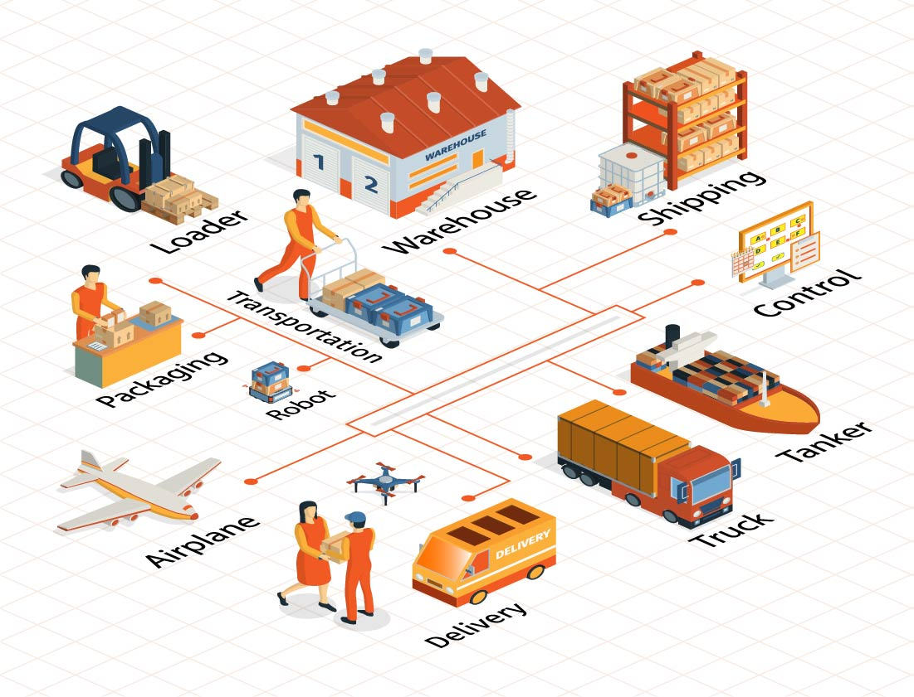

## เลือกสิทธิประโยชน์ต้นทาง การโอนย้ายสินค้า

- [คลังสินค้าทัณฑ์บน](2.bond)
- [ขอคืนอากรตามมาตรา 29](3.section_29)
- [ส่งเสริมการลงทุน BOI](4.boi)
- [เขตปลอดอากร (Freezone)](5.freezone)
- [เขตประกอบการเสรี (I-EAT)](6.i-eat)

