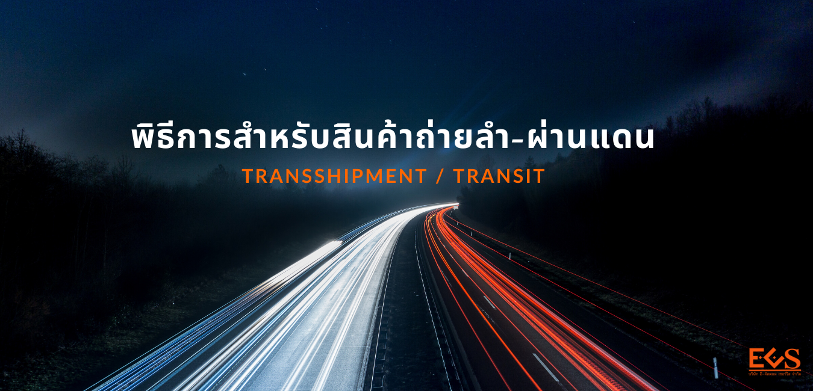
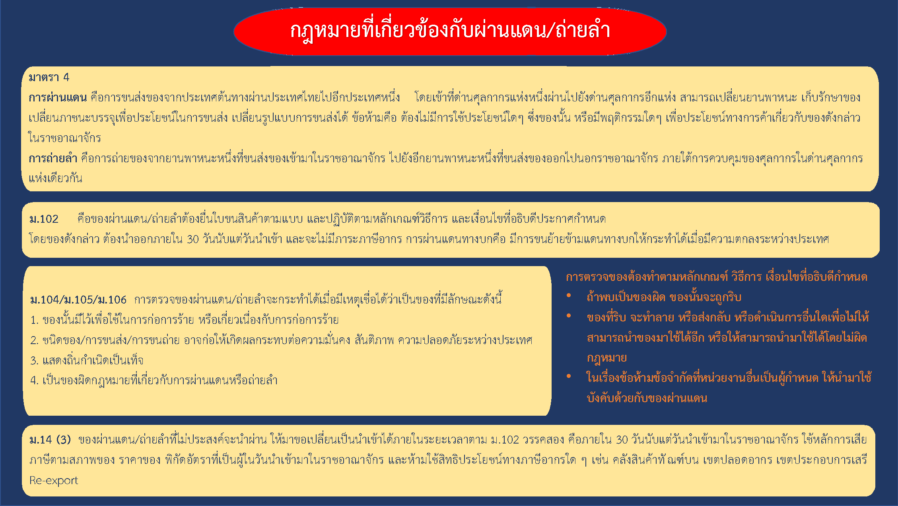
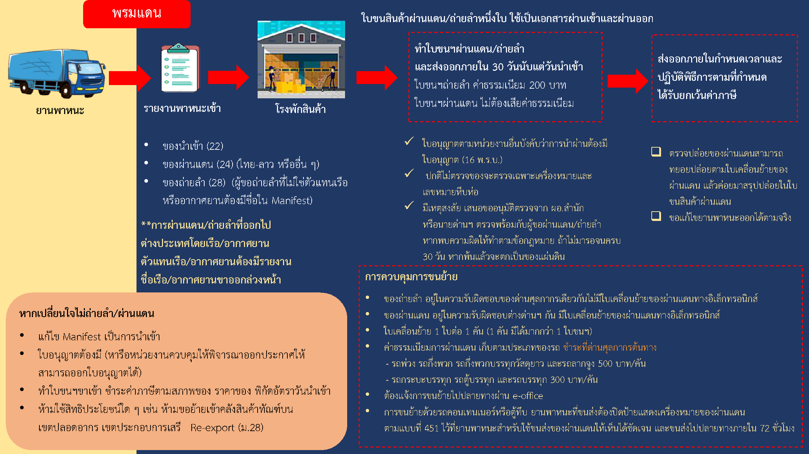
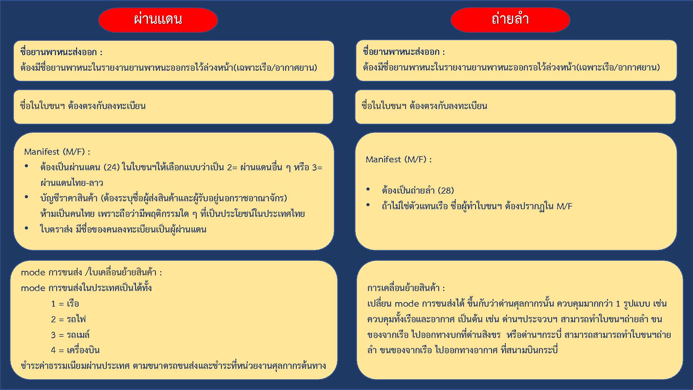
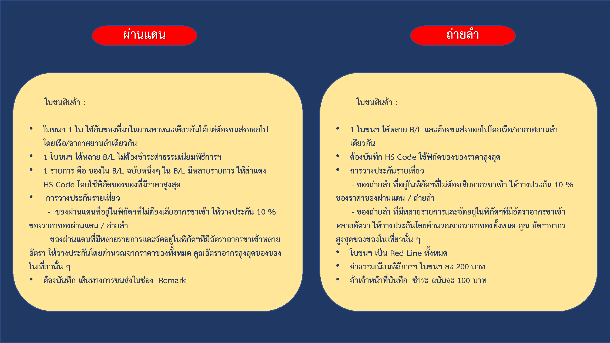



พระราชบัญญัติศุลกากร พ.ศ. 2560 เป็นกฎหมายที่ได้มีการปรับปรุงให้มีความทันสมัย และสอดคล้องกับสถานการณ์ปัจจุบัน อันเป็นการเพิ่มขีดความสามารถในการแข่งขันของประเทศ ซึ่งมีผล ใช้บังคับเมื่อวันที่ 13 พฤศจิกายน 2560 ทั้งนี้ กฎหมายศุลกากรฉบับนี้ยังคงกําหนดบทบัญญัติที่ เกี่ยวข้องกับการผ่านแดนและการถ่ายลําไว้เช่นเดิม เพื่อให้การผ่านแดนและการถ่ายลําเป็นไปตาม มาตรฐานสากล ตามความตกลงทั่วไปว่าด้วยภาษีศุลกากรและการค้า (General Agreement on Tariffs and Trade : GATT) 2494 ใน Article V Freedom of Transit และเป็นไปตามหลักเกณฑ์ในอนุสัญญา ระหว่างประเทศว่าด้วยพิธีการศุลกากรที่เรียบง่ายและสอดคล้องกัน (The International on the Simplification and Harmonization of Customs Procedures) อนุสัญญาบาร์เซโลนาว่าด้วยเสรีภาพ ในการผ่านแดน (Barcelona Convention and Statue on Freedom of Goods in transit) ค.ศ.2523.   

ความตกลงว่าด้วยการขนส่งทางถนนระหว่างรัฐบาลแห่งราชอาณาจักรไทยและ รัฐบาลแห่งสาธารณรัฐประชาธิปไตยประชาชนลาว เมื่อวันที่ 5 มีนาคม 2542 และความตกลงว่าด้วยการขนส่งสินค้าจากฝั่งตะวันออก ไปยังฝั่งตะวันตกของคาบสมุทรมาเลเซีย และกลับกันผ่านแดนไทยโดยการรถไฟแห่ง ประเทศไทย เมื่อวันที่ 24 พฤศจิกายน 2522 เพื่อเป็นการอํานวยความสะดวกแก่ผู้ประกอบการโดยให้ ใช้อาณาเขตของประเทศไทยเป็นเส้นทางขนส่ง ภายใต้การควบคุมของศุลกากร
กฎหมายศุลกากรฉบับนี้ได้กําหนดคํานิยามของคําว่า **“การผ่านแดน”** ไว้ตามหลักการเดิมแห่งพระราชบัญญัติศุลกากร (ฉบับที่ 2) พ.ศ. 2557 โดยเป็นการขนส่งของผ่านราชอาณาจักร จากด่านศุลกากรแห่งหนึ่งที่ขนส่งของเข้ามาไปยังด่านศุลกากรอีกแห่งหนึ่งที่ขนส่งของออกไป ภายใต้การ ควบคุมของศุลกากร โดยมีจุดเริ่มต้นและจุดสิ้นสุดของการขนส่งอยู่นอกราชอาณาจักร นอกจากนั้นยังเพิ่มเติมให้การผ่านแดนจะต้องไม่มีการใช้ประโยชน์ใด ๆ ซึ่งของนั้นหรือมีพฤติกรรมใด ๆ เพื่อประโยชน์ทางการค้า เกี่ยวกับของดังกล่าวในราชอาณาจักรด้วย ก็เพื่อเป็นการป้องกันมิให้อาศัยการปฏิบัติพิธีการ ศุลกากรผ่านแดน ซึ่งมีเจตนารมณ์ในการใช้อาณาเขตของประเทศไทย เป็นเส้นทางในการนําผ่านเท่านั้น มาเพื่อใช้ประโยชน์ซึ่งสินค้าดังกล่าวในทางการค้า ตามที่บัญญัติไว้ในมาตรา 4

## ความรับผิดในเรื่องอากร

**ความรับผิดในเรื่องอากรขาเข้า และ อากรขาออก**

1. ของผ่านแดน หรือ ถ่ายลำ ที่ได้ยื่นใบขนสินค้าตามแบบ และ ดำเนินการตามหลักเกณฑ์ วิธีการและเงื่อนไขที่อธิบดีกำหนด และได้นำของออกไปนอกประเทศไทย*ภายใน 30 วัน* นับแต่วันที่นำเข้ามาในราชอาณาจักร ของนั้นไม่อยู่ภายใต้ความรับผิดที่จะต้องเสียอากร กล่าวคือ ไม่ต้องชำระอากรขาเข้า และ อากรขาออก
2. ของผ่านแดน หรือ ถ่ายลำที่มีการยื่นคำขอเปลี่ยนเป็นการนำเข้า*ภายในกำหนด 30 วัน* นับแต่วันที่นำเข้ามาในราชอาณาจักร และได้ปฏิบัติครบถ้วนตามกฎหมายศุลกากรและกฎหมายอื่นที่เกี่ยวกับการนำเข้า ของนั้นต้องชำระอากรขาเข้าโดยคำนวณตามสภาพของ ราคาของ และพิกัดอัตราศุลกากร ที่เป็นอยู่ในเวลาที่นำของนั้นเข้ามาในราชอาณาจักร
3. ของผ่านแดนตามความตกลงว่าด้วยการขนส่งทางถนน ระหว่างรัฐบาลแห่งราชอาณาจักรไทยและ*รัฐบาลแห่งสาธารณรัฐประชาธิปไตยประชาชนลาว* ที่ไม่ได้นำออกไปนอกประเทศไทย หรือ ไม่มีการยื่นคำขอเปลี่ยนเป็นการนำเข้า _ภายใน 90 วัน_ นับแต่วันที่นำเข้ามาในราชอาณาจักร ของนั้นตกเป็นของตกค้าง
4. ของผ่านแดนตาม*ความตกลง GATT 1994* หรือ ของถ่ายลำ ที่ไม่ได้นำออกไปนอกประเทศไทย หรือ ไม่มีการยื่นคำขอเปลี่ยนเป็นการนำเข้า _ภายใน 30 วัน_ นับแต่วันที่นำเข้ามาในราชอาณาจักร ของนั้นตกเป็นของแผ่นดิน

## การจดทะเบียนเป็นผู้ขอผ่านแดน

**การขอเป็นผู้ขนส่งผ่านแดน ผู้ขอผ่านแดน ผู้ขอถ่ายลำ**

ผู้ที่ประสงค์จะขอเป็นผู้ขนส่งผ่านแดน หรือ ผู้ขอผ่านแดน หรือ ผู้ขอถ่ายลำ ต้องเป็นผู้ที่มีคุณสมบัติตามที่กรมศุลกากรกำหนดและยื่นคำขออนุมัติ เมื่อได้รับอนุมัติแล้วต้องทำสัญญาประกันทัณฑ์บน และวางหลักประกันเป็นเงินสดหรือหนังสือค้ำประกันของธนาคารเป็นประกันการดำเนินการ โดยผู้ขอผ่านแดนที่จดทะเบียนเป็นผู้ขอถ่ายลำด้วยสามารถใช้หลักประกันจำนวนเดียวกันค้ำประกันการดำเนินการทั้งสองประเภทได้ และ **หากเป็นผู้ประกอบการ AEO สามารถใช้หลักประกันของ AEO ค้ำประกันได้ด้วย** แต่เฉพาะผู้ขอผ่านแดนที่ขอเป็นผู้ขนส่งผ่านแดนด้วยต้องวางหลักประกันแยกกัน โดยหลักประกันดังกล่าว ครอบคลุมการดำเนินการทุกครั้งที่มีการขนส่ง ทั้งนี้ผู้ได้รับอนุมัติเป็นผู้ขนส่งผ่านแดน หรือ ผู้ขอผ่านแดน หรือ ผู้ขอถ่ายลำ อาจเลือกการวางหลักประกัน เป็นแบบรายเที่ยวก็ได้

## กฎหมายที่เกี่ยวข้อง

## พิธีการศุลกากร

**พิธีการศุลกากรในการขนย้ายของผ่านแดน และ ถ่ายลำ**

ผู้ขนส่งผ่านแดน หรือ ผู้ขอผ่านแดน หรือ ผู้ขอถ่ายลำ ที่ได้รับอนุมัติ ต้องจัดทำใบขนสินค้าผ่านแดนหรือใบขนสินค้าถ่ายลำในระบบอิเล็กทรอนิกส์แบบไร้เอกสารตามที่กรมศุลกากรกำหนด ยกเว้น การผ่านแดนทางรถไฟตามความตกลงว่าด้วยการขนส่งสินค้าผ่านแดนระหว่างประเทศไทยกับประเทศมาเลเซีย ให้ใช้ใบขนสินค้าผ่านแดนในรูปแบบกระดาษ เรียกว่า แบบ 448

## _ข้อควรทราบ_

การผ่านแดนตามพระราชบัญญัติศุลกากร พ.ศ. 2560 มาตรา 102 วรรคสาม กำหนดให้ **“การผ่านแดนที่มีการข้ามแดนทางบกให้กระทำได้ต่อเมื่อมีความตกลงระหว่างประเทศ”** หมายความว่า การผ่านแดนที่มีการข้ามแดนทางบกไม่ว่าจะมีการผ่านเข้าหรือผ่านออกจะต้องมีการทำความตกลงกับประเทศที่มีเขตแดนทางบกติดต่อกับประเทศไทย หากยังไม่มีความตกลงจะ**ไม่สามารถปฏิบัติพิธีการผ่านแดน** ต่อกันได้

ปัจจุบันประเทศไทยมีความตกลงเกี่ยวกับการผ่านแดนอยู่ 2 ความตกลง คือ การผ่านแดนตามความตกลงว่าด้วยการขนส่งทางถนนระหว่างรัฐบาลแห่งราชอาณาจักรไทยและรัฐบาลแห่ง*สาธารณรัฐประชาธิปไตยประชาชนลาว* และการผ่านแดนความตกลงว่าด้วยการขนส่งสินค้าจากฝั่งตะวันออกไปยังฝั่งตะวันตกของคาบสมุทร _มาเลเซียและกลับกันผ่านแดนไทยโดยการรถไฟแห่งประเทศไทย_ **(90 วัน)**

**MOU (Memorandum of Understanding)** หรือเรียกกันว่า _บันทึกความเข้าใจ_ หมายถึง เอกสารที่บันทึกข้อตกลงความร่วมมือ หรือความเข้าใจระหว่างองค์กร หน่วยงานภาครัฐ และเอกชน ซึ่งเมื่อทั้งสองฝ่าย **มีความเห็นตรงกัน** รับทราบถึงรายละเอียดในบันทึกข้อตกลง และยอมรับข้อตกลงที่ทำร่วมกันแล้ว ตัวแทนผู้มีอำนาจของทั้งสองฝ่ายจะลงนามในบันทึกข้อตกลงนั้น เพื่อรับรองว่า ทั้งสองฝ่ายพึงพอใจกับข้อตกลงที่ทำร่วมกัน และ MOU ฉบับนี้ก็จะมีผลบังคับใช้เมื่อทั้งสองฝ่ายได้ลงนามในเอกสารนั้นเป็นที่เรียบร้อยแล้ว **(30 วัน)**


**กรมศุลกากรเพิ่มการตรวจสอบข้อมูล** [24/12/62]

ศูนย์เทคโนโลยีสารสนเทศและการสื่อสาร ขอแจ้งการปรับปรุงระบบ โปรแกรมรับใบขนสินค้าถ่ายลำผ่านแดน และใบเคลื่อนย้ายของผ่านแดน นำขึ้นใช้งานจริง ภายในวันที่ 3 มกราคม 2563 โดยระบบมีเงื่อนไขการตรวจสอบข้อมูลที่ยื่นทำใบขนสินค้าถ่ายลำ/ผ่านแดน และใบเคลื่อนย้ายของผ่านแดน ดังนี้

- ตรวจสอบค่า Port สถานที่ตรวจปล่อยที่ยื่นทำใบขนสินค้าถ่ายลำ/ผ่านแดน และใบเคลื่อนย้ายของผ่านแดน ต้องมีค่า Indicator สอดคล้องกับค่า Area Code ใน Reference File ที่กรมศุลกากรกำหนดว่า Port Code นั้นเป็นสถานที่ตรวจปล่อยขาเข้า หรือขาออก หากค่าที่ส่งมานั้นไม่ถูกต้องระบบจะทำการ Reject
- ตรวจสอบการหมดอายุของการวางค้ำประกันแบบหนังสือ สำหรับพิธีการถ่ายลำผ่านแดน หากหนังสือการวางค้ำประกันหมดอายุจะไม่สามารถส่งข้อมูลใบขนสินค้าถ่ายลำผ่าน ผ่านแดนได้





- สอบถามข้อมูลเพิ่มเติมได้ที่ : สำนักงานศุลกากรท่าเรือกรุงเทพ (สทก.)
  กรมศุลกากร เลขที่ 1 ถ.สุนทรโกษา คลองเตย กทม. 10110
- หมายเลขโทรศัพท์ : 0-2667-7000 ต่อ 20-5604
- อีเมล์ : 70000100@customs.go.th
  

> - ที่มา : [กรมศุลกากร](http://www.customs.go.th/cont_strc_simple.php?ini_content=business_160426_02_160923_01_180614_01&ini_menu=menu_business_160421_02&lang=th&left_menu=menu_business_160421_02_160421_03).
> - วันที่ปรับปรุงล่าสุด : 6 กรกฎาคม 2561
