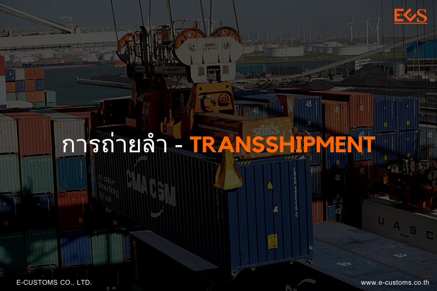
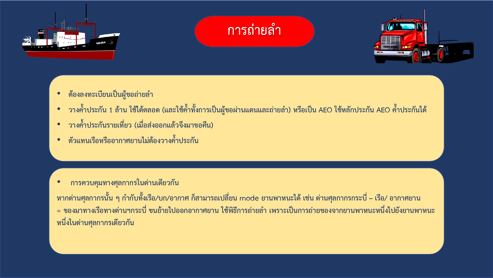





**การถ่ายลำ (Transshipment)** หมายถึง การขนถ่ายสิ่งของจากยานพาหนะหนึ่งที่ขนเข้ามาในประเทศ แล้วเปลี่ยนไปเป็นอีกพาหนะหนึ่งที่ขนออกไปนอกประเทศ ภายในท่าหรือที่แห่งเดียวกัน (ภายใต้การควบคุมของศุลกากรในด่านศุลกากรแห่งเดียวกัน) โดยมีจุดเริ่มต้นและจุดสิ้นสุดของการขนส่งอยู่นอกประเทศ โดยของหรือสินค้านั้นจะไม่มีการนำมาใช้ประโยชน์ภายในประเทศ

ตาม [ประกาศกรมศุลกากรที่ 140/.2560 เรื่อง พิธีการศุลกากรว่าด้วยการถ่ายลำทางอิเล็กทรอนิกส์](/KM/customs/post/announcement/customs/2560-140/) มีผลบังคับใช้ตั้งแต่วันที่ 13 พฤศจิกายน 2560 เป็นต้นมา ได้กำหนดพิธีการศุลกากรสำหรับการถ่ายลำมี่รายละเอียดดังนี้

**การถ่ายลํา** หมายความว่า การถ่ายของจากยานพาหนะหนึ่งที่ขนส่งของเข้ามา ในราชอาณาจักรไปยังอีกยานพาหนะหนึ่งที่ขนส่งของออกไปนอกราชอาณาจักร ภายใต้การควบคุมของศุลกากร ในด่านศุลกากรแห่งเดียวกัน โดยมีจุดเริ่มต้นและจุดสิ้นสุดของการขนส่งอยู่นอกราชอาณาจักร  


## เงื่อนไขการถ่ายลํา

**ของที่นําเข้ามาในราชอาณาจักรเพื่อทําการถ่ายลําตามหลักการในข้อ**

1. จะต้อง อยู่ภายใต้เงื่อนไข ดังต่อไปนี้

- ต้องมีบัญชีสินค้าสําหรับเรือหรืออากาศยาน หรือเอกสารการขนส่ง ระหว่างประเทศ หรือ ใบตราส่งสินค้าที่แจ้งท่าหรือสนามบินต้นทางและท่าหรือสนามบินปลายทางที่อยู่นอก ราชอาณาจักร
- บัญชีตู้คอนเทนเนอร์ (Container List) (ถ้ามี) ต้องระบุท่าหรือสนามบิน ถ่ายลําที่อยู่ในราชอาณาจักร
- กรณีที่ผู้ขอถ่ายลําไม่ใช่ตัวแทนเรือหรือสายการบิน ต้องมีชื่อผู้ขอถ่ายลําใน บัญชีสินค้าสําหรับเรือหรืออากาศยาน
- ของถ่ายลําให้ส่งออกไปนอกราชอาณาจักรภายใน 30 วัน นับแต่วันที่นำของถ่ายลําเข้ามาในราชอาณาจักร
- ในกรณีที่ผู้ขอถ่ายลําประสงค์จะเปลี่ยนการผ่านพิธีการศุลกากรจากการ ถ่ายลําเป็นการนําเข้า ต้องดําเนินการขอแก้ไขบัญชีสินค้าสําหรับเรือหรืออากาศยานหรือเอกสารการขนส่ง ระหว่างประเทศและใบตราส่งสินค้า ณ ด่านศุลกากรที่นําเข้า โดยปฏิบัติพิธีการนําเข้าพร้อมชําระภาษีอากร (หากมี) เท่านั้น ไม่สามารถใช้สิทธิประโยชน์ตามกฎหมายศุลกากรและกฎหมายอื่นที่เกี่ยวข้องได้ รวมถึงปฏิบัติ ตามกฎหมายอื่นที่เกี่ยวข้องและนําของนั้นออกไปจากอารักขาของศุลกากรให้แล้วเสร็จ ภายใน 30 วันนับแต่ วันนําของถ่ายลําเข้ามาในราชอาณาจักร โดยให้คํานวณอากรตามสภาพแห่งของ ราคาศุลกากร และพิกัดอัตรา ศุลกากรที่เป็นอยู่ในเวลาที่นําของนั้นเข้ามาในราชอาณาจักร และไม่สามารถส่งกลับเพื่อขอคืนอากรตาม มาตรา 28 แห่งพระราชบัญญัติศุลกากร พ.ศ. 2560


ในกรณีที่ผู้ขอถ่ายลําไม่นําของออกไปนอกราชอาณาจักรภายใน กําหนดเวลาตามวรรคหนึ่ง ให้ของนั้นตกเป็นของแผ่นดิน


## ของถ่ายลําที่นําเข้าทางเรือ
ในกรณีที่ยังไม่อาจยื่นใบขนสินค้าถ่ายลําได้ และผู้ขอถ่ายลําประสงค์จะขอ ถ่ายลําออกจากเรือ เพื่อรอรับการรับบรรทุกออกไปนอกราชอาณาจักร ให้ปฏิบัติดังต่อไปนี้  

1. **ของถ่ายลําที่เป็นของกองหรือมิได้บรรจุในตู้คอนเทนเนอร์** ให้เก็บวางของถ่ายลําในโรงพักสินค้าไม่ปะปนกับของนําเข้าอื่นๆ การตรวจนับจํานวนหีบห่อของถ่ายลําที่ขนถ่ายจากเรือเข้าเก็บไว้ใน โรงพักสินค้าให้ตรงตามบัญชีสินค้า ให้อยู่ในความควบคุมดูแลของหน่วยงานศุลกากรที่กํากับเรือ โดยมีหน้าที่ใน การตรวจสอบรายการตรวจนับหีบห่อ (Taly Sheet) ของพนักงานโรงพักสินค้าและของตัวแทนเรือว่าของถ่าย ลําได้ขนขึ้นและเก็บในโรงพักสินค้าถูกต้องตามบัญชีสินค้าสําหรับของถ่ายลําหรือไม่ มีขาดหรือเกินหรือไม่ ประการใด ถ้ามีการขนขึ้นขาดหรือเกิน ให้จดบันทึกไว้ในเอกสารรายการตรวจนับหีบห่อ (Tally Sheet) และ ให้ตัวแทนเรือส่งข้อมูลแก้ไขบัญชีสินค้าสําหรับของถ่ายลําให้ถูกต้อง
กรณีหีบห่อชํารุดหรือแตกหักเสียหาย การเปิดหีบห่อเพื่อสํารวจ รายการแตกหักเสียหาย ให้กระทําต่อหน้าตัวแทนเรือผู้รับขน พนักงานศุลกากรประจําโรงพักสินค้าที่ของถ่ายลํา นั้นเก็บรักษาอยู่ และผู้ที่มีชื่อระบุในเอกสารการขนส่งระหว่างประเทศหรือใบตราส่งหรือผู้ที่ได้รับมอบหมาย  

2. **ของถ่ายลําที่บรรจุในตู้คอนเทนเนอร์**  
  1. ให้ตัวแทนเรือแยกบัญชีของถ่ายลําที่บรรจุในตู้คอนเทนเนอร์ไว้ ต่างหากจากบัญชีของนําเข้าทั่วไป และแจ้งหมายเลขดวงตราประทับ (SEAL) ของบริษัทเรือสําหรับตู้คอนเทนเนอร์ แต่ละตู้ (ถ้ามี) ในบัญชีตู้คอนเทนเนอร์ เพื่อประกอบการควบคุมตรวจสอบ การเก็บรักษา และการขนย้ายตู้คอน เทนเนอร์ภายในเขตท่า
  2. ของถ่ายลําที่บรรจุในตู้คอนเทนเนอร์ ที่บรรจุของขาเข้าหลาย ผู้รับตราส่ง (ตู้ Less Container Load: LCL) ให้เก็บวางของถ่ายลําในโรงพักสินค้าให้เป็นสัดส่วน ไม่ปะปนกับ ของนําเข้าอื่นๆ
  3. ของถ่ายลําที่บรรจุในตู้คอนเทนเนอร์ ที่บรรจุของขาเข้าผู้รับตรา ส่งรายเดียว ( Fut Container Load: FCL) เมื่อขนถ่ายตู้คอนเทนเนอร์ซึ่งบรรจุของถ่ายลําลงจากเรือแล้ว ให้เก็บ ให้เป็นสัดส่วนเหมาะสม ไม่ปะปนกับของนําเข้าอื่นๆ

## ของถ่ายลําที่นําเข้าทางอากาศยานหรือทางบก

การเก็บของถ่ายลําที่นําเข้าทางอากาศยานหรือทางบก ให้ปฏิบัติตาม**ของถ่ายลําที่นําเข้าทางเรือ** โดยอนุโลม

## การทําใบขนสินค้าถ่ายลํา

1. ใบขนสินค้าถ่ายลําแต่ละฉบับให้ใช้กับของถ่ายลําที่นําเข้ามาโดยเรือลํา เดียวกัน และให้ใช้ได้กับเอกสารการขนส่งระหว่างประเทศหรือใบตราส่งที่ระบุเมืองปลายทาง ต่างประเทศเดียวกันได้หลายฉบับ
2. ให้ผู้ขอถ่ายลําจัดทําข้อมูลใบขนสินค้าถ่ายลําตามโครงสร้างมาตรฐานที่กรม ศุลกากรกําหนด และส่งข้อมูลทางอิเล็กทรอนิกส์เข้าสู่ระบบคอมพิวเตอร์ของศุลกากร ตามเอกสารแนบท้าย
3. ระบบคอมพิวเตอร์ของศุลกากรจะตรวจสอบความถูกต้องกับแฟ้มข้อมูลอ้างอิง ข้อมูลการอนุมัติ/อนุญาตตามกฎหมายที่เกี่ยวข้อง และข้อมูลบัญชีสินค้า สําหรับเรือหรืออากาศยาน ดังนี้

  - **ประเภทของกระบวนการ (Processing Indicator) มีค่าเป็น 28 = Transshipment (ถ่ายลํา)**
  - ประเภทการถ่ายลํา (Transshipment Type) มีค่าเป็น ด= การถ่าย ลําในด่านศุลกากรเดียวกัน
  - เลขประจําตัวผู้เสียภาษีของผู้ขอถ่ายลํา (Transshipment Applicant)
  - **ประเภทการขนถ่าย (Cargo Movement) มีค่าเป็น 3 = Transshipment (ขนถ่ายของถ่ายลํา)**
  - ชื่อผู้ขาย ชื่อผู้ส่งสินค้าในต่างประเทศ (Shipper Name)
  - ประเทศของผู้ส่งสินค้าในต่างประเทศ (Shipper Country Code)
  - ชื่อผู้ซื้อ/ชื่อผู้รับสินค้าในต่างประเทศ (Consignee Name)
  - ประเทศผู้รับสินค้าในต่างประเทศ (Consignee Country)
  - เลขที่ใบตราส่งสินค้าขาเข้า (Bit of Lading)
  - หมายเลขตู้คอนเทนเนอร์ (Container Number) (เฉพาะทางเรือ)
  - จํานวนหีบห่อของสินค้า (Total Package Amount)
  - หน่วยของหีบห่อ (Total Package Unit Code)
  - รหัสโกดังหรือสถานที่เก็บของ (Shed Number)/รหัสโรงพักสินค้า หรือสถานที่ตรวจปล่อยของ (Release Port)
  - รหัสท่าหรือสนามบิน ที่ทําการขนถ่ายของถ่ายลําเข้ามาในราชอาณาจักร (Port of Discharge)/รหัสท่าหรือสนามบิน ที่จะทําการ ขนถ่ายของถ่ายลําออกไปนอกราชอาณาจักร (Port of Loading)  
  
4. กรณีตรวจพบข้อผิดพลาดในการตรวจสอบความถูกต้องกับแฟ้มข้อมูลอ้างอิง ระบบคอมพิวเตอร์ของศุลกากรจะตอบรหัสข้อผิดพลาดกลับไปให้ ผู้ขอถ่ายลําต้องทําการแก้ไขข้อมูลและส่ง ข้อมูลที่แก้ไขแล้วเข้าสู่ระบบคอมพิวเตอร์ของศุลกากร
5. กรณีไม่พบข้อผิดพลาด ระบบคอมพิวเตอร์ของศุลกากรจะกําหนดเลขที่ใบขน สินค้าถ่ายลําทางอิเล็กทรอนิกส์จํานวน 14 หลัก โดยหลักที่ 5 ของเลขที่ใบขนสินค้าถ่ายลํา มีค่าเป็น **4** Transshipment และแจ้งเลขที่ใบขนสินค้าถ่ายลําทางระบบอิเล็กทรอนิกส์ตอบกลับไปยังผู้ขอถ่ายลํา

> ที่มา : กรมศุลกากร
