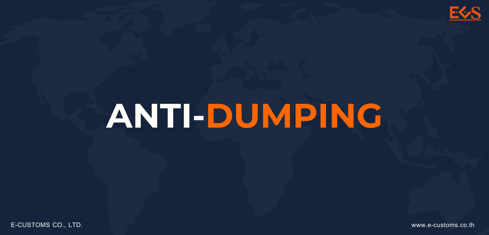
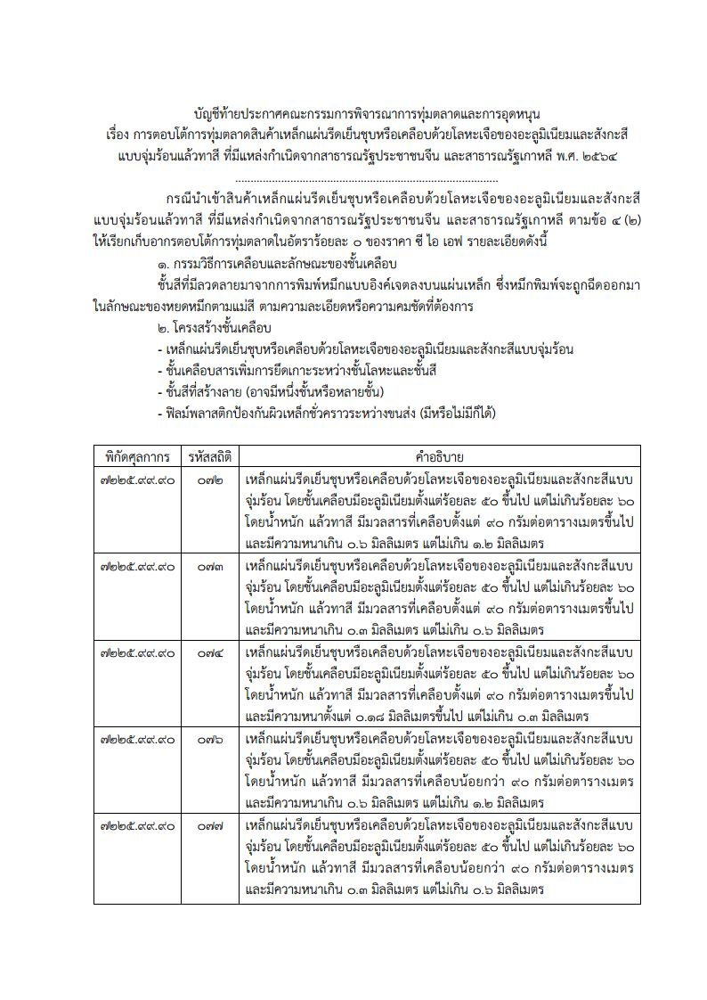
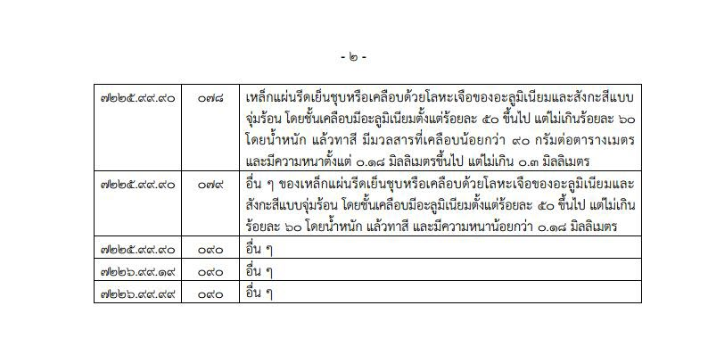

## การตอบโต้การทุ่มตลาดสินค้าเหล็กแผ่นรีดเย็นชุบหรือเคลือบด้วยโลหะเจือของอะลูมิเนียมและสังกะสีแบบจุ่มร้อนแล้วทาสี

### รายละเอียดการใช้มาตรการของสินค้า.    

**มาตรการ** : ตอบโต้การทุ่มตลาด (Anti-dumping)  
**ชื่อสินค้า** : เหล็กแผ่นรีดเย็นชุบหรือเคลือบด้วยโลหะเจือของอะลูมิเนียมและสังกะสีแบบจุ่มร้อนแล้วทาสี  
**ประเทศ** : *สาธารณรัฐประชาชนจีน สาธารณรัฐเกาหลี*  
**พิกัดศุลกากร** :
7210.7011.032, 7210.7011.033, 7210.7011.034, 7210.7011.042, 7210.7011.043, 7210.7011.044, 7210.7011.090, 7210.7091.020, 7210.7091.030, 7210.7091.040, 7210.7091.090, 7212.4011.090, 7212.4012.090, 7212.4019.090, 7212.4091.090, 7212.4092.090, 7212.4099.090, 7225.9990.072, 7225.9990.073, 7225.9990.074, 7225.9990.076, 7225.9990.077, 7225.9990.078, 7225.9990.079, 7225.9990.090, 7226.9919.090, 7226.9999.090  

ให้เรียกเก็บอากรตอบโต้การทุ่มตลาดจากการนําเข้าสินค้าเหล็กแผ่นรีดเย็นชุบ หรือเคลือบด้วยโลหะเจือ ของอะลูมิเนียมและสังกะสีแบบจุ่มร้อนแล้วทาสี ภายใต้พิกัดอัตราศุลกากร ปี 2560  ที่มีแหล่งกําเนิดจากสาธารณรัฐประชาชนจีน และสาธารณรัฐเกาหลีใน*อัตราร้อยละ 0* ของราคา ซี ไอ เอฟ เป็น*ระยะเวลา 5 เดือน* นับแต่วันที่ประกาศนี้มีผลใช้บังคับ หรือเป็นไปตามที่ คณะกรรมการกําหนดเป็นอย่างอื่น

**เมื่อพ้นระยะเวลาตามวรรคหนึ่ง ให้เรียกเก็บอากรตอบโต้การทุ่มตลาด ในอัตราดังนี้**

1. สินค้าที่มีแหล่งกําเนิดจาก*สาธารณรัฐประชาชนจีน* ในอัตรา*ร้อยละ 40.77* ของราคา ซี ไอ เอฟ
2. สินค้าที่มีแหล่งกําเนิดจากสาธารณรัฐเกาหลี
  - ร้อยละ *7.00* ของราคา ซี ไอ เอฟ สําหรับสินค้าที่ผลิตจาก *บริษัท Dongkuk Steel Mill Co., Ltd.*
  - ร้อยละ *4.27* ของราคา ซี ไอ เอฟ สําหรับสินค้าที่ผลิตจาก *บริษัท SeAH Coated Metal Corporation*
  - ร้อยละ *33.62* ของราคา ซี ไอ เอฟ สําหรับสินค้าที่ผลิตจาก*รายอื่น*

  
**วันที่เริ่มต้นเรียกเก็บอากร** : *01 พ.ค. 2564*  
**วันที่สิ้นสุดเรียกเก็บอากร** :  *30 เม.ย. 2569*

 


 

<a class="badge badge-danger" href="./AD1042.pdf" target="_blank" id="download_files_new">Download</a> 

 

> ที่มา : [กองปกป้องและตอบโต้ทางการค้า](https://www.thaitr.go.th/th/search/AD1042)   
กรมการค้าต่างประเทศ กระทรวงพาณิชย์
