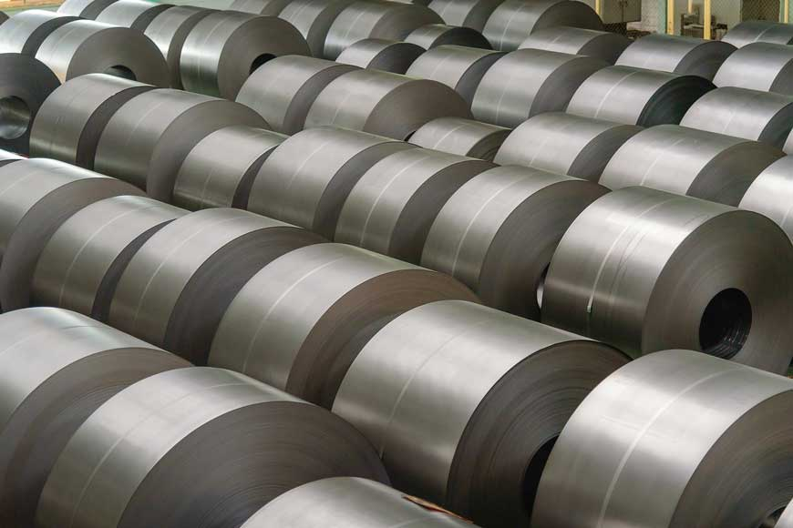

## การตอบโต้การทุ่มตลาดสินค้าเหล็กแผ่นรีดเย็นเคลือบสังกะสีแบบจุ่มร้อนชนิดเป็นม้วนและไม่เป็นม้วนที่มีแหล่งกำเนิดจากสาธารณรัฐประชาชนจีน

### รายละเอียดการใช้มาตรการของสินค้า.    

มาตรการ : **AD**.   
ชื่อสินค้า : **สินค้าเหล็กแผ่นรีดเย็นเคลือบสังกะสีแบบจุ่มร้อนชนิดเป็นม้วนและไม่เป็นม้วน**.  
ประเทศ : **สาธารณรัฐประชาชนจีน**.   
CASE ID : AD1043.  
**พิกัดศุลกากร** : 7210.4912.021, 7210.4912.022, 7210.4912.023, 7210.4912.024, 7210.4912.031, 7210.4912.032, 7210.4912.033, 7210.4912.034, 7210.4912.090, 7210.4913.021, 7210.4913.031, 7210.4913.090, 7210.4919.021, 7210.4919.031, 7210.4919.090, 7210.4991.000, 7210.4999.000. 7212.3011.021, 7212.3011.031, 7212.3011.090, 7212.3012.021, 7212.3012.031, 7212.3012.090, 7212.3013.011, 7212.3013.090, 7212.3019.011, 7212.3019.090, 7225.9290.090

| ขั้นตอนการไต่สวน                                                                                                                                                                                                                                            | เริ่มต้น                                  |
|:------------------------------------------------------------------------------------------------------------------------------------------------------------------------------------------------------------------------------------------------------------|:------------------------------------------|
| [1. เปิดการไต่สวนการทุ่มตลาด](https://www.thaitr.go.th/storage/announcements/Cj8F5Rif73evhadvUWqJyhXODA32OC8Zd5OogCjU.pdf)                                                                                                                                  | 21 ก.พ. 2563 (อยู่ระหว่างกระบวนการไต่สวน) |
| **1.2 มาตรการชั่วคราว**                                                                                                                                                                                                                                     |                                  |
| [1.2.1 การตอบโต้การทุ่มตลาดสินค้าเหล็กแผ่นรีดเย็นเคลือบสังกะสี แบบจุ่มร้อนชนิดเป็นม้วนและไม่เป็นม้วน พ.ศ. 2563](files/AD1043-01.pdf)                                                                                                                        | 03 ส.ค. 2563                              |
| [1.2.2 หลักเกณฑ์ วิธีการ และเงื่อนไขในการนำเข้าสินค้าเหล็กแผ่นรีดเย็น เคลือบสังกะสีแบบจุ่มร้อนชนิดเป็นม้วนและไม่เป็นม้วน ที่มีแหล่งกำเนิดจากสาธารณรัฐประชาชนจีน เพื่อใช้ในอุตสาหกรรมการผลิตยานยนต์และชิ้นส่วนยานยนต์ พ.ศ. 2563](files/AD1043-02.pdf)        | 03 ส.ค. 2563                              |
| [1.2.3 หลักเกณฑ์ วิธีการ และเงื่อนไขในการนำเข้าสินค้าเหล็กแผ่นรีดเย็นเคลือบสังกะสี แบบจุ่มร้อนชนิดเป็นม้วนและไม่เป็นม้วน ที่มีแหล่งกำเนิดจากสาธารณรัฐประชาชนจีน เพื่อใช้ในอุตสาหกรรมการผลิตเครื่องใช้ไฟฟ้าและอิเล็กทรอนิกส์ พ.ศ. 2563](files/AD1043-03.pdf) | 03 ส.ค. 2563                              |.  

 

### การตอบโต้การทุ่มตลาดสินค้าเหล็กแผ่นรีดเย็นเคลือบสังกะสี แบบจุ่มร้อนชนิดเป็นม้วนและไม่เป็นม้วน

 



 

### หลักเกณฑ์ วิธีการ และเงื่อนไขในการนำเข้าสินค้าเหล็กแผ่นรีดเย็น เคลือบสังกะสีแบบจุ่มร้อนชนิดเป็นม้วนและไม่เป็นม้วน ที่มีแหล่งกำเนิดจากสาธารณรัฐประชาชนจีน เพื่อใช้ในอุตสาหกรรมการผลิตยานยนต์และชิ้นส่วนยานยนต์

 



 

### หลักเกณฑ์ วิธีการ และเงื่อนไขในการนำเข้าสินค้าเหล็กแผ่นรีดเย็นเคลือบสังกะสี แบบจุ่มร้อนชนิดเป็นม้วนและไม่เป็นม้วน ที่มีแหล่งกำเนิดจากสาธารณรัฐประชาชนจีน เพื่อใช้ใน อุตสาหกรรมการผลิตเครื่องใช้ไฟฟ้าและอิเล็กทรอนิกส์

 


 

> ที่มา : [กองปกป้องและตอบโต้ทางการค้า](https://www.thaitr.go.th/th/search/AD1043)   
กรมการค้าต่างประเทศ กระทรวงพาณิชย์
