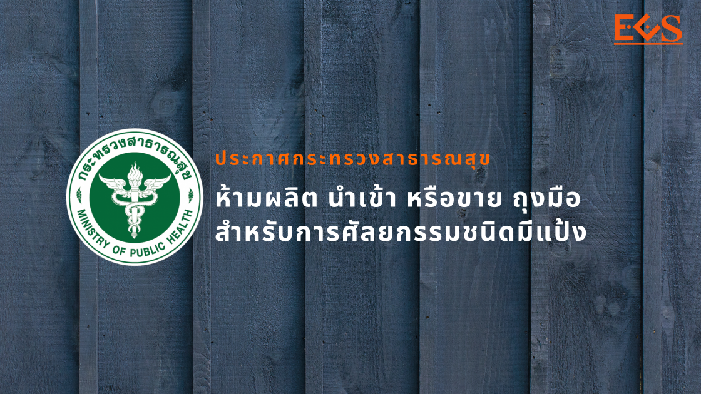
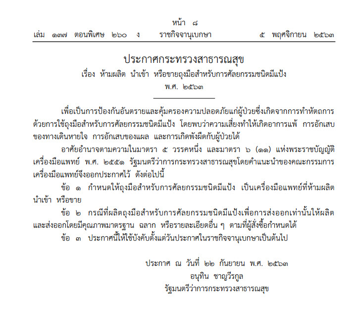

## ประกาศกระทรวงสาธารณสุข เรื่อง ห้ามผลิต นำเข้า หรือขายถุงมือสำหรับการศัลยกรรมชนิดมีแป้ง พ.ศ. 2563 

มีผลบังคับใช้ ตั้งแต่วันที่ 5 พฤศจิกายน 2563 เป็นต้นไป 

<a class="badge badge-danger" href="./FDA-2563-11.pdf" target="_blank" id="download_files_new">Download </a> <i id="files" class=" fas fa-file-pdf"></i>

 

> ที่มา : [ราชกิจจานุเบกษา](http://www.ratchakitcha.soc.go.th/DATA/PDF/2563/E/260/T_0008.PDF)

