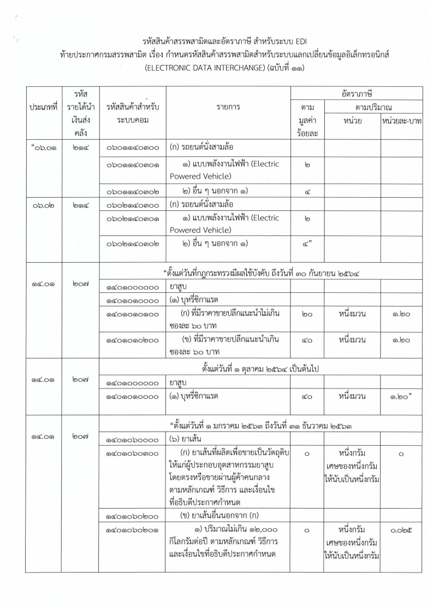
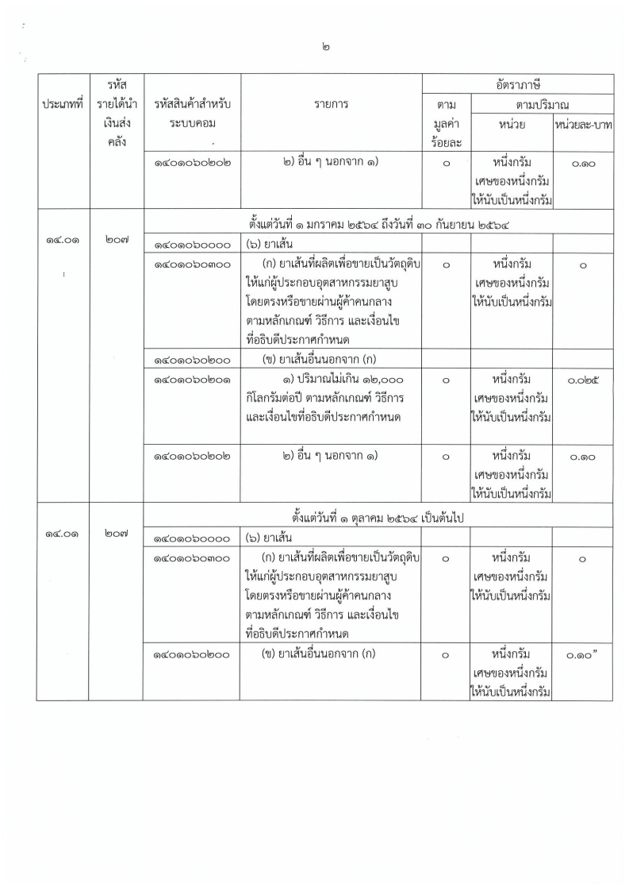

## ประกาศกรมสรรพสามิต เรื่อง กำหนดรหัสสินค้าสรรพสามิตสำหรับระบบแลกเปลี่ยนข้อมูลอิเล็กทรอนิกส์ (ELECTRONIC DATA INTERCHANGE) (ฉบับที่ 11)

เพื่อให้รหัสสินค้าสรรพสามิตและอัตราภาษีสรรพสามิต สำหรับระบบแลกเปลี่ยนข้อมูลอิเล็กทรอนิกส์ (ELECTRONIC DATA INTERCHANGE : EDI) ถูกต้องและเป็นปัจจุบัน อธิบดีกรมสรรพสามิตจึงกำหนดรหัสสินค้าสรรพสามิต รายการภาษีสรรพสามิต และอัตราภาษีสรรพสามิต เฉพาะในส่วนของ**สินค้ารถยนต์นั่งสามล้อ (ก) ของ (5) ของประเภทที่ 06.01 และ 06.02 บุหรี่ซิกาแรต ใน (1) ของประเภทที่ 14.01 และยาเส้นใน (6) ของประเภทที่ 14.01** ไว้ดังต่อไปนี้ มีผลบังคับใช้ **_ตั้งแต่วันที่ 9 กรกฎาคม 2563 เป็นต้นไป_**

### ประกาศฉบับเต็ม
 


 

> ที่มา : [กรมสรรพสามิต](http://edi.excise.go.th/)
