## ประกาศกรมศุลกากร ที่ 173/2560 เรื่อง หลักเกณฑ์ วิธีการ และเงื่อนไขการชักตัวอย่างของ

มีผลบังคับตั้งแต่*วันที่ 27 พฤศจิกายน 2560* เป็นต้นไป

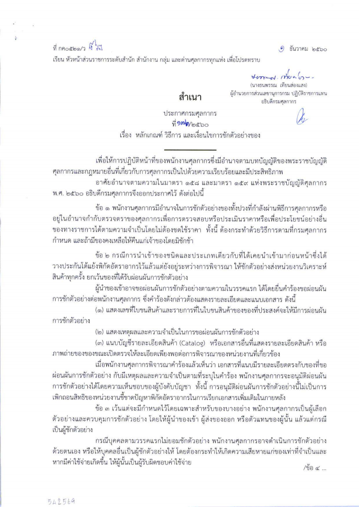

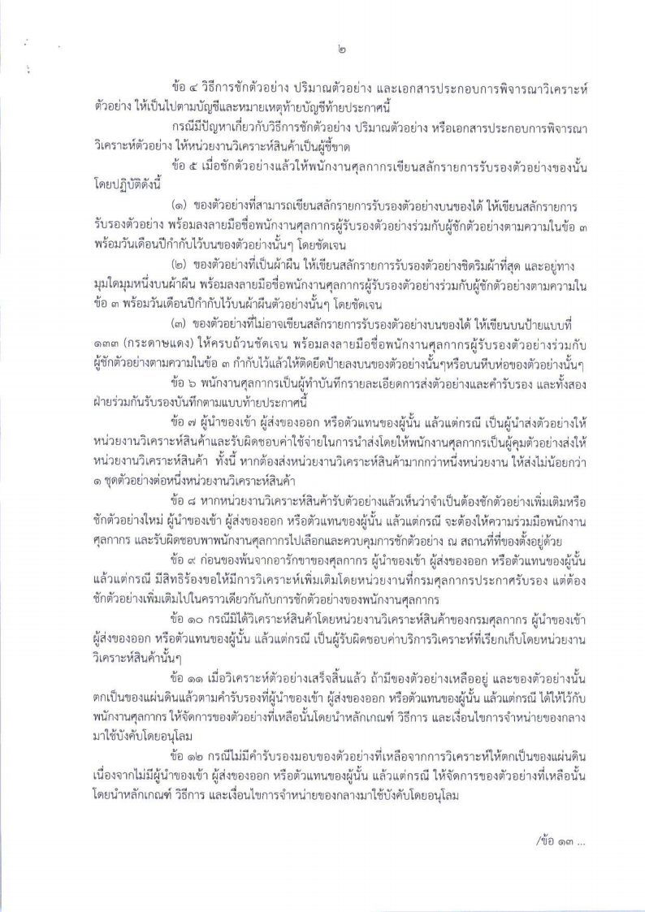

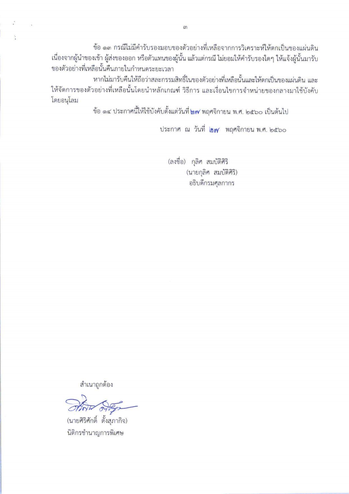

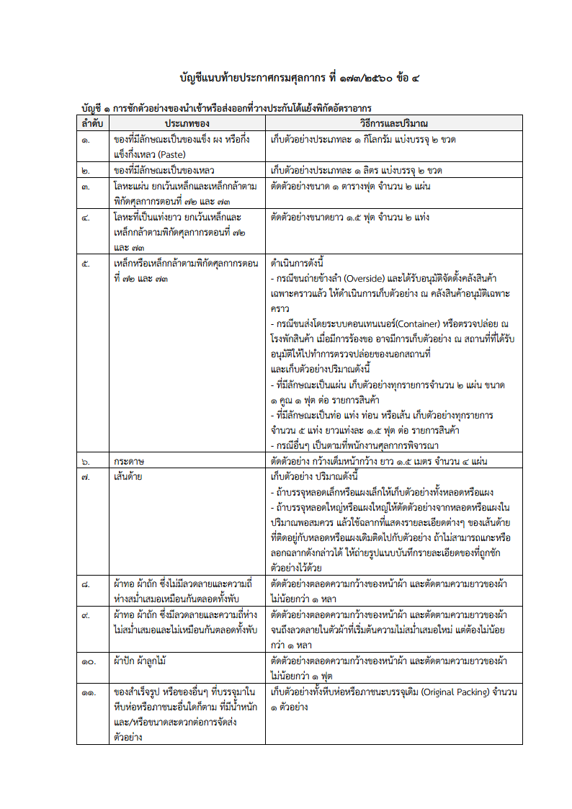

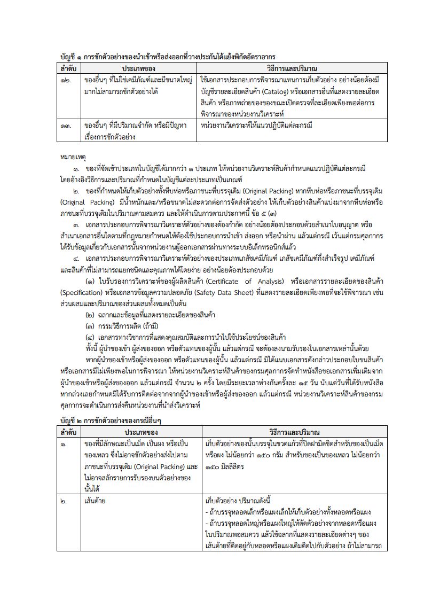

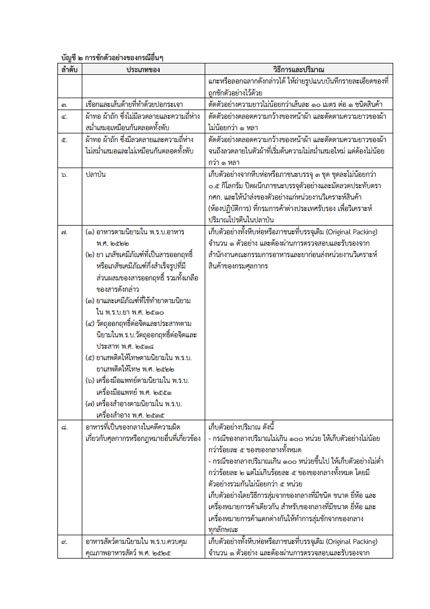

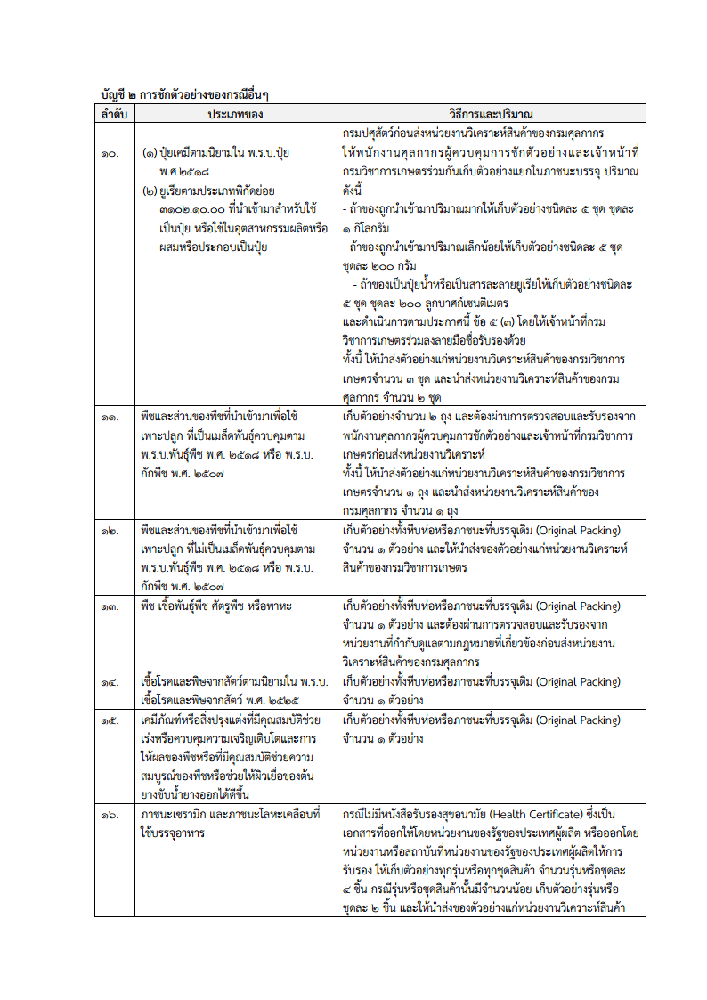

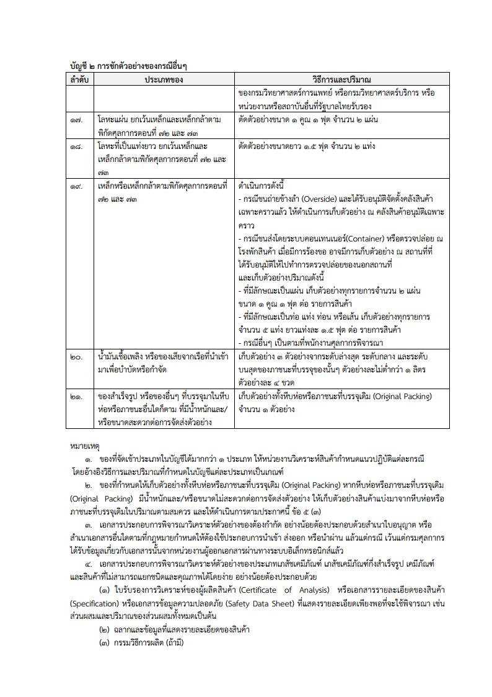

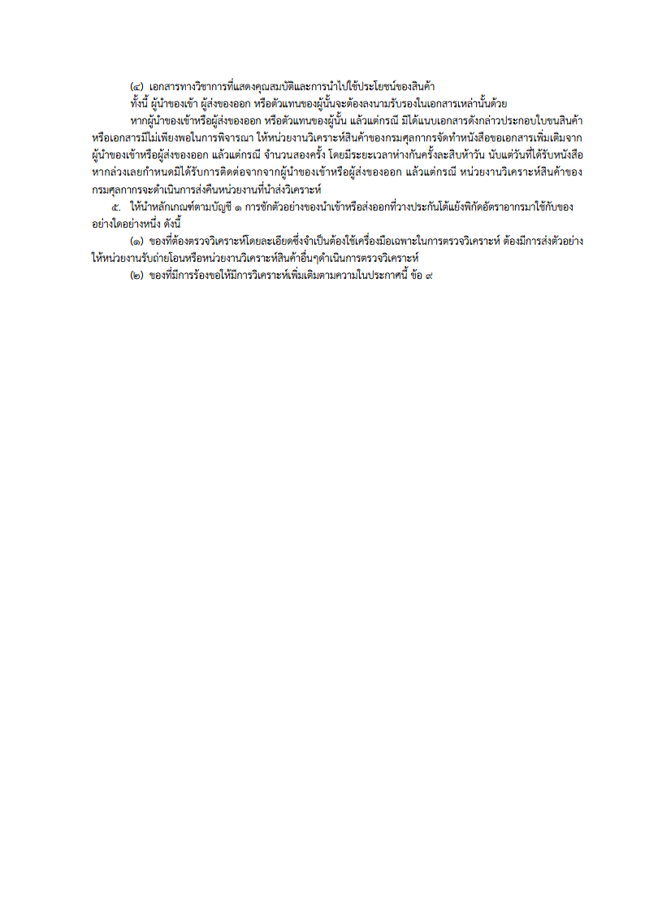

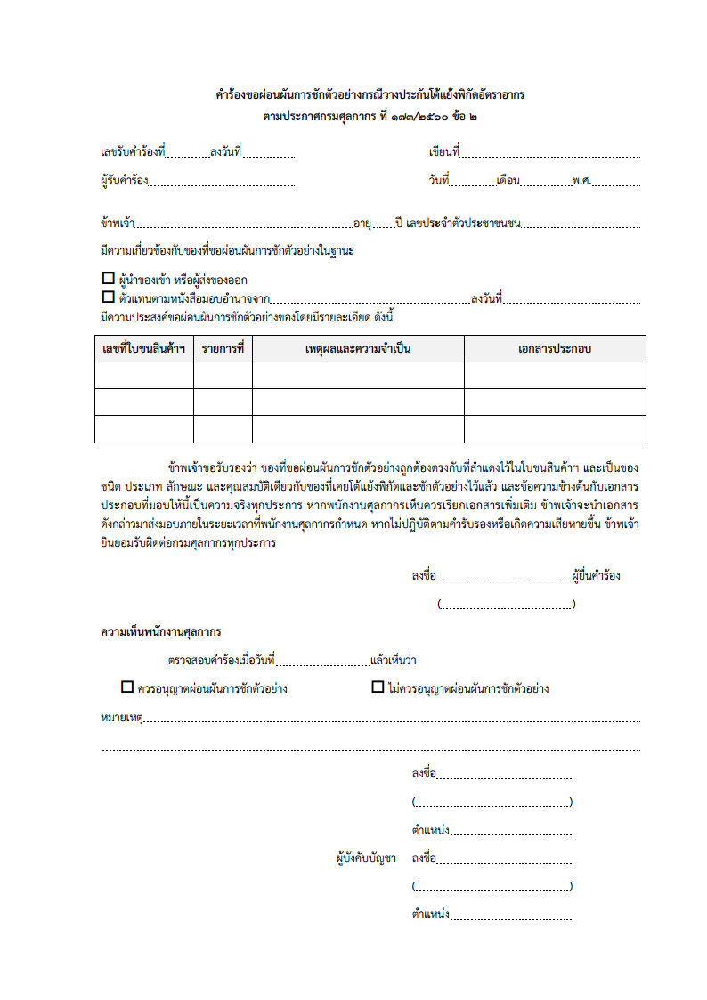

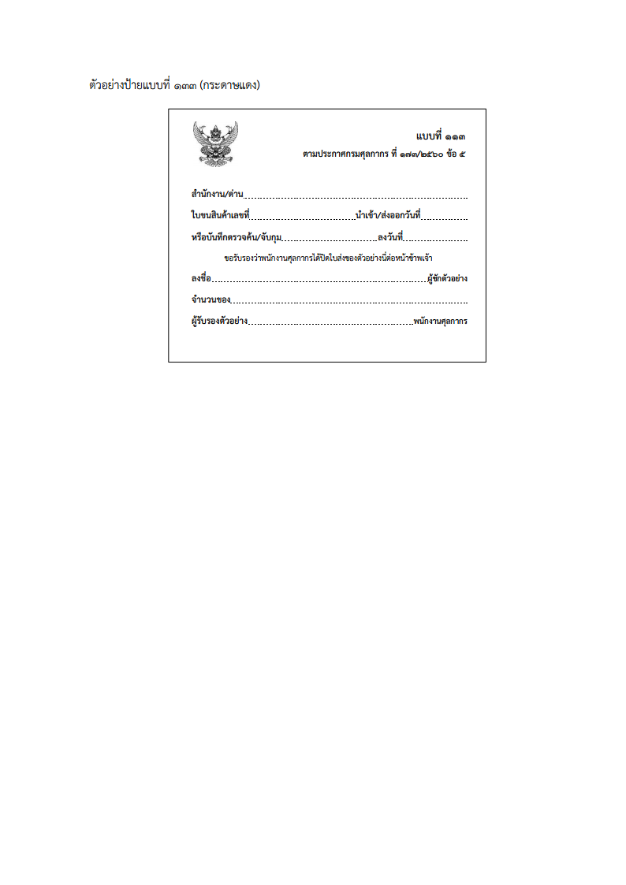

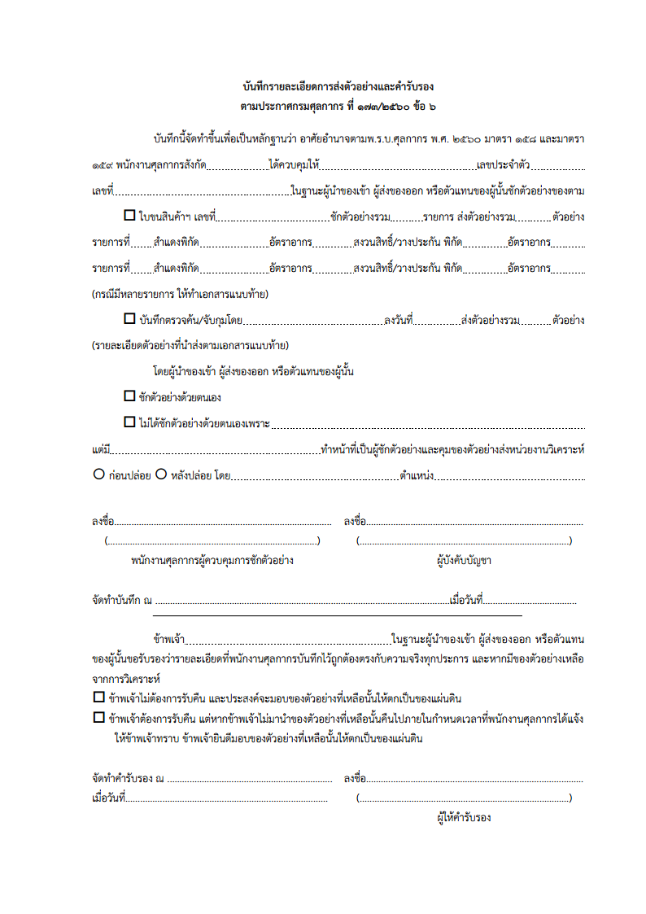

## รายละเอียดเพิ่มเติม

- เอกสารประกอบการบรรยาย**โครงการพัฒนาระบบอิเล็กทรอนิกส์เต็มรูปแบบในการคืนอากรเพื่อการส่งออกตามมาตรา 29 (e-Drawback)** [[*ดาวน์โหลด*]](https://ecs-support.github.io/KM/customs/post/announcement/customs/2563-126/present_e-drawback.pdf)  ซึ่งกรมศุลกากรได้จัดขึ้น เมื่อ**วันอังคารที่ 22 ตุลาคม 2562**

 

> ที่มา : [กรมศุลกากร](./2560-1.pdf)
