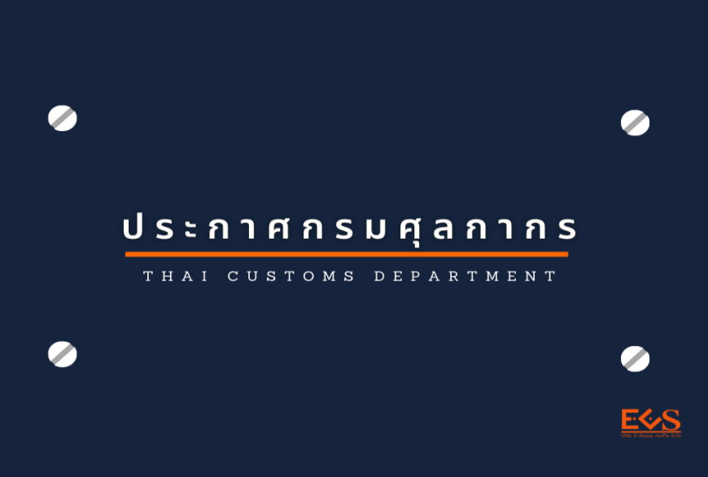

## การปฏิบัติพิธีการศุลกากรทางอิเล็กทรอนิกส์ สำหรับการเชื่อมโยงข้อมูลตามกฎหมายอื่นที่เกี่ยวข้องกับการศุลกากร.  

มีผลบังคับตั้งแต่*วันที่ 1 พฤษภาคม 2561* เป็นต้นไป
 

 

<a class="badge badge-danger" href="./2561-131.pdf" target="_blank" id="download_files_new">Download </a> 

 

> ที่มา : [กรมศุลกากร](./2561-131.pdf)