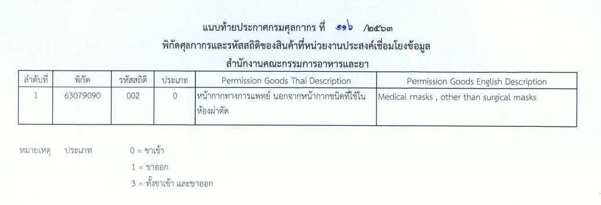

## ประกาศกรมศุลกากรที่ 116/.2563 เรื่อง การเชื่อมโยงข้อมูลใบอนุญาต/ใบรับรองอิเล็กทรอนิกส์ร่วมกับสำนักงานอาหารและยา.   

มีผลบังคับตั้งแต่*วันที่ 1 สิงหาคม 2563* เป็นต้นไป

 



 

<a class="badge badge-danger" href="./2563-116.pdf" target="_blank" id="download_files_new"> Download </a> 

> ที่มา : [กรมศุลกากร](./2563-116.pdf)
