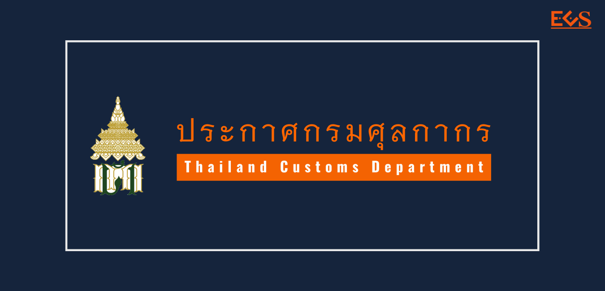
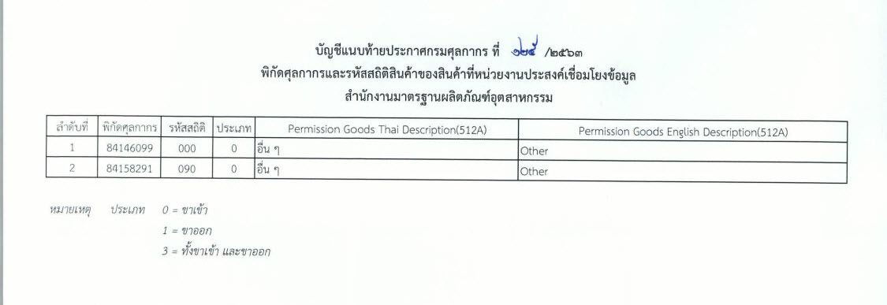

## ประกาศกรมศุลกากรที่ 125/.2563 เรื่อง การเชื่อมโยงข้อมูลใบอนุญาต/ใบรับรองอิเล็กทรอนิกส์ร่วมกับสำนักงานมาตรฐานผลิตภัณฑ์อุตสาหกรรม.   

มีผลบังคับตั้งแต่*วันที่ 17 สิงหาคม 2563* เป็นต้นไป

- *ประเภท 8414* : เครื่องสูบลมหรือสูบสุญญากาศ เครื่องอัดลมหรือ อัดก๊าซอื่น ๆ และพัดลม รวมทั้งเครื่องระบายอากาศหรือ เครื่องหมุนเวียนอากาศที่มีพัดลมประกอบร่วมอยู่ด้วย จะมีตัวกรองติดอยู่ด้วยหรือไม่ก็ตาม
 
- *ประเภท 8415* : เครื่องปรับอากาศที่ประกอบด้วยพัดลมซึ่งขับด้วยมอเตอร์ และมีส่วนที่ใช้สำหรับเปลี่ยนอุณหภูมิและความชื้น รวมถึงเครื่องจักรดังกล่าวที่ไม่สามารถแยกควบคุม ความชื้นต่างหากได้

 



 

<a class="badge badge-danger" href="./2563-125.pdf" target="_blank" id="download_files_new"> Download </a> 

> ที่มา : [กรมศุลกากร](./2563-125.pdf)
