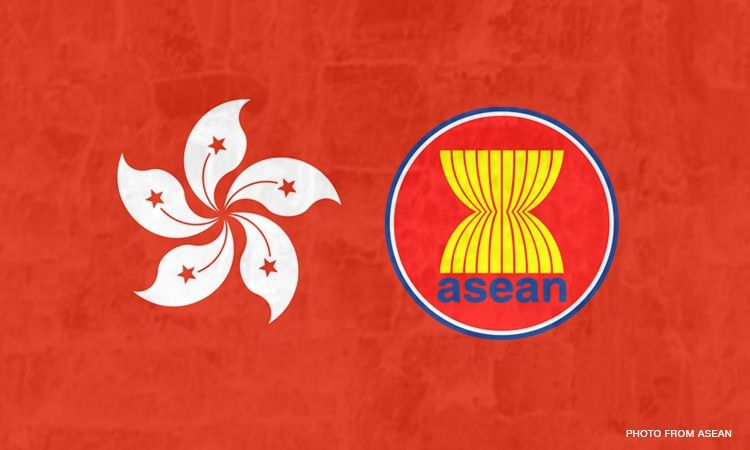
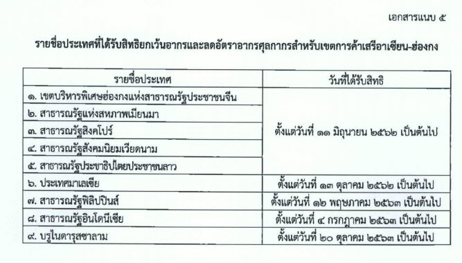

ประกาศกรมศุลกากรที่ 155/.2563 เรื่อง แก้ไขเพิ่มเติมประกาศกรมศุลกากรที่ 89/.2562 (หลักเกณฑ์และพิธีการการยกเว้นอากรและลดอัตราอากรศุลกากรสำหรับเขตการค้าเสรี*อาเซียน-ฮ่องกง*) มีการแก้ไขเพิ่มเติม รายชื่อประเทศที่ได้รับสิทธิยกเว้นอากรและลดอัตราอากรศุลกากรสำหรับเขตการค้าเสรีอาเซียน-ฮ่องกง

<a class="badge badge-danger" href="./2563-155.pdf" target="_blank" id="download_files_new"> Download </a> 

> ที่มา : [กรมศุลกากร](http://www.customs.go.th/cont_strc_download_with_docno_date.php?lang=th&top_menu=menu_homepage&current_id=14232832414c505f46464a4f464b4d)

