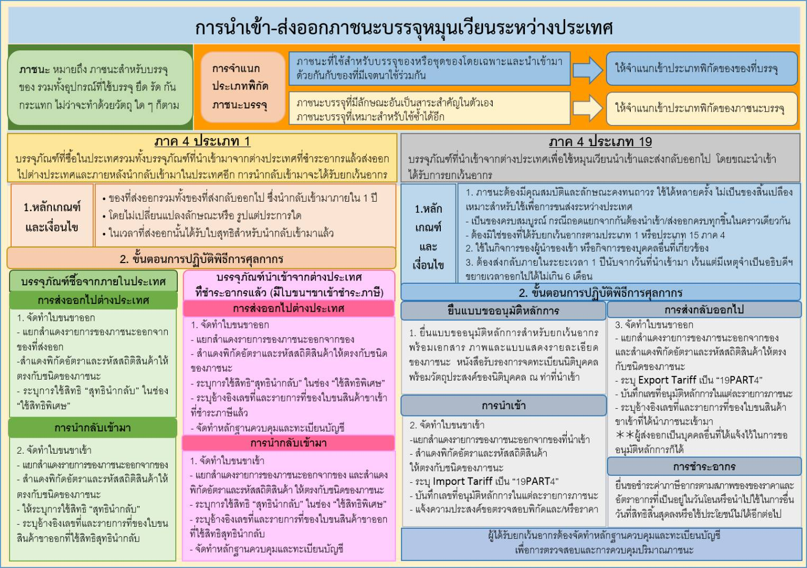

## ประกาศกรมศุลกากรที่ 162/.2563 เรื่อง แก้ไขเพิ่มเติมประกาศกรมศุลกากร ที่ 154/.2561 การยกเว้นอากรของตามประเภท 19 ภาค 4 (ภาชนะสำหรับบรรจุของ)
 

 


 

<a class="badge badge-danger" href="./2563-162.pdf" target="_blank" id="download_files_new"> Download </a> 

 

> ที่มา : [กรมศุลกากร](http://www.customs.go.th/cont_strc_download_with_docno_date.php?lang=th&top_menu=menu_homepage&current_id=14232832414c505f47464a4f464b46)

