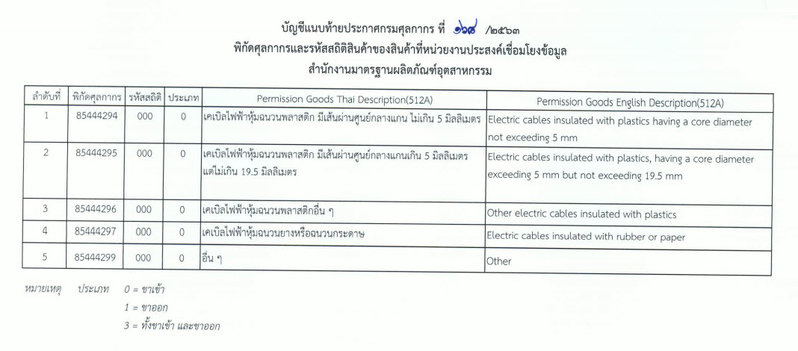

## ประกาศกรมศุลกากรที่ 168/.2563 เรื่อง การเชื่อมโยงข้อมูลใบอนุญาต/ใบรับรองอิเล็กทรอนิกส์ ร่วมกับสำนักงานมาตรฐานผลิตภัณฑ์อุตสาหกรรม

มีผลบังคับใช้ ตั้งแต่วันที่ 11 พฤศจิกายน 2563 เป็นต้นไป 

 


 

<a class="badge badge-danger" href="./2563-168.pdf" target="_blank" id="download_files_new"> Download </a> 

 

> ที่มา : [กรมศุลกากร](http://www.customs.go.th/cont_strc_download_with_docno_date.php?lang=th&top_menu=menu_homepage&current_id=14232832414c505f47464b4a464b49)

