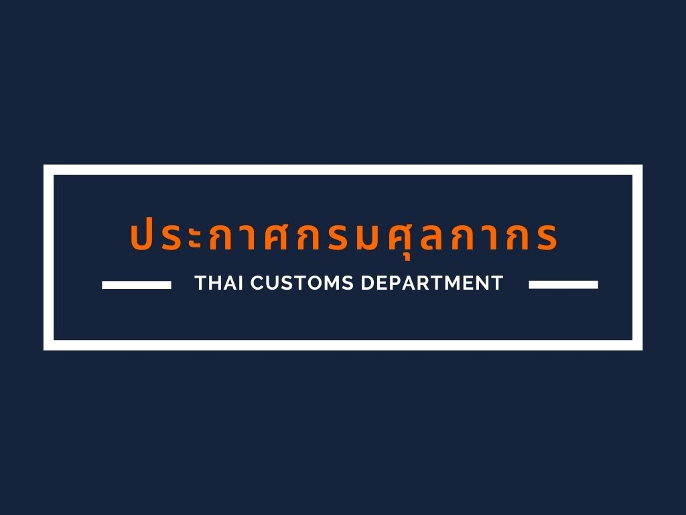

## ประกาศกรมศุลกากรที่ 169/.2563 เรื่อง การดำเนินกระบวนการทางศุลกากรสำหรับระบบศุลกากรผ่านแดนอาเซียน (ASEAN Customs Transit System - ACTS)

 


 

## เอกสารแนบท้ายประกาศกรมศุลกากรที่ 169/.2563

 


 

## คู่มือการใช้งานระบบศุลกากรผ่านแดนอาเซียน สำหรับผู้ประกอบการ

 


 

 

<a class="badge badge-danger" href="./2563-169.pdf" target="_blank" id="download_files_new"> ดาวน์โหลดประกาศ </a> 
<a class="badge badge-danger" href="./manual_ACTS.pdf" target="_blank" id="download_files_new"> ดาวน์โหลดคู่มือการใช้งาน </a> 

 

> ที่มา : [กรมศุลกากร](http://www.customs.go.th/cont_strc_download_with_docno_date.php?lang=th&top_menu=menu_homepage&current_id=14232832414c505f47464b4b464a4e)

