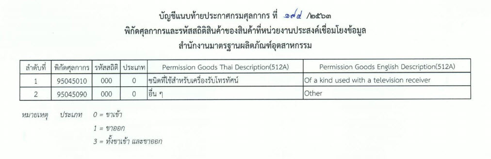

ประกาศกรมศุลกากรที่ 194/.2563 เรื่อง การเชื่อมโยงข้อมูลใบอนุญาต/ใบรับรองอิเล็กทรอนิกส์ ร่วมกับสำนักงานมาตรฐานผลิตภัณฑ์อุตสาหกรรม เพิ่มการเชื่อมโยงพิกัด **95045010 และ 95045090** : *คอนโซลวิดีโอเกมและเครื่องวิดีโอเกม นอกจากของ ตามประเภทย่อย 9504.30* มีผลบังคับใช้ ตั้งแต่วันที่ *4 มกราคม 2564*  เป็นต้นไป 

 


 

<a class="badge badge-danger" href="./2563-194.pdf" target="_blank" id="download_files_new"> Download </a> 

 

> ที่มา : [กรมศุลกากร](http://th.customs.go.th/cont_strc_download_with_docno_date.php?lang=th&top_menu=menu_homepage&current_id=14232832414c505f4c464b49464b48)

