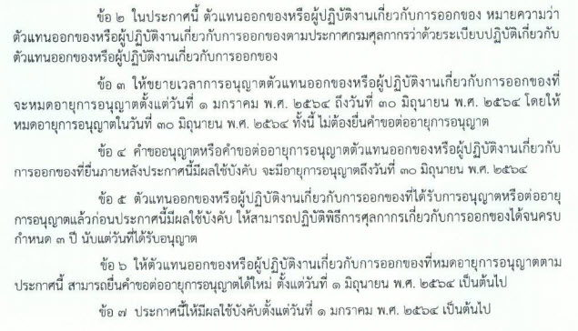
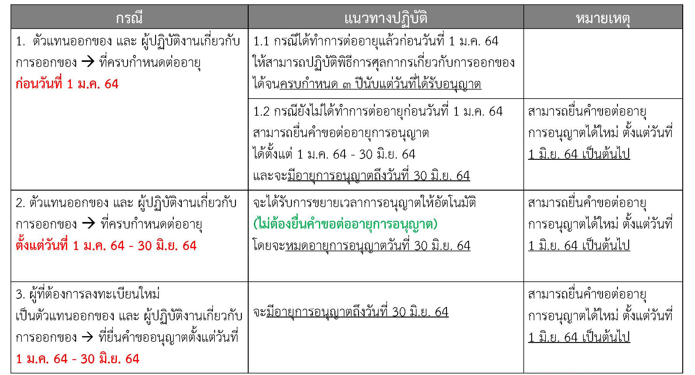

ประกาศกรมศุลกากรที่ 204/.2563 เรื่อง มาตรการตัวแทนออกของและผู้ปฏิบัติงานเกี่ยวกับการออกของ มีผลบังคับใช้ ตั้งแต่วันที่ 1 มกราคม 2564 เป็นต้นมา

ทั้งนี้กรมศุลกากรได้ขยายเวลาการอนุญาตตัวแทนออกของหรือผู้ปฏิบัติงานเกี่ยวกับการออกของที่จะหมดอายุการอนุญาต*ตั้งแต่วันที่ 1 มกราคม 2564 ถึงวันที่ 30 มิถุนายน 2564* โดยให้หมดอายุการอนุญาตใน*วันที่  30 มิถุนายน 2564* โดยไม่ต้องยื่นคำขอต่ออายุการอนุญาต โดยจะสามารถยื่นคำขอต่ออายุการอนุมัติได้ใหม่ใน*วันที่  1 มิถุนายน 2564* เป็นต้นไป
 

 

 


 

<a class="badge badge-danger" href="./2563-204.pdf" target="_blank" id="download_files_new"> Download </a> 

 

> ที่มา : [กรมศุลกากร](http://www.customs.go.th/cont_strc_download_with_docno_date.php?lang=th&top_menu=menu_homepage&current_id=14232832414c505f4d464b4b464b49)

